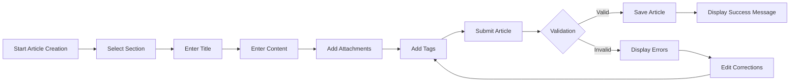

# Economic/Political Discussion Board Requirements Specification

## 1. User Account Management

### 1.1 Account Creation

WHEN a user provides a valid email address and password during registration, THE system SHALL:
- Create a new user account with a verified email
- Send a confirmation email with verification link
- Immediately log the user in upon email verification
- Enforce password complexity requirements (8+ characters, uppercase, lowercase, digit, special character)

WHEN a user submits an already registered email address, THE system SHALL return HTTP 400 Bad Request with error code EMAIL_ALREADY_EXISTS.

### 1.2 Account Login

WHEN a user submits valid email and password, THE system SHALL:
- Validate credentials against database
- Generate a JWT access token valid for 24 hours
- Create a persistent session record
- Redirect to home page upon success

WHEN a user submits incorrect email or password, THE system SHALL return HTTP 401 Unauthorized with error code AUTH_INVALID_CREDENTIALS.

### 1.3 Password Management

WHEN a user requests a password reset, THE system SHALL:
- Send a unique password reset link to registered email
- Invalidate previous session tokens
- Store reset token with expiration (2 hours)

WHEN a user submits a new password after reset verification, THE system SHALL:
- Update credentials in database
- Invalidate all previous sessions
- Return confirmation message

WHEN a user changes password through profile settings, THE system SHALL:
- Require current password verification
- Notify user about session termination
- Invalidate active sessions on other devices

### 1.4 Account Deletion

WHEN a user requests account deletion, THE system SHALL:
- Display confirmation prompt: "Are you sure you want to permanently delete your account and all associated content?"
- Require secondary confirmation

WHEN a user confirms deletion, THE system SHALL:
- Delete user account record
- Delete all associated articles and comments
- Invalidate all tokens and session records
- Remove all user data from analytics

## 2. User Profile Management

### 2.1 Profile Creation and Editing

WHEN a user completes profile creation during registration, THE system SHALL:
- Require display name (2-50 characters)
- Allow optional bio (up to 500 characters)
- Confirm profile creation upon submission

WHEN a user edits profile, THE system SHALL:
- Validate display name length (2-50 characters)
- Validate bio length (≤500 characters)
- Restrict bio character count with on-screen counter
- Apply edits immediately with success message

### 2.2 Profile Visibility

WHEN a user views another user's profile, THE system SHALL display:
- User's display name with verification badge
- User's bio limited to 200 characters with "Read More" option
- List of all articles (with title, date, and comment count)
- List of all comments (with article title, timestamp, and content preview)
- Total counts for articles and comments

## 3. Section Management

### 3.1 Section Creation and Management

WHEN an administrator creates a new section, THE system SHALL:
- Require section name (2-50 characters)
- Require section description (≤250 characters)
- Validate against existing section names
- Allow sections to be created with default order

WHEN an administrator edits an existing section, THE system SHALL:
- Allow modification of name and description
- Prevent changing the section ID
- Preserve existing sections' content

WHEN an administrator deletes a section, THE system SHALL:
- Prompt for confirmation: "Are you sure you want to delete this section? All articles within this section will be moved to the 'Uncategorized' section."
- Move all section articles to 'Uncategorized'
- Update section listings immediately

### 3.2 Section Visibility

WHEN a user browses sections, THE system SHALL display:
- Comprehensive section listing sorted alphabetically
- Each section showing name and brief description
- Active status indicator (enabled/disabled)

WHEN a user accesses a specific section, THE system SHALL:
- Display section title and description
- List applicable articles with filtering options
- Show article sorting controls (newest/oldest)

## 4. Article Creation and Management

### 4.1 Article Creation

WHEN a user creates an article, THE system SHALL:
- Require title (1-255 characters)
- Require content (≥10 characters)
- Require section selection
- Allow up to 10 images (JPG/PNG/GIF ≤10MB)
- Allow up to 10 documents (PDF/DOCX ≤20MB)
- Allow up to 5 tags (1-50 characters each, space-separated)

WHEN a user submits an article with empty title, THE system SHALL display "Article title cannot be empty."

WHEN a user uploads invalid file types, THE system SHALL:
- Display "Unsupported file type. Allowed types: JPG, PNG, GIF, PDF, DOCX."
- Provide recommended file types

### 4.2 Article Editing

WHEN a user edits their own article, THE system SHALL:
- Allow modification of title, content, attachments, and tags
- Preserve all original article data during editing
- Show progress during attachment updates

WHEN a user deletes their article, THE system SHALL:
- Display confirmation prompt: "Are you sure you want to delete this article and all associated comments?"
- Remove article from all listings
- Notify comment authors of article deletion

### 4.3 Article Management

WHEN a user views an article list, THE system SHALL:
- Display paginated results (20 articles per page)
- Show thumbnail previews for articles with images
- Include filtering controls for section, tags, and date
- Allow sorting by newest/oldest

WHEN a user views a single article, THE system SHALL display:
- Full article content with proper formatting
- All attached images in gallery format
- All attached documents in download list
- Tag list with clickable search
- Article creation date and time (ISO 8601 format)
- Author information link

## 5. Commenting System

### 5.1 Comment Creation

WHEN a user submits a comment, THE system SHALL:
- Require comment content (1-1000 characters)
- Validate against minimum length
- Apply comment moderation rules for banned users

WHEN a user submits empty comment, THE system SHALL display "Comment cannot be empty."

### 5.2 Comment Management

WHEN a user edits their own comment, THE system SHALL:
- Allow modification of comment content after creation
- Preserve original timestamp
- Notify article author of comment update

WHEN a user deletes their own comment, THE system SHALL:
- Display confirmation prompt: "Are you sure you want to delete this comment?"
- Remove comment from all views
- Update comment count for article

### 5.3 Comment Visibility

WHEN viewing comments on an article, THE system SHALL:
- Display comments sorted chronologically (oldest first)
- Show comment author with profile link
- Include comment timestamp with time zone
- Allow users to see up to 15 comments per page
- Provide pagination for longer comment threads

## 6. Banning System

### 6.1 Banning Process

WHEN an administrator bans a user, THE system SHALL:
- Require ban reason (20-500 characters)
- Display warning: "This action will prevent the user from accessing the platform."
- Record ban reason in audit log

WHEN a user is banned, THE system SHALL:
- Prevent login attempts with "Your account has been banned. Reason: [reason]."
- Keep content visible for public viewers
- Disable all user activities

### 6.2 Banned User Management

WHEN viewing banned users, THE system SHALL display:
- User's display name
- Ban reason with full text
- Date and time of ban (ISO 8601)
- Ban administrator and duration

WHEN an administrator lifts a ban, THE system SHALL:
- Remove ban status
- Update user permissions
- Notify the user via email
- Log unban operation in audit trail

## 7. Administrator System

### 7.1 Administrator Roles

WHEN a user requests to become an administrator, THE system SHALL:
- Allow requests with reason (20-250 characters)
- Store request with timestamp
- Notify user of request status via email

WHEN an administrator approves a request, THE system SHALL:
- Change user role to administrator
- Notify user via email
- Provide access to administrative features

WHEN an administrator rejects a request, THE system SHALL:
- Send rejection message with optional reason
- Record rejection in audit log

### 7.2 Administrative Capabilities

WHEN an administrator performs actions, THE system SHALL:
- Allow all regular user functions
- Permit section management (create/edit/delete)
- Allow article deletion
- Permit comment deletion
- Enable user banning/ unbanning

## 8. System Workflow Diagrams

### 8.1 User Authentication Flow

```mermaid
graph LR
    A[Start Process] --> B[User Requests Login]
    B --> C{Is User Registered?}
    C -->|Yes| D[Validate Credentials]
    C -->|No| E[Display "User Not Found" Error]
    D --> F{Credentials Valid?}
    F -->|Yes| G[Generate JWT Token]
    F -->|No| H[Display "Invalid Credentials" Error]
    G --> I[Save Session]
    I --> J[Redirect to Dashboard]
```

### 8.2 Article Submission Flow



## 9. Business Rules and Constraints

- Articles must have a title (min 1 character, max 255 characters)
- Article content must have at least 10 characters
- Users can attach up to 10 files and 10 images to a single article
- Each tag must be 1-50 characters, with maximum 5 tags per article
- Comments must be between 1-1000 characters
- Users can change their profile name and bio up to 5 times within a 24-hour period
- Banned users' content remains visible but can't be edited or commented on
- Articles created before section deletion are moved to default section
- All article content must be UTF-8 encoded
- Passwords must meet specific complexity requirements
- User names must pass content filtering for inappropriate language

## 10. Performance Requirements

WHEN a user views an article list with 100 articles, THE system SHALL:
- Load page within 1.5 seconds
- Display article thumbnails with lazy loading

WHEN searching articles by keyword with 10,000 results, THE system SHALL:
- Return results within 2 seconds
- Provide filtered results within specific sections
- Return most relevant matches within first page

WHEN uploading an image file (≤10MB), THE system SHALL:
- Display progress bar
- Complete within 5 seconds
- Show success/failure status immediately

## 11. Error Handling and Recovery

**Account Management**
- WHEN a user registers with invalid email format, THE system SHALL display "Please enter a valid email address."
- WHEN a user registers with short password, THE system SHALL display "Password must be at least 8 characters with uppercase, lowercase, digit, and special character."

**Article Management**
- WHEN a user creates an article without section selection, THE system SHALL display "Please select an article section."
- WHEN a user tries to create an article with empty content, THE system SHALL display "Article content cannot be empty."

**Section Management**
- WHEN an administrator tries to delete a section with articles, THE system SHALL display "This section contains articles. Move articles to another section before deletion."

**Banning System**
- WHEN a user tries to log in while banned, THE system SHALL display "Your account has been permanently banned. Reason: [reason]."