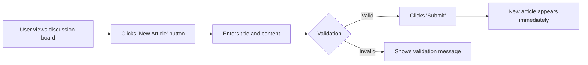
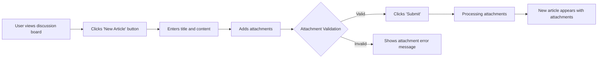

# Discussion Board Business Rules

### Core Business Model

#### Why This Service Exists
The discussion board addresses the need for a simple, accessible platform for economic and political discussions, democratizing participation in these topics without the complexity of traditional forums. While moderated platforms exist, they often overwhelm users with registration requirements, category structures, or administrative routines. This board caters specifically to users who want to express opinions immediately after reading relevant articles, without upfront sign-ins or post-categorization.

#### Business Value Proposition
The platform delivers:
- **Zero-entry barriers**: No registration required to start discussions
- **Direct engagement**: Articles may be immediately commented on
- **Minimalist interface**: Focused on content without distractions
- **Instant visibility**: All posts appear publicly without approval workflows

#### Success Metrics
- Initial user activity: 50+ discussions created within first 2 weeks
- Engagement rate: 30% of posts will have at least one comment within 24 hours
- Daily active users: 25+ unique active users per day within 30 days
- Participant retention: 40% of first-time posters will return within 7 days

### Content Validation Rules

#### Essential Requirements for Articles
*All requirements must use EARS format for clarity and testability:*

1. **Article Title Validation**
WHEN a user attempts to submit an article, THE system SHALL require a title field containing between 2 and 100 characters.
WHILE the title is between 2 and 100 characters, THE system SHALL allow submission.
IF the title is less than 2 characters, THEN THE system SHALL display "Article title must be at least 2 characters" as a user-facing message.
IF the title exceeds 100 characters, THEN THE system SHALL display "Article title cannot exceed 100 characters" as a user-facing message.

2. **Article Content Validation**
WHEN a user attempts to submit an article, THE system SHALL require a content field containing between 10 and 5000 characters.
WHILE the content is between 10 and 5000 characters, THE system SHALL allow submission.
IF the content is less than 10 characters, THEN THE system SHALL display "Article content must be at least 10 characters" as a user-facing message.
IF the content exceeds 5000 characters, THEN THE system SHALL display "Article content cannot exceed 5000 characters" as a user-facing message.

3. **Image Attachment Validation**
WHEN a user attempts to attach an image to an article, THE system SHALL accept only JPEG or PNG file types.
WHILE the file is JPEG or PNG, THE system SHALL allow attachment.
IF the file is not JPEG or PNG, THEN THE system SHALL display "Only JPEG and PNG images are supported" as a user-facing message.

4. **PDF Attachment Validation**
WHEN a user attempts to attach a PDF file to an article, THE system SHALL allow PDF attachments.
WHILE the file is a PDF, THE system SHALL allow attachment.
IF the file is not PDF, THEN THE system SHALL display "Only PDF attachments are supported for this type of content" as a user-facing message.

### Attachment Restrictions

#### PDF Attachment Limitations
INTEGER(20) MB is the maximum size for a PDF file attachment. This ensures large documents don't degrade system performance while maintaining usability for educational content.

WHEN attempting to upload a PDF over 20 MB, THE system SHALL block the upload and display the message: "PDF files cannot exceed 20 MB in size."

#### Image Attachment Limitations
JPEG and PNG images MUST not exceed 5 MB in size.

WHEN attempting to upload an image over 5 MB, THE system SHALL block the upload and display the message: "Image files cannot exceed 5 MB in size."

#### Combined Attachment Limit
WHEN an article includes both images and PDFs, THE system SHALL enforce the cumulative size limit.

WHILE the total combined size of all attachments does not exceed 20 MB, THE system SHALL allow the post to be submitted.

IF the combined attachment size exceeds 20 MB, THEN THE system SHALL display "Combined attachments must not exceed 20 MB total."

### Post Moderation Rules

#### Public Visibility Requirements
THE system SHALL publish all articles immediately upon submission without requiring moderation approval.

IF a user posts inappropriate content, THEN THE system SHALL not be directly responsible for content moderation; instead, post visibility will be governed by the user community.

#### User Reporting Mechanism
WHEN users encounter inappropriate posts, THE system SHALL provide a "Report" button on each article.

WHILE the report button is visible, THE system SHALL allow users to report inappropriate content.

IF a report is submitted, THEN THE system SHALL log the report but not block the content - moderation decisions are at the community's discretion.

### System Behavior Constraints

#### Response Time Requirements
WHEN a user views the discussion board, THE system SHALL load the first page of posts within 2 seconds.
WHEN a user submits an article with attachments, THE system SHALL display a confirmation message within 3 seconds.

#### Content Processing Performance
WHILE the attachment processing is in progress, THE system SHALL show a progress bar to the user.

IF attachment processing exceeds 5 seconds, THEN THE system SHALL display an appropriate error message.

#### Error Recovery Expectations
IF the network connection is lost during attachment processing, THEN THE system SHALL not permanently delete the partially uploaded file - instead, allowing users to resume upload.

IF the system fails to process an attachment, THEN THE system SHALL provide the user with instructions to retry the attachment.

### User Experience Requirements from Business Perspective

The entire discussion board experience must feel **immediate and friction-free**:
- Article creation flow must complete in fewer than 5 seconds with average internet speeds
- Post visibility must be instantaneous with no delay or workflow elements
- Attachment handling must be intuitive without complex dialogs or error messages

### Diagram: Article Creation Anticipated Flow

#### Figure 1: Article Creation Without Attachments

#### Figure 2: Article Creation With Attachments

> *Developer Note: This document defines **business requirements only**. All technical implementations (architecture, APIs, database design, etc.) are at the discretion of the development team.*