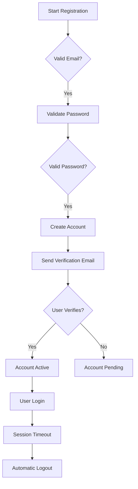

# Economic/Political Discussion Board Requirements Specification

## 1. User Account

### User Registration
- WHEN a user submits registration form, THE system SHALL validate email format (RFC 5322) and password strength (min 12 characters, mix of uppercase, lowercase, numbers, special characters).
- IF email is already registered, THE system SHALL respond with HTTP 400 and message 'Email address already in use'.
- WHEN registration is valid and confirmed, THE system SHALL create account with status 'pending_verification'.
- WHILE waiting for verification, THE user SHALL NOT be able to log in.

### User Authentication
- WHEN a user attempts login with valid email/password, THE system SHALL authenticate against database and return JWT token with expiry 2 hours.
- IF password is incorrect, THE system SHALL allow 5 attempts before locking account for 15 minutes.
- WHEN session expires, THE system SHALL automatically log out user and require re-authentication.

### Account Management
- WHEN a user requests password change, THE system SHALL verify current password before allowing new password submission.
- IF password change succeeds, THE system SHALL invalidate all active sessions for the account.
- WHEN user deletes account, THE system SHALL automatically delete all associated articles, comments, and attachments.

## 2. User Profile

### Profile Creation
- WHEN a user creates account, THE system SHALL create empty profile with default display name 'New User'.
- THE user SHALL be able to update display name and bio within 24 hours of registration.

### Profile Viewing
- WHEN a user views another user's profile, THE system SHALL display:
  - Display name
  - Bio text
  - List of articles written (with title, date, section)
  - List of comments written (with content excerpt, date)
- THE profile SHALL NOT show private information (email, password history).

## 3. Sections

### Section Management
- WHEN an administrator creates a new section, THE system SHALL require name (max 50 characters) and description (max 300 characters).
- IF name is duplicate, THE system SHALL display error 'Section name already exists'.
- THE system SHALL prevent deletion of sections with existing articles.

### Section Visibility
- WHEN a user browses sections, THE system SHALL list all available sections with name and brief description.
- THE system SHALL populate article lists when a section is selected.

## 4. Articles

### Article Creation
- WHEN a user creates an article, THE system SHALL require:
  - Title (max 100 characters, cannot be empty)
  - Content (min 100 characters, must be valid HTML)
  - Section selection (one of existing sections)
- THE user SHALL be able to attach up to 10 files (max 10MB each) and 5 images (max 5MB each).

### Article Editing
- WHEN a user edits an article, THE system SHALL allow modification of title, content, attachments, and tags.
- IF article is edited, THE system SHALL log previous content in audit trail.
- THE system SHALL prevent editing other users' articles.

### Article Deletion
- WHEN a user deletes an article, THE system SHALL confirm deletion with 'Are you sure you want to delete this article?' prompt.
- THE system SHALL remove all attachments and associated comments.

## 5. Article List

### Listing and Pagination
- WHEN viewing article list, THE system SHALL display 10 articles per page with next/previous navigation.
- THE list SHALL show:
  - Title (linked to article view)
  - Author (displayed name)
  - Tags (comma-separated)
  - Comment count (number)
  - Time posted (relative format '2 days ago')

### Sorting
- WHEN user selects 'Newest First', THE system SHALL sort articles by creation date descending.
- WHEN user selects 'Oldest First', THE system SHALL sort articles by creation date ascending.

## 6. Viewing an Article

### Article Display
- WHEN a user views article, THE system SHALL show:
  - Full title
  - Author (displayed name)
  - Full content (rendered HTML)
  - Attachments (download links)
  - Tags (clickable)
  - Time posted (absolute date/time)
- THE system SHALL display file attachments as thumbnail images for image files.

## 7. Searching Articles

### Search Implementation
- WHEN a user searches by title or content, THE system SHALL perform full-text search with fuzzy matching.
- THE search results SHALL be paginated (10 per page) with sorting options.
- WHEN filtering by tags, THE system SHALL require at least one tag selected.

## 8. Comments

### Comment Creation
- WHEN a user adds comment, THE system SHALL require comment content (min 20 characters).
- THE system SHALL limit comment count to 50 per article.

### Comment Management
- WHEN a user edits a comment, THE system SHALL record edit history with timestamp.
- WHEN a user deletes a comment, THE system SHALL display confirmation.

## 9. Administrator System

### Administrator Requests
- WHEN a user submits administrator request, THE system SHALL store reason in database with status 'pending'.
- SUPER administrators SHALL see all pending requests in 'Administrator Requests' dashboard.

### Administrative Capabilities
- WHEN a super administrator approves a request, THE system SHALL change user role to 'admin' and notify user.
- SUPER administrators SHALL create, edit, delete sections.
- SUPER administrators SHALL view all banned users with reasons.

## 10. Banning System

### Banning Workflow
- WHEN a user is banned, THE system SHALL record reason (text, max 500 characters) and ban date.
- Banned users SHALL NOT be able to log in while banned.
- THE system SHALL allow administrators to view ban reason when banning a user.

### Ban Management
- WHEN a super administrator unbans a user, THE system SHALL remove ban record and restore account access.
- THE system SHALL display all active bans in 'Banned Users' list.

[Mermaid Diagram: User Account Lifecycle]
