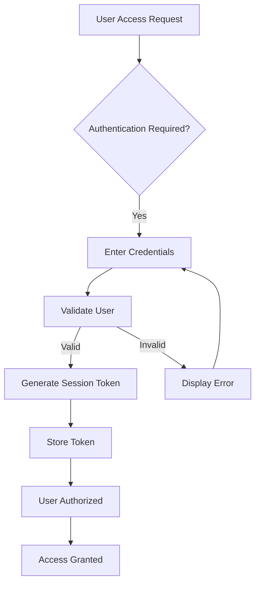

# Economic/Political Discussion Board - Requirements Specification

## 1. User Account
### Business Requirements

#### Account Creation and Management
WHEN a new user initiates registration, THE system SHALL require email and password fields to be provided.

WHEN user provides valid email and password, THE system SHALL create a new user account with the details.

WHEN registration email is already in use, THE system SHALL display 'Email already exists' error.

#### Login Requirements
WHEN a user attempts to log in with valid credentials, THE system SHALL generate a secure session token.

WHEN login credentials are invalid, THE system SHALL display 'Invalid email or password' message after 3 failed attempts.

#### Password Management
WHEN a user requests password reset, THE system SHALL send verification email with time-limited token.

WHEN password is changed, THE system SHALL invalidate all existing session tokens for the user.

#### Account Deletion
WHEN a user requests account deletion, THE system SHALL prompt confirmation dialog.

WHEN deletion is confirmed, THE system SHALL permanently delete the account and all associated data (including articles, comments, profiles).

WHEN account is deleted, THE system SHALL remove all references to the user from the database without data recovery options.

### Authentication Flow
