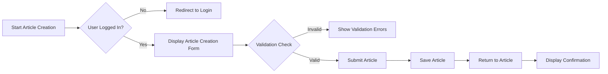

# 07-Article Management Requirements

## Overview

This document specifies all business requirements for article management within the Economic/Political Discussion Board platform. The article management system enables registered users to create, manage, and interact with discussion articles within various sections of the board. This system is designed to support a robust community-driven discussion environment while maintaining appropriate content governance.

## Document Scope

This documentation covers the article creation process, content validation rules, attachment management, tagging system, and editing/delete functionality. It exclusively describes business requirements and user workflows, not technical implementation details. All requirements are specified in EARS format where applicable.

## Relationship with Other Documents

This document integrates with these other documents:
- [02-business-model.md](./02-business-model.md) provides the business context for the discussion board platform
- [03-user-actors.md](./03-user-actors.md) defines user permissions for article management
- [04-functional-requirements.md](./04-functional-requirements.md) provides the broader functional context
- [06-authentication.md](./06-authentication.md) details user authentication requirements
- [11-business-rules.md](./11-business-rules.md) outlines content regulations and business rules

## 1. Article Creation Process

### General Requirements

THE system SHALL enable users to create new articles within the platform. THE article creation process SHALL comply with all content validation rules and business requirements. THE system SHALL provide an intuitive creation interface that guides users through all required fields.

### User Roles and Permissions

WHEN a guest attempts to create an article, THE system SHALL deny access and redirect to login. THE system SHALL allow members to create articles within any section. THE system SHALL not allow administrators to create articles under restricted permissions (admin capabilities are separate).

### Article Creation Workflow

#### Step 1: Starting the Article Creation

WHEN a member navigates to the article creation page, THE system SHALL display a form with all required fields. THE system SHALL pre-select the "Politics" section as default. THE system SHALL indicate which fields are required.

#### Step 2: Filling In Article Details

WHEN a member enters a title, THE system SHALL validate it against length requirements. THE system SHALL require a title of at least 5 characters. THE system SHALL allow titles up to 100 characters.

WHEN a member enters article content, THE system SHALL require at least 50 characters. THE system SHALL allow up to 10,000 characters of content.

WHEN a member selects a section, THE system SHALL ensure the section is valid and available. THE system SHALL display an error message for invalid sections.

### Mermaid Flowchart

## 2. Content Validation Rules

### Title Validation

WHEN a member submits an article with an empty title, THE system SHALL display an error message saying "Title is required". THE system SHALL require titles to be between 5-100 characters. WHEN a member submits a title outside this range, THE system SHALL display a specific error message indicating the required length range.

### Content Validation

WHEN a member submits an article with empty content, THE system SHALL display an error message saying "Content is required". THE system SHALL validate content length to be between 50-10,000 characters. WHEN a member submits content outside this range, THE system SHALL display a specific error message indicating the required length range.

### Section Validation

WHEN a member selects a non-existent section, THE system SHALL display an error message saying "Invalid section selection". THE system SHALL only display sections that are currently active and publicly available.

### Content Safety Validation

WHEN members submit potentially controversial content, THE system SHALL not automatically filter or reject but SHALL provide warnings about potential violations of content policies. THE system SHALL require users to acknowledge the platform's content policies before submission of the article.

## 3. Attachment Management

### Attachment Types

THE system SHALL support two types of attachments:
- Images (formats: JPEG, PNG, GIF)
- Files (formats: PDF, DOC, DOCX, XLSX)

### Attachment Guidelines

WHEN a member attaches a file, THE system SHALL validate it against format restrictions and size limitations. THE system SHALL not allow files larger than 50MB. THE system SHALL display an error message for invalid formats or oversized files.

WHEN a member attaches an image, THE system SHALL display a preview thumbnail of the image. THE system SHALL not allow animated GIFs to prevent excessive resource usage.

### Attachment Limits

THE system SHALL allow up to 10 attachments per article. THE system SHALL display a counter showing how many attachments have been added. WHEN a member tries to exceed this limit, THE system SHALL display a message saying "Maximum attachments reached (10)".

### Attachment Handling for Users

WHEN a member views an article with attachments, THE system SHALL display a download button for each attachment. WHEN a member clicks on an image attachment, THE system SHALL display a larger preview version of the image. THE system SHALL not allow attachments to be modified after submission.

## 4. Tagging System

### Tag Requirements

WHEN members create an article, THE system SHALL allow them to add up to 5 tags. THE system SHALL not allow duplicate tags on a single article. THE system SHALL allow free text tags without a predefined list.

### Tag Validation

WHEN members enter a tag, THE system SHALL validate it as follows:
- Minimum 2 characters
- Maximum 30 characters
- No special characters except hyphens and spaces

WHEN members enter a tag outside these parameters, THE system SHALL display a specific validation error message. THE system SHALL not allow tags with only whitespace or punctuation.

### Tag Management

THE system SHALL maintain a global list of all tags used across the platform. THE system SHALL display the most used tags as suggestions when creating a new tag. THE system SHALL not allow tagging with empty or invalid strings.

### Tag Display

WHEN users view articles, THE system SHALL display all tags associated with the article. THE system SHALL format tags as clickable elements that filter articles by that tag. THE system SHALL display each tag in a distinctive color for visual distinction.

## 5. Editing and Deletion

### Article Editing

WHEN a member wants to edit their own article, THE system SHALL display an edit button on the article view page. THE system SHALL allow members to edit title, content, attachments, and tags. THE system SHALL not allow editing of the section after article publication.

WHEN a member submits edited text with invalid content length, THE system SHALL display appropriate validation errors. THE system SHALL automatically validate all fields as if creating a new article when editing.

### Article Deletion

WHEN a member clicks the delete button for their own article, THE system SHALL display a confirmation dialog asking for confirmation of deletion. THE system SHALL require confirmation before proceeding with deletion. WHEN the member confirms, THE system SHALL delete the article and all associated attachments.

WHEN a member requests to delete an article, THE system SHALL remove the article and its content from all public views while maintaining the article's association with the user's account. THE system SHALL not immediately delete comments associated with the article; rather, they remain as is.

### Administrative Article Deletion

WHEN an administrator clicks the delete button for any article, THE system SHALL display a confirmation dialog. THE system SHALL allow administrators to delete any article without additional confirmation. WHEN the administrator confirms, THE system SHALL delete the article and all associated attachments while maintaining comment history and user information.

### Deletion Handling

WHEN a user deletes an article, THE system SHALL automatically remove all image attachments related to that article. THE system SHALL not delete comments associated with the article. THE system SHALL maintain a soft-delete mechanism that makes the article unavailable to public view but maintains data in the system for potential recovery or audit purposes.

## 6. Error Handling and User Feedback

### General Error Handling

WHEN any validation error occurs during the article creation or editing process, THE system SHALL display specific, helpful messages that indicate exactly what needs correction. THE system SHALL not use generic error messages such as "Something went wrong" or "Error 404".

### Specific Error Cases and Messages

| Error Case | User-Facing Message |
|------------|---------------------|
| Empty title | "Please provide a title for your article (minimum 5 characters)"
| Title too long | "Article title cannot exceed 100 characters"
| Empty content | "Please provide content for your article (minimum 50 characters)"
| Content too long | "Article content cannot exceed 10,000 characters"
| Invalid section | "The selected section is unavailable or invalid"
| Attachment too large | "The attachment is too large (maximum 50MB)"
| Invalid attachment format | "The attachment format is not supported"

## 7. Business Rules

### Article Uniqueness

THE system SHALL not enforce uniqueness of article titles. THE system SHALL allow two separate articles with identical titles to exist within the same or different sections.

### Article Visibility

WHEN a member creates an article, THE system SHALL make it immediately visible to all users except banned users. THE system SHALL not require administrator approval for articles from regular members.

### Section Association

THE system SHALL automatically associate articles with their selected section. THE system SHALL allow articles to maintain their section association even after section modifications (e.g., renaming the section).

### Content Governance

THE system SHALL not automatically moderate content but SHALL provide clear information about content policies. THE system SHALL require users to acknowledge these policies before posting.

### Attachment Ownership

WHEN a member deletes their article, THE system SHALL delete all related attachments but SHALL retain comments and profile data. THE system SHALL not automatically delete attachments owned by multiple articles.

## Summary

This comprehensive documentation provides all the business requirements for the article management system within the economic/political discussion board platform. Every requirement is specified for implementation in a business context that is clear, specific, and implementation-ready for backend developers. The document covers all aspects of article creation, validation, attachments, tagging, and management from a business perspective without including technical implementation details.