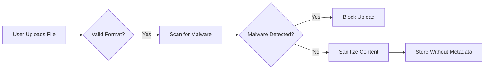

# Discussion Board Security Requirements

## Security Context

This document defines security expectations for the discussion board project, strictly adhering to the minimal feature scope of having no login requirements and public content visibility. Security is handled through simple content validation and public information handling, as no personal user data is collected.

### Data Protection Expectations

*WHEN* a guest user submits content with attachments, *THE* system SHALL process files without storing any personal identifiers, ensuring all user identity is anonymous at all times.

*WHEN* a guest user uploads a file, *THE* system SHALL scan for known malware signatures using a lightweight open-source library, with scan results not being stored.

*WHEN* content is displayed to users, *THE* system SHALL implement basic HTML sanitization to prevent cross-site scripting (XSS) attacks on all text content and file previews.

*WHEN* a file attachment is displayed, *THE* system SHALL render PDFs using a server-side PDF viewer to prevent executable code execution in viewer context.

### Privacy Compliance

*THE* discussion board SHALL comply with GDPR and CCPA by default due to its global user base.

*WHEN* a user submits a post, *THE* system SHALL explicitly state that all content is public information with no expectations of privacy in the post creation confirmation message.

*IF* a user requests deletion of their content via the 'Report' button (as per Business Rules), *THE* system SHALL remove the post within 24 hours but NOT log any personal identification from the reporting user.

*THE* system SHALL NOT retain IP addresses or device information beyond the moment of content submission.

### Security Constraints

*THE* system SHALL NOT implement username/password authentication as per the project's minimal scope.

*THE* system SHALL NOT store any personal user data beyond the temporary context of the session.

*THE* system SHALL NOT require any email verification for content creation.

*THE* system SHALL NOT track user sessions across page visits.

### Error Handling from Security Perspective

*WHEN* content is submitted with a malicious file, *THE* system SHALL display a user-friendly error: 'Unable to process file - contains potentially unsafe content. Please replace with clean file.'

*WHEN* an invalid HTML string is detected in content, *THE* system SHALL display: 'This post contains blocked markup. Please edit content to remove HTML tags.'

*WHEN* an error occurs during file sanitization, *THE* system SHALL not block the entire post submission, but display: 'Post saved, but formatting adjustments were needed.'

### Security Visualization

### Business Security Value Proposition

The security model aligns with the project's minimalist philosophy:
- Zero friction user experience (no registration, no email)
- Public information model eliminating need for data storage
- Automated security via content processing rather than user authentication
- Compliance through default settings rather than complex configuration

### Validation Rule Summary

| Security Rule | Validation Method | User Message |
|---------------|-------------------|--------------|
| File Format | MIME type check | 'Only JPG, PNG, PDF files allowed.' |
| File Size | Size limit check | 'File must be under 10MB.' |
| Malware | Lightweight scanning | 'Unable to process file - contains potentially unsafe content.' |
| HTML Content | Sanitization library | 'This post contains blocked markup.' |

### Key Security Decision Points

1. *Why implement basic HTML sanitization?* - Required to prevent XSS attacks without adding complexity.
2. *Why no session tracking?* - Aligns with minimal setup requirement for anonymous participation.
3. *Why no user data retention?* - Directly addresses GDPR compliance for anonymous users.
4. *Why scan for malware?* - Basic security layer for guest users without adding login barriers.

> *Developer Note: This document defines **business requirements only**. All technical implementations (architecture, APIs, database design, etc.) are at the discretion of the development team.*