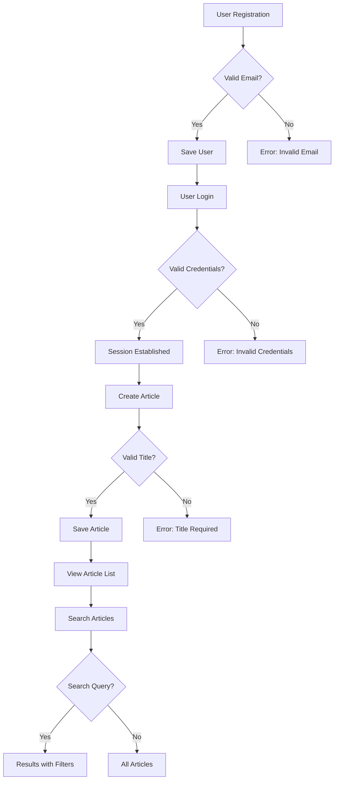

# Economic/Political Discussion Board Requirements Specification

## 1. User Account Management

### Registration and Authentication

WHEN a user provides a valid email address and password during registration, THEN the system SHALL validate the email format and ensure uniqueness, and SHALL create a new user account.

WHEN a user attempts to register with a duplicate email address, THEN the system SHALL return a user-friendly error message stating 'Email address already in use'.

WHEN a user submits a valid email and password for login, THEN the system SHALL authenticate the user and establish an authenticated session.

WHEN a user forgets their password, THEN the system SHALL send a password reset link to the registered email address.

### Password Management

WHEN a user requests to change their password, THEN the system SHALL require the current password for verification before allowing a new password to be set.

WHEN a user successfully changes their password, THEN the system SHALL invalidate all active sessions for that user and notify them of the change.

### Account Deletion

WHEN a user requests account deletion, THEN the system SHALL require confirmation and inform them that all associated articles and comments will be permanently deleted.

WHEN a user's account is deleted, THEN the system SHALL remove all personal data, articles, comments, and all related records from the database.

## 2. User Profile Management

### Profile Information

WHEN a user creates or edits their profile, THEN the system SHALL allow updating of display name (2-50 characters) and bio (up to 250 characters).

WHEN a user views another user's profile, THEN the system SHALL display their display name, bio, and links to their articles and comments.

### Profile Visibility

WHEN a user creates a profile, THEN the system SHALL make the display name visible to all users by default.

WHEN a user updates their profile, THEN the system SHALL update all existing references to their profile information.

## 3. Section Management

### Section Creation and Maintenance

WHEN an administrator creates a new section, THEN the system SHALL require a name (2-50 characters) and description (up to 500 characters).

WHEN an administrator edits a section, THEN the system SHALL allow modification of the section's name and description.

WHEN an administrator deletes a section, THEN the system SHALL move existing articles to a default 'Uncategorized' section and prevent further article creation in the deleted section.

### Section Visibility

WHEN users view the list of sections, THEN the system SHALL display all available sections in alphabetical order.

WHEN a user browses articles within a section, THEN the system SHALL restrict article display to that specific section's content.

## 4. Article Management

### Article Creation

WHEN a user creates a new article, THEN the system SHALL require a title (2-255 characters) and content (minimum 50 characters), and SHALL allow selection of a section and attachment of files/images.

WHEN a user attempts to create an article without required fields, THEN the system SHALL display specific error messages indicating missing information.

### Article Editing and Deletion

WHEN a user edits their own article, THEN the system SHALL allow modification of title, content, attachments, and tags.

WHEN a user deletes their own article, THEN the system SHALL remove the article and all related comments, and remove it from all sections.

## 5. Article Content and Display

### Article List

WHEN a user views the article list, THEN the system SHALL display paginated results showing title, author, tags, comment count, and time posted.

WHEN a user sorts the article list by 'newest first', THEN the system SHALL sort results by post date in descending order.

WHEN a user sorts the article list by 'oldest first', THEN the system SHALL sort results by post date in ascending order.

### Article Viewing

WHEN a user views a single article, THEN the system SHALL display title, author, full content, attachments, tags, and time posted.

WHEN a user downloads an attached file or image, THEN the system SHALL stream the file through the browser with appropriate MIME type.

## 6. Search and Filtering

### Search Functionality

WHEN a user enters a search query in the search bar, THEN the system SHALL search all article titles and content for matching terms, ignoring case sensitivity.

WHEN a user performs a search with an exact phrase (within quotes), THEN the system SHALL search for the exact phrase within articles.

### Tag Filtering

WHEN a user applies a tag filter, THEN the system SHALL restrict results to articles containing that tag.

WHEN a user applies multiple tags, THEN the system SHALL display articles matching any of the selected tags (OR filtering).

## 7. Comment Management

### Comment Creation and Display

WHEN a user writes a comment on an article, THEN the system SHALL store the comment with the user's display name, content, and timestamp.

WHEN a user views comments on an article, THEN the system SHALL display comments in ascending order by timestamp.

### Comment Editing and Deletion

WHEN a user edits their own comment, THEN the system SHALL allow modification of the comment content.

WHEN a user deletes their own comment, THEN the system SHALL permanently remove the comment and update the comment count for the article.

## 8. Administrator System

### Administrator Permissions

WHEN a user submits an administrator request, THEN the system SHALL require a reason text (20-500 characters) and store the request for review.

WHEN a super administrator approves an administrator request, THEN the system SHALL grant the user regular administrator permissions.

### Administrative Capabilities

WHEN an administrator manages sections, THEN the system SHALL allow creation, editing, and deletion of sections.

WHEN an administrator deletes an article, THEN the system SHALL permanently remove the article and all related comments.

### User Banning System

WHEN an administrator bans a user, THEN the system SHALL record a ban reason (20-500 characters) and mark the user as banned without deleting their account data.

WHEN a user is banned, THEN the system SHALL prevent login but maintain visibility of their existing articles and comments.

## 9. Business Process Flow

