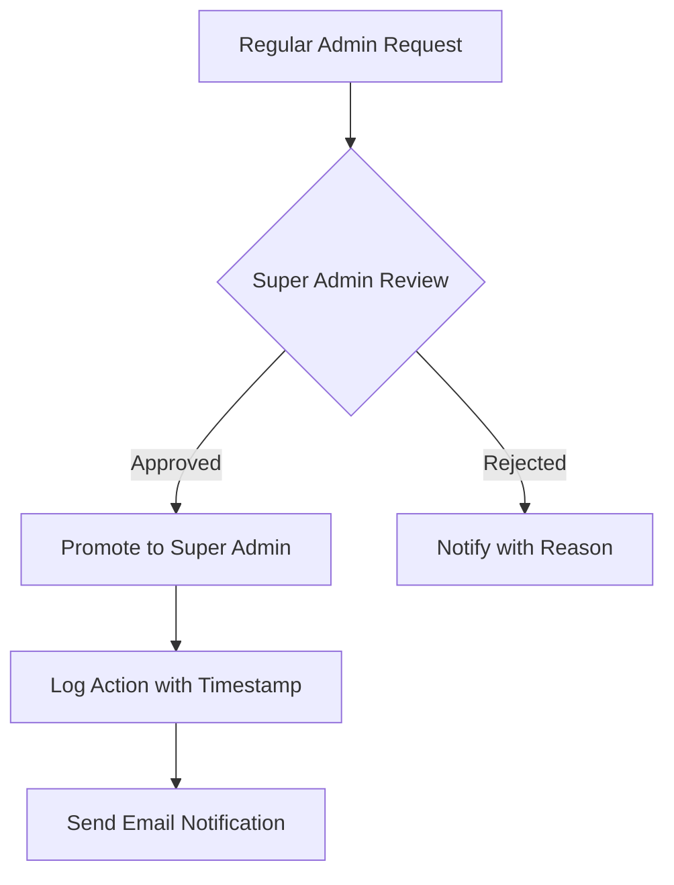

# Economic/Political Discussion Board Requirements

## 1. User Account

### Registration and Authentication

WHEN a new user submits registration with email and password, THE system SHALL validate:
- Email format (RFC 5322-compatible)
- Password strength (minimum 12 characters, 1 uppercase, 1 lowercase, 1 number, 1 special character)
- Unique email address

WHEN a user submits login credentials, THE system SHALL authenticate via JWT with:
- 15-minute session timeout
- 2-factor authentication option
- Login attempt limit (5 failed attempts locks account for 15 minutes)

WHEN a user requests password change, THE system SHALL:
- Verify current password
- Enforce new password strength requirements
- Send confirmation email after successful change

### Account Termination

WHEN a user requests account deletion, THE system SHALL:
- Confirm deletion through email verification
- Delete all associated articles and comments
- Preserve user content history in audit logs for 30 days
- Remove user from all moderation watchlists

## 2. User Profile

### Profile Management

WHEN a user submits display name and bio update, THE system SHALL:
- Validate display name (2-30 characters, no special characters except underscores)
- Validate bio (10-2000 characters)
- Update in all user-facing contexts within 2 seconds

WHEN another user views a profile, THE system SHALL display:
- Display name and bio
- Count of published articles (30-day limit)
- Recent comment activity (last 10 comments)
- User activity status (active/inactive)

## 3. Sections

### Management Requirements

WHEN an administrator creates a new section, THE system SHALL:
- Require name (2-50 characters, alphanumeric with spaces)
- Require description (10-1000 characters)
- Log creation action with metadata

WHEN a section is deleted, THE system SHALL:
- Reassign articles to default 'Uncategorized' section
- Preserve article links in metadata
- Notify users about section removal
- Maintain section history for moderation

### User Navigation

WHEN a user browses sections, THE system SHALL:
- Display all active sections in alphabetical order
- Show article count per section
- Allow section search by name
- Prevent access to deleted sections

## 4. Articles

### Publishing Process

WHEN a user creates an article, THE system SHALL:
- Require title (3-100 characters)
- Require content (50-10,000 characters)
- Assign to one active section
- Store attachments as base64-encoded JSON
- Allow up to 5 attachments per article
- Convert text to HTML for security

WHEN a user submits article tags, THE system SHALL:
- Allow 1-5 tags max
- Validate tags against forbidden words list
- Convert all tags to lowercase
- Store as comma-separated list

### Moderation Constraints

WHEN an administrator deletes an article, THE system SHALL:
- Preserve comments with 'deleted' status
- Mark article as 'moderated' in audit log
- Notify author of deletion reason
- Apply 24-hour review policy for all deletions

## 5. Article Management

### User Edition

WHEN a user edits their article, THE system SHALL:
- Log all changes in version history
- Preserve attachment integrity
- Maintain all existing comments
- Apply content sanitization for security

WHEN a user attempts to delete their own article, THE system SHALL:
- Verify ownership
- Confirm deletion action
- Remove from all public views
- Keep in moderation history

## 6. Administration System

### Role Hierarchy

| Action | Regular Admin | Super Admin |
|--------|---------------|-------------|
| Create Section | ✅ | ✅ |
| Delete Section | ✅ | ✅ |
| Delete Any Article | ✅ | ✅ |
| Ban Users | ✅ | ✅ |
| Promote Administrators | ❌ | ✅ |
| Demote Administrators | ❌ | ✅ |
| View Ban Reasons | ✅ | ✅ |
| System Settings Access | ❌ | ✅ |

### Promotion Workflow

WHEN a super administrator initiates promotion, THE system SHALL:
- Require email confirmation from target user
- Capture security verification step
- Log full audit trail of promotion
- Update role metadata in 2 seconds

## 7. Banning System

### Ban Implementation

WHEN an administrator bans a user, THE system SHALL:
- Record non-empty ban reason (10-500 characters)
- Prevent login while preserving content
- Display ban reason on profile page
- Log action with moderator ID

WHEN a user's account is banned, THE system SHALL:
- Show "Account Banned" banner
- Display ban reason to all viewers
- Maintain all public content visibility
- Lock profile editing capabilities

### Ban Management

WHEN an administrator reviews banned users, THE system SHALL display:
- Display name and registration date
- Ban date and reason
- Current ban status
- Associated appeal status

WHEN an administrator requests unbanning, THE system SHALL:
- Require security verification
- Log unban action with reason
- Send email notification to user
- Return user to active status

## 8. Business Rules

### Content Validation

WHEN content exceeds 10,000 characters, THE system SHALL:
- Reject submission
- Show validation message
- Suggest word count reduction
- Log validation error

WHEN content contains more than 5 attachments, THE system SHALL:
- Reject submission
- Show attachment limit message
- Suggest selective attachment
- Log error without technical details

### Performance Requirements

THE system SHALL process all administrative actions within 2 seconds for 95% of requests.

WHEN a moderation action fails, THE system SHALL display "System temporarily unavailable. Please try again in 5 minutes." without technical details.

> *Business Requirement Note: All features must comply with the 24-hour moderation review policy and maintain content integrity during administrative actions.*