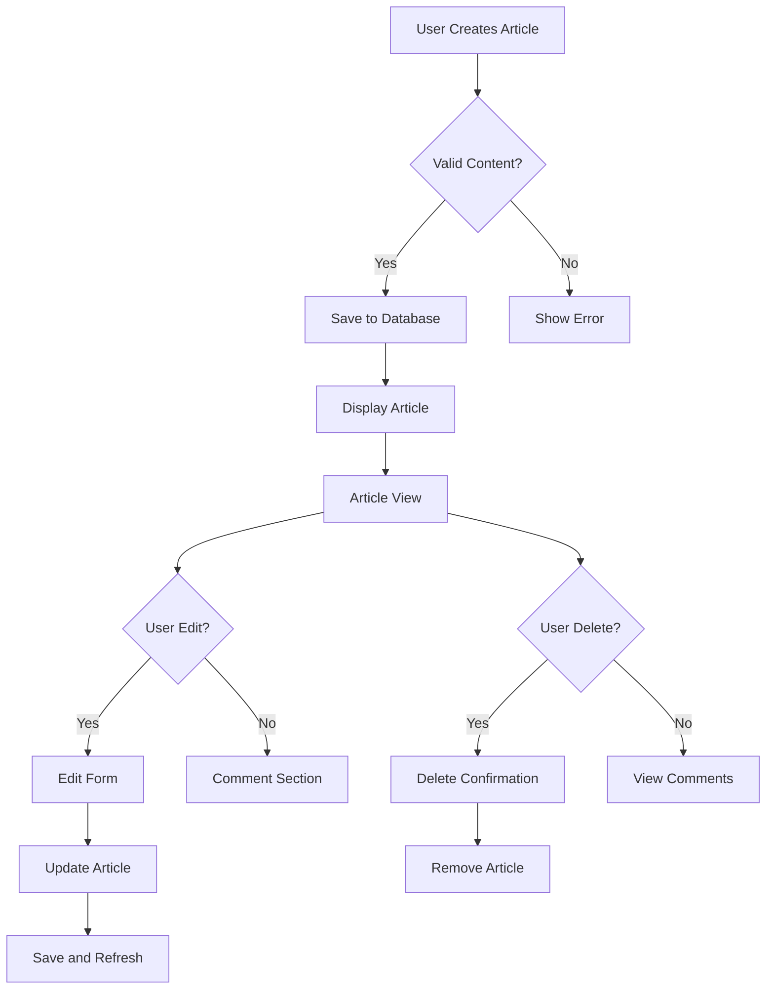

# Economic/Political Discussion Board

## 1. Introduction

This document specifies the comprehensive requirements for the Economic/Political Discussion Board platform, designed to foster thoughtful discourse on economic and political topics while maintaining community integrity. The system provides a structured environment for users to engage with content, express perspectives, and participate in meaningful discussions through articles and comments.

### Core Principles

- **User-Centric Design**: Intuitive workflows that prioritize user experience while maintaining platform safety
- **Content Integrity**: Robust systems to protect legitimate discourse and prevent abuse
- **Administrative Control**: Comprehensive tools for maintaining platform health without impeding free expression
- **Scalability**: Architecture designed for rapid user growth and content expansion

## 2. User Account Management

### 2.1 Registration Process

WHEN a new user arrives at the platform, THE system SHALL display a registration form with fields for email address and password.

WHEN a new user enters a valid email address that doesn't already exist in the system, THE system SHALL send a verification email containing a unique registration token.

WHEN a user clicks the verification link in the email within 24 hours, THE system SHALL complete the registration process and create a new user account.

WHEN a user fails to verify their email within 24 hours, THE system SHALL automatically delete the unverified account after timeout.

WHEN a user attempts to register with an email already in use, THE system SHALL display an error message 'Email address is already registered' and prevent account creation.

### 2.2 Authentication Workflow

WHEN a user attempts to log in with a valid email and password, THE system SHALL verify credentials against the user database and issue a JWT access token valid for 2 hours.

WHEN a user enters an incorrect password, THE system SHALL increment a failed login counter with a maximum of 5 failed attempts before requiring email verification for further attempts.

WHEN a user's session token expires, THE system SHALL prompt for re-authentication before allowing access to private features.

### 2.3 Password Management

WHEN a user accesses their account settings, THE system SHALL display a 'Change Password' option.

WHEN a user submits a new password, THE system SHALL require confirmation of the new password and validation that it doesn't match previous passwords.

WHEN a user changes their password, THE system SHALL immediately invalidate all active session tokens associated with their account before updating the password.

### 2.4 Account Deletion

WHEN a user requests account deletion, THE system SHALL display a confirmation message 'Deleting your account will permanently remove all your articles and comments. Are you sure?'

WHEN a user confirms account deletion, THE system SHALL permanently remove the user profile along with all associated articles, comments, and attachments from the platform within 24 hours.

WHEN an account is deleted, THE system SHALL update all related statistics, remove the user from analytics, and notify any users who received notifications from this profile.

## 3. User Profile Management

### 3.1 Profile Creation and Editing

WHEN a user completes registration, THE system SHALL prompt for initial display name and bio creation.

WHEN a user accesses their profile, THE system SHALL display their current display name and bio with edit buttons.

WHEN a user changes their display name, THE system SHALL validate it against existing display names to prevent duplicates.

WHEN a user submits a new bio, THE system SHALL limit it to 150 characters to maintain consistent profile aesthetics.

### 3.2 Profile Visibility

WHEN a user views another user's profile, THE system SHALL display the other user's display name, bio, and any publicly available information.

WHEN a user views their own profile, THE system SHALL display additional management options for their articles and comments.

### 3.3 Content Display

WHEN a user views another user's profile, THE system SHALL display the user's articles in reverse chronological order (most recent first) with previews of article content.

WHEN a user views another user's profile, THE system SHALL display the user's comments in reverse chronological order with brief content previews.

WHEN a user views a user's articles list, THE system SHALL limit the display to 10 most recent articles at a time with pagination for additional content.

## 4. Sections Management

### 4.1 Section Creation

WHEN an administrator accesses the section management interface, THE system SHALL display a 'Create New Section' button.

WHEN an administrator enters a section name and description and clicks 'Create', THE system SHALL validate that the name doesn't contain profanity or restricted terms.

WHEN a section is created, THE system SHALL assign a unique identifier, store the name and description, and make the section available for selection when creating articles.

### 4.2 Section Management

WHEN an administrator edits a section, THE system SHALL allow modification of the name and description.

WHEN an administrator deletes a section, THE system SHALL prompt for confirmation and warn that all articles associated with the section will be moved to a default section.

WHEN a section is deleted, THE system SHALL update all related data to use the default section and notify administrators of the change.

## 5. Articles Management

### 5.1 Article Creation

WHEN a user selects a section and clicks 'New Article', THE system SHALL display a form with fields for title, article content, and attachment options.

WHEN a user submits a title with fewer than 3 characters, THE system SHALL display an error 'Title must be at least 3 characters long'.

WHEN a user submits article content, THE system SHALL limit content to 50,000 characters.

WHEN an article is created, THE system SHALL associate it with the user's account, the selected section, and the current timestamp.

### 5.2 Attachment Handling

WHEN a user attaches multiple files, THE system SHALL allow selection of multiple files of up to 10 MB each, with a maximum total of 5 files per article.

WHEN files are attached, THE system SHALL store them securely in the cloud storage service with appropriate access controls.

WHEN files are displayed on an article page, THE system SHALL provide download buttons for each attached file with previews for image files.

### 5.3 Tagging System

WHEN a user adds tags to an article, THE system SHALL allow up to 5 tags per article.

WHEN a user enters a tag, THE system SHALL validate that it contains only alphanumeric characters and spaces.

WHEN an article is displayed in list views, THE system SHALL show all tags as clickable filters for users.

### 5.4 Article Modification and Deletion

WHEN a user edits their article, THE system SHALL allow modification of title, content, attachments, and tags.

WHEN a user deletes their article, THE system SHALL prompt for confirmation and then permanently remove the article from public view with all attachments.

WHEN an article is deleted, THE system SHALL update the user's article count and remove the article from search indexes immediately.

## 6. Article List Implementation

### 6.1 Pagination

WHEN a user views the list of articles in a section, THE system SHALL display articles in sets of 10 with pagination controls.

WHEN a user clicks on a page number, THE system SHALL load and display articles for that page without refreshing the entire page.

### 6.2 Article List Data

WHEN a user views the article list, THE system SHALL display for each article: title, author display name, associated tags as comma-separated values, comment count, and timestamp of publication in user's local time.

WHEN a user clicks on an article title, THE system SHALL redirect them to the article's full view page.

### 6.3 Sorting Mechanism

WHEN a user selects 'Sorted by Newest First', THE system SHALL reorder articles with the most recently published at the top.

WHEN a user selects 'Sorted by Oldest First', THE system SHALL reorder articles with the oldest at the top.

WHEN articles are sorted, THE system SHALL display the current sort order and allow users to easily change it.

## 7. Article Viewing

### 7.1 Full Display

WHEN a user views an article in full, THE system SHALL display title, author display name, full article content, attached files with download options, tags, and timestamp.

WHEN a user views an article with attachments, THE system SHALL display images in a responsive gallery and files as downloadable list items.

### 7.2 Attachment Handling

WHEN a user downloads an attached file, THE system SHALL provide a secure download link valid for 1 hour to prevent mass downloads.

WHEN a user views the article page, THE system SHALL ensure all attached content loads within 2 seconds to maintain user engagement.

## 8. Search Functionality

### 8.1 Search Implementation

WHEN a user enters search terms, THE system SHALL search article titles and content for matching text.

WHEN search terms exceed 50 characters, THE system SHALL truncate and display 'Your search query was too long. Please refine your search. '

WHEN search results exceed 100 entries, THE system SHALL limit to 100 results and prompt for more specific terms.

### 8.2 Tag Filtering

WHEN a user selects a tag, THE system SHALL filter search results to show only articles with that tag.

WHEN a user selects multiple tags, THE system SHALL apply an AND operation to display only articles matching all selected tags.

## 9. Commenting System

### 9.1 Comment Creation

WHEN a user views an article, THE system SHALL display a comment input form if the user is logged in.

WHEN a user enters a comment with fewer than 5 characters, THE system SHALL display 'Comment must be at least 5 characters'.

WHEN a comment contains only whitespace, THE system SHALL display 'Comment must contain visible content'.

### 9.2 Comment Display

WHEN a user views article comments, THE system SHALL sort by 'oldest first' as default.

WHEN a user sorts comments 'newest first', THE system SHALL apply the sorting order and update the view immediately.

### 9.3 Comment Management

WHEN a user edits their comment, THE system SHALL allow changes within 24 hours of creation.

WHEN a user deletes their comment, THE system SHALL immediately remove it from public view and update the article's comment count.

## 10. Administrator System

### 10.1 Administrative Roles

WHEN a regular administrator requests to become a super administrator, THE system SHALL record the request with the reason and status 'Pending'.

WHEN a super administrator reviews a request, THE system SHALL display the request details including the user's profile and reason.

WHEN a super administrator approves a request, THE system SHALL update the user's role to 'super administrator' and notify the user.

### 10.2 Administrative Capabilities

WHEN an administrator creates a new section, THE system SHALL update the section list and make the new section available for article creation.

WHEN an administrator deletes an article, THE system SHALL permanently remove it from public view while keeping audit logs.

WHEN an administrator bans a user, THE system SHALL restrict login access and record the ban reason.

## 11. Banning System

### 11.1 Banning Process

WHEN an administrator selects 'Ban User' for a user, THE system SHALL prompt for a ban reason description.

WHEN a ban reason exceeds 200 words, THE system SHALL truncate and display 'Ban reason too long. Maximum 200 words allowed.'.

WHEN a ban is recorded, THE system SHALL display the reason to the administrator and store it securely for up to 6 months.

### 11.2 Banned User Management

WHEN a user is banned, THE system SHALL prevent login attempts but allow viewing of all previously published content.

WHEN a user is banned, THE system SHALL generate a notification to the user stating 'You have been banned from the platform'.

WHEN an administrator requests to unban a user, THE system SHALL prompt for confirmation and display the reason for the ban prior to unban.

## 12. Business Rules

### 12.1 Content Moderation

WHEN a user's content violates community guidelines, THE system SHALL automatically flag it for administrator review.

WHEN a comment exceeds the 5,000 character limit, THE system SHALL retain the partial content for continued editing while preventing submission.

### 12.2 Performance Standards

WHEN a user views an article with 100 comments, THE system SHALL load all comments within 2 seconds for most devices.

WHEN a user submits a new article, THE system SHALL confirm receipt within 1 second for 95% of submissions.

### 12.3 Success Metrics

THE platform SHALL track and display monthly metrics including:
- Total number of active users
- Percentage of users leaving comments
- Average comment length
- Percentage of content requiring moderation
- Article creation rate per user
- Section popularity ranking

### 12.4 Error Handling

WHEN a system error occurs during critical operations, THE system SHALL display user-friendly messages without exposing technical details.

WHEN an authentication failure occurs, THE system SHALL redirect to login with a clear error message explaining the issue.

## 13. Integration Points

This system integrates with:
- **User Authentication** (06-authentication.md) for role-based access control
- **Article Management** (07-article-management.md) for article creation and management
- **Commenting System** (08-commenting-system.md) for discussion flow
- **Administration System** (09-administration-system.md) for management features
- **Banning System** (10-banning-system.md) for user restrictions

## 14. Business Value

The Economic/Political Discussion Board provides significant value by:
- Creating a safe environment for nuanced economic and political conversations
- Increasing user engagement through structured discussion threads
- Providing administrators with effective moderation tools
- Growing content library by enabling focused discussions in categorized sections
- Attracting users who seek thoughtful political discourse without the noise of other platforms

## 15. Summary

This economic/political discussion board delivers a comprehensive content management platform designed for informed discourse on current events, with robust moderation tools, user-friendly interfaces, and structured community engagement. The system is built to handle growth while maintaining quality conversation standards, with all features following the detailed specifications laid out in this document.