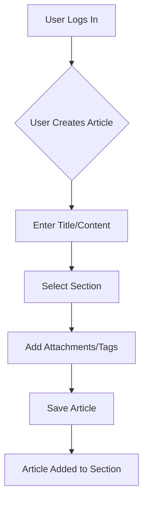
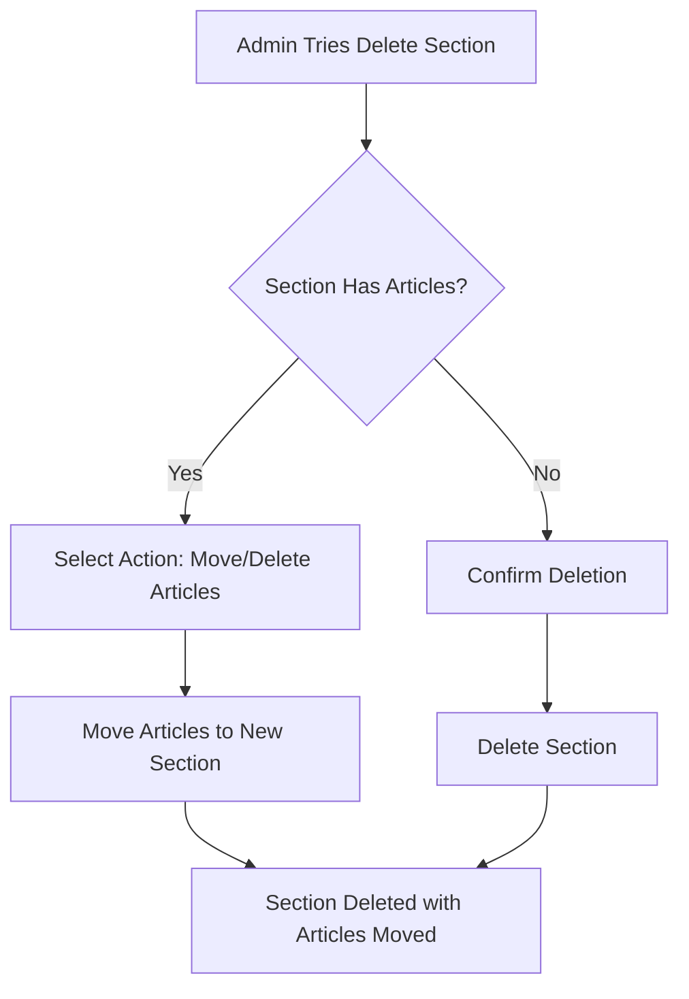
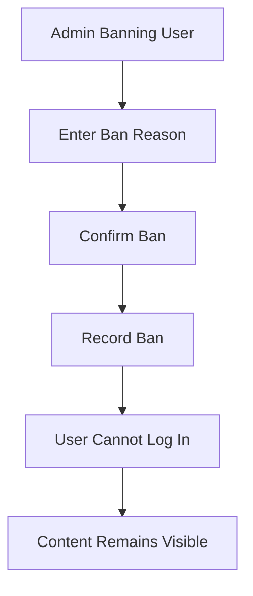

# Economic/Political Discussion Board

## Service Overview

This is a discussion platform for economic and political topics where users can create and manage articles, discuss through comments, and browse content by section. The platform is designed for meaningful, topic-focused conversations on current events and policy discussions.

The platform enables:

- Topic-based categorization through sections (e.g., Politics, Economy)
- User-generated content with rich media support
- Administrative oversight to maintain content quality
- Comprehensive user management system
- Public access to discussion content with role-based permissions

## Business Model

The platform serves as a community space for engaged citizens to discuss economic and political issues. The business model focuses on:

- Building a trusted space for informed discussions
- Providing a user-friendly interface that encourages participation
- Offering administrative tools for community management
- Creating a scalable infrastructure that handles growing user and content volumes

## User Actors

- **Guest**: Non-registered users who can view content but cannot create articles or comments.
- **User**: Registered members who can create and manage their own content.
- **Regular Administrator**: Members with permissions to manage sections, articles, and users.
- **Super Administrator**: Special administrators who manage all administrative functions including other administrators.

## Functional Requirements

### User Account Management

WHEN a new user registers, THE system SHALL:
- Require valid email and password (minimum 8 characters)
- Confirm email address before account activation
- Store password securely using strong encryption
- Welcome user with confirmation email

EXAMPLE:
> WHEN user provides valid email and password, THE system SHALL register and send confirmation email to verify email address.

WHEN a user logs in, THE system SHALL:
- Validate credentials against stored data
- Create session with JWT token
- Return session token for subsequent API requests
- Reject invalid credentials with specific error message

EXAMPLE:
> WHEN existing user enters valid credentials, THE system SHALL generate JWT token and return it for use in authenticated requests.

WHEN a user submits a password change request, THE system SHALL:
- Verify current password
- Accept new strong password (minimum 12 characters)
- Update password in secure database
- Notify user of successful update

EXAMPLE:
> WHEN user provides current password and new valid password, THE system SHALL change password and send confirmation email.

WHEN a user requests account deletion, THE system SHALL:
- Prompt for final confirmation
- Remove user account and all related data
- Delete all associated articles and comments
- Notify user that account is permanently deleted

EXAMPLE:
> WHEN user confirms account deletion, THE system SHALL permanently remove all user content and account information.

### User Profile Management

WHEN a user creates a profile, THE system SHALL:
- Allow setting display name (1-30 characters)
- Accept bio text (up to 500 characters)
- Store profile information with user account
- Update display name and bio when modified

EXAMPLE:
> WHEN user sets display name to "Economic Analyst" and bio to "Policy researcher with focus on climate economics", THE system SHALL store these profile details for display to other users.

WHEN a user views another user's profile, THE system SHALL:
- Display the user's display name and bio
- Show list of all articles written by the user
- Show list of all comments made by the user
- Format profiles consistently across the platform

EXAMPLE:
> WHEN user visits "John Smith's profile", THE system SHALL display:
> - Display Name: Economic Analyst
> - Bio: Policy researcher with focus on climate economics
> - Articles: 12 articles on Climate Policy
> - Comments: 24 comments on Economic Trends

### Section Management

WHEN an administrator creates a new section, THE system SHALL:
- Require unique section name (2-50 characters)
- Accept descriptive section description (10-500 characters)
- Generate system ID for the section
- Record who created the section and timestamp

EXAMPLE:
> WHEN admin creates section "Climate Policy" with description "Discussions about environmental regulations and climate action", THE system SHALL generate unique section ID and associate it with the new section.

WHEN an administrator edits a section, THE system SHALL:
- Allow modification of name and description
- Preserve all articles associated with the section
- Record edit history with administrator information

EXAMPLE:
> WHEN admin changes section "Economy" description to "Economic policies, markets, and financial trends", THE system SHALL update section information with new description and record the edit.

WHEN an administrator attempts to delete a section with articles, THE system SHALL:
- Prevent deletion without selecting article action
- Offer three options: move to another section, move to default, or delete articles along with section
- Confirm deletion before proceeding

EXAMPLE:
> WHEN admin tries to delete "Current Affairs" section with 5 articles, THE system SHALL display options to handle the articles before deletion.

### Article System

WHEN a user creates a new article, THE system SHALL:
- Require title (minimum 5 characters)
- Accept content (minimum 50 characters)
- Allow selection of one section
- Enable file/image attachment up to 10 items
- Permit multiple tags (free text, maximum 5)

EXAMPLE:
> WHEN user creates article "Rising Inflation Impact" with content "Current inflation trends show significant effects on household budgets." and selects "Economy" section, THE system SHALL save the article with title, content, and section.

WHEN a user views an article list in a section, THE system SHALL:
- Display limited information for each article
- Show title, author, tags, comment count, and time posted
- Sort by date in descending order (newest first)
- Paginate results with standard limits

EXAMPLE:
> WHEN user views "Economy" section, THE system SHALL display:
> - "Rising Inflation Impact" (by John Smith, tags: Inflation, Economy, Budget, 5 comments, 2 hours ago)
> - "Monetary Policy Update" (by Jane Doe, tags: Central Bank, Interest Rates, 3 comments, 1 day ago)

WHEN a user views a single article, THE system SHALL:
- Display full title, author, content, and attachments
- Show article creation timestamp
- Provide download links for attached files and images

EXAMPLE:
> WHEN user views "Rising Inflation Impact" article, THE system SHALL display full content with images and file downloads.

### Commenting System

WHEN a user writes a comment, THE system SHALL:
- Require comment content (minimum 10 characters)
- Associate comment with author and article
- Record timestamp of comment
- Sort comments chronologically (oldest to newest)

EXAMPLE:
> WHEN user submits comment "This analysis misses the impact on small businesses", THE system SHALL associate it with the article and record the timestamp.

WHEN a user views comments on an article, THE system SHALL:
- Display comments in chronological order (oldest first)
- Show commenter display name and content
- Show timestamp of each comment

EXAMPLE:
> WHEN user views comments on "Rising Inflation Impact", THE system SHALL show:
> - John Smith: "This analysis misses the impact on small businesses. (3 days ago)"
> - Jane Doe: "Looking forward to your next analysis on interest rates. (2 days ago)"

### Administrator System

WHEN a user submits administrator request, THE system SHALL:
- Collect request reason (text field)
- Store request for super administrators
- Notify user of pending request status

EXAMPLE:
> WHEN user submits request with reason "I want to help moderate the platform", THE system SHALL store the request and notify the user.

WHEN a super administrator grants administrator status, THE system SHALL:
- Promote user to regular administrator
- Update user's role in database
- Notify user of successful promotion

EXAMPLE:
> WHEN super admin approves "I want to help moderate the platform" request, THE system SHALL set user role to regular administrator and send notification.

WHEN a super administrator promotes a regular administrator to super administrator, THE system SHALL:
- Update the user's role to super administrator
- Record the promotion in audit log
- Prevent self-promotion for super administrators

EXAMPLE:
> WHEN super admin promotes "Jane Doe" to super administrator, THE system SHALL update her role and log the action.

### Banning System

WHEN an administrator bans a user, THE system SHALL:
- Record the ban reason
- Prevent user from logging in
- Preserve existing content (articles and comments remain visible)

EXAMPLE:
> WHEN admin bans "John Smith" with reason "Repeated offensive comments", THE system SHALL prevent login and preserve his content.

WHEN an administrator views banned users, THE system SHALL:
- List all banned users with ban reasons
- Show timestamp of ban
- Enable unbanning

EXAMPLE:
> WHEN admin views banned users, THE system SHALL display:
> - John Smith (Banned: "Repeated offensive comments" on 2023-01-15)
> - Jane Doe (Banned: "Spamming irrelevant content" on 2023-02-01)

## Business Workflows

### Article Creation Workflow

### Section Deletion Workflow

### User Banning Workflow

## Performance Requirements

WHEN users view section lists with 20+ sections, THE system SHALL:
- Load all sections within 200ms
- Maintain responsive UI during loading

WHEN viewing article lists with pagination, THE system SHALL:
- Load first 10 articles immediately
- Load next 10 articles on scroll or click
- Display loading indicators during data fetch

WHEN a user creates an article with multiple attachments, THE system SHALL:
- Save article and attachments within 2 seconds
- Return confirmation success message within 1 second

## Error Handling Requirements

WHEN a user tries to delete a section with articles without selecting action, THE system SHALL:
- Show error: "Cannot delete section with articles. Please choose to move or delete articles first."

WHEN a user tries to create an article without required title, THE system SHALL:
- Show error: "Title is required. Please enter a title."