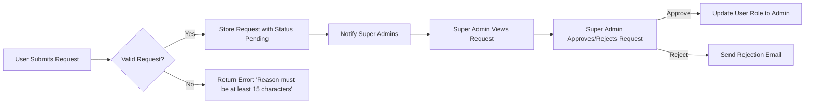
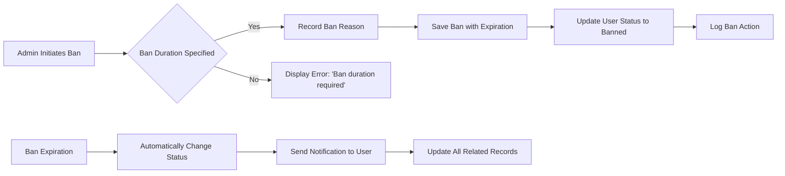

# Economic/Political Discussion Board Requirements Specification

## 1. Introduction

### 1.1 Purpose
This document serves as the authoritative requirements specification for the economic and political discussion board application. It details all functionality, business rules, and user interactions required for developers to build a production-ready backend system.

### 1.2 Scope
The application enables users to participate in forums discussing economic and political topics with the ability to create articles, comment on content, and engage with administrative features. The system supports user accounts, content management, section organization, and administrative controls.

---

## 2. User Account Management

### 2.1 Account Creation

WHEN a user submits registration data with valid email and password, THE system SHALL:
- Generate a new user account with default role 'member'
- Send verification email with registration link
- Store account creation timestamp and verification status
- Enforce password complexity requirements (minimum 12 characters, uppercase, lowercase, number)

**Business Rules**:
- Email addresses must be unique across all users
- Passwords must not include personal information
- Usernames (derived from email) must be unique

### 2.2 Authentication

WHEN a user attempts to log in, THE system SHALL:
- Verify credentials against stored user data
- Generate JWT token with expiration of 24 hours
- Record login timestamp and IP address
- Reject authentication after 5 failed attempts with 15-minute lockout

**Business Rules**:
- Passwords must be hashed using bcrypt with 12 salt rounds
- Email verification is required before account activation
- Users must confirm their session on new devices

### 2.3 Account Management

WHEN a user requests to change their password, THE system SHALL:
- Validate current password
- Enforce new password complexity requirements
- Record password change timestamp
- Invalidate all active sessions for the user

WHEN a user requests account deletion, THE system SHALL:
- Verify account ownership via email confirmation
- Delete all associated articles and comments
- Mark user account as deleted (not physically removed from database)
- Notify the user of successful deletion

**Business Rules**:
- User must wait 24 hours after password change before deleting account
- Account deletion requires verification with existing password
- Deleted content cannot be recovered

---

## 3. User Profile System

### 3.1 Profile Information

THE system SHALL store for each user:
- Display name (maximum 50 characters)
- Biography text (maximum 500 characters)
- Profile creation timestamp
- Account status (active, deleted, suspended)

WHEN a user updates their profile, THE system SHALL:
- Allow modification of display name and biography
- Validate field lengths and content safety
- Record update timestamp
- Notify the user of successful update

### 3.2 Profile View

WHEN a user views another user's profile, THE system SHALL:
- Display the user's display name and biography
- Show list of articles created by the user
- Show list of comments written by the user
- Provide option to follow or message the user

**Business Rules**:
- Public profile visibility for all registered users
- Private profile data (email, phone) remains hidden to others
- Profile views are logged for moderation purposes

---

## 4. Section Management

### 4.1 Section Structure

A section is defined by:
- Name (maximum 50 characters, alphanumeric)
- Description (maximum 200 characters)
- Creation timestamp
- Creator user ID

### 4.2 Administrative Control

WHEN a super administrator creates a section, THE system SHALL:
- Assign unique system-generated ID
- Store section name with sanitization
- Record creation timestamp
- Add to public section list

WHEN a regular administrator edits a section, THE system SHALL:
- Update section description and name
- Log all changes
- Notify all users with a system message

**Business Rules**:
- All section names must pass content safety checks
- Only administrators can create sections
- Section IDs cannot be reused after deletion

---

## 5. Article Management

### 5.1 Article Creation

WHEN a user creates an article, THE system SHALL:
- Validate title (minimum 10 characters)
- Store content as Markdown text
- Associate with selected section
- Create article ID with format ART-YYYYMMDD-NNN
- Store article creation timestamp
- Record associated user ID

**Business Rules**:
- Articles must include at least one valid section
- Users cannot create articles while banned
- Article titles must not contain offensive language

### 5.2 Attachment Management

THE system SHALL support multiple attachments per article:
- File uploads (max 50MB per file, all types except executables)
- Image uploads (PNG, JPG, GIF, max 10MB)
- Automatic image resizing (max dimension 2000px)

WHEN a user attaches files, THE system SHALL:
- Validate file types and sizes
- Generate secure download URLs
- Store file metadata including original name and size
- Compress images to optimize storage usage

### 5.3 Article Editing

WHEN a user edits their article, THE system SHALL:
- Allow modification of title, content, and attachments
- Preserve all previous versions in history
- Record editor and edit timestamp
- Notify the user of successful update

**Business Rules**:
- Users can only edit articles they authored
- Article edits must not exceed 100 revisions
- Deleted attachments are archived, not permanently removed

---

## 6. Administrator System

### 6.1 Administrator Requests

WHEN a user submits a request for administrator status, THE system SHALL:
- Verify user has been active for at least 30 days
- Check request reason length (minimum 15 characters)
- Create request with pending status
- Notify super administrators

WHEN a super administrator approves the request, THE system SHALL:
- Update user's role to 'regular administrator'
- Send confirmation email
- Record approval timestamp
- Log in the administrator audit trail

### 6.2 Administrative Grading

THE system SHALL manage two administrator grades:
- Regular Administrator: Manages articles, sections
- Super Administrator: Manages all aspects including user roles

WHEN a super administrator attempts to promote a regular administrator, THE system SHALL:
- Verify user has held role for at least 90 days
- Ensure less than 3 super administrators exist
- Update role grade and record action

**Business Rules**:
- Maximum of 3 super administrators allowed
- Regular administrators must be inactive for at least 90 days to be promoted
- System auto-promotes highest-privileged regular administrator when all super admins are demoted

---

## 7. Banning System

WHEN an administrator bans a user, THE system SHALL:
- Require valid ban reason (minimum 10 characters)
- Store ban duration and expiration date
- Record banning administrator ID
- Set user status to 'banned'
- Prevent login but preserve all existing content

WHEN a ban period expires, THE system SHALL:
- Automatically set user status to 'active'
- Send notification to user
- Update all related records
- Log automatic unban action

**Business Rules**:
- Ban durations must be specified (e.g., 7 days, 30 days, permanent)
- Banned users cannot create new content
- Ban decisions are reversible via administrator action

---

## 8. Requirements Validation

### 8.1 System Constraints
- Articles can have up to 10 attachments
- Comment text is limited to 20,000 characters
- Banned users receive automatic notification 24 hours before ban expiration
- User roles are managed with hierarchical permissions
- All administrative actions are recorded in audit log with timestamp

### 8.2 Performance Expectations
- User profile load time for content < 1.5 seconds
- Article list loading time < 2 seconds
- Banner system updates in real-time without user refresh
- Ban processing completion in < 0.5 seconds

### 8.3 Success Metrics
- 95% of user authentication requests succeed within 2 seconds
- 100% of administrative actions logged with sufficient detail
- 99.9% uptime for all user-facing features during business hours
- 100% content preservation for banned users' content
- 95% of article search results displayed within 2 seconds
