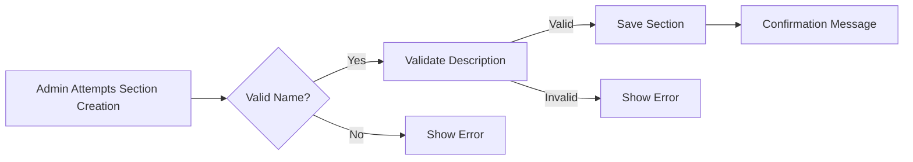
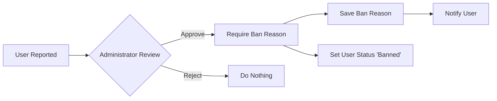

# Economic/Political Discussion Board - Requirements Specification

## 1. Service Overview

### 1.1 Vision
The EconPol Discussion Platform enables users to engage in moderated economic and political discourse through structured articles, comments, and topic sections. The platform prioritizes civil discussion while maintaining robust administrative controls for content quality.

### 1.2 Core Features
- Multi-section discussion environment (Politics, Economy, Current Affairs)
- User account management with profile customization
- Article creation with rich media support
- Administrative control system for content moderation
- Banning system with comprehensive audit trails

### 1.3 Technical Overview
The application will be implemented as a NestJS backend with Prisma ORM, providing RESTful APIs for frontend consumption. All data operations will follow enterprise-grade security and performance standards.

## 2. Business Model

### 2.1 Target Audience
- Political and economic professionals
- Educators and students
- Policy analysts
- General public interested in civic discourse

### 2.2 Value Proposition
The platform provides:
- Structured discussion categories for topic-focused exchanges
- Moderation tools to maintain civil discourse
- User profile visibility to build community reputation
- Tag-based content discovery for easier topic navigation

### 2.3 User Journey
User Registration → Profile Setup → Section Selection → Article Creation → Comments → Community Participation → (Optional) Admin Role Request

## 3. User Actors

| Actor              | Description                                       | Permissions |
|--------------------|--------------------------------------------------|-------------|
| Registered User    | Basic forum participant                           | Full content access, create articles/comments |
| Admin              | Standard moderator                                | All user functionality + section/article management |
| Super Admin        | Platform administrator with role management       | All admin functionality + user role management, ban management |

## 4. Functional Requirements

### 4.1 User Account Management

#### 4.1.1 Registration
WHEN a new user attempts to register with a valid email and password, THE system SHALL create a new account with status 'active' and send verification email.
WHEN registration email format is invalid, THE system SHALL display 'Invalid email format' error.
THE system SHALL not allow duplicate email addresses.

#### 4.1.2 Profile Management
WHEN a user edits their display name or bio, THE system SHALL update profile information in the database and return confirmation message.
THE system SHALL require display name to be 2-50 characters and bio to be 0-500 characters.

### 4.2 Section Management

#### 4.2.1 Section Creation
WHEN a super administrator creates a new section with valid name and description, THE system SHALL save the section and add to available sections.
WHEN section name exceeds 50 characters, THE system SHALL display 'Section name must be 50 characters or less' error.

#### 4.2.2 Section Deletion
WHEN an administrator deletes a section with no attached articles, THE system SHALL remove the section immediately.
WHEN an administrator deletes a section with attached articles, THE system SHALL migrate all articles to 'Uncategorized' section and show migration count.

### 4.3 Article Management

#### 4.3.1 Creation Requirements
WHEN a user submits an article with title, content, and valid section, THE system SHALL validate:
- Title: 5-200 characters
- Content: 10-5000 characters
- Section: Must exist
- Attachments: Max 5 files (max 10MB each)
WHEN validations fail, THE system SHALL display specific error messages.

#### 4.3.2 Article Modification
WHEN a user edits their article, THE system SHALL allow title/content/attachments/tags modification within 48 hours of creation.
THE system SHALL log all modification history for audit purposes.

#### 4.3.3 Article Visibility
WHEN an article is created, THE system SHALL set its status to 'Published' for public viewing.
WHEN an article is deleted, THE system SHALL immediately remove it from search results but preserve in admin history.

### 4.4 Commenting System

#### 4.4.1 Comment Rules
WHEN a user submits a comment on an article, THE system SHALL require:
- Content: 1-1000 characters
- Must be single-level (no nesting)
- Must reference valid article
WHEN comment content exceeds limits, THE system SHALL display 'Comment exceeds 1000 characters' error.

#### 4.4.2 Comment Moderation
WHEN an administrator reviews comments, THE system SHALL display all comments for the article sorted by oldest first.
THE system SHALL allow deletion of any comment without affecting article content.

### 4.5 Administrator Functions

#### 4.5.1 Role Management
WHEN a super administrator approves a user role request, THE system SHALL update user role to 'admin' and send confirmation email.
WHEN a super administrator promotes a regular admin to super admin, THE system SHALL:
- Update role
- Change role permissions
- Update audit log

#### 4.5.2 Ban Management
WHEN an administrator bans a user for violating policies, THE system SHALL require:
- Ban reason: 10-255 characters
- Effective date: Current timestamp
THE system SHALL save ban reason and prevent login attempts.

## 5. Authentication Requirements

### 5.1 Core Workflow
WHEN a user submits valid email/password for login, THE system SHALL:
- Authenticate against database
- Generate JWT token
- Return token with 30-day expiration
- Set secure HTTP-only cookie
WHEN authentication fails (invalid credentials), THE system SHALL display 'Invalid email or password' within 2 seconds.

### 5.2 Password Management
WHEN a user requests password reset, THE system SHALL send verification email.
WHEN password reset link is used within 24 hours, THE system SHALL allow password change.
THE system SHALL log all password change attempts for security analysis.

## 6. Security Requirements

### 6.1 Content Restrictions
THE system SHALL block article content containing:
- Non-ASCII special characters (excluding standard punctuation)
- URLs exceeding 255 characters
- HTML tags or JavaScript execution

### 6.2 Data Protection
THE system SHALL encrypt all user passwords using bcrypt with 12 rounds.
THE system SHALL apply rate limiting (100 requests/minute) to all endpoint APIs.

## 7. Business Rules

### 7.1 Article Lifecycle
- All newly created articles default to 'Published' status
- Deleted articles remain viewable with 'DELETED' marker
- Articles exceeding 5000 characters are automatically split into parts

### 7.2 Permission Hierarchy
- Admins can delete any content
- Super admins can manage user roles
- Regular users cannot access administrative interfaces

### 7.3 Concurrency Protection
WHEN multiple users attempt to edit the same article, THE system SHALL block concurrent modifications and display 'Article being edited by another user' message.

## 8. Performance Requirements

WHEN a user browses section articles (100 items), THE system SHALL load within 1.5 seconds for 95% of requests.
WHEN a user searches with tags, THE system SHALL return results within 2 seconds for datasets up to 10,000 articles.

## 9. Error Handling

### 9.1 Validation Errors
WHEN user submits invalid section selection, THE system SHALL display 'Invalid section selection' error.
WHEN article attachment file type is unsupported (e.g., .exe), THE system SHALL display 'Unsupported file type' error.

### 9.2 System Failures
WHEN payment API is unavailable (for premium features), THE system SHALL display 'Processing services unavailable - please try again later' message without exposing technical details.
WHEN database connection fails, THE system SHALL show 'Service temporarily unavailable' message and log error for monitoring.

## 10. User Experience Specifications

### 10.1 Article Listing
The article listing page SHALL display:
- Article title (linked to view)
- Author name (linked to profile)
- First 50 characters of content preview
- Number of comments
- Time posted (relative: '2 hours ago')

### 10.2 Search Functionality
WHEN a user searches by title or content, THE system SHALL:
- Return matching articles and their sections
- Filter by specified tags if provided
- Paginate results (20 items per page)
- Sort by newest first by default

## Appendix: Business Context

This platform supports civil discourse in politically sensitive topics. Discussion rules require:
- No personal attacks or threats
- Arguments must be supported by factual sources
- Users must maintain respectful language

The platform's success metrics include:
- 80% of articles meeting discussion guidelines
- 75% user retention after 30 days
- 60% growth in article volume quarterly

This document serves as the authoritative requirements specification for all downstream phases (Database, Interface, Test, Realize).