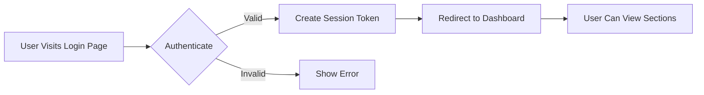

# Economic/Political Discussion Board Requirements

## Service Overview

The Economic/Political Discussion Board is a platform for users to engage in constructive discussions about economic and political topics. The service enables users to create, share, and discuss articles within organized sections while maintaining strict moderation controls and user account management capabilities.

### Core Values
- Constructive dialogue on economic and political matters
- Transparent content management
- Secure user environment with appropriate moderation
- Mobile-responsive interface for all device types

### Scope
- Platform for public discussion of economic/ political topics
- User-generated article and comment system
- Role-based access control (user, administrator, super administrator)
- Content moderation capabilities for administrators
- Secure user account management

### Success Metrics
- 75% of newly registered users creating at least one article within 30 days
- Average session duration of 15+ minutes per user
- Less than 5% of articles requiring moderation interventions
- 95% user satisfaction rate in post-registration surveys

## Business Model

### Revenue Stream
- Freemium model with basic features free to all users
- Premium membership (15/month) for extra features:
  - Advanced search filtering
  - Article promotion to top of section
  - Increased attachment size limits (20 MB)
  - Customizable profile themes

### Audience
- General public interested in economic and political discussions
- Students and academics engaging in research
- Professionals seeking diverse viewpoints on economic policies
- Journalists gathering public opinion on political topics

### Key Metrics
- Minimum of 500 active users within first 3 months
- 30% of users progressing to premium within 6 months
- 15+ articles per section maintained daily
- 50+ comments per active article

## User Actors

### User Types and Permissions

| User Type | Permissions | Article Management | Section Management | User Management |
|-----------|-------------|--------------------|-------------------|----------------|
| Regular User | Create articles, comments | Own articles only | None | None |
| Regular Administrator | Full user permissions + | Full control | Create/edit sections | Ban users |
| Super Administrator | Full regular admin + | Full control | Full control | Ban users, promote admins |

### Authentication Flow

### User Registration Process

WHEN a new user registers for the platform, THE system SHALL:
- Require email address validation with confirmation email
- Enforce password strength requirements (12+ characters)
- Create a profile with default display name 'User[123]'
- Store registration timestamp and IP address

WHEN a user attempts to register with an existing email, THE system SHALL display 'Email already in use' message with HTTP 409 response.

## Content Management

### Article Creation

WHEN a user creates a new article, THE system SHALL:
- Allow title (5-100 characters)
- Allow content (50-10,000 characters)
- Require selection of one valid section
- Allow up to 10 file attachments (10MB each, .jpg, .png, .pdf, .docx, .txt)
- Allow up to 5 tags (unique per article)

WHEN a user attempts to submit with invalid title length, THE system SHALL display 'Title must be 5-100 characters' message with HTTP 400 response.

### Article Editing

WHEN a user edits their own article, THE system SHALL:
- Allow modification of title, content, attachments, tags
- Prevent section changes
- Record edit timestamp

WHEN a user attempts to edit another user's article, THE system SHALL show 'You do not have permission to edit this article' with HTTP 403 response.

### Comment Management

WHEN a user writes a comment, THE system SHALL:
- Require minimum 5 characters of content
- Allow maximum 500 characters per comment
- Sort comments by oldest first
- Display author's display name and comment timestamp

WHEN a comment exceeds 500 characters, THE system SHALL show 'Comment too long (max 500 characters)' with HTTP 400 response.

## Section Management

### Section Creation

WHEN a regular administrator creates a new section, THE system SHALL:
- Require section name (3-50 characters)
- Require section description (10-200 characters)
- Generate unique section ID

WHEN an administrator attempts to create a duplicate section name, THE system SHALL show 'Section name already exists' message with HTTP 409 response.

### Section Usage

THE system SHALL allow users to:
- View all available sections with names and descriptions
- Browse articles within a selected section
- See number of articles per section

## Search and Filtering

### Search Functionality

WHEN a user searches for articles, THE system SHALL:
- Allow search by title or content
- Display results paginated 20 per page
- Provide filtering by tags

WHEN search returns more than 100 results, THE system SHALL display 'Displaying first 100 results' with HTTP 200 response.

### Performance Requirements

THE system SHALL:
- Load search results within 0.8 seconds
- Process article listings within 1.5 seconds
- Display images within 0.5 seconds

## Administration and Moderation

### Administrator Functions

WHEN a regular administrator reviews content, THE system SHALL:
- Allow deletion of any article
- Allow deletion of any comment
- Display article and comment details

WHEN a user submits an administrator request, THE system SHALL:
- Record submission with reason text
- Notify super administrators
- Display pending requests in admin interface

### Administrator Promotion

WHEN a super administrator promotes a regular administrator, THE system SHALL:
- Update role in user database
- Notify the user of promotion
- Record promotion in audit log

WHEN a super administrator attempts to promote themselves, THE system SHALL show 'Cannot promote self' message with HTTP 400 response.

## User Banning

### Banning Process

WHEN an administrator bans a user, THE system SHALL:
- Prevent login attempts
- Preserve all existing articles and comments
- Record ban reason
- Display 'Account banned' message to user

WHEN a user attempts to login after being banned, THE system SHALL show 'This account has been banned' with HTTP 403 response.

### Ban History

THE system SHALL maintain detailed ban history including:
- Ban date and timestamp
- Reason provided by administrator
- Administrator who applied ban
- Effective date of ban
- Expiry date (if applicable)

## Technical Requirements

### Authentication

- JWT tokens with session expiration of 30 minutes of inactivity
- Passwords stored with bcrypt (cost 12)
- CSRF protection on all state-changing endpoints
- 2FA option available for premium users

### Error Handling

All error responses SHALL contain:
- HTTP status code
- Error key
- User-friendly message

WHEN an invalid JWT token is detected, THE system SHALL respond with HTTP 401 and error key 'INVALID_TOKEN'.

## Business Rules Summary

These business rules define the minimum capabilities and constraints of the Economic/Political Discussion Board, ensuring consistent behavior across the platform. All functionality must strictly comply with these rules without exception.

Key enforcement points:
- All content must be validated before creation
- User authorization must be consistently checked at all levels
- Business constraints must be enforced at the application layer
- Session management must follow specified duration limits
- All user actions must be audited for moderation purposes