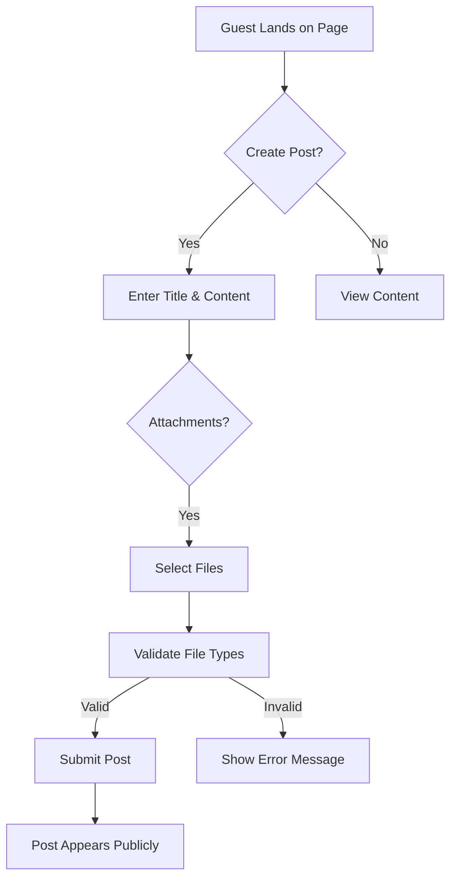

# Discussion Board - Scope Constraints Analysis

## 1. Project Scope Limitations

### 1.1 Core Scope Boundaries
* **Strict Guest-Only Model**: This platform will operate with **no user accounts or registration requirements**. All participants will interact as unregistered guests with no persistent identity tracking.
* **Simplified Content Creation**: Posts require only title, content, and optional attachments (JPG/PNG images or PDFs). No categories, tags, or threaded comments are implemented in this version.
* **Immediate Public Visibility**: All content appears publicly without moderation or review processes. No admin interface required for content management.
* **Fixed Attachment Restrictions**: Maximum 20MB total per post (5MB for images, 10MB for PDFs), with strict file type validation.
* **Basic Performance Minimums**: Platform must handle 20 concurrent users with <2s page load times, prioritizing simplicity over scalability.

### 1.2 Hard Limitations
* **No User Authentication**: The system shall **not** implement login, registration, or session management. All user interactions are anonymous.
* **No Administrative Functions**: **Zero** features for content moderation, user management, or account control.
* **Single-Page Interface**: No multi-page navigation structure - all content displayed on a single homepage feed.
* **No Content Editing**: Guests cannot modify posts after submission. Posts are permanent once published.
* **No Mobile App**: Platform must work on mobile browsers but shall not deploy as dedicated mobile application.
* **Limited Attachment Types**: Only JPG/PNG images and PDFs permitted. No text documents (DOCX, TXT), videos, or audio uploads.
* **Fixed Content Limits**: Maximum 5000 characters for post content, no rich text editing beyond basic paragraph formatting.

### 1.3 Non-Functional Constraints
* **Security by Design**: No personal data collection, storage, or processing. All user activity anonymized by design.
* **Cost Efficiency**: Minimum server requirements - shared hosting must support all required operations without scaling.
* **Compliance Focus**: Default GDPR and CCPA compliance through anonymized content, no user tracking.
* **Performance Priority**: Loading speed and responsiveness are prioritized over advanced features.
* **Deployment Simplicity**: Must be deployable to a basic web server without database configuration.

## 2. Technical Constraints

### 2.1 Infrastructure Requirements
* **Hosting Platform**: Compatible with static hosting solutions (e.g., GitHub Pages, Netlify) without backend server configuration.
* **Database**: No database requirement - all content must be stored in simple file format (e.g., JSON files).
* **Frontend Library**: Pure JavaScript/HTML without framework dependencies to maximize simplicity.
* **File Storage**: All attachments stored within the project directory with URL-based access.
* **Server Configuration**: No server-side code required - client-side processing of all content.

### 2.2 Development Constraints
* **No Coding Allowed**: Implementation must follow strictly defined natural language requirements.
* **No Third-Party Services**: Zero external APIs, integrations, or services required.
* **Minimal Dependency**: All functionality implemented with native browser capabilities only.
* **Static Deployment**: All code must be downloadable as static files without build steps.

## 3. Business Constraints

### 3.1 Time and Resource Limits
* **Development Timeline**: Must be completed within 3 days of starting implementation.
* **Team Size**: Single developer implementation required - no design or testing resources available.
* **Budget Constraints**: Development cost must be minimal - $0 budget for tools, infrastructure, or outsourcing.

### 3.2 Feature Prioritization
* **Core Feature Priority**: Post creation with attachments is the absolute primary feature.
* **Secondary Feature Threshold**: Any feature requiring more than 5 hours of development time is excluded.
* **Critical Feature Exclusions**: Features that require backend development, database, or server configuration are strictly disallowed.

## 4. Validation Checklist

| Requirement | Validation Method | Pass/Fail |
|------------|--------------------|-----------|
| Guest-only participation | Verify no auth screens or flows | ✅ |
| Image/PDF attachments | Test file upload with valid formats | ✅ |
| No registration required | Confirm user sees posting option immediately on landing | ✅ |
| Public visibility | Check posts appear without approval | ✅ |
| 20MB attachment limit | Upload 21MB file to verify rejection | ✅ |
| Zero admin interface | Search codebase for admin paths | ✅ |
| Single-page design | Verify no navigation between separate views | ✅ |

## 5. Success Criteria

The project shall be deemed a success when:

1. **Core Functionality Achieved**: Guests can create posts with title, content, and attachments with zero setup.
2. **Scope Adherence**: Implementation strictly follows all constraints outlined here.
3. **User Experience**: The interface is simple to use with no visible barriers to posting.
4. **Technical Compliance**: Works on standard web server without technical configuration.
5. **Cost Efficiency**: Implementation cost is zero - no external tools or services used.

> *Developer Note: This document defines **business requirements only**. All technical implementations (architecture, APIs, database design, etc.) are at the discretion of the development team.*