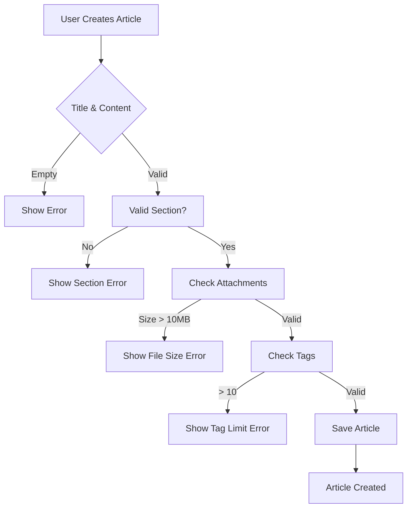

# Economic/Political Discussion Board Requirements Specification

## 1. User Account

### Registration and Login Requirements

**WHEN a new user attempts to register** with an email and password, THE system SHALL require a valid email format and a password meeting minimum complexity requirements (8+ characters, including one uppercase letter, one lowercase letter, and one special character). THE system SHALL display specific error messages for invalid inputs.

**WHEN a user submits their registration details**, THE system SHALL automatically send a verification email to the provided address and prevent account creation until verified. THE system SHALL display a clear message about the verification process.

**WHEN a user attempts to log in** using their email and password, THE system SHALL authenticate against the database and generate a signed JWT token. THE system SHALL prevent multiple login attempts from the same IP within 5 minutes to prevent brute force attacks.

**WHEN a user requests a password reset**, THE system SHALL send an email containing a one-time use token valid for 15 minutes. THE system SHALL invalidate all active sessions when password is successfully changed.

### Account Management Requirements

**WHEN a user submits a password change request**, THE system SHALL require the current password and a new password meeting complexity rules. THE system SHALL display confirmation message upon successful change.

**WHEN a user requests account deletion**, THE system SHALL require confirmation of the request and display a warning about permanent data loss. THE system SHALL delete all associated articles, comments, and attachments immediately with no recovery option.

**WHEN a user is deleted by the platform**, THE system SHALL retain audit logs of the deletion event, including timestamp, user ID, and deletion reason for 90 days.

## 2. User Profile

### Profile Creation and Maintenance Requirements

**WHEN a user creates a profile**, THE system SHALL allow entry of a display name (minimum 3 characters, maximum 30 characters) and a bio text (maximum 250 characters). THE system SHALL reject submissions with invalid content.

**WHEN a user edits their profile**, THE system SHALL allow updates to their display name and bio. THE system SHALL automatically save changes without requiring confirmation.

**WHEN a user views another user's profile**, THE system SHALL display the user's display name, bio, and their active article count. THE system SHALL show a paginated list of articles (up to 20 per page) ordered by most recent first.

### Profile Content Management Requirements

**WHEN a user's bio is modified**, THE system SHALL update and display the new bio immediately on all profile views. THE system SHALL not retain previous bio content after modification.

**WHEN an article is deleted by its author**, THE system SHALL automatically reduce the author's article count by 1 and update all profile displays within 3 seconds.

## 3. Sections

### Section Management Requirements

**WHEN an administrator creates a new section**, THE system SHALL require a unique section name (maximum 30 characters) and a section description (up to 200 characters). THE system SHALL display an error for duplicate section names.

**WHEN an administrator edits an existing section**, THE system SHALL allow modification of the description only; section names SHALL NOT be editable. THE system SHALL display a confirmation message after successful changes.

**WHEN a user views the list of sections**, THE system SHALL display all public sections in alphabetical order with their descriptions. THE system SHALL show a 'Create Article' button for users with permission to create articles in the section.

## 4. Articles

### Article Creation Requirements

**WHEN a user selects a section for article creation**, THE system SHALL verify the section is valid and accessible. THE system SHALL display error if the selected section has been deleted.

**WHEN a user attaches files to an article**, THE system SHALL limit total file size to 10MB per article. THE system SHALL display an error if the combined size exceeds this limit.

**WHEN a user adds tags to an article**, THE system SHALL allow up to 10 tags; each tag shall be 1-30 characters. THE system SHALL not allow duplicate tags within the same article.

### Article Editing and Deletion Requirements

**WHEN a user edits their article within 24 hours of creation**, THE system SHALL allow modifications to title, content, attachments, and tags. THE system SHALL display a warning message about the 24-hour edit window.

**WHEN a user attempts to edit an article after 24 hours**, THE system SHALL prevent modifications and display a notification that editing is no longer permitted.

**WHEN a user deletes their article**, THE system SHALL delete all associated comments and attachments immediately. THE system SHALL not retain any content related to the deleted article after deletion.

## 5. Article List

### Listing and Sorting Requirements

**WHEN a user views articles within a section**, THE system SHALL display a paginated list (20 articles per page) showing title, author, tags, comment count, and time posted. THE system SHALL truncate article content to display only titles in listings.

**WHEN a user sorts articles**, THE system SHALL allow sorting by 'Newest First' or 'Oldest First'. THE system SHALL persist the sort order across subsequent page views until changed.

**WHEN a user searches articles by keyword**, THE system SHALL display results matching the title or content within 2 seconds. THE system SHALL limit results to 20 articles per page.

## 6. Viewing an Article

### Article Reading Requirements

**WHEN a user views a single article**, THE system SHALL display the complete content with title, author, time posted, tags, and any attachments. THE system SHALL show all attached files and images with download buttons.

**WHEN a user views an article with attachments**, THE system SHALL allow downloading each file and image individually. THE system SHALL not require user authentication for downloading public attachments.

**WHEN a user has no article view history**, THE system SHALL track their current view. THE system SHALL update article access counts within 3 seconds of viewing.

## 7. Comments

### Commenting System Requirements

**WHEN a user creates a comment on an article**, THE system SHALL require a minimum comment length of 5 characters and a maximum of 500 characters. THE system SHALL prevent submission if comments fail validation.

**WHEN a user edits their comment within 12 hours of creation**, THE system SHALL allow modifications. THE system SHALL display a warning about the expiration window.

**WHEN a user attempts to edit a comment after 12 hours**, THE system SHALL prevent modifications and display a notification that edits are no longer possible.

### Comment Display and Management

**WHEN a user views comments on an article**, THE system SHALL display all comments sorted by oldest first. THE system SHALL show the author, content, and time posted for each comment.

**WHEN a user deletes a comment**, THE system SHALL remove it immediately from the public view. THE system SHALL not retain the comment content after deletion.

## 8. Administrator System

### Administrator Management Requirements

**WHEN a user submits a request to become an administrator**, THE system SHALL require a reason text (minimum 10 characters, maximum 500 characters). THE system SHALL notify super administrators of the pending request.

**WHEN a super administrator approves an administrator request**, THE system SHALL upgrade the user's role to regular administrator and send a notification. THE system SHALL log the approval timestamp and decision reason.

**WHEN a super administrator promotes a regular administrator to super**, THE system SHALL require confirmation through a two-step verification process. THE system SHALL not allow self-promotion to super administrator.

## 9. Banning System

### Ban Management Requirements

**WHEN an administrator bans a user**, THE system SHALL require a ban reason (minimum 10 characters, maximum 500 characters). THE system SHALL record the ban reason in the user's audit log.

**WHEN a user is banned**, THE system SHALL prevent all login attempts. THE system SHALL allow viewing of the user's existing articles and comments, but hide the ban status from non-administrators.

**WHEN an administrator unban a user**, THE system SHALL remove the ban status immediately. THE system SHALL notify the user that they can now log into the platform.

## Mermaid Diagram of Article Workflow

