# Prisma Markdown

> Generated by [`prisma-markdown`](https://github.com/samchon/prisma-markdown)

- [Actors](#actors)
- [Systematic](#systematic)
- [Communities](#communities)
- [Posts](#posts)
- [Comments](#comments)
- [Voting](#voting)
- [Feeds](#feeds)
- [Karma](#karma)
- [Moderation](#moderation)
- [Reporting](#reporting)
- [UserProfiles](#userprofiles)

## Actors

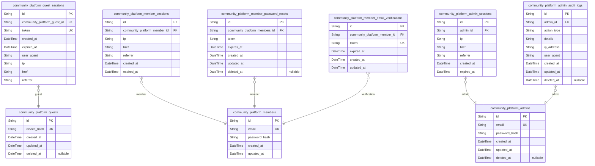

### `community_platform_guests`

Temporary guest accounts identified by device hash for public content
access. Guests are tracked via device hash to prevent abuse of public
content features and maintain access policies without requiring
authentication.

Properties as follows:

- `id`: Primary Key.
- `device_hash`: Permanent device identifier used to track guest sessions across visits
- `created_at`: Record creation timestamp.
- `updated_at`: Record last update timestamp.
- `deleted_at`: Soft delete timestamp if record is inactive.

### `community_platform_guest_sessions`

Temporary session tokens with device fingerprint for guest access management

This table stores temporary session information for unauthenticated users
who access public content. Each session is tied to a specific guest (from
community_platform_guests) and contains a unique token for API
authentication. Sessions expire after a fixed duration to enhance
security and reduce stale session storage.

Key relationships: - This table references community_platform_guests
(actor) through foreign key

Properties as follows:

- `id`: Primary Key.
- `community_platform_guest_id`
  > Guest account that owns this session. References the actor table
  > (community_platform_guests).
- `token`
  > Unique session token used for authentication. Rotated on each login
  > attempt to prevent session fixation attacks.
- `created_at`: Timestamp when the session was created (UTC).
- `expired_at`
  > Timestamp when the session will expire (UTC). Prevents stale sessions
  > from being used.
- `user_agent`
  > User agent string from the request. Helps identify client type for
  > security monitoring.
- `ip`
  > IP address associated with the session. Used for security monitoring and
  > location-based features.
- `href`
  > Full URL of the session's origin. Required for session context and
  > security.
- `referrer`
  > Source where session was initiated (e.g., browser URL). Required for
  > session security and analytics.

### `community_platform_members`

Store member information for user authentication and account management.
Includes email for identification, password hash for security, and
profile fields for user identity. Designed for use with authentication
flows and session management.

Properties as follows:

- `id`: Primary Key.
- `email`: User's unique email address for authentication.
- `password_hash`: Secure hash of user's password, stored using bcrypt or similar algorithm.
- `created_at`: Timestamp of when the account was created.
- `updated_at`: Timestamp of the last update to the account data.

### `community_platform_member_sessions`

Persistent JWT session tokens with access/refresh tokens for member
authentication. Stores secure session information including client device
data for security audits and token expiry management.

This table tracks all active member sessions with connection metadata
(IP, headers, referrer) to support security monitoring and session
lifecycle management. All sessions belong to community_platform_members
and must have valid token expiration.

Properties as follows:

- `id`: Primary Key.
- `community_platform_member_id`: Member record's [community_platform_members.id](#community_platform_members)
- `ip`: Client IP address used for session creation and security monitoring
- `href`: Full URL of session creation request
- `referrer`: Originating URL of session request
- `created_at`: Timestamp when session was created
- `expired_at`: Timestamp when session expires (not null by security requirement)

### `community_platform_member_password_resets`

Temporary tokens for password reset with expiration timestamps. These
tokens are generated when users request to reset their password and are
used to validate the reset process before resetting the password. The
token is valid for 24 hours after being generated.

Properties as follows:

- `id`: Primary Key.
- `community_platform_members_id`
  > Member whose password reset token this is. {@link
  > community_platform_members.id}.
- `token`: The unique reset token used for password reset validation.
- `expires_at`
  > Timestamp when this reset token expires. Tokens remain valid for 24 hours
  > from creation.
- `created_at`: Timestamp when the password reset token was created.
- `updated_at`
  > Timestamp when the password reset token was last updated (e.g., if
  > reissued).
- `deleted_at`
  > Timestamp when the password reset token was soft-deleted (token
  > invalidated before expiration).

### `community_platform_member_email_verifications`

Temporary tokens for email confirmation with expiration timestamps during
member account registration and verification process. Each token is
created and consumed once for email validation.

Properties as follows:

- `id`: Primary Key.
- `community_platform_member_id`: Referenced member account's {@link community_platform_members.id.
- `token`: Uniquely identifies email verification request used for validation.
- `expired_at`: Token expiration timestamp for validity checks.
- `created_at`: Token creation timestamp.
- `updated_at`: Token last update timestamp.

### `community_platform_admins`

System administrators with elevated permissions and authentication
credentials. This table stores core authentication information for admin
users, including email and password hashes. Serves as the primary
identity record for admin actors in the system.

*Note: All admin authentication flows and session management are handled
through this table's relationship to community_platform_admin_sessions,
which is managed by another agent component.

Properties as follows:

- `id`: Primary Key.
- `email`
  > User's authentication email address. Must be unique across all actor
  > tables.
- `password_hash`: Hashed password for authentication. Never stores plaintext passwords.
- `created_at`: Timestamp when admin account was created.
- `updated_at`: Timestamp when admin account was last updated.
- `deleted_at`: Timestamp when admin account was soft-deleted for audit purposes.

### `community_platform_admin_sessions`

JWT session tokens for administrative access with role-based validation.
Tracks active sessions for admin users including IP, browser context, and
session expiration details. Each session is tied to an admin account via
`admin_id`.

Properties as follows:

- `id`: Primary Key.
- `admin_id`: Admin's [community_platform_admins.id](#community_platform_admins)
- `ip`: IP address of session origin.
- `href`: Current URL location of session.
- `referrer`: Previous URL before session access.
- `created_at`: Session creation timestamp.
- `expired_at`: Session expiration timestamp (security requirement).

### `community_platform_admin_audit_logs`

Audit trail of all administrative actions including login attempts,
configuration changes, and content moderation. This historical record
captures the who (admin), what (action), when (timestamp), and additional
context (details) of all administrative activities performed within the
platform.

Properties as follows:

- `id`: Primary Key.
- `admin_id`: Corresponding admin's [community_platform_admins.id](#community_platform_admins).
- `action_type`
  > Type of administrative action (e.g., 'login_attempt', 'config_change',
  > 'content_moderation')
- `details`: Additional context and specifics about the administrative action performed
- `ip_address`: IP address of the administrator when the action was performed
- `user_agent`
  > User agent string of the administrator's browser/client when the action
  > was performed
- `created_at`: Timestamp when the audit entry was created
- `updated_at`: Timestamp when the audit entry was last updated
- `deleted_at`: Timestamp when the audit entry was deleted (soft delete)

## Systematic

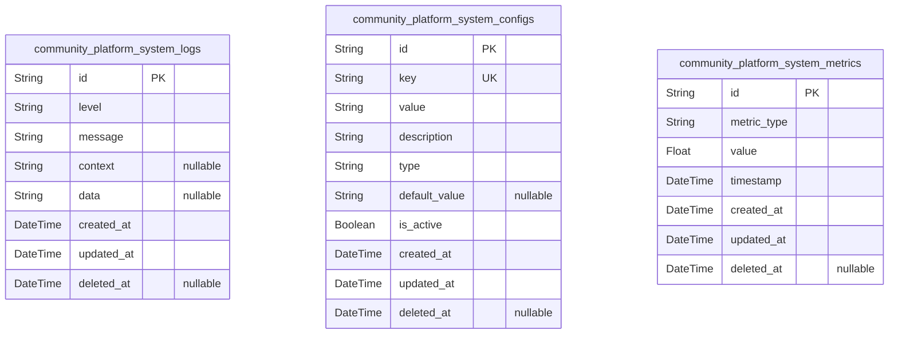

### `community_platform_system_logs`

Centralized logging system for tracking application events, errors, and
system activities, allowing administrators to monitor system health,
detect issues, and debug application behavior. This log storage provides
historical data for system analysis, performance monitoring, and security
auditing. All logging entries are timestamped with creation and update
times, with soft deletion capability to manage log retention policies
without data loss.

Properties as follows:

- `id`: Primary Key.
- `level`
  > Log severity level indicating the importance of the log entry (e.g.,
  > 'INFO', 'WARNING', 'ERROR').
- `message`
  > Main text content of the log message, providing details about the event
  > or error.
- `context`
  > Additional contextual information about the log event, such as request
  > ID, user ID, or system component involved.
- `data`
  > Structured data related to the log event, potentially containing
  > JSON-formatted details for advanced analysis.
- `created_at`: Timestamp of when the log entry was first created.
- `updated_at`: Timestamp of when the log entry was last modified.
- `deleted_at`: Timestamp of when the log entry was marked for deletion (soft delete).

### `community_platform_system_configs`

Application configuration parameters (e.g., timeout limits, feature
flags, environment settings). Stores all system configuration settings
that can be dynamically modified without code deployment.

Properties as follows:

- `id`: Primary Key.
- `key`
  > Unique configuration parameter key (e.g., 'api_timeout',
  > 'feature_analytics_enabled'). This key must be globally unique across all
  > system configurations.
- `value`
  > Current value for the configuration parameter (will be interpreted based
  > on the 'type' field). For boolean types, uses 'true' or 'false' string
  > values.
- `description`: Description of what this configuration parameter controls and its purpose.
- `type`
  > The data type of the configuration parameter (e.g., 'int', 'boolean',
  > 'string', 'duration'). This determines how the 'value' should be
  > interpreted.
- `default_value`
  > Default value for the configuration parameter when it's newly created.
  > Will be used to restore to default if no value is set.
- `is_active`
  > Whether this configuration parameter is currently active and should be
  > applied to the system.
- `created_at`: Timestamp when this configuration entry was created.
- `updated_at`: Timestamp when this configuration entry was last updated.
- `deleted_at`
  > Timestamp when this configuration entry was soft-deleted (if applicable).
  > Null means it's still active.

### `community_platform_system_metrics`

System performance metrics for tracking response times, uptime, and
resource utilization.

This table captures key performance indicators for monitoring system
health and user experience. Includes metric type, value, and timestamp
for historical tracking. Designed for efficient querying based on time
ranges and metric types.

Properties as follows:

- `id`: Primary Key.
- `metric_type`: The type of performance metric (e.g., response_time, uptime, cpu_usage).
- `value`
  > Numerical value of the metric measurement (e.g., response time in
  > milliseconds, uptime percentage).
- `timestamp`: Timestamp when the metric value was recorded.
- `created_at`: The timestamp when the metric record was created.
- `updated_at`: The timestamp when the metric record was last updated.
- `deleted_at`: The timestamp when the metric record was logically deleted (soft delete).

## Communities

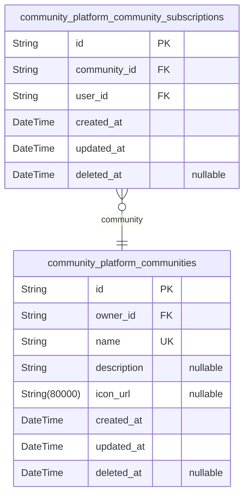

### `community_platform_communities`

Stores community metadata including unique name, description, icon URL,
and owner reference. This table serves as the primary entity representing
communities in the platform, with each community owned by exactly one
user (actor).

Properties as follows:

- `id`: Primary Key.
- `owner_id`
  > The user who created this community ({@link
  > community_platform_members.id}).
- `name`
  > Unique name of the community (used in URLs, must be unique across all
  > communities).
- `description`
  > Detailed description of the community, explaining what it's about and
  > what users can expect.
- `icon_url`
  > URL pointing to an image file used as the community's icon (e.g., PNG,
  > JPG).
- `created_at`: Timestamp when the community was created.
- `updated_at`: Timestamp when the community was last updated.
- `deleted_at`: Timestamp when the community was soft-deleted; null means not deleted.

### `community_platform_community_subscriptions`

Tracks user subscriptions to communities with timestamps for subscription
management.

This table represents the relationship between users and communities,
recording when a user subscribes to a community. It supports community
subscription management features including:
- Tracking active subscriptions for feed display
- Managing community membership status
- Supporting user subscription history
- Enforcing unique subscriptions (prevents duplicate subscriptions for
same user-community pair)

Properties as follows:

- `id`: Primary Key.
- `community_id`: Associated community's [community_platform_communities.id](#community_platform_communities).
- `user_id`: Subscribing user's [community_platform_members.id](#community_platform_members).
- `created_at`: When the subscription was created.
- `updated_at`: When the subscription was last updated.
- `deleted_at`: When the subscription was deleted (soft delete) or null if active.

## Posts

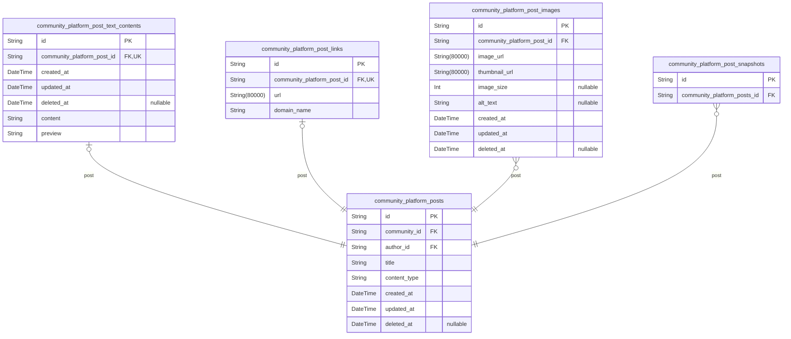

### `community_platform_posts`

Main table for all posts created by users within communities. Contains
basic metadata including title, content type, and community references.
Supports text, link, and image posts with type differentiation. Stores
post creation timestamp and authorship information for user interaction
tracking.

Properties as follows:

- `id`: Primary Key.
- `community_id`
  > The community this post belongs to. {@link
  > community_platform_communities.id}
- `author_id`
  > The member user who created this post. {@link
  > community_platform_members.id}
- `title`: The post title as displayed to users.
- `content_type`: Type of post: text, link, or image.
- `created_at`: Timestamp when the post was created.
- `updated_at`: Timestamp when the post was last updated.
- `deleted_at`: Timestamp when the post was soft-deleted (null if not deleted).

### `community_platform_post_text_contents`

Full text content and preview (first 200 characters) of text-based posts,
linked to the main community_platform_posts table for content management.

This subsidiary table holds the full text content for text-based posts,
with a preview field for display in feeds. The table is managed through
the parent post entity (community_platform_posts) with a 1:1
relationship.

Properties as follows:

- `id`: Primary Key.
- `community_platform_post_id`
  > The main post this text content belongs to. {@link
  > community_platform_posts.id}.
- `created_at`: When the text content was initially created.
- `updated_at`: When the text content was last modified.
- `deleted_at`: When the text content was logically deleted (soft delete).
- `content`: Full text content of the post.
- `preview`
  > Preview text (first 200 characters) of the post content for display in
  > feeds.

### `community_platform_post_links`

Stores the full URL and display domain name for link-based posts within
the platform. Each link entry corresponds to exactly one post via a 1:1
relationship. Domain names are displayed as part of the feed content
(e.g., 'youtube.com'). This table handles all URL-related metadata
specific to link posts without combining with other content types.

Properties as follows:

- `id`: Primary Key.
- `community_platform_post_id`
  > Reference to the main post that this link belongs to. {@link
  > community_platform_posts.id}
- `url`
  > Full URL for the linked content (e.g., 'https://example.com'). Must be a
  > valid URI.
- `domain_name`
  > Display domain name extracted from the URL (e.g., 'example.com'). For
  > feed display, only showing the domain name without path.

### `community_platform_post_images`

Stores full image URLs and thumbnails for image-based posts, capturing
the media associated with each post without redundant data.

This table handles the specific media requirements for image-based posts,
including the full-resolution URL and a thumbnail URL for display in
feeds. It is managed through the main post entity with a 1:N
relationship.

All image URLs are validated for external access and follow the
appropriate format for the platform's media storage system.

Properties as follows:

- `id`: Primary Key.
- `community_platform_post_id`: Reference to the associated post's ID.
- `image_url`: Full-resolution image URL stored with permanent access link for viewing.
- `thumbnail_url`
  > Thumbnail URL for display in feeds and previews, typically served at
  > reduced resolution.
- `image_size`: File size in bytes of the original image content.
- `alt_text`: Alternative text description for accessibility and SEO purposes.
- `created_at`: Timestamp of when this image was first stored.
- `updated_at`: Timestamp of the last update to this image record.
- `deleted_at`
  > Timestamp of when this image was soft-deleted. Nullable for soft delete
  > implementation.

### `community_platform_post_snapshots`

Point-in-time state capture of a post for editing history and audit
trail. Contains full denormalized copy of the post's state at
creation/edition time, including content and metadata. Used for version
control, moderation, and historical analysis without requiring parent
post joins.

This table supports:
- Post editing history tracking (version control)
- Auditing of post content before moderation
- Analysis of historical post data without impacting current state
- Restoration of past post states when required

Properties as follows:

- `id`: Primary Key.
- `community_platform_posts_id`: Parent post entity's [community_platform_posts.id](#community_platform_posts).

## Comments

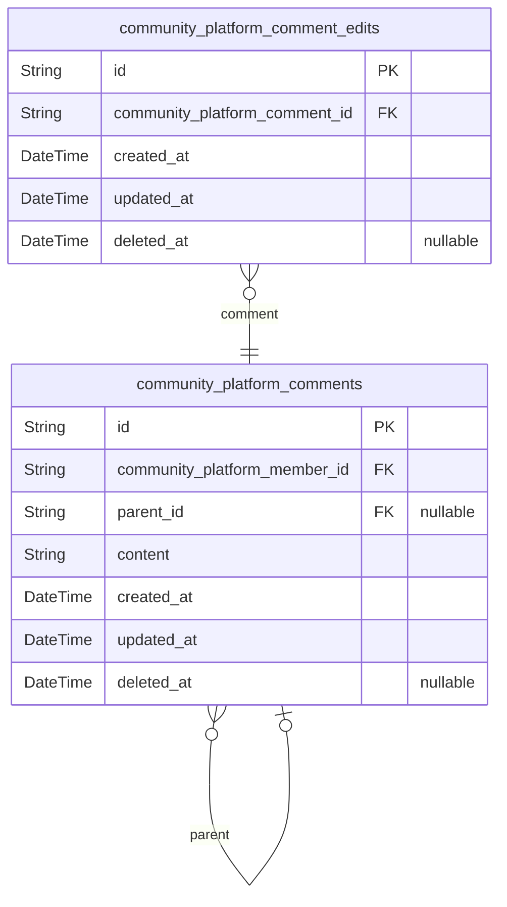

### `community_platform_comments`

Main comments table storing content, user relationships, and hierarchy
(with parent_id for nested replies). Includes text content of comments.
Supports nested comment replies via parent_id reference. Owned by
registered users (community_platform_members).

Properties as follows:

- `id`: Primary Key.
- `community_platform_member_id`: User who created the comment. [community_platform_members.id](#community_platform_members).
- `parent_id`
  > Parent comment for nested conversation structure. {@link
  > community_platform_comments.id}.
- `content`: The content of the comment (max 500 characters).
- `created_at`: Timestamp when the comment was created.
- `updated_at`: Timestamp when the comment was last updated.
- `deleted_at`: Timestamp when the comment was soft-deleted (if applicable).

### `community_platform_comment_edits`

Edit history tracking to store timestamps and user modifications with
references to original comments.

Properties as follows:

- `id`: Primary Key.
- `community_platform_comment_id`
  > Reference to the original comment being edited. {@link
  > community_platform_comments.id}.
- `created_at`: Timestamp when the edit record was created.
- `updated_at`: Timestamp when the edit record was last updated.
- `deleted_at`: Timestamp when the edit record was soft-deleted (if applicable).

## Voting

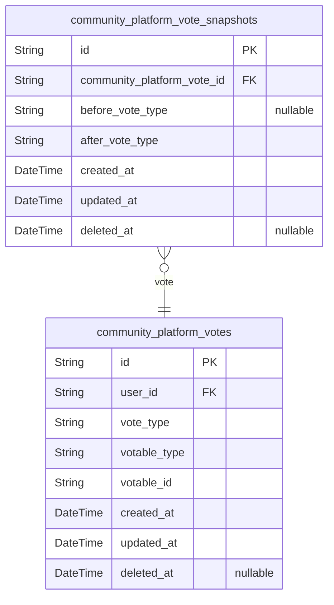

### `community_platform_votes`

Tracks current votes made by users on posts and comments, including vote
type (up/down) and timestamp. Uses polymorphic association to reference
either posts or comments. Each vote is associated with a single user, a
single post or comment, and a vote type.

Properties as follows:

- `id`: Primary Key.
- `user_id`: User who made the vote.
- `vote_type`: Vote type (up or down).
- `votable_type`: Type of votable (either 'post' or 'comment').
- `votable_id`: ID of the post or comment being voted on.
- `created_at`: Timestamp when the vote was created.
- `updated_at`: Timestamp when the vote was last updated.
- `deleted_at`: Timestamp when the vote was soft-deleted (if applicable).

### `community_platform_vote_snapshots`

Maintains historical records of vote modifications, capturing before and
after vote states for auditing and analytics. This table tracks every
change to a user's vote on posts or comments, enabling moderation
actions, karma adjustments, and dispute resolution. References the parent
vote via community_platform_vote_id and stores full snapshot of changes
including previous values for accurate historical tracking.

Properties as follows:

- `id`: Primary key for the vote snapshot.
- `community_platform_vote_id`
  > Reference to the vote this snapshot belongs to. {@link
  > community_platform_votes.id}.
- `before_vote_type`: Previous vote type before the change (e.g., 'up', 'down', 'none').
- `after_vote_type`: New vote type after the change (e.g., 'up', 'down').
- `created_at`: Timestamp when the vote snapshot was created.
- `updated_at`: Last timestamp when the vote snapshot was modified.
- `deleted_at`: Timestamp when the vote snapshot was soft-deleted (if applicable).

## Feeds

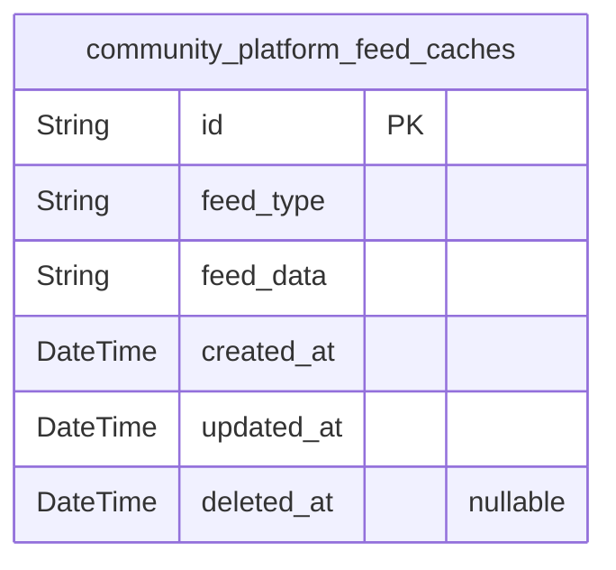

### `community_platform_feed_caches`

Temporary storage for cached feed responses to reduce database queries
and meet 5-minute cache duration performance requirement. This cache
stores precomputed feed content to minimize repeated database queries
while maintaining 5-minute cache duration for performance optimization.

Properties as follows:

- `id`: Primary Key.
- `feed_type`: Type of feed being cached (home, popular, community).
- `feed_data`
  > Serialized feed content data stored as JSON string to enable client-side
  > rendering without database access.
- `created_at`: Timestamp when cache entry was created.
- `updated_at`: Timestamp of last cache update.
- `deleted_at`: Timestamp when cache entry was marked for deletion (soft delete).

## Karma

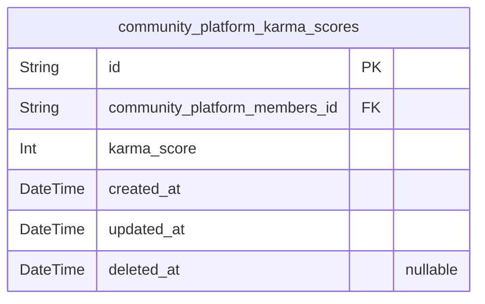

### `community_platform_karma_scores`

Current karma score for each user, updated incrementally based on votes.
This table tracks the real-time score reflecting the user's voting
activity across the platform.

Properties as follows:

- `id`: Primary Key.
- `community_platform_members_id`: User's [community_platform_members.id](#community_platform_members) with associated karma score.
- `karma_score`
  > The user's current karma score, updated incrementally based on voting
  > activity.
- `created_at`: Timestamp when the karma score record was created.
- `updated_at`: Timestamp when the karma score record was last updated.
- `deleted_at`
  > Timestamp when the karma score record was marked for deletion (soft
  > delete).

## Moderation

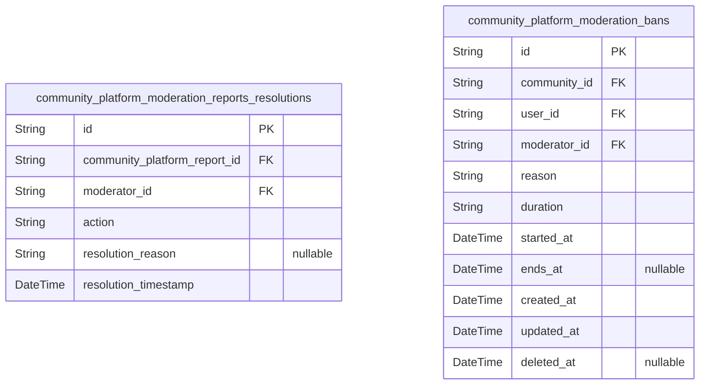

### `community_platform_moderation_reports_resolutions`

Audit trail of report resolutions including moderator actions
(approval/dismissal) and resolution timestamps. Captures resolution
status changes over time for moderation history tracking.

Properties as follows:

- `id`: Primary Key.
- `community_platform_report_id`: Report that was resolved. [community_platform_reports.id](#community_platform_reports)
- `moderator_id`
  > Moderator who performed the resolution action. {@link
  > community_platform_admins.id}
- `action`: Resolution action performed (e.g., 'approved', 'dismissed', 'escalated').
- `resolution_reason`: Reason provided by moderator for the resolution action.
- `resolution_timestamp`: Timestamp when the resolution action was performed.

### `community_platform_moderation_bans`

Active user bans within communities with duration, reason, and moderator
references.

This table tracks active bans that users have in specific communities,
including details about the ban duration, reason for the ban, and which
moderator implemented the ban. The table is a subsidiary of the
Moderation component and depends on the Communities and Users components
for data relationships.

Properties as follows:

- `id`: Primary Key.
- `community_id`
  > Community affected by this ban's {@link
  > community_platform_communities.id}.
- `user_id`: User being banned's [community_platform_members.id](#community_platform_members).
- `moderator_id`: Moderator who implemented this ban's [community_platform_admins.id](#community_platform_admins).
- `reason`
  > Reason for the ban as provided by the moderator. Maximum text length
  > enforced in business logic.
- `duration`
  > Duration of the ban in a user-friendly format (e.g., '7 days',
  > 'permanent').
- `started_at`: Timestamp when the ban went into effect.
- `ends_at`: Timestamp when the ban ends (null for permanent bans).
- `created_at`: Record creation timestamp for audit.
- `updated_at`: Record last update timestamp for audit.
- `deleted_at`: Record deletion timestamp for soft delete (null if not deleted).

## Reporting

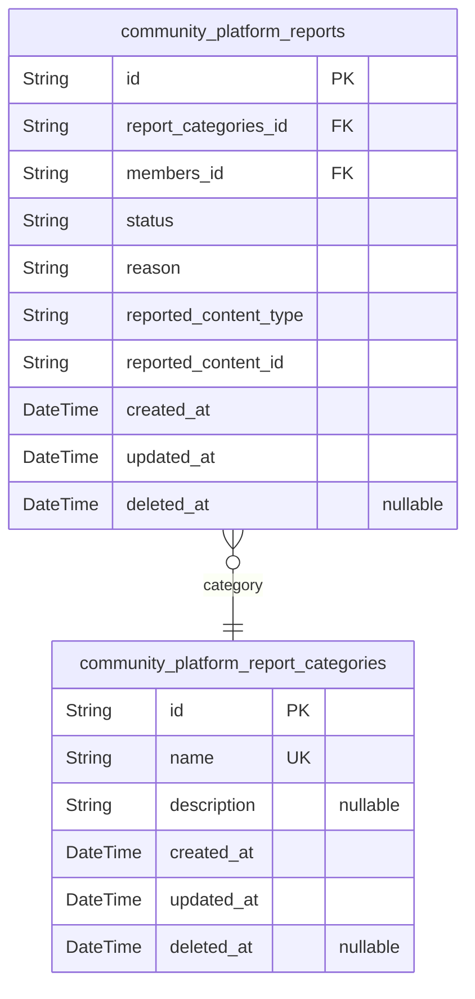

### `community_platform_report_categories`

Predefined reporting categories such as spam, inappropriate content,
copyright violation. These categories serve as a standardized set for
users to select when submitting reports of content.

Note: This is a subsidiary lookup table that is not managed by end users
but is referenced by core reporting entities. It provides consistency in
report categorization across the platform.

Properties as follows:

- `id`: Primary Key.
- `name`
  > Category name describing the type of report (e.g., spam, inappropriate
  > content, copyright violation).
- `description`
  > Detailed explanation of when this report category should be used for
  > content moderation.
- `created_at`: Timestamp of when the category record was created.
- `updated_at`: Timestamp of the last update to the category record.
- `deleted_at`
  > Timestamp of when the category record was marked as deleted for soft
  > delete. Null indicates not deleted.

### `community_platform_reports`

Core reporting records with status, category, reason, and reference to
reported content. Each report is submitted by a user, associated with a
category, and linked to the content being reported for moderation
processing.

Properties as follows:

- `id`: Primary Key.
- `report_categories_id`: Report category's [community_platform_report_categories.id](#community_platform_report_categories)
- `members_id`: Reporting user's {@link community_platform_members.id>
- `status`: Current status of the report (pending, approved, rejected).
- `reason`: Detailed reason for the report (min 10 characters, max 500).
- `reported_content_type`: Type of the reported content (post or comment).
- `reported_content_id`
  > ID of the content being reported (references the corresponding post or
  > comment ID).
- `created_at`: Time when the report was created.
- `updated_at`: Last time the report was modified.
- `deleted_at`: Time when the report was deleted (soft delete).

## UserProfiles

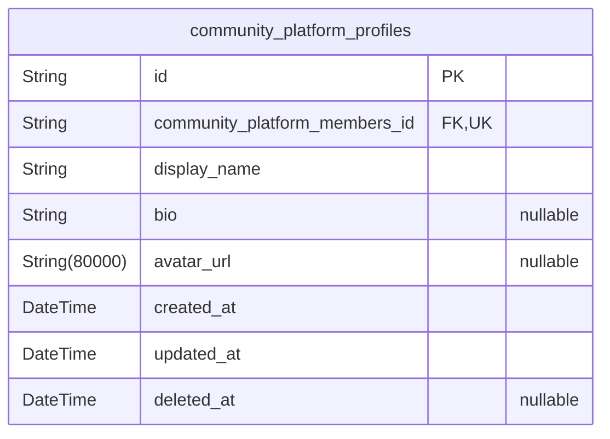

### `community_platform_profiles`

User public identity data including display name, bio text, and avatar
URL linked to actor accounts.

This table stores the public profile information that users can see and
edit. It is linked to user actor accounts (community_platform_members) as
a one-to-one relationship since each user can have only one profile.

Properties as follows:

- `id`: Primary Key.
- `community_platform_members_id`
  > The user's member account [community_platform_members.id](#community_platform_members) this
  > profile is associated with.
- `display_name`: Public display name chosen by the user, max 30 characters.
- `bio`
  > Short bio text describing the user's interests or background, max 255
  > characters.
- `avatar_url`: URL pointing to the user's avatar image (JPG/PNG, max 10MB).
- `created_at`: Timestamp when the profile was created.
- `updated_at`: Timestamp when the profile was last updated.
- `deleted_at`: Timestamp when the profile was logically deleted (soft delete).
