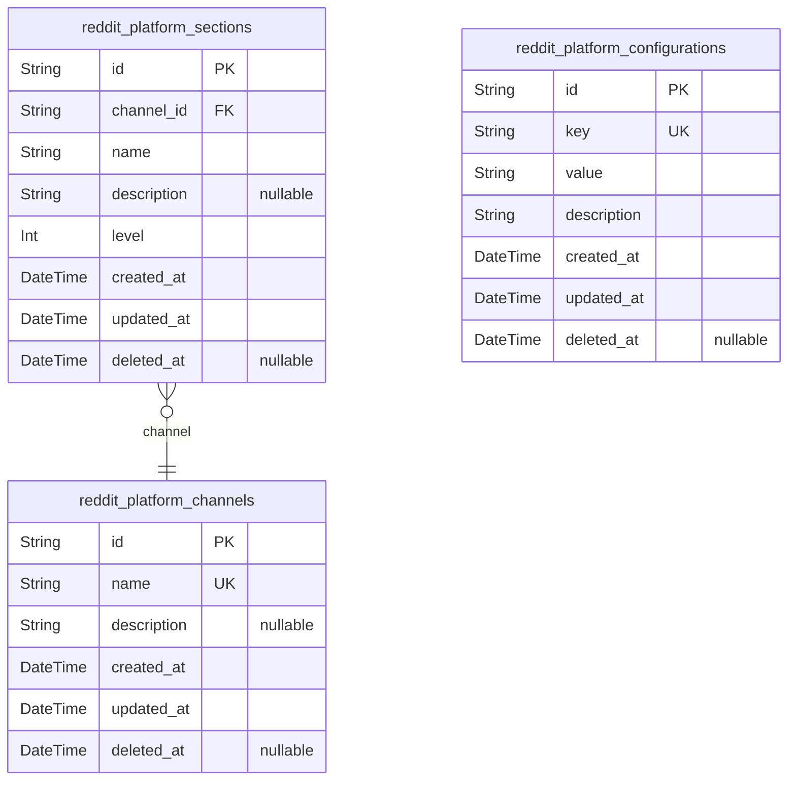
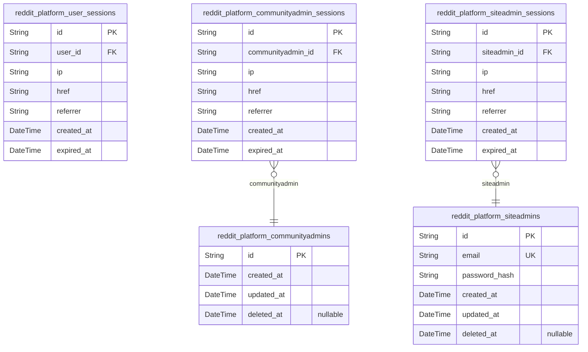
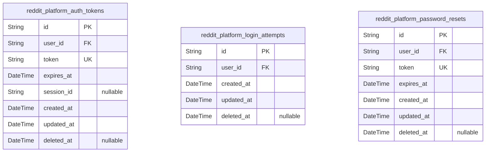
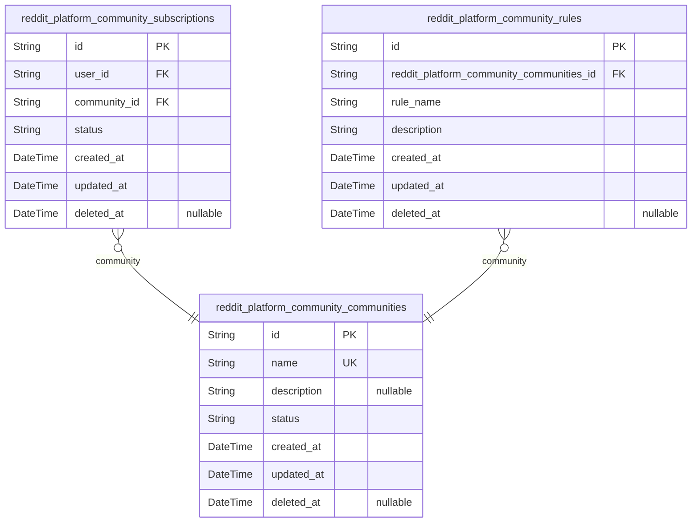
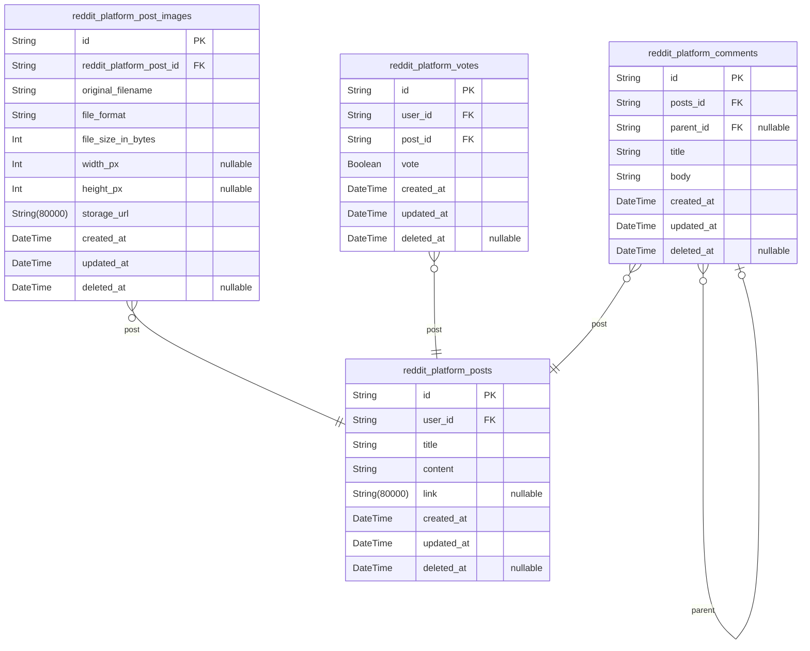
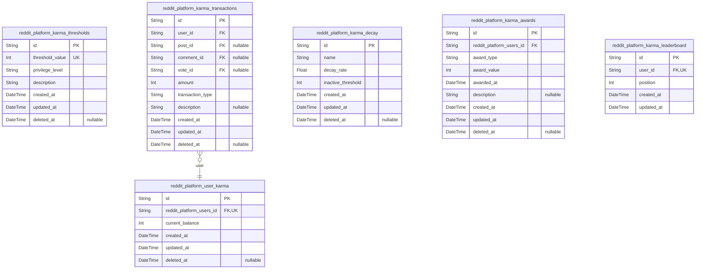
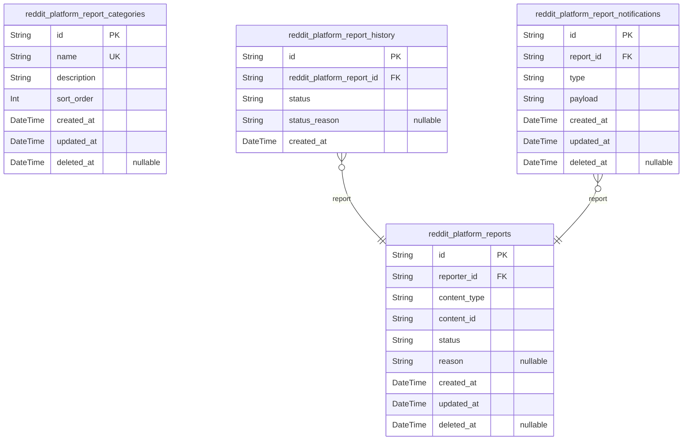
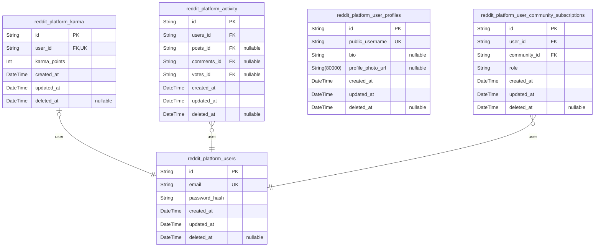

# Prisma Markdown

> Generated by [`prisma-markdown`](https://github.com/samchon/prisma-markdown)

- [Systematic](#systematic)
- [Actors](#actors)
- [Authentication](#authentication)
- [Community](#community)
- [PostComment](#postcomment)
- [KarmaSystem](#karmasystem)
- [Reporting](#reporting)
- [UserProfile](#userprofile)

## Systematic

### `reddit_platform_channels`

Platform-wide content channels representing thematic communities or
content groups with branding and configuration.

Channels are the top-level content organization units for the platform,
allowing users to categorize and discover content by topics, interests,
or communities. Each channel has a unique name, descriptive content, and
configurable settings.

Channels support basic CRUD operations: creation, viewing, updating, and
soft deletion for moderation purposes. The name field must be globally
unique across all channels.

Properties as follows:

- `id`: Primary Key.
- `name`: Unique channel name for display and routing.
- `description`: Description of the channel's purpose and content focus.
- `created_at`: Channel creation timestamp.
- `updated_at`: Last modification timestamp.
- `deleted_at`: Soft delete timestamp if marked for deletion.

### `reddit_platform_sections`

Sections representing hierarchical organizational units within content
channels for structured content grouping and visibility control.

Provides granular categorization of content under broader channel
structures with distinct settings and visibility rules. Each section
belongs to a single channel and can contain multiple sub-sections.

Maintains historical context through temporal fields, allowing audit
trails of section creation, modification, and removal. Supports
channel-specific navigation and content discovery, with unique section
names within each channel context.

Sections operate as independently managed entities with their own
configuration settings, separate from channel-level governance but nested
within channel hierarchies.

Properties as follows:

- `id`: Primary Key.
- `channel_id`: Parent channel's [reddit_platform_channels.id](#reddit_platform_channels).
- `name`
  > Section name as visible to users and appearing in channel navigation.
  > Must be unique within channel scope for proper content organization.
- `description`
  > Detailed explanation of section purpose and content guidelines. Used for
  > channel administrators to understand section context and user visibility.
- `level`
  > Hierarchy level in channel structure (1 for top-level, 2 for subsections,
  > etc.). Determines visual placement and nesting depth in channel
  > navigation.
- `created_at`
  > Timestamp when the section was created. Used for sorting and historical
  > reference.
- `updated_at`
  > Timestamp when the section was last modified. Tracks changes for
  > moderation and audit purposes.
- `deleted_at`
  > Timestamp when the section was marked for deletion (soft delete). Allows
  > recovery without data loss.

### `reddit_platform_configurations`

System-wide platform configuration settings for feature toggles and
operational parameters. Provides API endpoints for managing platform
settings across all components.

Stores key-value pairs for configuration options that control platform
behavior, including feature flags, environmental settings, and runtime
parameters. Each configuration option has a descriptive explanation to
guide administrators in setting values.

This table supports independent management of configuration settings with
dedicated CRUD endpoints, making it a core component for platform
administration. All changes are tracked through temporal fields for audit
purposes.

Properties as follows:

- `id`: Primary Key.
- `key`
  > Configuration key identifier. Must be unique across all configuration
  > items in system.
- `value`
  > Configuration value. Can be a boolean string representation, JSON object,
  > or simple value.
- `description`: Human-readable explanation of the configuration purpose and usage context.
- `created_at`: Timestamp when configuration was created.
- `updated_at`: Timestamp when configuration was last modified.
- `deleted_at`
  > Timestamp when configuration was marked for deletion. Null indicates
  > active configuration.

## Actors

### `reddit_platform_user_sessions`

Active authentication sessions for standard users, tracking login state
and tokens.

Stores each user's active session context including connection details
(IP address, URL, referrer), session creation time, and expiration time.
Each session is linked to a specific user account and expires after a
defined period for security.

Session management enables tracking user activity for audit purposes and
security features like preventing session hijacking.

Properties as follows:

- `id`: Primary Key.
- `user_id`: User's account identifier [reddit_platform_users.id](#reddit_platform_users).
- `ip`: IP address of the client connecting to the session.
- `href`: Connection URL for the session.
- `referrer`: Referrer URL that initiated the session.
- `created_at`: Time when the session was created.
- `expired_at`: Time when the session expires for security purposes.

### `reddit_platform_communityadmins`

System records for community administrators who manage specific platform
communities.

Stores identification and core administrative metadata for users
designated as community managers. Each community admin record represents
a distinct administrative identity within a community context.

Admins can create, manage, and moderate content within their assigned
communities. This system tracks community admin status, assigned
community boundaries, and moderation thresholds without storing
authentication credentials.

The community admin identity is maintained separately from general user
identity and authentication, allowing for clear role specialization and
permissions management.

Properties as follows:

- `id`: Primary Key.
- `created_at`: Timestamp when the community admin record was created.
- `updated_at`: Timestamp when the community admin record was last updated.
- `deleted_at`
  > Timestamp when the community admin record was soft-deleted (null
  > indicates active).

### `reddit_platform_communityadmin_sessions`

Active authentication sessions for community administrators, tracking
login state and security context for community management operations.

Manages authentication tokens and session context specifically for
community administrator roles with dedicated session tracking. Each
session is linked to a community administrator's account and includes
comprehensive connection metadata for security monitoring and audit
trails.

Session management follows standard security practices with expiration
time and connection details for all community administrator sessions.

Properties as follows:

- `id`: Primary Key.
- `communityadmin_id`
  > Community administrator account's {@link
  > reddit_platform_communityadmins.id}.
- `ip`: IP address from which session was initiated.
- `href`: Connection URL used to establish session.
- `referrer`: Referrer URL from which session originated.
- `created_at`: Session creation timestamp.
- `expired_at`: Session expiration timestamp (required, never NULL).

### `reddit_platform_siteadmins`

Platform-wide administrators with system-level permissions and control
capabilities.

Represents the main account data for users with full administrative
access across the entire platform. Each site admin has a unique email for
authentication, with password hashing for secure login. Supports soft
deletion for account management without permanent data loss.

Properties as follows:

- `id`: Primary Key.
- `email`
  > Unique email address for authentication and system notifications. Must
  > follow business email domain requirements.
- `password_hash`
  > Secure hash of the user's password for authentication. Never store
  > plaintext passwords.
- `created_at`
  > Timestamp when the site admin account was created. Used for audit and
  > activity tracking.
- `updated_at`
  > Timestamp when the site admin account was last updated. Reflects changes
  > to profile or authentication data.
- `deleted_at`
  > Timestamp when the site admin account was deleted. Soft deletion allows
  > for recovery without data loss.

### `reddit_platform_siteadmin_sessions`

Active authentication sessions for site administrators tracking login
state and security parameters.

Stores session records for platform-wide administrators who have
system-level permissions and control capabilities. Each session is
associated with a specific site administrator account and includes
connection context for audit purposes.

Sessions require expiration for security, with both creation and
expiration timestamps recorded. Multiples sessions per siteadmin are
supported, which is why foreign key relationships have the 1:N pattern.

The session data structure follows the required pattern strictly: IP,
connection URL, referrer, timestamps, and non-nullable expired_at for
security compliance.

Properties as follows:

- `id`: Primary Key.
- `siteadmin_id`
  > Site administrator account who owns this session. {@link
  > reddit_platform_siteadmins.id}.
- `ip`: IP address from which the session was initiated.
- `href`: Connection URL used for session establishment.
- `referrer`: Referrer URL that led to the session initiation.
- `created_at`: Timestamp when the session was created.
- `expired_at`
  > Timestamp when the session expires for security reasons. Mandatory
  > non-nullable value.

## Authentication

### `reddit_platform_auth_tokens`

Authentication session tokens used for user access control across the
platform.

Stores JWT tokens with expiration, user reference, and session context to
maintain authenticated user sessions. Each token entry represents a valid
authentication session that can be managed independently. Tokens are
uniquely identified and expire based on set time limits, enabling secure
session management and automatic revocation.

Usage includes login session verification, token refresh, and security
incident response. Supports API-based token management with standard CRUD
operations for session control.

Properties as follows:

- `id`: Primary Key.
- `user_id`: User owner of this token. [reddit_platform_users.id](#reddit_platform_users).
- `token`: JWT token string used for authentication requests.
- `expires_at`: Expiration timestamp for this authentication token.
- `session_id`: Session identifier for tracking browser/session context.
- `created_at`: Token creation timestamp for audit trail.
- `updated_at`: Last modification timestamp for update tracking.
- `deleted_at`: Deletion timestamp for soft deletion support.

### `reddit_platform_login_attempts`

Tracks failed login attempts to enforce security policies. Each entry
represents a single failed authentication attempt linked to a user
account with immutable timing details for security analysis.

This table supports security features like account lockout after 5 failed
attempts by providing historical data for authentication system analysis.
The combination of user_id, created_at, and attempt identifiers enables
comprehensive login attempt pattern analysis for security monitoring.

Soft deletion is supported to maintain security audit trails while
allowing content moderation of attempt records when needed.

Properties as follows:

- `id`: Primary Key.
- `user_id`: User who attempted login. [reddit_platform_users.id](#reddit_platform_users).
- `created_at`: Timestamp when the login attempt was recorded.
- `updated_at`
  > Timestamp when the login attempt record was last updated (silently
  > updated on each update operation).
- `deleted_at`
  > Timestamp when the login attempt was soft-deleted. If null, record is
  > active.

### `reddit_platform_password_resets`

Password reset token management for secure account recovery processes.

Stores cryptographic tokens generated for password reset flows, with
strict expiration requirements and link to user accounts. Each token is
valid for a single-use reset operation and automatically expires to
prevent security vulnerabilities.

This table enables system-wide password recovery processes while
maintaining security through time-bound tokens and proper user
association. Standard authentication protocols require all reset tokens
to be revoked after usage or expiration to prevent replay attacks.

The tokens are generated with sufficient entropy and secured against
common vulnerabilities like predictable patterns or insufficient
expiration windows.

Properties as follows:

- `id`: Primary Key.
- `user_id`
  > Associated user account for whose password reset token is created. {@link
  > reddit_platform_users.id}.
- `token`
  > Cryptographic token for password reset. Unique per token instance,
  > generated with sufficient entropy for security.
- `expires_at`
  > Expiration time for the reset token. Tokens must expire within defined
  > security window (e.g., 1 hour) to prevent misuse.
- `created_at`
  > Timestamp when the token was created. Used for audit trails and security
  > enforcement.
- `updated_at`
  > Timestamp when the token was last updated. For reset tokens, this
  > typically equals creation time.
- `deleted_at`
  > Timestamp when the token was marked as deleted. Supports soft delete for
  > security audits without data loss.

## Community

### `reddit_platform_community_subscriptions`

Tracks user subscriptions to communities with subscription status and
timestamps for active community engagement.

This table represents the fundamental relationship between users and
communities where users choose to participate in specific communities.
Each subscription entry contains the user's active participation status,
creation timestamps, and historical reference to the community they
subscribed to.

Subscriptions can be managed independently by users (create, view, and
cancel) without needing parent community context. This supports use cases
like 'show all communities a user is part of' or 'show users subscribed
to community X' with no need for nested queries.

The subscription status transitions follow defined workflow: active
(default), pending (for moderation), or inactive (canceled). This table
maintains a soft delete capability to preserve subscription history for
audit trails while allowing content moderation.

Properties as follows:

- `id`: Primary Key.
- `user_id`: Reference to the user who subscribed. [reddit_platform_users.id](#reddit_platform_users).
- `community_id`
  > Reference to the community being subscribed to. {@link
  > reddit_platform_community_communities.id}.
- `status`
  > Current subscription status: active (default), pending (for moderation),
  > inactive (canceled). Status transitions follow business workflow rules.
- `created_at`
  > Subscription creation timestamp. Always populated when subscription is
  > created.
- `updated_at`
  > Last subscription update timestamp. Automatically updated on status
  > changes.
- `deleted_at`
  > Subscription deletion timestamp for soft delete capability. Null
  > indicates active subscription.

### `reddit_platform_community_rules`

Stores community-specific rules and policies that define content
moderation standards and user conduct requirements within each platform
community. Each rule is associated with a specific community, allowing
for customized moderation guidelines that vary by community.

Rules include a human-readable name, detailed description, and metadata
for active management. Unique rule names within a community prevent
duplication while maintaining clear identification. Supports soft
deletion for audit trails without removing historical records.

Maintains creation and modification timestamps for tracking rule history
and active state tracking.

Properties as follows:

- `id`: Primary Key.
- `reddit_platform_community_communities_id`
  > The community to which this rule belongs. {@link
  > reddit_platform_community_communities.id}.
- `rule_name`
  > Human-readable name of the rule for community administrators to identify
  > it (e.g., 'No Spam', 'Respectful Conduct').
- `description`
  > Detailed explanation of the rule's content and requirements for community
  > members, including specific examples and enforcement guidelines.
- `created_at`: Timestamp when the rule was created.
- `updated_at`: Timestamp when the rule was last modified.
- `deleted_at`
  > Timestamp when the rule was soft-deleted; null indicates currently active
  > rule.

### `reddit_platform_community_communities`

Core community metadata including name, description, and operational
status for the platform's community structure.

This table stores fundamental information about each platform community,
representing the primary structural unit where user content is organized
and managed. Each community has a unique name, descriptive content that
helps users understand its purpose, and a status indicating its current
operational state (active, pending, closed).

The community structure enables users to discover, join, and participate
in topic-based groups. Communities remain active until explicitly closed
or pending review, supporting the platform's content organization and
user engagement goals.

This model serves as the reference point for community subscriptions and
community-specific rules, allowing for proper relationship management
across the application.

Properties as follows:

- `id`: Primary Key.
- `name`
  > Unique community name for identification and display. Must be globally
  > unique across all communities.
- `description`
  > Detailed description of the community's purpose, rules, and content focus
  > for user understanding.
- `status`
  > Current operational status of the community. Valid values: active,
  > pending, closed. Determines visibility and interaction capabilities.
- `created_at`: Timestamp of community creation date and time.
- `updated_at`: Timestamp of the last community metadata modification.
- `deleted_at`
  > Timestamp of community deletion for soft delete functionality. Null
  > indicates active community.

## PostComment

### `reddit_platform_posts`

Main posts created by users, containing text content, links, and
reference to associated images for community content.

This table stores the core content creation mechanism where authenticated
users share posts with textual content, optional links, and references to
image attachments. Each post is uniquely identified and managed by its
creator with timestamp tracking for content evolution.

Posts remain associated with their original creator and content even if
user accounts or post images change. The content structure allows for
composition of posts using Markdown-style formatting for text
representation while maintaining data integrity with image association
metadata.

The soft delete mechanism enables content moderation without permanent
data removal, preserving historical records for community management
purposes.

Properties as follows:

- `id`: Primary Key.
- `user_id`: Creator of this post. [reddit_platform_users.id](#reddit_platform_users).
- `title`
  > Title of the post for user visibility and searchability. Must be
  > descriptive and concise to capture post essence.
- `content`
  > Main body content of the post, supporting Markdown formatting for text
  > rendering. Contains complete message content.
- `link`
  > Optional external link to related content or resources referenced in the
  > post. Must be valid URL format.
- `created_at`: Timestamp of post creation. Records when the content was first published.
- `updated_at`
  > Timestamp of last modification. Updates when content is edited or
  > modified.
- `deleted_at`
  > Timestamp when post was deleted (soft deletion). Null indicates active
  > post, not deleted.

### `reddit_platform_post_images`

Image attachments associated with community posts, containing file
metadata and storage information.

Stores images referenced in user posts, including the original filename,
image format, size, and dimensions. Each image is tied to a specific post
for context. The storage URL provides direct access to the image
resource.

User-uploaded images have a soft deletion mechanism to prevent data loss
during content moderation. System employs standard created_at and
updated_at timestamps for tracking metadata changes.

Properties as follows:

- `id`: Primary Key.
- `reddit_platform_post_id`: Post this image is attached to. [reddit_platform_posts.id](#reddit_platform_posts).
- `original_filename`
  > Original filename from the user's device, including extension (e.g.,
  > 'cat.jpg').
- `file_format`: File format such as 'jpeg' or 'png' indicating the image type.
- `file_size_in_bytes`: File size in bytes, representing the storage size of the image file.
- `width_px`: Image width in pixels. Can be null if dimensions aren't available.
- `height_px`: Image height in pixels. Can be null if dimensions aren't available.
- `storage_url`: URI of the stored image file, used for direct HTTP access.
- `created_at`: Timestamp when the image was first uploaded.
- `updated_at`: Timestamp when the image metadata was last modified.
- `deleted_at`: Timestamp when the image was soft-deleted (null for active images).

### `reddit_platform_comments`

User comments on posts with hierarchical structure, supporting multiple
nested reply levels and text content.

Comments represent user responses to forum posts and other comments. Each
comment is associated with a specific post (parent post) and can have a
parent comment (for threaded replies).

Comments require independent management for moderation workflows: users
can search all comments across posts, moderate individual comments, and
track comment activity. This requires a primary stance for API
generation.

Each comment has a title for short summary and body for detailed content,
along with creation and update timestamps for activity tracking.

Properties as follows:

- `id`: Primary Key.
- `posts_id`: Parent post's [reddit_platform_posts.id](#reddit_platform_posts).
- `parent_id`: Parent comment's [reddit_platform_comments.id](#reddit_platform_comments).
- `title`: Brief summary for comment, displayed in lists or preview views.
- `body`
  > Detailed content of the comment, supporting markdown or rich text
  > formatting.
- `created_at`: Time when the comment was created and posted.
- `updated_at`: Last time the comment content was modified.
- `deleted_at`: Timestamp when the comment was soft-deleted, null if active.

### `reddit_platform_votes`

Upvotes and downvotes made by users on posts for engagement tracking.

Records individual user votes on posts with upvote/downvote indicators.
Each vote is uniquely tied to a user and post to prevent duplicates, with
timestamps capturing creation and modification.

Supports engagement metrics and content moderation through unique
constraints and soft deletion for historical tracking. Votes are
independent entities requiring separate management from posts and users.

Prevents duplicate votes through unique constraint on (user_id, post_id)
while maintaining full auditability through temporal fields.

Properties as follows:

- `id`: Primary Key.
- `user_id`: Voter's account [reddit_platform_users.id](#reddit_platform_users).
- `post_id`: Voted post [reddit_platform_posts.id](#reddit_platform_posts).
- `vote`: Indicates vote direction (true=upvote, false=downvote).
- `created_at`: Timestamp when vote was created.
- `updated_at`: Timestamp when vote was last modified.
- `deleted_at`: Timestamp when vote was soft-deleted for moderation.

## KarmaSystem

### `reddit_platform_user_karma`

Tracks the real-time karma balance for each platform user.

Maintains a current balance reflecting all earned karma points from
posts, comments, and voting interactions. Each user has exactly one
active karma record representing their current standing in the community.

The balance is updated through karma transactions recorded in a separate
table (reddit_platform_karma_transactions), allowing for historical
analysis of karma changes while providing efficient current balance
access. Soft delete capability is included to support moderation and
account reconciliation without permanent data deletion.

Properties as follows:

- `id`: Primary Key.
- `reddit_platform_users_id`
  > User whose karma balance this record belongs to. {@link
  > reddit_platform_users.id}.
- `current_balance`
  > Current karma points accumulated by the user after applying all
  > transactions.
- `created_at`: Karma record creation timestamp.
- `updated_at`: Last karma balance update timestamp.
- `deleted_at`: Optional soft delete timestamp for account reconciliation.

### `reddit_platform_karma_thresholds`

Defines quantitative karma thresholds that determine user privileges and
system features.

This table establishes the minimum karma values required for specific
platform privileges and functionality access. Each threshold record
specifies a numerical cutoff value that triggers defined privilege levels
when a user's karma balance crosses it.

The system uses these thresholds to dynamically manage user capabilities
without hardcoding business rules in application logic. Threshold
configurations are versioned through the standard temporal fields and can
be enabled/disabled through soft deletion operations.

Thresholds are evaluated at runtime to activate or deactivate features
for users based on their real-time karma balance.

Properties as follows:

- `id`: Primary Key.
- `threshold_value`
  > Minimum karma value required to qualify for this threshold level (e.g.,
  > 100 for comment permissions).
- `privilege_level`
  > System-defined privilege designation corresponding to this threshold
  > (e.g., 'user', 'moderator', 'admin').
- `description`
  > Business context describing the purpose and meaning of this threshold
  > value in relation to user permissions.
- `created_at`: Timestamp when threshold configuration was initially created.
- `updated_at`: Timestamp when the threshold configuration was last modified.
- `deleted_at`: Timestamp when threshold configuration was soft-deleted (null = active).

### `reddit_platform_karma_transactions`

Records all karma change events from user interactions including posts,
comments, and voting actions.

This table contains detailed records of individual karma transactions
that occur when users engage with platform content. Each row represents a
specific karma event triggered by user activity, such as posting content,
commenting, or voting on other users' content.

The table serves as the historical record of all karma changes, enabling
detailed tracking, auditing, and analytics about user reputation
accumulation. Each entry provides the exact amount, the event type, and
the context (post, comment, or vote) that triggered the karma change.

Properties as follows:

- `id`: Primary Key.
- `user_id`
  > The user who received or lost karma via this transaction. {@link
  > reddit_platform_user_karma.id}
- `post_id`
  > The post that triggered this karma transaction, if applicable. {@link
  > reddit_platform_posts.id}
- `comment_id`
  > The comment that triggered this karma transaction, if applicable. {@link
  > reddit_platform_comments.id}
- `vote_id`
  > The vote that triggered this karma transaction, if applicable. {@link
  > reddit_platform_votes.id}
- `amount`
  > The amount of karma added or subtracted. Positive values increase karma,
  > negative values decrease karma.
- `transaction_type`
  > The type of event that triggered this karma transaction. Valid values:
  > 'post_created', 'comment_added', 'upvote', 'downvote', 'feature_award'.
- `description`
  > A brief explanation of the transaction context, such as 'Post created
  > with 5 karma bonus' or 'User received 10 karma for top comment'.
- `created_at`: Timestamp when the karma transaction was recorded.
- `updated_at`: Timestamp when the karma transaction was last modified.
- `deleted_at`: Timestamp when the karma transaction was soft-deleted, if applicable.

### `reddit_platform_karma_decay`

Karma decay configuration rules for inactive users.

Manages daily decay rates and inactivity thresholds that determine how
user karma decreases when accounts become inactive. Each rule defines a
specific decay rate and inactivity period, with the configuration being
applied across all users based on current platform business rules.

The decay configuration system allows for different decay rules to be
defined and managed independently, supporting A/B testing of decay
policies and different decay strategies for user segments. Rules are
applied automatically to eligible users without manual intervention, with
the decay rate applied daily to all inactivity periods exceeding the
threshold.

Key configuration parameters include the decay percentage applied daily,
the number of days of inactivity required before decay begins, and a
human-readable name for each rule. The system tracks rule history and
changes through standard temporal fields for audit purposes.

Properties as follows:

- `id`: Primary Key.
- `name`
  > Human-readable identifier for the decay rule (e.g., 'Default Daily
  > Decay', 'Community Standard Decay').
- `decay_rate`
  > Percentage of karma reduced daily for inactive accounts (0.01 = 1% decay
  > rate). Must be between 0.0 and 1.0.
- `inactive_threshold`
  > Number of days an account must be inactive before decay process begins
  > (e.g., 30 days).
- `created_at`: Timestamp when this decay configuration rule was created.
- `updated_at`: Timestamp when this decay configuration rule was last updated.
- `deleted_at`: Timestamp when this configuration rule was deleted (soft delete).

### `reddit_platform_karma_awards`

Tracks special karma awards given to users for achievements like top
contributor status.

Stores each award instance with the award type, value earned, awarded
date, and optional description. Each award is associated with a user who
received it as part of their reputation system.

The system tracks awards with a dedicated record that supports soft
delete for content management while maintaining historical award data for
user profile display and karma calculation logic.

Properties as follows:

- `id`: Primary Key.
- `reddit_platform_users_id`: User who received the special award. [reddit_platform_users.id](#reddit_platform_users).
- `award_type`: Type of award given, such as 'Top Contributor' or 'Daily Active User'.
- `award_value`: Number of karma points awarded for this special achievement.
- `awarded_at`: Timestamp when the award was processed and awarded to the user.
- `description`: Optional detailed description of the award criteria and context.
- `created_at`: Timestamp when this award record was created in the system.
- `updated_at`: Timestamp when this award record was last modified.
- `deleted_at`: Timestamp when the award was soft-deleted. Null indicates active award.

### `reddit_platform_karma_leaderboard`

Tracks real-time user rankings based on current karma balance.

Maintains the current position of each platform user in the karma
leaderboard system, updated automatically upon karma changes. This table
reflects the most recent ranking for all users where position is
determined by descending karma score.

Leaderboard positions are computed in real time and stored to enable
efficient sorting and pagination without requiring expensive joins during
user-facing requests. Each user has a single position entry reflecting
their current standing in the global leaderboard.

The table structure follows third normal form, storing only the ranking
position and reference to the user model without duplicating karma
values, which are maintained in dedicated karma tracking tables.

Properties as follows:

- `id`: Primary Key.
- `user_id`: User whose position is tracked. [reddit_platform_users.id](#reddit_platform_users).
- `position`
  > Current global ranking position based on karma score. Higher values
  > indicate lower standing.
- `created_at`: Timestamp when this leaderboard position was first recorded.
- `updated_at`: Timestamp of last position update due to karma changes.

## Reporting

### `reddit_platform_report_categories`

Predefined content reporting categories for user content moderation.

This table stores all valid category types used when reporting content,
including Spam, Hate Speech, Inappropriate Content, and Other. Each
category allows system administrators to define reporting options with
unique names and descriptive details.

Categories are managed independently by the platform, allowing for
flexible addition of new reporting types without affecting content
submission processes. The system ensures each category name is globally
unique to prevent conflicting reporting options.

Temporal fields support audit tracking for category management history.

Properties as follows:

- `id`: Primary Key.
- `name`
  > Unique identifier for the category (e.g., 'Spam', 'Hate Speech'). Must be
  > short, clear, and match UX labels.
- `description`
  > Detailed explanation of the category purpose and usage guidelines for
  > moderators and users.
- `sort_order`
  > Numeric priority for display ordering in UI selections, lower numbers
  > appear first.
- `created_at`: Timestamp when the category was originally added to the system.
- `updated_at`: Timestamp when the category was last modified.
- `deleted_at`
  > Timestamp when the category was marked as deleted (soft delete). Null
  > means active category.

### `reddit_platform_reports`

Tracks all user-reported content submissions, including content type,
reporter ID, and current status.

A report is created when a user flags content as violating community
guidelines. Each report is associated with a content item (post or
comment) and has a status that progresses through the moderation
workflow.

Reports are managed by community moderators and site administrators, and
each report has a creation timestamp and optional resolution. Users can
report the same content multiple times, so no unique constraint on
(reporter_id, content_id).

Properties as follows:

- `id`: Primary Key.
- `reporter_id`: The user who reported the content. [reddit_platform_users.id](#reddit_platform_users).
- `content_type`: Type of content being reported, such as 'post' or 'comment'.
- `content_id`
  > The unique identifier for the reported content item (e.g., post ID or
  > comment ID).
- `status`
  > Current status of the report. Valid values: 'pending', 'under_review',
  > 'resolved', 'closed'.
- `reason`
  > Reason provided by the reporter for the report, such as 'spam', 'hate
  > speech', or other category.
- `created_at`: Timestamp when the report was created.
- `updated_at`: Timestamp when the report was last updated.
- `deleted_at`: Timestamp when the report was soft-deleted (nullable for soft delete).

### `reddit_platform_report_history`

Report status change audit trail tracking the entire resolution process.

Stores all status changes made to user-reported content in the reporting
system. Each entry records the status change, the reason for the change
(if provided), and the exact timestamp of the transition.

The audit trail captures intermediate resolution steps including review
stages and moderator actions, ensuring a clear record of how reports
progressed from submission to final resolution. Each status transition
represents a significant milestone in the moderation workflow.

Status values follow a logical progression: open → under_review →
resolved or closed based on moderator decisions. This table is
append-only with no modifications to historical entries.

Properties as follows:

- `id`: Primary Key.
- `reddit_platform_report_id`: Reference to the report being tracked. [reddit_platform_reports.id](#reddit_platform_reports).
- `status`
  > Current status of the report. Valid values: open, under_review, resolved,
  > closed, rejected.
- `status_reason`
  > Optional reason for the status change or additional context about the
  > moderation outcome.
- `created_at`: Timestamp when the status change was recorded in the reporting system.

### `reddit_platform_report_notifications`

Logs all notifications sent to users regarding report status updates,
moderator actions, and resolution outcomes.

Serves as a persistent record of communication between the moderation
system and users about reported content. Each notification entry
represents a discrete message sent for a specific report in the workflow.

Notifications include both automated status changes (e.g., 'Report marked
as resolved') and moderator actions (e.g., 'Comment removed per community
guidelines'). All entries maintain historical context for user reference.

Properties as follows:

- `id`: Primary Key.
- `report_id`: Report this notification relates to. [reddit_platform_reports.id](#reddit_platform_reports)
- `type`: Notification type (status_update, resolution, reminder, warning).
- `payload`
  > Serialized JSON notification content including metadata and message
  > details.
- `created_at`: Timestamp when notification was created and sent.
- `updated_at`: Timestamp of last modification to notification status or content.
- `deleted_at`: Timestamp when notification was soft-deleted (null if not deleted).

## UserProfile

### `reddit_platform_users`

Core user account information including authentication details, profile
identifiers, and basic metadata for platform identity management.

Manages user authentication through email and password hash, enabling
secure login. Each user has a unique email address and password stored
via cryptographic hashing. The table supports soft deletion for account
management without permanent data loss, maintaining historical audit
trails.

Users can update their accounts, with timestamps marking the most recent
changes. This foundational identity table serves as the primary reference
for all user-related operations across the platform.

Properties as follows:

- `id`: Primary Key.
- `email`
  > User's email address used for authentication and account recovery. Must
  > be unique across all users and match business email standard.
- `password_hash`
  > Cryptographic hash of user's password for secure authentication. Never
  > stores plaintext passwords.
- `created_at`
  > Timestamp of user account creation. Never nullable as it records the
  > initial creation event.
- `updated_at`
  > Timestamp of the last user account modification. Always updated to
  > reflect most recent changes.
- `deleted_at`
  > Timestamp marking when account was soft-deleted. Nullable to support soft
  > delete workflow.

### `reddit_platform_karma`

Karma points tracking system for user reputation.

Stores current karma balance and threshold validation data for each user.
Metrics are updated in real-time based on interactions and transaction
history. Designed to support premium features and visibility levels based
on karma thresholds.

Integration with user profiles provides a complete community engagement
snapshot. Soft deletion is supported for audit purposes.

Properties as follows:

- `id`: Primary Key.
- `user_id`: User account's [reddit_platform_users.id](#reddit_platform_users).
- `karma_points`
  > Current karma balance for the user. Calculated in real-time based on
  > interactions and scores.
- `created_at`: Record creation timestamp.
- `updated_at`: Record last update timestamp.
- `deleted_at`: Soft delete timestamp for audit purposes.

### `reddit_platform_activity`

User interaction history for profile analytics.

Stores all user activity records including posts, comments, and voting
actions. Each activity is linked to a user and optionally to a specific
content item (post, comment, or vote) for complete tracking and filtering
capabilities. Supports real-time profile activity displays and user
engagement analytics within community context.

Properties as follows:

- `id`: Primary Key.
- `users_id`: User performing the activity. [reddit_platform_users.id](#reddit_platform_users).
- `posts_id`: Post referenced by this activity. [reddit_platform_posts.id](#reddit_platform_posts).
- `comments_id`: Comment referenced by this activity. [reddit_platform_comments.id](#reddit_platform_comments).
- `votes_id`: Vote referenced by this activity. [reddit_platform_votes.id](#reddit_platform_votes).
- `created_at`: Activity creation timestamp.
- `updated_at`: Activity last update timestamp.
- `deleted_at`: Soft deletion timestamp.

### `reddit_platform_user_profiles`

User public profile information displayed publicly across the platform,
including public username, bio, and profile photo. Each profile is
created and managed independently by the user, with soft deletion
capability for moderation purposes.

Stores display details separate from authentication data, allowing
flexible updates to profile information without affecting login
credentials. The public username is distinct from the login username to
provide users with display name options.

Profile photo is stored as a URL reference rather than binary data,
enabling efficient content delivery. Historical profile changes are
preserved through application-level logging since snapshots aren't
required for profile data, but soft deletion maintains audit trails for
moderation.

Properties as follows:

- `id`: Primary Key.
- `public_username`
  > User's display name for public visibility across the platform. Must be
  > unique across all profiles and distinct from login username.
- `bio`
  > User's personal description for community context. Provides additional
  > information about user interests, affiliations, or specialties to other
  > community members.
- `profile_photo_url`
  > URL reference to user's profile image. Stores a normalized image path
  > with cloud storage integration for efficient content delivery and
  > caching.
- `created_at`: Profile creation timestamp. Represents when the profile was first created.
- `updated_at`
  > Profile last modification timestamp. Tracks when profile data was last
  > updated by the user.
- `deleted_at`
  > Profile deletion timestamp for soft delete functionality. Null indicates
  > active profile, non-null indicates deletion with audit trail.

### `reddit_platform_user_community_subscriptions`

Tracks user subscriptions to communities with role indicators
(Member/Admin) for profile display.

This table manages the relationship between users and communities they're
subscribed to, including whether they're a regular member or community
administrator. The subscription data is stored at the user profile level
for efficient access during profile display and management operations.

Users can subscribe to multiple communities and have different roles
within each community (either 'member' or 'admin'). This table supports
direct management of subscriptions, including creation, viewing, and
cancellation (via soft delete).

Properties as follows:

- `id`: Primary Key.
- `user_id`: User who is subscribed to the community. [reddit_platform_users.id](#reddit_platform_users)
- `community_id`
  > Community to which the user is subscribed. {@link
  > reddit_platform_community_communities.id}
- `role`
  > The role of the user within the community, either 'member' or 'admin'.
  > This indicates their permissions and status within the community.
- `created_at`: Timestamp when the subscription was created.
- `updated_at`: Timestamp when the subscription was last updated.
- `deleted_at`
  > Timestamp when the subscription was marked for deletion (soft delete).
  > Null means the subscription is active.
