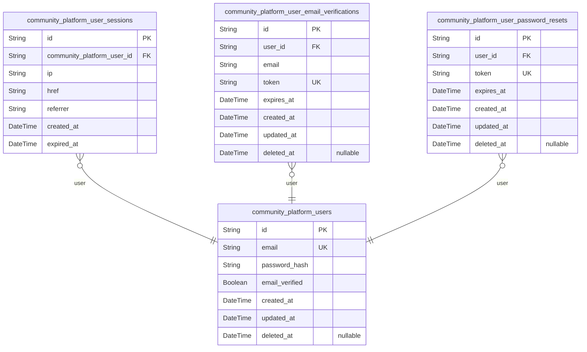
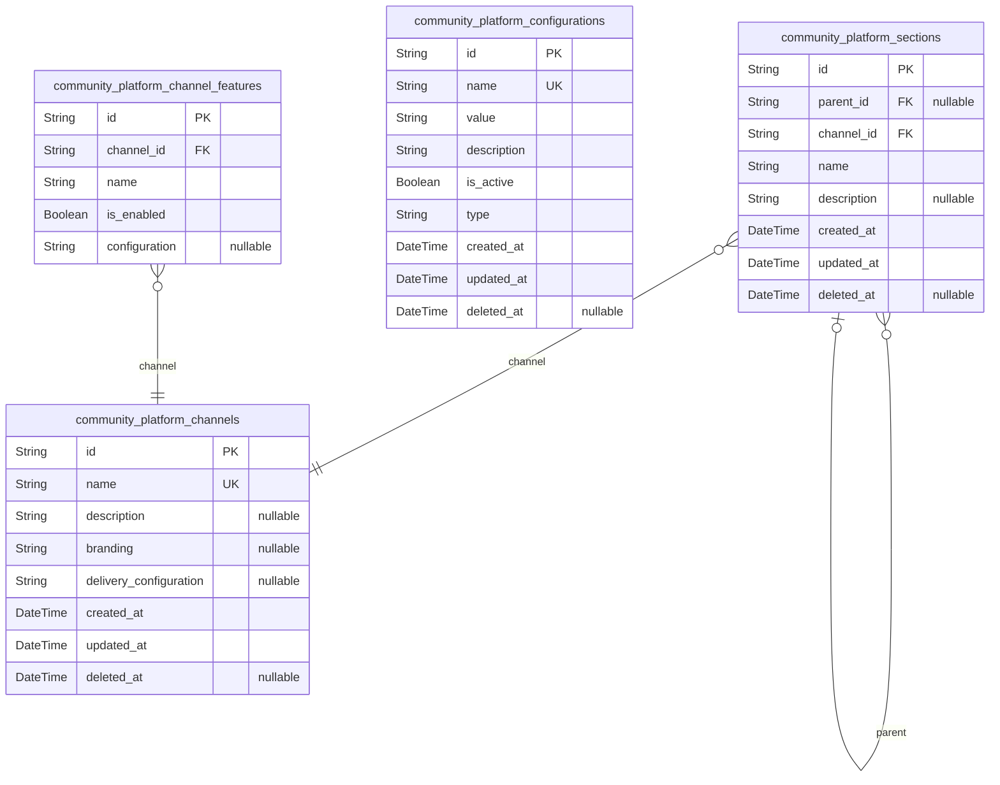
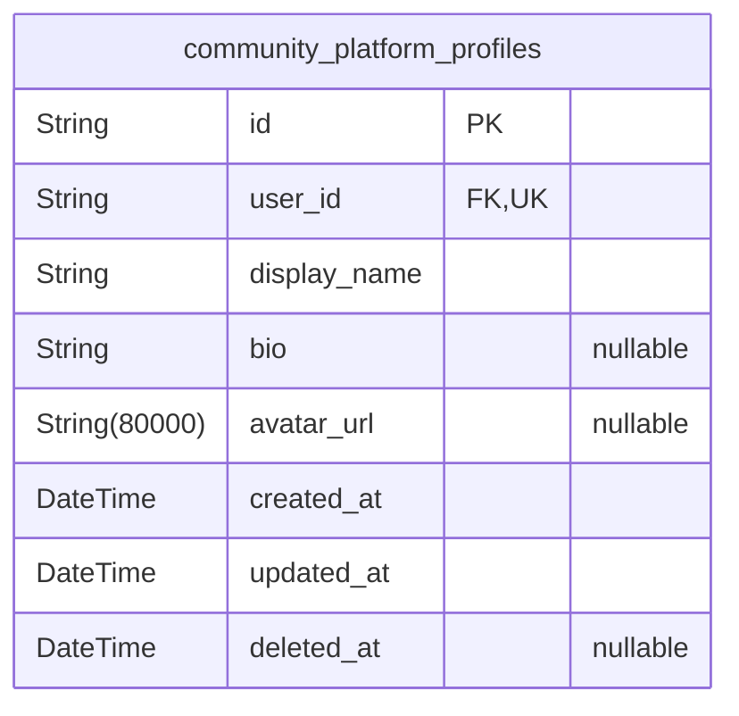
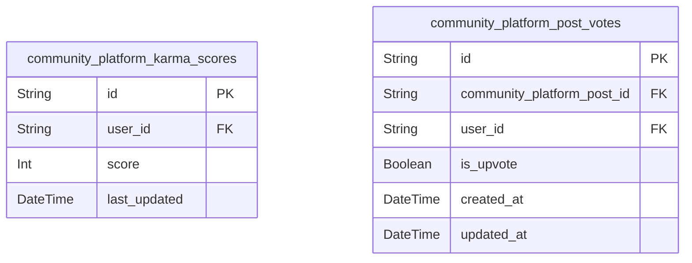
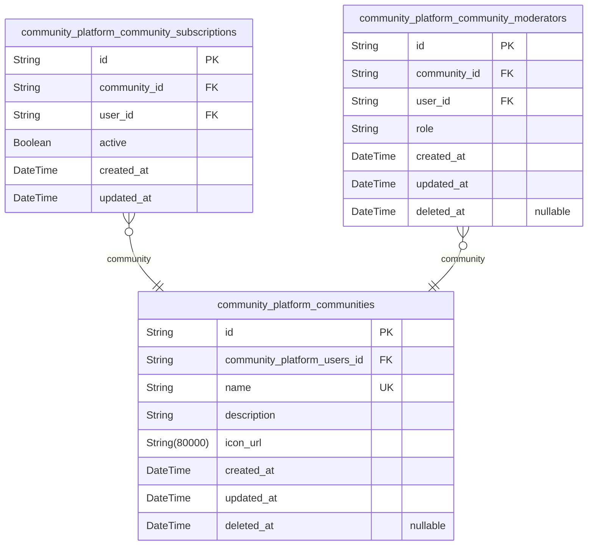
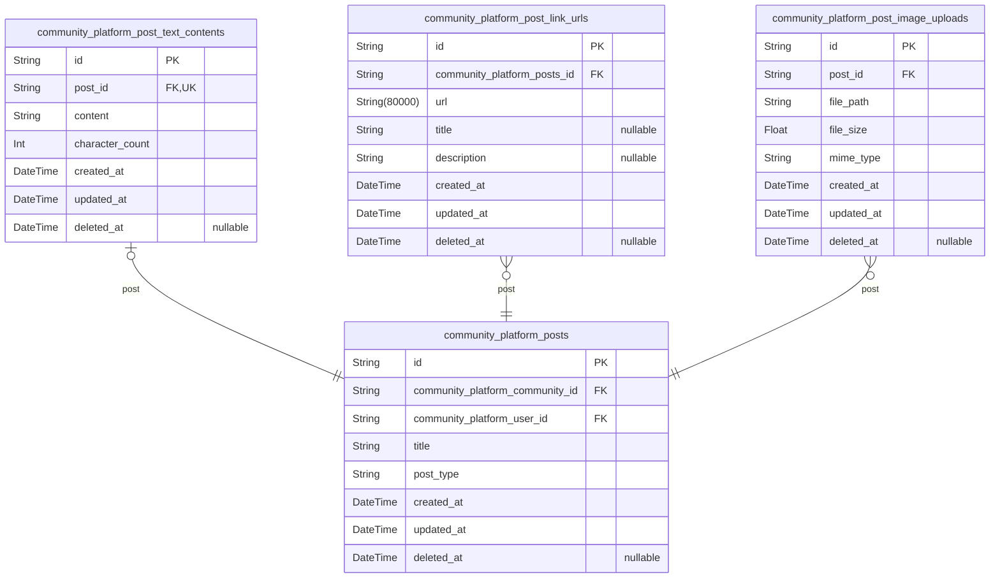
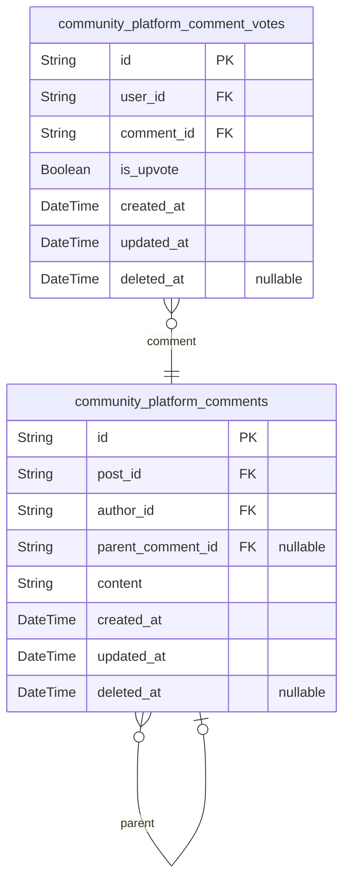
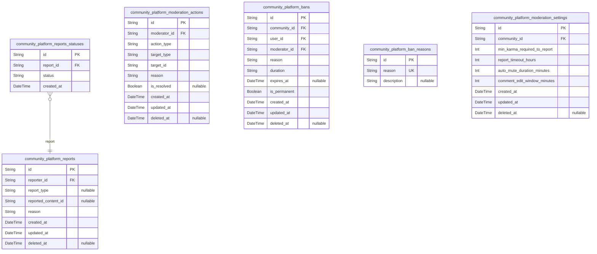

# Prisma Markdown

> Generated by [`prisma-markdown`](https://github.com/samchon/prisma-markdown)

- [Actors](#actors)
- [Systematic](#systematic)
- [Profiles](#profiles)
- [Karma](#karma)
- [Communities](#communities)
- [Posts](#posts)
- [Comments](#comments)
- [Moderation](#moderation)

## Actors

### `community_platform_users`

User authentication records including credentials, email verification
state, and account activity tracking. Stores primary user identity data
with email credentials for system access and audit trails.

Includes all fields necessary for user registration, login, and session
management while following strict schema normalization. User accounts are
fully authenticated through email and password, with verification state
tracked separately from profile data.

Properties as follows:

- `id`: Primary Key.
- `email`
  > User's email address used for authentication and email communication.
  > Must be unique across all users to prevent duplicate accounts.
- `password_hash`
  > Hashed password for authentication. Stored securely with cryptographic
  > hashing to prevent plaintext password exposure.
- `email_verified`
  > Whether the user's email address has been verified through the
  > verification process. Used for security and access control.
- `created_at`
  > Account creation timestamp. Automatically set when the user creates their
  > account.
- `updated_at`
  > Last account modification timestamp. Updated on any profile change or
  > credential update.
- `deleted_at`
  > Account deletion timestamp for soft delete functionality. Null indicates
  > active account, timestamp indicates deletion for audit trails.

### `community_platform_user_sessions`

Session records for user authentication and access management.

Tracks active user login sessions including connection details and
expiration information.

Each session is associated with a single user and records the following:
- Session creation data (timestamp and connection details)
- Session lifetime (with forced expiration for security)
- Session lifecycle for security audit tracking

This table uses the standard session table pattern for user authentication.

Security: Sessions always expire by default (no unlimited sessions) to
prevent security vulnerabilities.

Properties as follows:

- `id`: Primary Key.
- `community_platform_user_id`: User session belongs to a user's [community_platform_users.id](#community_platform_users)
- `ip`: IP address from which the session was created.
- `href`: Connection URL (full URL) that created the session.
- `referrer`: Referrer URL that initiated the session.
- `created_at`: Session creation timestamp.
- `expired_at`: Session expiration timestamp.

### `community_platform_user_email_verifications`

Stores email verification tokens used during user account activation
after registration. Each verification token is tied to a user's email
address and has a limited validity period for security.

The token is generated upon registration and email is stored as part of
the verification request. Tokens expire to prevent unauthorized access
while the user completes the activation process. This table supports
secure account activation without storing sensitive verification data
long-term.

Verification tokens are only valid for the intended email and expiration
date, ensuring that tokens cannot be reused or misused for different
email accounts.

Properties as follows:

- `id`: Primary Key.
- `user_id`: User this verification belongs to. [community_platform_users.id](#community_platform_users)
- `email`
  > Email address for which the verification token was issued. Must match the
  > email in user profiles for activation.
- `token`
  > One-time verification token used during account activation. Stored in
  > hashed form for security, not plaintext.
- `expires_at`
  > Time when the verification token expires. After this time, the token is
  > no longer valid for account activation.
- `created_at`: Timestamp when the verification token was created.
- `updated_at`: Timestamp when the verification token was last modified (e.g., refreshed).
- `deleted_at`
  > Timestamp when the verification token was marked for deletion. Soft
  > delete support for security audit trails.

### `community_platform_user_password_resets`

Stores temporary tokens for secure password reset workflows, including
expiration timing for security and automatic cleanup.

This table holds one-time password reset tokens used to validate user
requests for changing their password. Each token is uniquely associated
with a user account and has a limited validity period to prevent stale
tokens.

Tokens are generated as UUIDs and stored with expiration dates set to
match system security requirements. The table tracks token creation time
for audit purposes, allowing security monitoring of reset attempts.

Automated cleanup processes remove expired tokens to maintain database
efficiency and security compliance.

Properties as follows:

- `id`: Primary Key.
- `user_id`: Associated user's [community_platform_users.id](#community_platform_users).
- `token`
  > Unique password reset token generated for security verification. Must be
  > a strong, random UUID string.
- `expires_at`
  > Expiration timestamp for the reset token. Tokens become invalid after
  > this time.
- `created_at`: Timestamp of when the reset token was created.
- `updated_at`: Timestamp of the last modification to the token record.
- `deleted_at`
  > Timestamp for soft delete to maintain audit trail when tokens are expired
  > or used.

## Systematic

### `community_platform_channels`

Sales channels where content is delivered (e.g., web, mobile) with their
specific branding, delivery configuration, and feature sets. These
channels represent distinct distribution methods for community platform
content, allowing businesses to tailor the user experience across
different access methods.

Each channel maintains its own branding, delivery configuration, and
features while remaining part of the unified community platform. The
system tracks channels as independent entities that users can manage and
configure through the platform's administrative interface. Channel
management includes adding new distribution channels, modifying existing
channel configurations, and deactivating channels via soft delete.

Properties as follows:

- `id`: Primary Key.
- `name`
  > Channel name (e.g., 'web', 'mobile') used for identification and display.
  > Must be unique across all channels.
- `description`
  > Detailed description of the channel's purpose and scope for
  > administrative use. Used internally to understand channel context.
- `branding`
  > Branding details including color schemes, logos, and visual elements
  > specific to this channel. Stored as a text description for flexibility.
- `delivery_configuration`
  > Configuration parameters for content delivery through this channel (e.g.,
  > CDN settings, compression levels). May store JSON as string when
  > necessary.
- `created_at`: Timestamp when channel was created, used for tracking channel lifecycle.
- `updated_at`
  > Timestamp when channel was last updated, reflecting the most recent
  > modifications.
- `deleted_at`
  > Timestamp when channel was soft-deleted, null if the channel is currently
  > active.

### `community_platform_sections`

Hierarchical content sections within channels for organizing posts and
community content.

Stores sections that organize content within specific channels, providing
a nested structure for content organization.

Each section belongs to one channel and can have multiple child sections
to form a hierarchical organization for posts, community content, and
channel-specific structures.

Sections are independently managed and queried for content organization
without dependency on parent sections (e.g., users can filter to find all
sections for a particular channel regardless of nesting).

Properties as follows:

- `id`: Primary Key.
- `parent_id`: Parent section in the hierarchy ([community_platform_sections.id](#community_platform_sections)).
- `channel_id`
  > Channel that contains this section ({@link
  > community_platform_channels.id}).
- `name`: Section display name, used for user interface and navigation.
- `description`: Section description in natural language for detailed context.
- `created_at`: When the section was first created.
- `updated_at`: When the section was last modified.
- `deleted_at`: When the section was deleted (soft delete timestamp).

### `community_platform_configurations`

System-wide configuration settings that control platform behavior,
feature activation, and default application parameters.

These configurations define global system behavior, feature flags, and
default values for different application components. Each configuration
has a name, value, and description to guide their use. The configurations
are managed through a dedicated admin interface and do not require direct
user input.

This table serves as a central repository for all configurable
parameters, allowing the system to be adjusted to different operational
requirements without code changes. Configurations can be enabled or
disabled to toggle features on or off.

Properties as follows:

- `id`: Primary Key.
- `name`
  > Configuration name that uniquely identifies this setting. Follows the
  > pattern 'namespace_setting' or 'feature_name'.
- `value`
  > The current value for this configuration. May be a boolean, string,
  > number, or JSON string depending on the configuration.
- `description`
  > Brief explanation of what this configuration controls and its purpose in
  > the system.
- `is_active`
  > Indicates whether this configuration is enabled or disabled. Use for
  > toggleable features.
- `type`
  > Specifies the data type of the value. Possible types include: 'boolean',
  > 'string', 'number', 'json'.
- `created_at`: Timestamp when this configuration was first created.
- `updated_at`: Timestamp when this configuration was last updated.
- `deleted_at`: Timestamp when this configuration was deleted. Null means not deleted.

### `community_platform_channel_features`

Individual feature configurations for platform channels, enabling atomic
storage of channel-specific feature settings.

Stores available channel features such as 'push notifications' and
'offline mode' that can be enabled or disabled for specific channels.
Each entry represents a channel's configuration for a specific feature.
Supports flexible feature management by allowing channel-specific
customizations.

The features represent optional channel capabilities that may be enabled
or disabled, with additional configuration stored for more complex
features. Each channel maintains its own feature configuration, allowing
for granular channel management.

Properties as follows:

- `id`: Primary Key.
- `channel_id`
  > Channel this feature is configured for. {@link
  > community_platform_channels.id}.
- `name`
  > Feature name representing the capability or functionality (e.g., 'push
  > notifications', 'offline mode').
- `is_enabled`: Indicates whether this feature is enabled for the channel.
- `configuration`
  > Additional configuration options for the feature in JSON format when
  > needed.

## Profiles

### `community_platform_profiles`

User profile metadata for registered community members, including display
name, bio, and avatar image details.

Stores essential user identity information beyond authentication
credentials, allowing users to customize their public identity within
community platforms. Each profile is tied to a single user account in the
Actors component, ensuring 1:1 relationship matching user management
requirements.

Profile data provides consistent user representation across all community
interactions while maintaining separation of authentication credentials
(stored in Actors component) from user identity details (stored in
Profiles component). All profile data is managed directly by users
through dedicated profile modification flows.

Properties as follows:

- `id`: Primary Key.
- `user_id`: User account owner of this profile. [community_platform_users.id](#community_platform_users).
- `display_name`
  > Unique display name for the user in the community platform. Must be
  > between 2-50 characters and contain only alphanumeric characters,
  > underscores, or hyphens.
- `bio`
  > User's personal bio description limited to 500 characters with basic
  > formatting support. All HTML tags are automatically stripped for
  > security.
- `avatar_url`
  > URL path to the user's avatar image file stored in the application.
  > Images must meet square aspect ratio requirements and be resized to
  > 200x200 pixels.
- `created_at`: Timestamp when the profile was first created.
- `updated_at`: Timestamp when the profile was last modified.
- `deleted_at`
  > Timestamp when the profile was soft-deleted, allowing for recovery and
  > audit trails.

## Karma

### `community_platform_karma_scores`

Tracks current karma scores for each user with timestamp of last update
for display purposes.

Stores the calculated karma score for each registered user based on all
upvotes and downvotes received on posts and comments. The score is
maintained as a running total that automatically updates when votes
change. The last_updated timestamp is used to refresh karma displays in
user interfaces and support efficient caching mechanisms.

This table serves as the central source for karma score display across
the application, providing a single, up-to-date value that accurately
reflects a user's reputation within the community.

Properties as follows:

- `id`: Primary Key.
- `user_id`: Related user account that this karma score belongs to.
- `score`
  > The current karma score for the user, calculated from upvotes minus
  > downvotes, which can be negative.
- `last_updated`: Timestamp of when the karma score was last updated based on vote changes.

### `community_platform_post_votes`

Tracks upvotes and downvotes on posts. This table enables accurate karma
calculation by recording each post vote with type (up/down) and
timestamp. Each user can cast one vote per post, and votes can be changed
without affecting the karma calculation integrity. The voting system
supports modifying votes, which adjusts karma based on the new vote type
without duplicate adjustments.

Voting data is critical for the karma calculation system that sums all
upvotes and subtracts all downvotes on posts and comments for each user.
The table ensures that vote changes trigger appropriate karma adjustments
and prevents duplicate votes by users on the same post.

Properties as follows:

- `id`: Primary Key.
- `community_platform_post_id`: The post being voted on
- `user_id`: The user who cast the vote
- `is_upvote`: Indicates if this vote was an upvote (true) or a downvote (false).
- `created_at`: Timestamp when the vote was created.
- `updated_at`
  > Timestamp when the vote was last updated. This typically changes only if
  > the vote type is changed.

## Communities

### `community_platform_communities`

Core community information including name, description, icon, and creator
association.

Communities are the fundamental group entities that define
user-subscribable topic spaces. Each community represents a dedicated
space for users to engage in focused discussions. The platform supports
communities with unique names, descriptive purposes, and visual
identifiers (icons) that allow users to quickly identify community focus
areas.

Communities require a unique name as their primary identifier and the
creator automatically becomes the community owner with full management
rights. This table serves as the foundation for community management,
subscriptions, and moderation operations, enabling all user interactions
centered around specific community spaces.

Properties as follows:

- `id`: Primary Key.
- `community_platform_users_id`: Creator of the community's [community_platform_users.id](#community_platform_users).
- `name`
  > Unique community name between 10-50 characters containing only letters,
  > numbers, and underscores. Must be globally unique across all communities
  > to prevent naming conflicts.
- `description`
  > Community description text up to 500 characters explaining the
  > community's purpose, topics covered, and intended audience. Provides
  > users with context before subscribing to the community.
- `icon_url`
  > URL path to the square icon image file used as visual representation of
  > the community. Must reference a validated image file stored on the
  > platform.
- `created_at`
  > Timestamp when the community was first created. Records the origin point
  > for all community activity and metrics.
- `updated_at`
  > Timestamp of the last community detail change. Tracks when community
  > information was modified (name, description, icon).
- `deleted_at`
  > Timestamp indicating when the community was logically deleted. When
  > populated, the community remains visible to owners but not active users.

### `community_platform_community_subscriptions`

Tracks user subscriptions to communities for engagement and content
discovery.

Stores the relationship between users and communities they choose to
follow, enabling users to receive notifications and content specific to
their subscribed communities.

Each subscription is tracked with an active status flag to manage
community engagement levels. The system maintains real-time subscription
data to support community browsing features and user engagement metrics.

Subscription status can be active or inactive (unsubscribed), with
timestamps tracking when subscriptions were created or updated.

Properties as follows:

- `id`: Primary Key.
- `community_id`
  > Community the user is subscribed to. {@link
  > community_platform_communities.id}.
- `user_id`: User who created the subscription. [community_platform_users.id](#community_platform_users).
- `active`: Current subscription status - active (true) or unsubscribed (false).
- `created_at`: Subscription creation timestamp.
- `updated_at`: Last subscription modification timestamp.

### `community_platform_community_moderators`

Tracks user assignments as moderators within specific communities,
granting them moderation capabilities for the designated community.

This table establishes the relationship between users and communities,
specifically identifying which users are granted moderation rights. The
role field specifies the level of permission granted to the moderator
(e.g., 'moderator', 'admin').

Moderation capabilities include content deletion, user bans, and other
community-specific moderation actions. Assignments are managed by
community owners who can add or remove moderators at their discretion.

This table serves as a junction table linking community roles with users,
and is managed through the community management API endpoints.

Properties as follows:

- `id`: Primary Key.
- `community_id`
  > Community that is being moderated. {@link
  > community_platform_communities.id}
- `user_id`: User assigned as moderator. [community_platform_users.id](#community_platform_users)
- `role`
  > Moderation role (e.g., 'moderator', 'admin'). Can be restricted to
  > specific roles as defined in business requirements.
- `created_at`: When the moderator assignment was created.
- `updated_at`: Last time the moderator assignment was updated.
- `deleted_at`: When the moderator assignment was deleted (soft delete).

## Posts

### `community_platform_posts`

Core post entity that serves as the entry point for content creation on
the platform.

Stores all essential metadata for posts including title, author,
community, and type. Each post represents a content contribution with the
ability to be text, link, or image.

Posts are the focal point for user engagement, featuring the ability to
be upvoted/downvoted, commented on, and interacted with through the karma
system. The type field determines how the content is displayed and
validated.

Posts are managed independently by users who have subscribed to the
relevant community, and can be created, edited, and deleted within the
platform's workflow.

Properties as follows:

- `id`: Primary Key.
- `community_platform_community_id`
  > Community to which this post belongs. This is a required relationship
  > that links the post to the specific community it's being created in.
- `community_platform_user_id`
  > Author of the post who created it. Reference to the author user's profile
  > data.
- `title`
  > Post title for the content being displayed. Must be between 10-100
  > characters as per business requirements.
- `post_type`
  > Type of post. Valid values: 'text', 'link', 'image' based on business
  > requirements for content types.
- `created_at`: Timestamp when the post was created.
- `updated_at`: Timestamp when the post was last updated.
- `deleted_at`
  > Timestamp when the post was soft-deleted. Allows content moderation and
  > historical tracking.

### `community_platform_post_text_contents`

Stores rich text content for text-based posts with character limit
validation.

Holds the formatted text content for text posts with up to 10,000
characters as required by the platform. The content is stored in a format
that supports markdown and rich text formatting for display across all
interface types.

This table maintains a separate record for each text-based post, storing
the actual content and character count for validation purposes. It
directly references the community_platform_posts table to link the
content to the specific post instance.

Character count is stored as a separate field to enable efficient
validation before saving content, reducing the need for on-the-fly
calculations during user input.

Properties as follows:

- `id`: Primary Key.
- `post_id`: Text post's [community_platform_posts.id](#community_platform_posts).
- `content`
  > Rich text content for text-based posts with markdown support. Must not
  > exceed 10,000 characters.
- `character_count`
  > Character count of the content text for automatic validation. Matches
  > content length for display and limits.
- `created_at`
  > Content creation timestamp with timezone. Reflects when user created the
  > post text.
- `updated_at`
  > Content last modification timestamp. Tracked for versioning and audit
  > trails.
- `deleted_at`
  > Soft deletion timestamp. Null if still active, set when content is
  > deleted.

### `community_platform_post_link_urls`

Stores URL information for link-based posts with validation for proper
URL format.

This table captures the web URL used in link posts across the community
platform. It supports link-based posts by storing the necessary URL
information including the actual URL, optional title and description for
the linked resource, and audit data for tracking the content's lifecycle.
The table follows normalization principles by having no direct relation
to the main post table - instead, the main post table references this
link via a foreign key.

The system validates the URL format, ensuring only properly formatted
URLs are accepted for link posts. This validation is performed at the
application level, but the table structure supports it with proper data
types and constraints.

Properties as follows:

- `id`: Primary Key.
- `community_platform_posts_id`: Reference to the main post entity in community_platform_posts.
- `url`: Full URL for the linked content. Must be a valid URL format.
- `title`: Optional title or summary that describes the linked content.
- `description`: Optional detailed description for the linked content, if provided.
- `created_at`: Timestamp when the URL information was created.
- `updated_at`: Timestamp when the URL information was last updated.
- `deleted_at`: Timestamp when the URL was marked for deletion (soft delete).

### `community_platform_post_image_uploads`

Stores image file paths and metadata for image-based posts, including
size validation and file type information.

Each entry links to a specific post through a foreign key relationship,
enabling image data to be retrieved with associated post content.
The file size field validates images are under 10MB as required by post
type specifications, preventing oversized uploads that could impact
performance.
The mime_type field specifies the file content type (JPG, PNG, GIF) for
proper handling during display and storage operations.

Properties as follows:

- `id`: Primary Key.
- `post_id`: The parent post this image belongs to. [community_platform_posts.id](#community_platform_posts)
- `file_path`: Location of the image file in the storage system.
- `file_size`: File size in megabytes (MB), must be <= 10.0 for image uploads.
- `mime_type`: MIME type of the image file (e.g., image/jpeg, image/png).
- `created_at`: Timestamp when the image was stored in the system.
- `updated_at`: Timestamp when the image metadata was last updated.
- `deleted_at`: Timestamp when the image was soft-deleted (null if still active).

## Comments

### `community_platform_comment_votes`

Tracks upvotes and downvotes on comments with unique user-comment
constraints, enabling accurate karma calculation for the community
platform.

This table stores every user's vote on a specific comment, ensuring each
user can vote only once per comment. The system uses these votes to
calculate karma scores for authors and manage voting behavior without
duplicate adjustments.

The unique combination of user and comment enforces the business rule
that each vote must be between a single user and a single comment,
preventing duplicate or conflicting votes. Votes support both up
(positive) and down (negative) actions, with the vote direction stored as
a boolean flag.

Temporal fields (created_at, updated_at) track when votes are recorded or
modified, while soft deletion (deleted_at) allows for content moderation
without data loss.

Properties as follows:

- `id`: Primary Key.
- `user_id`: User who cast the vote. [community_platform_users.id](#community_platform_users).
- `comment_id`: Comment being voted on. [community_platform_comments.id](#community_platform_comments).
- `is_upvote`: Whether the vote is an upvote (true) or downvote (false).
- `created_at`: Timestamp when the vote was created.
- `updated_at`: Timestamp when the vote was last updated.
- `deleted_at`: Timestamp when the vote was soft-deleted (null if not deleted).

### `community_platform_comments`

Core comment structure including content, parent-child relationships,
author, and post references.

Represents the fundamental unit of conversation within the platform,
allowing users to create threaded discussions about posts. Comments can
exist as top-level posts or nested replies to other comments.

Each comment carries its core content, reference to the originating post,
author information, and temporal metadata for audit trails. The platform
supports unlimited nesting depth through the self-referential
parent_comment_id relationship.

Comments require independent management due to platform requirements:
users need to search across all posts, moderate individual comments, and
track comment activity without post context.

Properties as follows:

- `id`: Primary Key.
- `post_id`
  > The associated post's [community_platform_posts.id](#community_platform_posts). Comments must
  > belong to a parent post for context.
- `author_id`
  > The comment author's [community_platform_users.id](#community_platform_users). All comments
  > have a clear origin.
- `parent_comment_id`
  > The parent comment's [community_platform_comments.id](#community_platform_comments), allowing
  > nested replies.
- `content`: The raw content of the comment using standard markdown formatting.
- `created_at`: When the comment was originally created.
- `updated_at`: When the comment was last modified.
- `deleted_at`: When the comment was soft-deleted for moderation or user request.

## Moderation

### `community_platform_reports`

Tracks all user reports of content violations with metadata such as the
reported content type, reported content ID, reporter, and report reason.
Each report has a status that can be updated through moderation actions,
and each report is tied to a specific content item (post or comment)
being reported. This table supports independent querying and management
of all reports across the platform.

Properties as follows:

- `id`: Primary Key.
- `reporter_id`: Reporter's identifier. [community_platform_users.id](#community_platform_users)
- `report_type`: Type of content being reported (e.g., 'post' or 'comment').
- `reported_content_id`: ID of the reported content (post or comment).
- `reason`: Reason for the report, limited to a maximum of 200 characters.
- `created_at`: Timestamp of report creation.
- `updated_at`: Timestamp of the report's last update.
- `deleted_at`: Timestamp of report deletion if soft delete is applied.

### `community_platform_reports_statuses`

Status history records for all user-reported content across the community
platform. Each entry documents a specific change in a report's status,
including the timestamp of the change, enabling complete audit trails and
status transition analysis. The historical nature of this table allows
moderation team members to track the full lifecycle of each report from
its initial submission through completion, providing transparency for
resolving content violations efficiently.

Properties as follows:

- `id`: Primary Key.
- `report_id`
  > Report this status is associated with. {@link
  > community_platform_reports.id}.
- `status`
  > Current status in the report's lifecycle. Valid values: active, approved,
  > dismissed.
- `created_at`: Timestamp when this status change was recorded.

### `community_platform_moderation_actions`

Documents all actions taken by moderators including deletions, bans, and
warnings. Records action type, target entity with reference, reason, and
timestamps.

Each moderation action is tracked as a distinct entity that requires
independent management. This includes documenting which moderator
performed the action, what type of action was taken (delete, ban,
warning), which target entity was affected (post, comment, user,
community), and the reason for the action.

The system uses a polymorphic reference pattern (target_type/target_id)
to avoid multiple nullable foreign keys for different target entities.
This design follows the Compatible Actor Pattern for polymorphic
ownership while maintaining data integrity. Action history is preserved
for audit trails and reporting without denormalization.

Properties as follows:

- `id`: Primary Key.
- `moderator_id`: Moderator performing the action. [community_platform_users.id](#community_platform_users).
- `action_type`
  > Type of moderation action taken. Valid values: 'delete', 'ban',
  > 'warning', 'suspend'.
- `target_type`
  > Type of target entity being acted upon. Valid values: 'post', 'comment',
  > 'user', 'community'.
- `target_id`
  > ID of the target entity being acted upon. References the primary key of
  > the target table.
- `reason`
  > Reason for the moderation action, up to 200 characters. Required for all
  > actions to maintain transparency.
- `is_resolved`
  > Indicates whether the moderation action has been resolved (e.g., ban
  > lifted).
- `created_at`: Timestamp when the moderation action was recorded.
- `updated_at`: Timestamp when the moderation action was last modified.
- `deleted_at`: Timestamp when the action was soft-deleted (for audit trail).

### `community_platform_bans`

Records user bans within communities with duration and reason.

Stores details about user bans made by moderators within specific
communities. Each ban entry includes the banned user, the community
affected, the moderator who applied the ban, the reason for the ban, the
duration of the ban, and the expiration timestamp (if applicable).

Bans are managed through the moderation interface where moderators can
create, update, and delete bans as needed for community governance. The
ban system ensures banned users cannot create posts or comments in the
community but can still view profile data.

The system automatically handles ban expiration, where permanent bans
never expire but temporary bans (e.g., 7 days) are automatically lifted
at the timestamp specified in expires_at.

Properties as follows:

- `id`: Primary Key.
- `community_id`: Community that the ban applies to.
- `user_id`: User who is banned within this community.
- `moderator_id`: Moderator who applied the ban in this community.
- `reason`
  > Reason for the ban (human-readable description of why the user was
  > banned).
- `duration`: Duration of the ban (permanent, 1 day, 7 days, etc.).
- `expires_at`: When the ban expires - null for permanent bans.
- `is_permanent`
  > Whether this is a permanent ban (true for permanent bans, false for
  > temporary).
- `created_at`: When the ban was created.
- `updated_at`: When the ban was last updated.
- `deleted_at`: When the ban was soft-deleted (null for active bans).

### `community_platform_ban_reasons`

List of standard ban reasons for consistent moderation across all
communities.

Maintains a curated list of approved ban reasons that moderators can
select from when banning users. This lookup table ensures consistency in
moderation actions across different communities and time periods by
providing a standardized set of reasons. The reasons are managed by
community owners and platform administrators.

Each ban reason must be unique to prevent duplicate entries. The
description field provides detailed information about the context or
usage of each reason to help moderators understand proper application.

Properties as follows:

- `id`: Primary Key.
- `reason`
  > Unique identifier for the ban reason. Used as the key in the lookup table
  > and for internal system references. Should be in lowercase without spaces
  > (e.g. 'spam').
- `description`
  > Detailed description of the ban reason for moderator reference. Explains
  > the appropriate context and circumstances for applying this ban reason.

### `community_platform_moderation_settings`

Community-specific moderation configuration settings

Stores per-community moderation preferences including user eligibility
thresholds and time-based settings. Allows community owners to customize
moderation rules for their specific community context, such as limiting
reporting eligibility to users with minimum karma levels or defining
automatic moderation actions for repeated violations.

This enables communities to establish their own moderation standards
while maintaining a unified platform structure. Settings apply directly
to community members and their reported content, and allow for flexible
moderation policies across the network without altering platform-wide
defaults.

Properties as follows:

- `id`: Primary Key.
- `community_id`
  > The community this moderation setting applies to. {@link
  > community_platform_communities.id}.
- `min_karma_required_to_report`
  > Minimum karma score required for users to submit reports in this
  > community.
- `report_timeout_hours`
  > Maximum hours a report remains active before being automatically marked
  > as resolved.
- `auto_mute_duration_minutes`
  > Automatic mute duration for users who repeatedly submit reports without
  > valid justification.
- `comment_edit_window_minutes`
  > Maximum time window (in minutes) after creation during which a user can
  > edit their comment.
- `created_at`: Timestamp when the moderation settings were first created.
- `updated_at`: Timestamp when the moderation settings were last updated.
- `deleted_at`: Timestamp when the moderation settings were soft-deleted (null if active).
