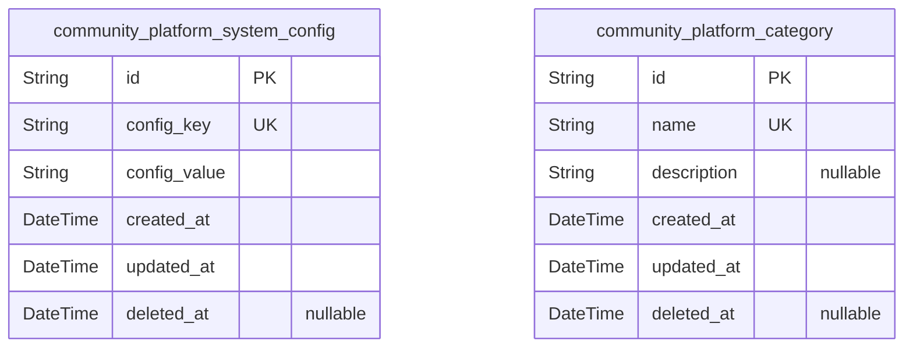
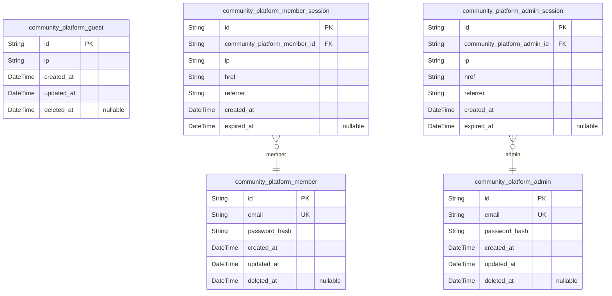
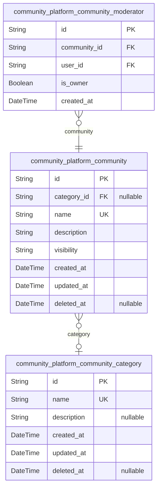
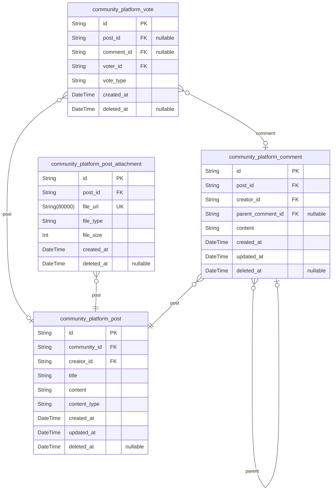
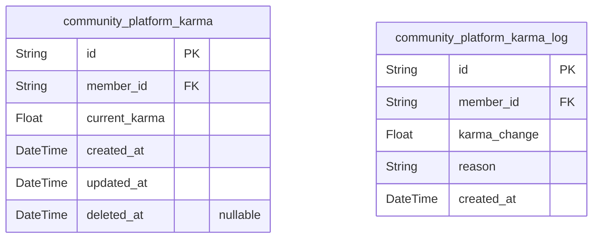
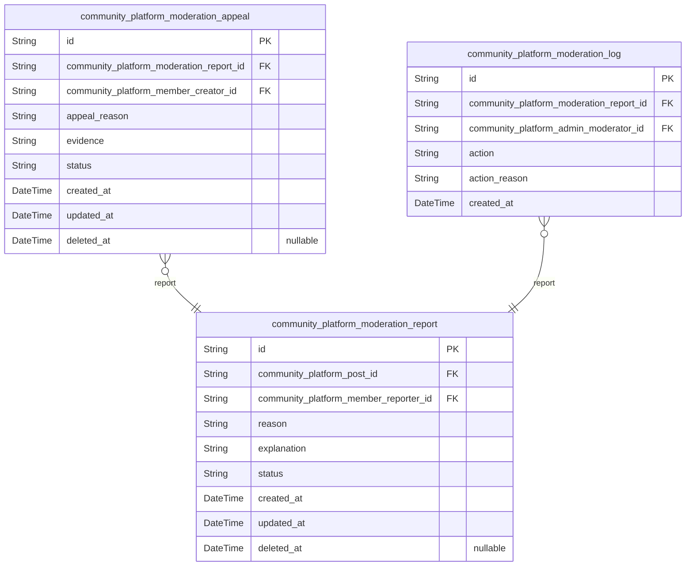
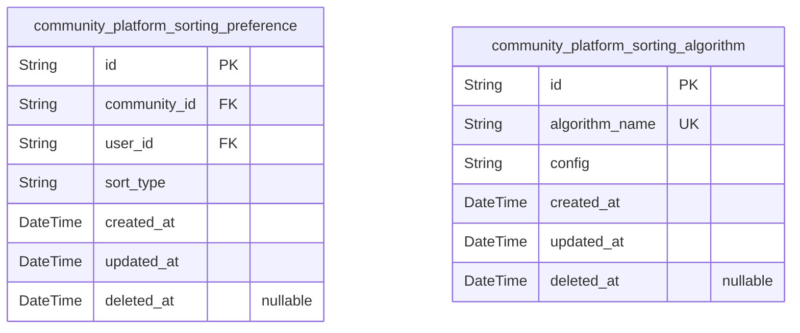
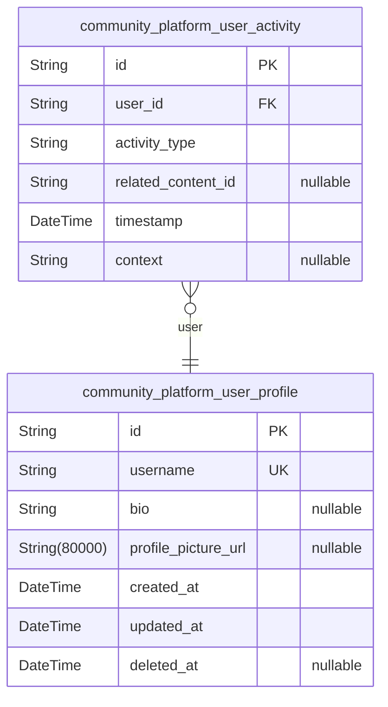
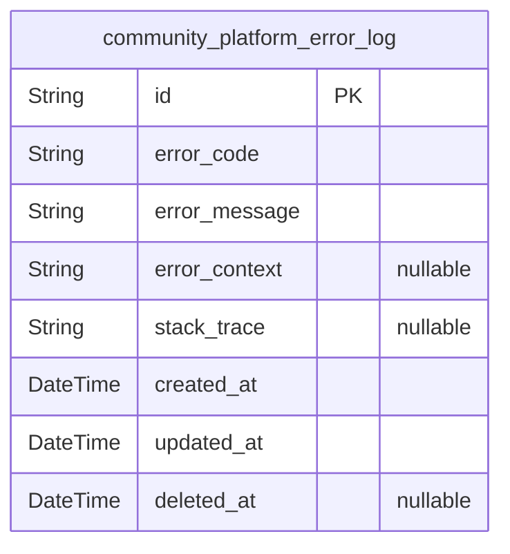

# Prisma Markdown

> Generated by [`prisma-markdown`](https://github.com/samchon/prisma-markdown)

- [Systematic](#systematic)
- [Actors](#actors)
- [Community](#community)
- [Content](#content)
- [Karma](#karma)
- [Moderation](#moderation)
- [Sorting](#sorting)
- [Profiles](#profiles)
- [ErrorHandling](#errorhandling)

## Systematic

### `community_platform_system_config`

System configuration settings that control platform behavior, such as
feature toggles and application parameters.

Properties as follows:

- `id`: Primary Key.
- `config_key`
  > Unique identifier for the configuration setting, following the pattern
  > <namespace>_<setting_name>.
- `config_value`
  > Value of the configuration setting, may be string, JSON, or other
  > supported formats based on configuration type.
- `created_at`: Timestamp when this configuration entry was first created.
- `updated_at`: Timestamp when this configuration entry was last updated.
- `deleted_at`
  > Timestamp when this configuration entry was logically deleted (soft
  > delete).

### `community_platform_category`

Foundational content categories that organize community content for
better navigation and discovery.

Properties as follows:

- `id`: Primary Key.
- `name`: Human-readable name of the content category, used for display purposes.
- `description`
  > Detailed description of the content category and its purpose within the
  > community.
- `created_at`: Timestamp when this content category was first created.
- `updated_at`: Timestamp when this content category was last updated.
- `deleted_at`: Timestamp when this content category was logically deleted (soft delete).

## Actors

### `community_platform_guest`

Tracking information for anonymous guests who have not authenticated to
the system. Used for analytics and session logging without account data.

Properties as follows:

- `id`: Primary Key.
- `ip`: IP address of the guest
- `created_at`: When guest record was created
- `updated_at`: Last update timestamp for guest record
- `deleted_at`: Soft delete timestamp for guest record

### `community_platform_member`

Authenticated users who can create communities, post content, and
participate in community discussions.

Properties as follows:

- `id`: Primary Key.
- `email`: User's email address for authentication
- `password_hash`: Hashed password for authentication
- `created_at`: Account creation timestamp
- `updated_at`: Last update timestamp
- `deleted_at`: Soft delete timestamp

### `community_platform_admin`

System administrators with elevated access to moderate content, manage
communities, and configure global settings.

Properties as follows:

- `id`: Primary Key.
- `email`: User's email address for authentication
- `password_hash`: Hashed password for authentication
- `created_at`: Account creation timestamp
- `updated_at`: Last update timestamp
- `deleted_at`: Soft delete timestamp

### `community_platform_member_session`

Session records for authenticated members, tracking connection details
and authentication state.

Properties as follows:

- `id`: Primary Key.
- `community_platform_member_id`: Member who owns the session. [community_platform_member.id](#community_platform_member).
- `ip`: IP address used for the session
- `href`: Connection URL
- `referrer`: Referrer URL
- `created_at`: Session creation time
- `expired_at`: Session expiration time

### `community_platform_admin_session`

Session records for administrator accounts, tracking connection details
and authentication state.

Properties as follows:

- `id`: Primary Key.
- `community_platform_admin_id`: Admin who owns the session. [community_platform_admin.id](#community_platform_admin).
- `ip`: IP address used for the session
- `href`: Connection URL
- `referrer`: Referrer URL
- `created_at`: Session creation time
- `expired_at`: Session expiration time

## Community

### `community_platform_community`

Represents a user-created community within the platform. Includes core
metadata such as name, description, visibility settings, and relationship
to category.

Properties as follows:

- `id`: Primary Key.
- `category_id`: Community category's [community_platform_community_category.id](#community_platform_community_category).
- `name`: Community name with minimum 3 characters and maximum 50 characters.
- `description`: Short community description (10-200 characters).
- `visibility`: Community visibility (public/private).
- `created_at`: Community creation timestamp.
- `updated_at`: Community last update timestamp.
- `deleted_at`: Soft delete timestamp if community is deleted.

### `community_platform_community_category`

Represents a category classification for communities. Used to organize
and filter communities by topic.

Properties as follows:

- `id`: Primary Key.
- `name`: Category name, unique across all categories.
- `description`: Category description (optional).
- `created_at`: Category creation timestamp.
- `updated_at`: Category last update timestamp.
- `deleted_at`: Soft delete timestamp if category is deleted.

### `community_platform_community_moderator`

Manages the relationship between communities and their moderators. Tracks
which members have moderation rights for each community.

Properties as follows:

- `id`: Primary Key.
- `community_id`
  > Community the moderator belongs to {@link
  > community_platform_community.id}.
- `user_id`
  > Member who is the community moderator {@link
  > community_platform_member.id}.
- `is_owner`: Whether the member is the community owner (creator).
- `created_at`: Moderation relationship creation timestamp.

## Content

### `community_platform_post`

Main business entity for user-created posts within communities. Contains
content details, creator reference, and community context. Requires
independent API operations for creation, searching, and filtering.

Properties as follows:

- `id`: Primary Key.
- `community_id`: Community the post belongs to. [community_platform_community.id](#community_platform_community).
- `creator_id`: User who created the post. [community_platform_member.id](#community_platform_member).
- `title`: Post title with minimum 5 characters requirement for quality.
- `content`: Main post content supporting up to 20000 characters.
- `content_type`: Type of content (text, link, image).
- `created_at`: Timestamp when post was created.
- `updated_at`: Timestamp when post was last updated.
- `deleted_at`: Timestamp when post was soft-deleted (nullable for soft delete).

### `community_platform_comment`

Main business entity for user-created comments on posts. Requires
independent management for moderation, search, and filtering across all
posts.

Properties as follows:

- `id`: Primary Key.
- `post_id`: Post the comment belongs to. [community_platform_post.id](#community_platform_post).
- `creator_id`: User who created the comment. [community_platform_member.id](#community_platform_member).
- `parent_comment_id`: Parent comment for nested replies. [community_platform_comment.id](#community_platform_comment).
- `content`: Comment text with minimum 1 character requirement.
- `created_at`: Timestamp when comment was created.
- `updated_at`: Timestamp when comment was last updated.
- `deleted_at`: Timestamp when comment was soft-deleted (nullable for soft delete).

### `community_platform_post_attachment`

Supporting entity for post media attachments. Managed through parent post
entities with no independent API endpoint requirement.

Properties as follows:

- `id`: Primary Key.
- `post_id`: Parent post. [community_platform_post.id](#community_platform_post).
- `file_url`: URL to the attached media file.
- `file_type`: Type of file (image, video, etc.).
- `file_size`: Size of file in bytes.
- `created_at`: Timestamp when attachment was created.
- `deleted_at`: Timestamp when attachment was soft-deleted (nullable for soft delete).

### `community_platform_vote`

Supporting entity for content voting patterns (upvotes/downvotes).
Managed through parent content entities with no independent API endpoint
requirement. This revised model uses separate vote tables for posts and
comments to ensure referential integrity.

Properties as follows:

- `id`: Primary Key.
- `post_id`: Post that was voted on. [community_platform_post.id](#community_platform_post).
- `comment_id`: Comment that was voted on. [community_platform_comment.id](#community_platform_comment).
- `voter_id`: User who cast the vote. [community_platform_member.id](#community_platform_member).
- `vote_type`: Type of vote (upvote, downvote).
- `created_at`: Timestamp when vote was cast.
- `deleted_at`: Timestamp when vote was soft-deleted (nullable for soft delete).

## Karma

### `community_platform_karma`

Stores current karma scores for all users in the system. Tracks the
active karma balance for each user, updated in real-time as they
contribute to the platform. The data stored here is used for immediate
user engagement and reputation display.

Properties as follows:

- `id`: Primary Key.
- `member_id`
  > Member's account that owns this karma record. {@link
  > community_platform_member.id}.
- `current_karma`
  > Current karma points for the member, updated in real-time based on
  > platform activities.
- `created_at`: Timestamp when the karma record was created.
- `updated_at`: Timestamp when the karma record was last updated.
- `deleted_at`: Timestamp when the karma record was deleted (soft delete).

### `community_platform_karma_log`

Records the complete history of karma transactions for each member.
Tracks all karma changes including the amount, reason, and timestamp for
audit trails and historical analysis. This is the snapshot table for
karma activity.

Properties as follows:

- `id`: Primary Key.
- `member_id`
  > Member's account responsible for this karma transaction. {@link
  > community_platform_member.id}.
- `karma_change`: The amount of karma added or deducted for this transaction.
- `reason`
  > Business reason for the karma change (e.g., 'post_created',
  > 'comment_removed', 'karma_decay').
- `created_at`: Timestamp when this karma transaction occurred.

## Moderation

### `community_platform_moderation_report`

User-reported content requiring moderation review. Contains report
details from users and administrative status tracking.

Properties as follows:

- `id`: Primary Key.
- `community_platform_post_id`: Target post being reported. [community_platform_post.id](#community_platform_post)
- `community_platform_member_reporter_id`: User who submitted the report. [community_platform_member.id](#community_platform_member)
- `reason`: Reason category selected by user (Hate Speech, Spam, etc.)
- `explanation`: User's additional explanation for the report
- `status`: Current status of the report (pending, approved, rejected)
- `created_at`: Timestamp when report was created
- `updated_at`: Timestamp of last modification to the report
- `deleted_at`: Timestamp when report was logically deleted

### `community_platform_moderation_appeal`

User-submitted appeal against moderated content. Contains appeal details
and status tracking.

Properties as follows:

- `id`: Primary Key.
- `community_platform_moderation_report_id`: Report being appealed. [community_platform_moderation_report.id](#community_platform_moderation_report)
- `community_platform_member_creator_id`: User who submitted the appeal. [community_platform_member.id](#community_platform_member)
- `appeal_reason`: Category for the appeal (False Positives, Misunderstanding, New Evidence)
- `evidence`: Additional evidence provided with the appeal
- `status`: Current status of the appeal (pending, approved, rejected)
- `created_at`: Timestamp when appeal was created
- `updated_at`: Timestamp of last modification to the appeal
- `deleted_at`: Timestamp when appeal was logically deleted

### `community_platform_moderation_log`

Historical record of moderation actions. Captures who did what and when
for auditing purposes.

Properties as follows:

- `id`: Primary Key.
- `community_platform_moderation_report_id`: Report being logged. [community_platform_moderation_report.id](#community_platform_moderation_report)
- `community_platform_admin_moderator_id`: Moderator who performed the action. [community_platform_admin.id](#community_platform_admin)
- `action`: Type of action taken (approve, reject, request_more_info)
- `action_reason`: Reason for the moderation action
- `created_at`: Timestamp when the moderation action occurred

## Sorting

### `community_platform_sorting_preference`

User-specific sorting preferences for communities. Each user can define
their preferred sorting method per community independently. Supports hot,
new, top, and controversial sorting criteria.

Properties as follows:

- `id`: Primary Key.
- `community_id`
  > Reference to the community for which the sorting preference applies.
  > [community_platform_community.id](#community_platform_community).
- `user_id`
  > Reference to the member who owns this sorting preference. {@link
  > community_platform_member.id}.
- `sort_type`
  > The user's preferred sorting method for the community. Valid options:
  > 'hot', 'new', 'top', 'controversial'.
- `created_at`: Timestamp when the preference was first created.
- `updated_at`: Timestamp when the preference was last updated.
- `deleted_at`
  > Timestamp when the preference was deleted (soft delete). Nullable, only
  > populated if profile is deleted.

### `community_platform_sorting_algorithm`

System-wide configuration for sorting algorithms. Defines the parameters
and behavior of different sorting methods like hot, new, top, and
controversial. Managed by platform administrators.

Properties as follows:

- `id`: Primary Key.
- `algorithm_name`
  > The unique name of the sorting algorithm (e.g., 'hot', 'new', 'top',
  > 'controversial').
- `config`
  > JSON configuration for the algorithm (e.g., weight parameters for hot
  > sort).
- `created_at`: Timestamp when the algorithm configuration was created.
- `updated_at`: Timestamp when the algorithm configuration was last updated.
- `deleted_at`: Timestamp when the algorithm configuration was deleted (soft delete).

## Profiles

### `community_platform_user_profile`

Core user identity and profile information for platform members

Properties as follows:

- `id`: Primary Key.
- `username`
  > User's unique identifier as seen in the interface. Must be 5-30
  > characters in length.
- `bio`
  > Brief description of the user in 10-200 characters. Optional field for
  > additional profile context.
- `profile_picture_url`
  > URL to the user's profile picture (100x100px thumbnail and 500x500px main
  > image). Optional field.
- `created_at`: Timestamp when the user profile was first created.
- `updated_at`: Timestamp when the user profile was last updated.
- `deleted_at`
  > Timestamp when the user profile was deleted (soft delete). Nullable, only
  > populated if profile is deleted.

### `community_platform_user_activity`

Tracks user activities and interactions across the platform for activity
monitoring and analytics

Properties as follows:

- `id`: Primary Key.
- `user_id`
  > User who performed the activity. {@link
  > community_platform_user_profile.id}.
- `activity_type`
  > Type of user activity (e.g., 'post_created', 'comment_created', 'upvote',
  > 'downvote').
- `related_content_id`
  > ID of the content that was interacted with. Nullable for activities
  > without specific content (like profile updates).
- `timestamp`: Precise timestamp when the activity occurred.
- `context`
  > Additional context or metadata about the activity. Optional field for
  > additional information.

## ErrorHandling

### `community_platform_error_log`

System error tracking and logging mechanism for monitoring and recovery
processes.

Properties as follows:

- `id`: Primary Key.
- `error_code`
  > Error code for categorization and filtering (e.g., 'ERROR_400',
  > 'SYSTEM_ERROR').
- `error_message`: Description of the error that occurred.
- `error_context`
  > Contextual information about where the error occurred (e.g., 'POST
  > /api/v1/user/login - v3.2.1').
- `stack_trace`: Full stack trace of the error, helpful for debugging.
- `created_at`: Timestamp when the error was recorded.
- `updated_at`: Timestamp of the last modification to the error log entry.
- `deleted_at`: Timestamp when the error was soft-deleted.
