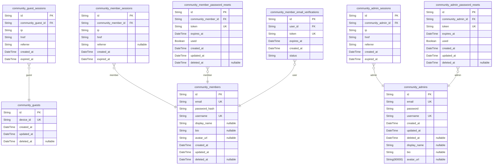
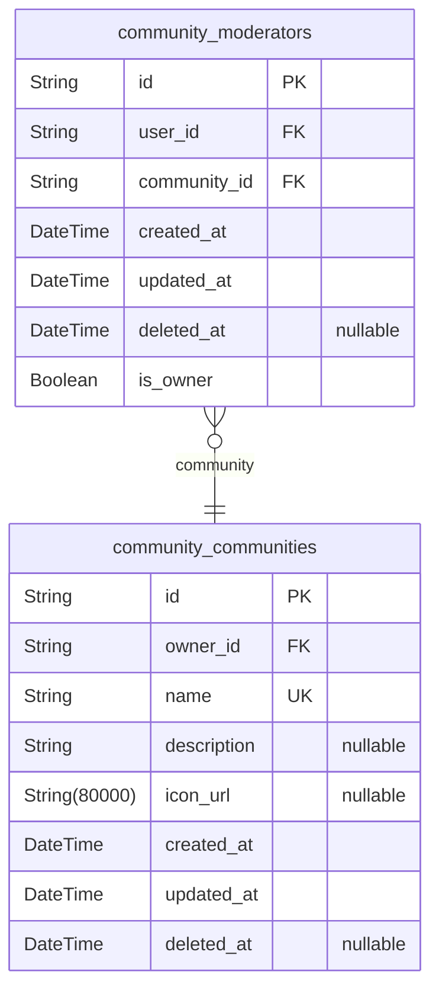
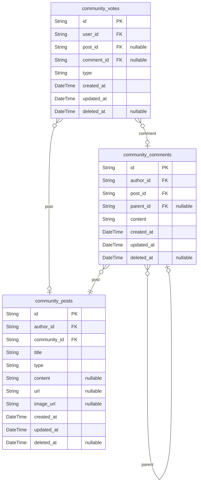
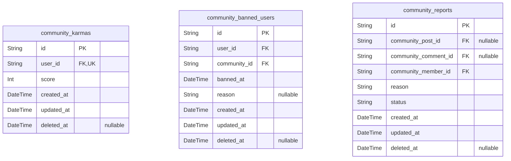

# Prisma Markdown

> Generated by [`prisma-markdown`](https://github.com/samchon/prisma-markdown)

- [Actors](#actors)
- [Communities](#communities)
- [Posts](#posts)
- [KarmaModeration](#karmamoderation)

## Actors

### `community_guests`

Temporary guest accounts for anonymous browsing, identified by unique
device ID. Supports tracking of guest activity and session management.

Guest accounts are temporary and do not require authentication, allowing
unregistered users to browse public content. Device ID serves as the
unique identifier for guest sessions, enabling consistent guest
experience across browser sessions without registration.

This table is separate from authenticated user tables (members/admins) as
guests operate under a different permission model (no login, no profiles,
limited to read-only community browsing).

Properties as follows:

- `id`: Primary Key.
- `device_id`
  > Unique device identifier for guest session tracking. Must be unique
  > across all guest accounts.
- `created_at`: Timestamp when guest account was created.
- `updated_at`: Timestamp of last modification to guest account.
- `deleted_at`: Timestamp when account was soft-deleted (null if active).

### `community_guest_sessions`

Temporary session tokens for guest access with 15-minute expiration.
Tracks guest sessions with IP, referrer and expiration details for
anonymous browsing.

This session table is for guest actors (unauthenticated users) who need
temporary session tokens for browsing activities without registration.
Sessions expire after 15 minutes of inactivity as per business
requirements.

Properties as follows:

- `id`: Primary Key.
- `community_guest_id`: Guest actor's session reference. [community_guests.id](#community_guests)
- `ip`: IP address of the guest session origin.
- `href`: Full URL where session was initiated.
- `referrer`: Referral source URL that led to the session.
- `created_at`: Session creation timestamp.
- `expired_at`
  > Session expiration timestamp (15-minute expiration as per functional
  > requirements).

### `community_members`

Registered user accounts with email/password credentials and
GDPR-compliant storage. Handles user authentication, profile data, and
GDPR-compliant data management.

Users can create accounts with email, password, and username. Profile
data (display_name, bio, avatar_url) is optional and stored per user. All
business entities include audit timestamps (created_at, updated_at) and
soft delete (deleted_at).

Properties as follows:

- `id`: Primary Key.
- `email`: User's unique email address for account verification and communication.
- `password_hash`: Hashed password for secure authentication.
- `username`: Unique username for user identification.
- `display_name`: Optional display name for public profile.
- `bio`: Optional user bio for public profile.
- `avatar_url`: Optional URL to user's profile avatar image.
- `created_at`: Timestamp when account was created.
- `updated_at`: Timestamp when account was last updated.
- `deleted_at`: Timestamp when account soft-deleted (null for active accounts).

### `community_member_sessions`

JWT session tokens for member authentication with access/refresh token
support. Maintains security context and session tracking for member
users, including IP logging and session expiration management for
security audits.

Properties as follows:

- `id`: Primary Key.
- `community_member_id`: Member session owner's identifier. {@link community_members.id.
- `ip`: Client IP address for session security logging.
- `href`: Full request URL where session was created.
- `referrer`
  > Previous page URL where session was initiated (optional for security
  > audit).
- `created_at`: Session creation timestamp for security audits.
- `expired_at`
  > Session expiration timestamp, required for security to prevent stale
  > sessions.

### `community_member_password_resets`

Password reset tokens with 24-hour expiration and usage tracking for
community members. Each entry represents a token issued for a member's
password reset, with 24-hour validity period and a flag indicating if
it's been used.

Properties as follows:

- `id`: Primary Key.
- `community_member_id`
  > The community member who requested the password reset. {@link
  > community_members.id}.
- `token`
  > Unique token string for password reset with 24-hour validity. Generated
  > as a cryptographically secure random string.
- `expires_at`
  > Timestamp indicating when the reset token expires. Always 24 hours from
  > creation.
- `used`
  > Flag indicating if the token has been used for a password reset.
  > Automatically set to true after first use.
- `created_at`: Timestamp when the password reset token was created.
- `updated_at`
  > Timestamp when the password reset token was last updated (e.g., when
  > token is marked as used).
- `deleted_at`
  > Timestamp when the password reset token was soft-deleted. Null indicates
  > active token.

### `community_member_email_verifications`

Email verification tokens for registration with anti-flood protection.
Each token allows user to verify their email during account registration.

- Token validity: 24 hours
- Verification status: 'pending', 'verified', 'expired'
- Anti-flood protection: single token per user at any time
- Relationship: 1:N from community_members (user) to email_verifications

Properties as follows:

- `id`: Primary Key.
- `user_id`: User who received the verification email. [community_members.id](#community_members)
- `token`: Unique verification token sent to user's email.
- `expires_at`: Token expiration timestamp (24 hours after creation).
- `created_at`: When the verification token was created.
- `status`
  > Current verification status: pending, verified, expired. The token must
  > be used before expiration to be verified.

### `community_admins`

System administrator accounts with elevated privileges and security
policies. Provides identity and authentication foundation for all
platform administrative operations, with strict credential management and
audit trails.

Properties as follows:

- `id`: Primary Key.
- `email`: Unique email address for admin account authentication.
- `password`: Hashed password for secure authentication.
- `username`: Unique username for administrative account identification.
- `created_at`: Timestamp when admin account was first created.
- `updated_at`: Timestamp when admin account details were last modified.
- `deleted_at`
  > Timestamp when admin account was soft-deleted (or null for active
  > accounts).
- `display_name`
  > Optional customizable display name for admin profile. Example: 'Jane
  > Admin'.
- `bio`: Optional brief description of admin role or responsibilities.
- `avatar_url`: Optional URL to profile avatar image for visual identification.

### `community_admin_sessions`

JWT session tokens for administrator authentication with enhanced
security. Manages session context for admin users including IP tracking,
request URLs, and session lifetime.

Properties as follows:

- `id`: Primary Key.
- `community_admin_id`: Reference to the admin user's account. [community_admins.id](#community_admins).
- `ip`: Client's IP address
- `href`: Request URL that initiated the session
- `referrer`: Referrer URL that led to the session
- `created_at`: Session creation timestamp
- `expired_at`: Session expiration timestamp

### `community_admin_password_resets`

Password reset tokens specifically for administrative accounts with
24-hour expiration and usage tracking.

- Each token is valid for 24 hours from creation
- Tokens are unique and cannot be reused after usage
- Related to admin accounts through community_admins foreign key
- Tracks whether token has been used for password reset
- Used for admin-specific password reset flows (distinct from member
accounts)

Properties as follows:

- `id`: Primary Key.
- `community_admin_id`: Admin account this token belongs to. [community_admins.id](#community_admins).
- `token`: Unique token string for password reset request.
- `expires_at`: Token expiration timestamp (24 hours from creation).
- `used`: Whether the token has been used to reset password.
- `created_at`: Token creation timestamp.
- `updated_at`: Last update timestamp for token status.
- `deleted_at`: Deletion timestamp for soft delete (nullable).

## Communities

### `community_communities`

Stores community details including name, description, icon URL, and owner
reference (with owner_id foreign key). Each community has a unique name,
description, and owner with creation timestamp.

This table represents the core business entity for user-created
communities. Users directly manage these communities through creation,
modification, and deletion operations. The owner is a reference to the
community_members actor table (user accounts), enabling authentication
and authorization flows.

*Primary Entity*: Communities are user-created entities requiring
independent administration (create, read, update, delete).

Properties as follows:

- `id`: Primary Key.
- `owner_id`
  > The owner of this community, linked to their account on Community Members
  > model.
- `name`: Unique name for the community (3-30 characters), used in the URL path.
- `description`
  > Description of the community (up to 500 characters, shown in community
  > grid)
- `icon_url`: URL pointing to the community icon image (max 10MB size)
- `created_at`: Timestamp when the community was created.
- `updated_at`: Timestamp when the community was last updated.
- `deleted_at`
  > Timestamp when the community was soft deleted (nullable for deletion
  > tracking)

### `community_moderators`

Manages community moderators and owners with role distinction (is_owner
flag for community owners).

Tracks user associations with communities for moderation purposes where
is_owner indicates ownership status. References communities through
community_communities and users through community_members.

Properties as follows:

- `id`: Primary Key.
- `user_id`: User account of the moderator. [community_members.id](#community_members).
- `community_id`
  > Organization within which the user is a moderator. {@link
  > community_communities.id}.
- `created_at`: Timestamp when community moderation role was assigned.
- `updated_at`: Timestamp when moderation role details were last updated.
- `deleted_at`: Timestamp when moderation role was removed (soft delete).
- `is_owner`
  > Flag indicating if the user is the community owner (true) or regular
  > moderator (false).

## Posts

### `community_posts`

Main posts with text, link, or image content types created by members in
communities. Stores all post details including type-specific content
fields (content for text, url for link, image_url for image). Follows 3NF
principles with proper references to author and community entities.

Properties as follows:

- `id`: Primary Key.
- `author_id`: Author's account identifier. [community_members.id](#community_members)
- `community_id`: Community where this post was created. [community_communities.id](#community_communities)
- `title`: Post title (max 150 characters).
- `type`: Post content type (text, link, or image).
- `content`: Text content of text posts.
- `url`: URL of link posts.
- `image_url`: Image URL for image posts.
- `created_at`: Post creation timestamp.
- `updated_at`: Last update timestamp.
- `deleted_at`: Soft delete timestamp (null if active).

### `community_comments`

User comments on posts with hierarchical replies and nested comment
structure. Comments require independent management for moderation
workflows, user activity tracking, and notification systems. Supports
nested replies through parent_id relationship with self-referencing
hierarchy.

Properties as follows:

- `id`: Primary Key.
- `author_id`: User who made the comment. @link community_members.id
- `post_id`: Post the comment belongs to. @link community_posts.id
- `parent_id`: Parent comment for nested replies. @link community_comments.id
- `content`: Comment content text.
- `created_at`: Timestamp comment was created.
- `updated_at`: Timestamp comment was last updated.
- `deleted_at`: Timestamp comment was soft deleted (nullable for soft deletion).

### `community_votes`

Tracks user upvotes and downvotes on posts and comments, supporting vote
modification rules (add, change, remove). This table enables updating
user karma scores based on vote changes. Voters can cast one vote per
post or comment, and modify or remove votes as needed. Includes full
tracking of vote actions for audit purposes.

Properties as follows:

- `id`: Primary Key.
- `user_id`: User who cast the vote. [community_members.id](#community_members)
- `post_id`: Post being voted on. [community_posts.id](#community_posts)
- `comment_id`: Comment being voted on. [community_comments.id](#community_comments)
- `type`: Vote type (up or down).
- `created_at`: Timestamp when the vote was created.
- `updated_at`: Timestamp when the vote was last updated.
- `deleted_at`: Timestamp when the vote was deleted (soft delete).

## KarmaModeration

### `community_karmas`

Tracks cumulative karma scores for each user across all content
interactions, reflecting their voting contributions. This table provides
the foundation for public karma displays, profile scoring, and moderation
audit trails. References all voting actions through community_votes and
user identities through community_members.

Properties as follows:

- `id`: Primary Key.
- `user_id`: User's [community_members.id](#community_members).
- `score`: Total karma score based on upvotes and downvotes across all content.
- `created_at`: Timestamp when karma record was created.
- `updated_at`: Timestamp when karma record was last updated.
- `deleted_at`: Soft deletion timestamp; null if active.

### `community_banned_users`

Tracks users banned from specific communities with associated reasons,
timestamps, and audit trail for moderation activities. Maintains soft
delete capability for ban records. Banned users cannot post or comment in
the community until unbanned.

Properties as follows:

- `id`: Primary Key.
- `user_id`: Banned user's [community_members.id](#community_members).
- `community_id`: Banned community's [community_communities.id](#community_communities).
- `banned_at`: Timestamp when the ban was applied.
- `reason`: Reason for ban as provided by moderator.
- `created_at`: Timestamp when the ban record was created.
- `updated_at`: Timestamp of last modification to the ban record.
- `deleted_at`: Soft delete timestamp when ban is lifted (null by default).

### `community_reports`

Manages user-reported content with status tracking and resolution
history. References reported posts via {@link community_posts.id and
reported comments via [community_comments.id](#community_comments). Status values:
'pending', 'approved', 'dismissed'.

Properties as follows:

- `id`: Primary Key.
- `community_post_id`: Reported post's [community_posts.id](#community_posts).
- `community_comment_id`: Reported comment's [community_comments.id](#community_comments).
- `community_member_id`: Reporter's [community_members.id](#community_members).
- `reason`: Human-readable reason for reporting (min 5 chars).
- `status`: Current resolution status: 'pending', 'approved', or 'dismissed'.
- `created_at`: Timestamp when report was created.
- `updated_at`: Timestamp when report was last updated.
- `deleted_at`: Timestamp when report was soft-deleted.
