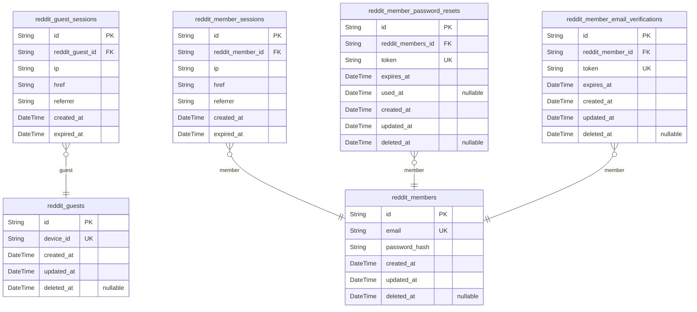
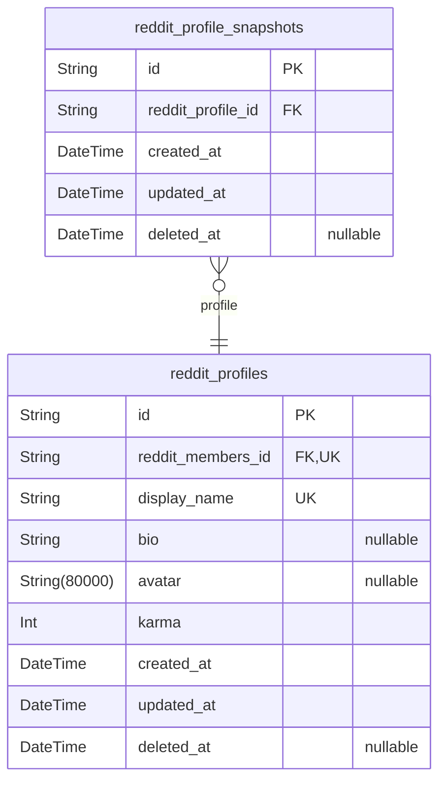
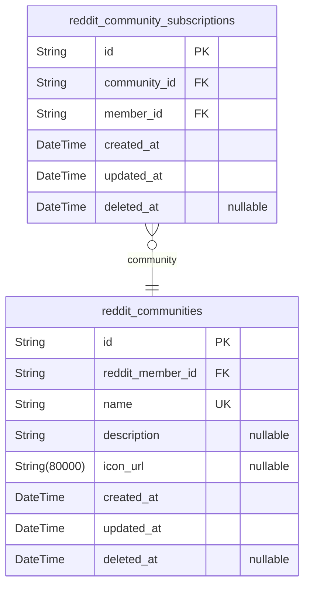
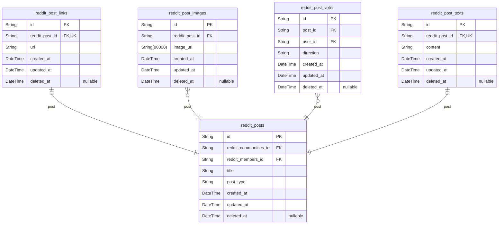
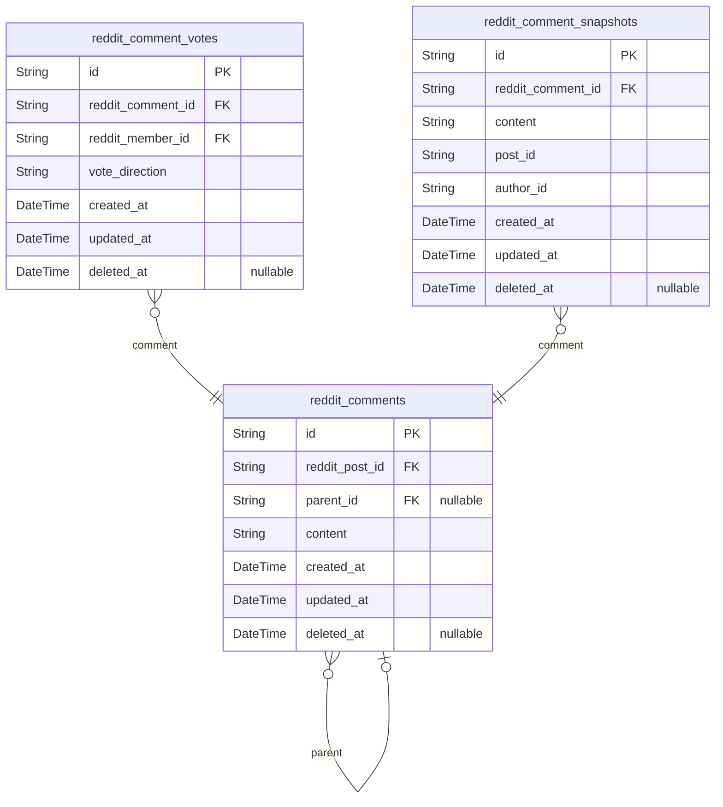
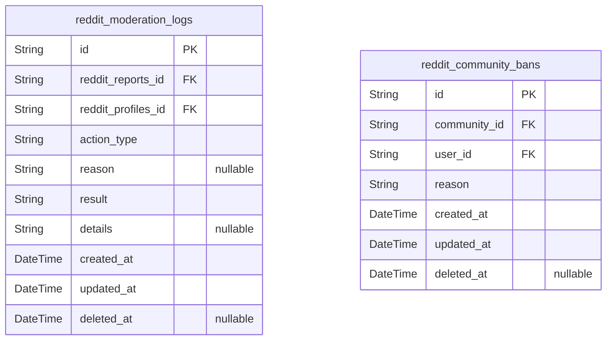
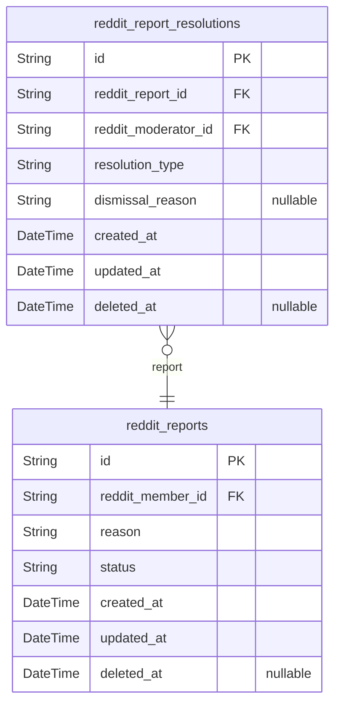
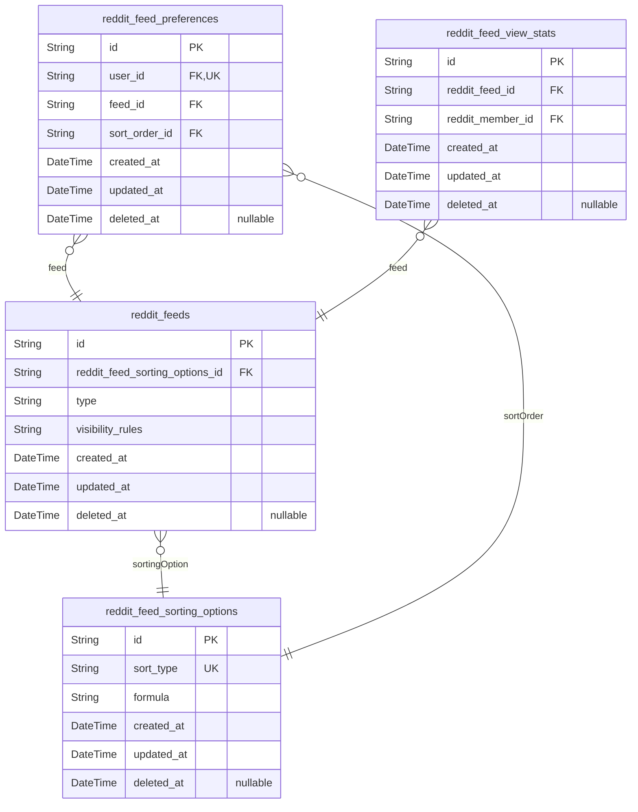

# Prisma Markdown

> Generated by [`prisma-markdown`](https://github.com/samchon/prisma-markdown)

- [Actors](#actors)
- [Profile](#profile)
- [Community](#community)
- [Post](#post)
- [Comment](#comment)
- [Moderation](#moderation)
- [Reporting](#reporting)
- [Feed](#feed)

## Actors

### `reddit_guests`

Temporary guest accounts identified by device ID for anonymous content
access. Guests do not require authentication but can interact with public
content. Device ID provides a persistent identifier for anonymous user
sessions across device usage.

Properties as follows:

- `id`: Primary Key.
- `device_id`
  > Unique identifier for the device used by the guest. Allows tracking
  > anonymous interactions across sessions within the same device.
- `created_at`: Record of when the guest account was created.
- `updated_at`: Record of when the guest account was last updated.
- `deleted_at`
  > Record of when the guest account was marked for deletion (soft delete).
  > Null indicates active account.

### `reddit_guest_sessions`

Session tokens with 30-minute expiration for guest temporary access.

Stores temporary session tokens for unauthenticated guests with 30-minute
expiration, tracking connection metadata for audit and security purposes.

- IP address origin
- Current URL and referrer tracking
- Automatic session expiration (30 minutes)
- Linked to reddit_guests for guest identity

Properties as follows:

- `id`: Primary Key.
- `reddit_guest_id`: Belonged guest's [reddit_guests.id](#reddit_guests).
- `ip`: IP address of session origin.
- `href`: Current URL where session was accessed.
- `referrer`: Previous URL the user came from.
- `created_at`: Session creation timestamp.
- `expired_at`: Session expiration timestamp.

### `reddit_members`

Registered member accounts with email/password credentials and profile
data. Includes authentication credentials and account lifecycle fields
for logged-in users with full platform access as per requirement
specification.

Properties as follows:

- `id`: Primary Key.
- `email`
  > Unique email address for account login; must match registration email for
  > authentication.
- `password_hash`
  > Bcrypt-hashed password stored securely for authentication; never stored
  > in plaintext.
- `created_at`: Account creation timestamp.
- `updated_at`: Last account modification timestamp.
- `deleted_at`
  > Soft delete timestamp indicating account deactivation (null for active
  > accounts).

### `reddit_member_sessions`

JWT tokens with access/refresh management for member authentication
sessions. Stores session tokens with connection metadata and temporal
fields for security auditing and session lifecycle management.

Key features:
- Tracks all active member sessions with unique session IDs
- Stores connection context including IP, href, and referrer for security
analysis
- Enforces 30-minute session expiration standard from requirements
- Maintains session history in reverse chronological order for logout
tracking

Properties as follows:

- `id`: Primary Key.
- `reddit_member_id`: Belongs to member's [reddit_members.id](#reddit_members).
- `ip`: Client IP address used for session tracking.
- `href`: Navigation reference URI used for this session.
- `referrer`: Previous page URL that originated this session.
- `created_at`: Timestamp when session was created (UTC).
- `expired_at`: Timestamp when session expires (UTC).

### `reddit_member_password_resets`

Password reset tokens with expiration and usage tracking. Each token is
valid for a single reset operation and expires within time window. Tokens
are automatically invalidated after use for security.

The table enables secure password recovery while maintaining audit trail
through timestamp tracking and soft deletion.

Properties as follows:

- `id`: Primary Key.
- `reddit_members_id`: The member who requested the password reset. [reddit_members.id](#reddit_members).
- `token`: Unique password reset token string for security.
- `expires_at`: Token expiration timestamp (15-minute validity by default).
- `used_at`: Timestamp when token was first used for password reset.
- `created_at`: Token creation timestamp.
- `updated_at`: Last updated timestamp for the token.
- `deleted_at`: Soft deletion timestamp when token is no longer usable.

### `reddit_member_email_verifications`

Email verification tokens with expiration dates for member account
activation.

Each token is associated with a specific member account and expires after
a set period. Tokens are single-use for security and validity.

Key business rules:
- Single token per member (active only)
- Tokens expire after 24 hours
- Verification tokens are deleted after use or expiration
- No user interaction required - tokens are system-generated

Properties as follows:

- `id`: Primary Key.
- `reddit_member_id`: Associated member account. [reddit_members.id](#reddit_members)
- `token`: Unique verification token string (system-generated, 64-character random)
- `expires_at`: Token expiration timestamp (24-hour validity)
- `created_at`: Timestamp when token was generated
- `updated_at`: Timestamp when token was last updated
- `deleted_at`: Timestamp when token was deactivated (soft delete)

## Profile

### `reddit_profiles`

Stores core profile data including unique display name, bio text (max 500
chars), avatar URL, and karma score. Each profile is linked to a user
account in the Actors component and represents a member's personalized
identity and reputation metrics on the platform. Display name serves as
unique identifier for profile operations. Karma score starts at 0 and
increments based on post/comment upvotes.

All historical profile changes are tracked via reddit_profile_snapshots
for audit trails. This table serves as the primary data structure for all
user-facing profile interactions and displays.

Properties as follows:

- `id`: Primary Key.
- `reddit_members_id`: Member profile owner reference. @\link reddit_members.id
- `display_name`
  > User's public display name (max 100 characters). Must be unique across
  > all profiles.
- `bio`
  > User's bio text (max 500 characters). Optional field for personal
  > description.
- `avatar`
  > URL to user's avatar image (stored as cloud-file reference). Nullable
  > until profile setup completes.
- `karma`
  > User's reputation score (default 0). Accumulates from post/comment
  > upvotes (+1) and downvotes (-1).
- `created_at`: Profile creation timestamp (UTC).
- `updated_at`: Profile last modification timestamp (UTC).
- `deleted_at`: Profile deletion timestamp (UTC). Nullable for soft delete.

### `reddit_profile_snapshots`

Tracks historical versions of profile data for audit and change history
during profile edits. Includes all business fields from reddit_profiles
table with timestamps to maintain full version history.

This snapshot table captures point-in-time state of profile data whenever
a user modifies their display name, bio, or avatar, enabling full
historical tracking for audit and moderation purposes. No calculated
fields are stored; all data is denormalized from the primary profile
record.

Properties as follows:

- `id`: Primary Key.
- `reddit_profile_id`: Reference to the parent profile this snapshot belongs to.
- `created_at`: When snapshot was created (UTC timestamp).
- `updated_at`: When snapshot was last updated (UTC timestamp).
- `deleted_at`: When snapshot was soft-deleted (UTC timestamp).

## Community

### `reddit_communities`

Community records including name, description, icon URL, and owner
relationship. Each community has a unique name and owner. This table
stores metadata for community profiles and is used for search
capabilities with partial string matching supported.

Properties as follows:

- `id`: Primary Key.
- `reddit_member_id`: The owner of the community (reference to reddit_members.id).
- `name`
  > Name of the community (unique identifier, max 50 characters for search
  > and uniqueness).
- `description`: Description of the community (max 500 characters).
- `icon_url`: URL of the community icon image stored in cloud storage.
- `created_at`: Timestamp when the community was created.
- `updated_at`: Timestamp of the last update to community metadata.
- `deleted_at`: Timestamp when the community was marked for deletion (soft delete).

### `reddit_community_subscriptions`

Tracks user subscriptions to communities for managing access and
subscriber counts. Each record represents a member's subscription to a
specific community, enabling access control to community content and
tracking subscription metrics.

Required for:
- Restricting user activity to subscribed communities
- Calculating community subscriber counts
- Enabling subscription management workflows

Properties as follows:

- `id`: Primary Key.
- `community_id`: Associated community's [reddit_communities.id](#reddit_communities).
- `member_id`: Subscribed member's [reddit_members.id](#reddit_members).
- `created_at`: Subscription creation timestamp.
- `updated_at`: Last update timestamp.
- `deleted_at`: Soft deletion timestamp (if applicable).

## Post

### `reddit_posts`

Core post metadata including title, creation timestamp, community ID,
author (FK to reddit_members), and post type identifier. Represents
user-created content across communities with specific content types
(text, link, image) that requires independent management and search
capabilities.

Key relationships:
- Belongs to a community (via reddit_communities table)
- Created by a member (via reddit_members table)
- Supports multiple content types with dedicated storage tables
(reddit_post_texts, reddit_post_links, reddit_post_images)

Properties as follows:

- `id`: Primary Key.
- `reddit_communities_id`: Community the post belongs to. [reddit_communities.id](#reddit_communities).
- `reddit_members_id`: Author of the post. [reddit_members.id](#reddit_members).
- `title`: Post title text for identification and display purposes.
- `post_type`
  > Type of the post (text, link, image) for content validation and storage
  > routing.
- `created_at`: Timestamp of when the post was created (UTC).
- `updated_at`: Timestamp of the last update to the post (UTC).
- `deleted_at`: Timestamp of deletion for soft delete (UTC).

### `reddit_post_links`

Stores the URL for link-based posts, ensuring the URL follows valid
http/https format. Each URL is associated with a single post and is
validated prior to storage. This subsidiary table supports the core
reddit_posts entity with 1:1 relationship.

Properties as follows:

- `id`: Primary Key.
- `reddit_post_id`: Post that this link belongs to. [reddit_posts.id](#reddit_posts)
- `url`: Valid URL for the link-based post (must start with http/https).
- `created_at`: Record creation timestamp.
- `updated_at`: Last record update timestamp.
- `deleted_at`: Soft delete timestamp (nullable).

### `reddit_post_images`

Stores image file references for image-based posts with cloud storage URL
and association to parent post. Includes cloud storage URL format
constraints and file size handling at application layer.

Properties as follows:

- `id`: Primary Key.
- `reddit_post_id`: Post this image belongs to. [reddit_posts.id](#reddit_posts)
- `image_url`
  > Cloud storage URL for image file. Includes application-level file size
  > validation (max 5MB).
- `created_at`: Timestamp when image record was created.
- `updated_at`: Timestamp when image record was last updated.
- `deleted_at`: Timestamp when image record was soft-deleted; null if still active.

### `reddit_post_votes`

Tracks user votes on posts with direction (up/down) and prevents
duplicate voting per user-post pair. Enables karma system adjustments for
post engagement.

This table stores each user's vote on a post (up or down), ensuring no
duplicate votes via unique constraint on (user_id, post_id). Vote
direction is stored separately to support future enhancements like
weighted voting. Required for karma calculation per post and user
engagement metrics.

Properties as follows:

- `id`: Primary Key.
- `post_id`: Vote belongs to a specific post. [reddit_posts.id](#reddit_posts)
- `user_id`: Vote belongs to a specific user (member). [reddit_members.id](#reddit_members)
- `direction`: Vote direction: 'up' or 'down'.
- `created_at`: Timestamp when the vote was created.
- `updated_at`: Timestamp when the vote was last updated.
- `deleted_at`: Soft delete timestamp for historical tracking.

### `reddit_post_texts`

Stores text content for text-based posts (minimum 10 characters) with
direct link to parent post. This subsidiary table supports text post
content while maintaining 3NF compliance through normalized relationship
with core posts.

Content validation: Minimum 10 characters required for text content. Text
content is linked to a single post via post_id, ensuring 1:1 relationship
for text-based posts.

This table does not require any additional business fields beyond the
required content and temporal fields, maintaining strict separation from
primary post entity.

Properties as follows:

- `id`: Primary Key.
- `reddit_post_id`: The post this text content belongs to. [reddit_posts.id](#reddit_posts).
- `content`: Full text content of the post. Must be at least 10 characters.
- `created_at`: Content creation timestamp.
- `updated_at`: Last modification timestamp.
- `deleted_at`: Deletion timestamp for soft delete. NULL = active.

## Comment

### `reddit_comments`

Main comment records with parent-child structure for nested replies and
post association. Comments are created by members, associated with
specific posts, and support hierarchical nesting with up to 5 levels of
replies.

This table forms the backbone of the community comment system, enabling:
- Hierarchical threaded discussions
- Post-specific comment organization
- Efficient content management with moderation workflows
- Full-text search capabilities for comment content

Properties as follows:

- `id`: Primary Key.
- `reddit_post_id`: Comment's parent post. [reddit_posts.id](#reddit_posts)
- `parent_id`: Parent comment in hierarchical structure. [reddit_comments.id](#reddit_comments)
- `content`: Text content of comment (max 1000 characters).
- `created_at`: Timestamp when comment was created.
- `updated_at`: Last timestamp when comment was updated.
- `deleted_at`: Timestamp when comment was soft-deleted.

### `reddit_comment_votes`

Voting records for comments including upvotes/downvotes and timestamps.
This table tracks user votes on comments to calculate comment scores,
with each entry representing an individual vote from a member. Enforces
uniqueness per user-comment pair to prevent duplicate votes.

Properties as follows:

- `id`: Primary Key.
- `reddit_comment_id`: The comment being voted on. [reddit_comments.id](#reddit_comments)
- `reddit_member_id`: The user who cast the vote. [reddit_members.id](#reddit_members)
- `vote_direction`: The direction of the vote: 'up' for upvotes, 'down' for downvotes.
- `created_at`: Timestamp of when the vote was cast.
- `updated_at`: Timestamp of the last update to the vote record.
- `deleted_at`: Timestamp when the vote was marked as deleted (for soft delete).

### `reddit_comment_snapshots`

Stores detailed comment modifications with before/after snapshots for
audit purposes. Retains all comment content, post context, and author
information at the time of modification to enable full audit history
without referencing current state. Primary use case: tracking comment
edits for moderation and data integrity verification.

Properties as follows:

- `id`: Primary Key.
- `reddit_comment_id`: Comment being snapshotted's ID. [reddit_comments.id](#reddit_comments).
- `content`: Content of the comment at the time of snapshot.
- `post_id`: Post ID of the comment's parent post.
- `author_id`: Author ID of the comment's user.
- `created_at`: Snapshot creation timestamp.
- `updated_at`: Last snapshot update timestamp.
- `deleted_at`: Soft delete timestamp.

## Moderation

### `reddit_moderation_logs`

Tracks all moderation actions performed by moderators, including
deletions of content, community bans, and resolution of user reports.
Each log entry records the action performed, the moderator responsible,
the related report (if any), and the outcome of the moderation action.
Provides an audit trail for all governance activities within the
community.

Properties as follows:

- `id`: Primary Key.
- `reddit_reports_id`
  > The specific report that the moderation action was applied to. {@link
  > reddit_reports.id}.
- `reddit_profiles_id`
  > The moderator user profile who performed the action. {@link
  > reddit_profiles.id}.
- `action_type`
  > Type of moderation action performed (e.g., 'delete_post', 'ban_user',
  > 'approve_report').
- `reason`: Detailed reason for the moderation action, as provided by the moderator.
- `result`
  > Outcome of the moderation action (e.g., 'approved', 'dismissed',
  > 'deleted').
- `details`
  > Additional details about the moderation action, such as specific content
  > IDs or resolution steps.
- `created_at`: Timestamp when the moderation log entry was created.
- `updated_at`: Timestamp of the last update to the moderation log entry.
- `deleted_at`: Timestamp when the log entry was marked as deleted (for soft delete).

### `reddit_community_bans`

Records of users banned from specific communities with reason and
timestamp for moderation audit trails. Tracks community bans including
ban reason, timestamp, and user-community relationships for moderation
workflows.

Properties as follows:

- `id`: Primary Key.
- `community_id`: Community the user was banned from. [reddit_communities.id](#reddit_communities).
- `user_id`: User who was banned. [reddit_profiles.id](#reddit_profiles).
- `reason`: Reason for the ban. Maximum 500 characters.
- `created_at`: Timestamp when the ban was applied.
- `updated_at`: Last modification timestamp of the ban record.
- `deleted_at`: Timestamp when the ban was removed (soft delete).

## Reporting

### `reddit_reports`

Tracks user-initiated reports of content violations with reason details
and resolution status. Each report includes the user who filed the
report, the current status (pending/approved/dismissed), and the report
reason text.

Properties as follows:

- `id`: Primary Key.
- `reddit_member_id`
  > User who initiated the report, referenced through the Members actor
  > entity. [reddit_members.id](#reddit_members).
- `reason`: User-provided reason for the report, up to 500 characters.
- `status`: Current status of the report: pending, approved, or dismissed.
- `created_at`: Timestamp when the report was created.
- `updated_at`: Last timestamp when the report was modified.
- `deleted_at`: Timestamp when the report was soft-deleted (null if active).

### `reddit_report_resolutions`

Logs resolution actions for user-reported content with moderator
identity, resolution type (approve/dismiss), and dismissal reasons when
applicable. References the original report and moderator's account for
audit purposes. Resolves reports for Moderation domain content while
preserving report history in separate reporting system.

**Business context**: Each resolution action (approve/dismiss) must tie
to the specific report and moderator, store the reason for dismissal, and
track timestamps for audit trails across reporting resolution workflows.

Properties as follows:

- `id`: Primary Key.
- `reddit_report_id`: Report being resolved's [reddit_reports.id](#reddit_reports).
- `reddit_moderator_id`: Modifying moderator's account [reddit_members.id](#reddit_members).
- `resolution_type`: Type of resolution action (approve or dismiss).
- `dismissal_reason`: Reason for dismissal action when applicable.
- `created_at`: Timestamp when resolution was recorded.
- `updated_at`: Timestamp when resolution was last updated.
- `deleted_at`: Timestamp when resolution was logically deleted (for soft delete).

## Feed

### `reddit_feeds`

Core feed definitions including type (Home, Popular, Community),
visibility rules, and default sorting criteria. Each feed is associated
with a specific sorting configuration to determine content display order
and visibility rules for users.

Properties as follows:

- `id`: Primary Key.
- `reddit_feed_sorting_options_id`
  > The default sorting configuration used for this feed. {@link
  > reddit_feed_sorting_options.id}
- `type`: Type of feed (Home, Popular, Community).
- `visibility_rules`
  > Accessibility rules for this feed (e.g., 'Public', 'Member-only'). For
  > example, 'All users' or 'Authentic member users only'.
- `created_at`: Timestamp when the feed was created.
- `updated_at`: Timestamp when the feed was last updated.
- `deleted_at`: Timestamp when the feed was soft-deleted (null if active).

### `reddit_feed_sorting_options`

Stores business rules for content sorting types including Hot, New, Top,
and Controversial. Each sorting option has a calculation formula and
supported time filters (e.g., today, week, month for 'Top' sorting).

Properties as follows:

- `id`: Primary Key.
- `sort_type`: Unique identifier for sorting type (hot, new, top, controversial).
- `formula`: Calculation formula for sorting score (e.g., 'votes * 1.5 + comments').
- `created_at`: Timestamp when the sorting rule was created.
- `updated_at`: Timestamp when the sorting rule was last updated.
- `deleted_at`: Timestamp when the sorting rule was deleted (soft delete).

### `reddit_feed_preferences`

User-specific feed preferences for saving preferred feed type and sort
order, stored with temporal tracking for audit and history.

These preferences are managed through the user's feed settings rather
than independently, requiring no dedicated CRUD API endpoints. The
settings reference established feed types (Home, Popular, Community) and
sorting options (Hot, New, Top, Controversial) defined in their
respective entities.

Properties as follows:

- `id`: Primary Key.
- `user_id`
  > Connected user's authentication identity for profile reference. {@link
  > reddit_members.id}.
- `feed_id`
  > The specific feed type preference (Home, Popular, Community). {@link
  > reddit_feeds.id}.
- `sort_order_id`
  > The preferred sorting method (Hot, New, Top, Controversial). {@link
  > reddit_feed_sorting_options.id}.
- `created_at`: Timestamp when the preference was first created.
- `updated_at`: Timestamp when the preference was last modified.
- `deleted_at`: Timestamp when the preference was soft-deleted (null if active).

### `reddit_feed_view_stats`

Tracks individual feed view events to monitor user engagement and feed
popularity for analytics purposes.

- Records when and by whom a feed was viewed
- Supports analytics on user behavior patterns across feed types
- Links view activity to both feed content and member profiles

Properties as follows:

- `id`: Primary Key.
- `reddit_feed_id`: The feed being viewed's ID. [reddit_feeds.id](#reddit_feeds).
- `reddit_member_id`: The member who viewed the feed. [reddit_members.id](#reddit_members).
- `created_at`: Timestamp when the feed was viewed.
- `updated_at`: Timestamp when the view event was last updated.
- `deleted_at`: Timestamp when the view event was soft-deleted.
