# Reddit-like Community Platform

## Introduction

The Community Platform is a social platform that enables users to create, follow, and engage with communities centered around shared interests. This platform is designed around core principles including community ownership, genuine engagement without algorithmic interference, and meaningful content quality over quantity.

## Service Overview

### Business Justification

The current market lacks a social platform that empowers users to control their content experience through community creation and ownership. Our platform addresses this gap by providing:

- A Reddit-like experience without engagement metrics-driven feeds
- Community ownership through self-moderation
- Karm-based reputation systems for authentic engagement
- User control over content visibility through subscription-based navigation

#### EARS Requirements
WHEN a user signs up for the platform, THE platform SHALL allow the user to create a unique username and password.
WHEN a user creates a community, THE platform SHALL automatically set them as the owner with full community management capabilities.
WHEN a user posts content, THE platform SHALL make it visible to community subscribers only.

### Value Proposition

#### For Users

The Community Platform provides an authentic Reddit experience with modern enhancements:
- **Personalized community discovery** through subscription model rather than algorithmic following
- **Karma-based reputation** reflecting meaningful community contributions
- **True profile ownership** with display names, bios, and avatars
- **Complete content control** including post editing and deletion
- **Moderation transparency** showing community health metrics

#### EARS Requirements
WHEN a user posts content, THE platform SHALL display their karma score next to their contributions.
WHEN a user joins a community, THE platform SHALL require that community to have at least one active moderator.
WHEN a user reports content, THE platform SHALL show the report reason to moderation team members.

#### For Communities

Communities gain:
- **Complete ownership and moderation tools** controlled by community owners
- **Scalable infrastructure** capable of supporting both small and large communities
- **Karma-based metrics** showing community health and engagement quality
- **Integrated reporting system** for efficient content moderation

#### For Moderators

Moderators benefit from:
- **Clear authority levels** within communities (owner vs. moderator)
- **Comprehensive moderation tools** for content management
- **Reporting interface** showing all content reports for their community
- **Banning capabilities** to protect community health

#### EARS Requirements
WHEN a community owner adds a moderator, THE platform SHALL make that user visible in the moderators list.
WHEN a moderator deletes content, THE platform SHALL log the action with timestamp and user ID.
WHEN a user requests community deletion, THE platform SHALL require owner confirmation.

### Core Features Implementation

#### User Identity System

##### Account Management

- **Registration**: Users sign up with email and password, with unique username choice (10-30 characters alphanumeric)
- **Login**: Email and password credentials are required for access
- **Password Management**: Users can change password with confirmation email validation
- **Account Deletion**: Deleting account removes all associated content (posts, comments, karma) within 24 hours

##### Profile Management

- **Display Name**: 1-30 characters, must be unique across system
- **Bio Text**: 0-250 characters, HTML-friendly
- **Avatar Image**: Supported formats (JPEG, PNG, GIF), max 5MB
- **Profile Viewing**: All users can view any other user's profile

##### EARS Requirements
WHEN a user creates a profile, THE platform SHALL enforce unique display name requirement.
WHEN a user updates their bio, THE platform SHALL limit text to 250 characters.
WHEN a user deletes their account, THE platform SHALL permanently remove all associated data within 24 hours.

#### Community Architecture

##### Community Creation

- **Required Fields**: Unique name (2-50 characters), description (0-500 characters), icon image (max 5MB)
- **Ownership**: User who creates community becomes owner
- **Browsing**: Public list of all communities with subscriber count display
- **Search**: Search by community name (fuzzy match)

##### Subscription Management

- **Subscribe**: Toggle button for communities users want to follow
- **Unsubscribe**: Toggle button to remove subscription
- **Subscription List**: View all communities user is subscribed to
- **Required for Posting**: Must be subscribed to create posts in community

##### EARS Requirements
WHEN a user creates a community, THE platform SHALL ensure name uniqueness across all communities.
WHEN a user subscribes to a community, THE platform SHALL display the community's current subscriber count.
WHEN a user views their subscriptions, THE platform SHALL list communities with last activity timestamp.

#### Content Management

##### Post Types

| Type | Description | Requirements |
|------|-------------|--------------|
| Text | Written content | Mandatory title, text content (20-5000 characters) |
| Link | External URL | Mandatory title, valid URL | 
| Image | Uploaded image | Mandatory title, image file (JPG/PNG/GIF, max 10MB) |

##### Post Operations

- **Creation**: In any subscribed community with a valid post type
- **Editing**: For user's own posts
- **Deletion**: For user's own posts
- **Viewing**: Post details including title, full content, author, community, vote score, comment count, and timestamp

##### EARS Requirements
WHEN a user creates a post, THE platform SHALL validate post type requirements.
WHEN a user edits a post, THE platform SHALL allow changes to all content fields except community selection.
WHEN a user deletes a post, THE platform SHALL remove it from all feeds and update community post count.

#### Post Voting System

- **Vote Types**: Upvote (+1 karma), Downvote (-1 karma)
- **Vote Limits**: One vote per user per post
- **Vote Changes**: Change vote type (upvote to downvote) by re-voting
- **Vote Removal**: Clear vote to reset to zero
- **Score Calculation**: Total upvotes - total downvotes

##### EARS Requirements
WHEN a user votes on a post, THE platform SHALL increment/decrement karma and update scores.
WHEN a user changes vote type, THE platform SHALL adjust karma accordingly.
WHEN a user removes a vote, THE platform SHALL revert to previous score without affecting karma.

#### Content Display

##### Post List View

Each post in feeds shows:
- Title (truncated to 100 characters)
- Author username
- Community name
- Vote score
- Comment count
- Time since posted (e.g., '3 hours ago')
- Content type indicator:
  - Text: first 200 characters of content
  - Link: domain name of URL (e.g., 'youtube.com')
  - Image: image thumbnail

##### EARS Requirements
WHEN a user views a post list, THE platform SHALL display truncated content based on type.
WHEN a user views a text post in list, THE platform SHALL show first 200 characters.
WHEN a user views a link post in list, THE platform SHALL display domain name without protocol.

#### Community Feed Implementation

All three feed types (Home, Popular, Community) use the same content display rules and support identical sorting options:

| Sort Type | Behavior | Time Filter Options |
|-----------|----------|---------------------|
| Hot | Recent posts with many upvotes | All sorts with time filters |
| New | Most recent posts | Today, this week, this month, this year, all time |
| Top | Highest vote score | Today, this week, this month, this year, all time |
| Controversial | Posts with many votes but score near zero | All time |

##### EARS Requirements
WHEN a user selects 'Top' sort, THE platform SHALL apply correct time filter options.
WHEN a user views the Popular feed, THE platform SHALL show posts from all communities without authentication requirement.
WHEN a user views the Home feed, THE platform SHALL show only posts from subscribed communities.

#### Community Moderation

##### Moderator Roles

- **Community Owner**: Highest authority, can add/remove moderators
- **Moderator**: Can add other moderators but cannot remove owner or other moderators
- **Moderator Actions**: Delete posts, delete comments, ban users from community

##### Ban Management

- **Banned Users**: Cannot create posts or comments within community, can view content
- **Ban Visibility**: Moderators can view list of banned users
- **Ban Removal**: Moderators can unban users

##### EARS Requirements
WHEN a community owner adds a moderator, THE platform SHALL make that user visible in the moderators list.
WHEN a moderator deletes a post, THE platform SHALL log the action with timestamp.
WHEN a user is banned from a community, THE platform SHALL prevent them from posting or commenting in that community.

#### Reporting System

##### Report Process

- **User Report**: Provides content, reason text (10-500 characters)
- **Moderator Review**: View all reports for their community, view report reason
- **Report Resolution**: Approve (delete content) or dismiss (keep content)
- **Dismissed Reports**: Automatically removed from report queue

##### EARS Requirements
WHEN a user submits a report, THE platform SHALL require report reason text between 10-500 characters.
WHEN a moderator dismisses a report, THE platform SHALL remove it from the report queue.
WHEN a moderator approves a report, THE platform SHALL delete the reported content and notify user who reported.

#### Technical Implementation Notes

```mermaid
graph LR
  A[User Registration] --> B[Profile Creation]
  B --> C[Community Selection]
  C --> D[Content Creation]
  D --> E[Voting & Comments]
  E --> F[Community Moderation]
  F --> G[Business Value]
  style A fill:#d4f0d4,stroke:#333
  style B fill:#d4e2f0,stroke:#333
  style C fill:#f0e0d4,stroke:#333
  style D fill:#e0f0d4,stroke:#333
  style E fill:#d4e0f0,stroke:#333
  style F fill:#f0d4e0,stroke:#333
  style G fill:#e0d4f0,stroke:#333
```

## Business Model

### Revenue Strategy

- **Basic Platform**: Free for all users and communities
- **Premium Subscription**: Optional paid features including:
  - Custom community themes
  - Ad-free experience for primary communities
  - Advanced analytics for community owners
  - Priority content promotion
- **Community Monetization**:
  - Optional sponsored posts (with clear labeling)
  - Community-sponsored content campaigns
  - Premium community features

### Success Metrics

| Metric | Target (3 months) | Target (12 months) | Target (24 months) |
|--------|------------------|------------------|------------------|
| DAU (Daily Active Users) | 5,000 | 50,000 | 250,000 |
| Community Creation Rate | 50/week | 500/week | 2,000/week |
| Average Posts/Community | 20 | 100 | 300 |
| Average Comments/Post | 10 | 25 | 50 |
| Premium Subscription Rate | 0.5% | 5% | 15% |
| Positive Community Sentiment | 70% | 80% | 90% |

### Performance Expectations

- Page load times for community feeds: Under 2 seconds for 95% of users
- Search response times for community names: Under 0.5 seconds
- Content loading (posts, comments): Load 20 items within 1.5 seconds
- Voting operations: Under 0.5 seconds
- API response times for core features: Under 1 second in 95% of requests

## Business Justification

The Community Platform fills a critical need in today's social media landscape by providing a Reddit-like experience focused on authentic community building. It empowers users with meaningful content discovery and community ownership while creating sustainable value through community-focused monetization. By prioritizing community health and user control over engagement metrics, the platform differentiates itself from mainstream social networks.