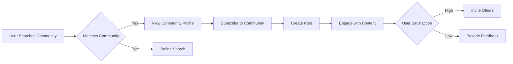
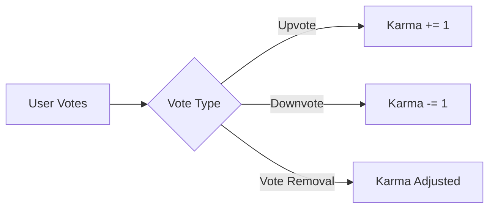
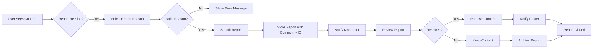

# Reddit-like Community Platform: Requirements Specification

## 1. Service Overview

### Problem Statement
The social media landscape suffers from fragmented community experiences due to lack of specialized platforms for topic-focused discussions. Current platforms fail to balance user engagement with community health, leading to toxic interactions, low-quality content, and poor user retention.

WHEN a user searches for a passionate community around a specific interest, THE system SHALL present a curated list of relevant communities with clear purpose and active discussion.

WHEN a user encounters toxic content, THE system SHALL provide immediate reporting and moderation pathways.

### Market Gap Analysis
The gap between general-purpose social platforms and specialized community platforms is clear. Our platform bridges this by:
- Providing focused community experiences around specific interests
- Empowering community owners with comprehensive moderation tools
- Implementing a transparent reputation system (karma)
- Offering intuitive content discovery across communities

### Value Proposition
Our platform offers:

1. **Focused Community Experience** - Unlike general social platforms, communities are laser-focused on specific interests.

WHEN a user discovers a new community interest, THE system SHALL display the community's purpose and active discussions to build immediate engagement.

2. **Transparent Reputation System** - Karma provides clear, actionable feedback on content contributions.

3. **Empowered Community Ownership** - Community creators have full control over community rules and content.

WHILE a user is browsing communities, THE system SHALL display subscription status and community purpose to guide participation decisions.

4. **Universal Feed Experience** - Three distinct feeds (Home, Popular, Community) provide flexibility without requiring constant navigation.

### Business Model

#### Why This Service Exists
This service addresses three core market needs:
- **For Users**: A place to build genuine connections around specific interests
- **For Community Owners**: Tools to maintain healthy communities
- **For Creators**: Transparant reputation system rewarding quality contributions

WHEN a user joins a niche community but finds no active discussion, THE system SHALL recommend similar communities with active engagement.

#### Revenue Strategy
- **Free Core Platform**: All basic features available with no ads
- **Premium Membership**: $2.99/month for enhanced features (analytics, branding, increased content limits)
- **Community Boosting**: Optional paid promotions (5% revenue donated to community funds)

WHEN a user views premium features, THE system SHALL display tiered benefits without aggressive sales tactics.

#### Growth Strategy
- **Community-First Acquisition**: Target niche communities for initial user base
- **Referral Program**: Reward users for bringing new members (enhanced community badges)
- **Content Quality Incentives**: 'Featured Community' program promoting quality communities

WHILE a user shares the platform, THE system SHALL track referrals without pressuring sharing behavior.

### Success Metrics
| Metric | Target (Year 1) | Target (Year 2) |
|--------|-----------------|-----------------|
| Monthly Active Users (MAU) | 50,000 | 250,000 |
| Community Creation Rate | 500/month | 2,500/month |
| Average Community Activity | 10 posts/week | 20 posts/week |
| User Retention Rate | 40% | 55% |
| Premium Conversion Rate | 3% | 7% |

WHILE monitoring system performance, THE system SHALL track and analyze user activity patterns.

### Non-Functional Requirements

#### Performance
WHEN a user loads the Home Feed, THE system SHALL display content within 1.5 seconds for 85% of users.

WHEN a user views a community with 10,000 subscribers, THE system SHALL load community details within 2 seconds.

#### Scalability
THE system SHALL support 10,000 concurrent users per community with minimal performance degradation.

WHEN traffic spikes occur, THE system SHALL automatically scale resources without manual intervention.

#### Security and Compliance
Users register with secure email authentication and password requirements (8+ characters, mix of case, numbers). All user data SHALL be stored and transmitted with current security best practices.

### Business Rules Summary

- User registration requires unique username and verified email
- Community creation: Any member can create a community with ownership to creator
- Karma calculation: Total upvotes minus total downvotes
- Content visibility depends on user permissions and community rules
- Reporting: All reports reviewed promptly by moderators



## 2. User Account Requirements

### Registration
WHEN a user attempts to register, THE system SHALL require:
- Unique email address
- Unique username (3-25 characters, alphanumeric with underscores and hyphens)
- Password (8+ characters, mix of case, numbers)
- Email verification before account activation

WHEN a user provides duplicate email, THE system SHALL display: "This email is already registered."

WHEN a username is reserved or duplicate, THE system SHALL display: "This username is unavailable."

### Login
WHEN a user submits valid credentials, THE system SHALL authenticate and issue a secure session token.

WHEN a user attempts to login with invalid credentials, THE system SHALL display: "Invalid email or password."

### Password Management
WHEN a user requests password change, THE system SHALL:
- Require current password for verification
- Enforce new password strength requirements
- Send confirmation email after successful change

WHEN a user deletes their account, THE system SHALL:
- Delete all personal data
- Remove all associated content
- Invalidate all session tokens
- Send confirmation email with deletion summary

## 3. User Profile Requirements

### Profile Structure
Every user profile SHALL include:
- Display name (max 50 characters)
- Bio text (max 500 characters)
- Avatar image (PNG/JPEG, max 2MB)
- Karma score
- Total posts and comments

### Profile Management
WHEN a user edits their profile, THE system SHALL:
- Allow changes to display name, bio, and avatar
- Enforce display name character limits
- Validate avatar file types and sizes
- Update profile information immediately

WHEN a user requests to delete their account, THE system SHALL:
- Require explicit confirmation
- Delete all associated content
- Permanently remove account data

### Profile Views
WHEN viewing another user's profile, THE system SHALL display:
- Display name and avatar
- Bio text
- Karma score
- Total posts
- Total comments
- List of all posts and comments

## 4. Karma System Requirements

### Core Formula
```
Karma = Total Upvotes - Total Downvotes
```

### EARS Requirements

WHEN a user receives an upvote, THEN THE system SHALL increase karma by 1.
WHEN a user receives a downvote, THEN THE system SHALL decrease karma by 1.
WHEN a user removes a vote, THEN THE system SHALL adjust karma to prior state.

### Calculation Workflow



### Display Rules

WHEN viewing a profile, THE system SHALL display karma prominently above the bio.
WHEN viewing content, THE system SHALL display karma next to username.
ALL karma scores SHALL be displayed as plain integers (no additional text or symbols).

### Special Case Handling

WHEN content is deleted, THE system SHALL maintain karma history but remove score from content.
WHEN user's account is deleted, THE system SHALL permanently remove karma history.
WHEN a user creates a new account, THE system SHALL reset karma to 0.

WHEN karma falls below -10, THE system SHALL display: "This user's content may not be visible to all community members."

## 5. Communities Requirements

### Community Creation
WHEN a user creates a new community, THE system SHALL:
- Validate unique community name (3-25 characters, alphanumeric with underscores/hyphens)
- Assign creator as owner
- Generate unique community ID
- Default icon to system placeholder
- Store creation timestamp in ISO 8601
- Provide immediate confirmation

WHEN invalid name format is provided, THE system SHALL display: "Community name must be 3-25 characters long and can only contain letters, numbers, underscores, and hyphens."

### Community Management
WHEN user is owner, THEN THE system SHALL allow:
- Adding/removing moderators
- Setting community rules
- Managing community settings

WHEN a user attempts to join a community, THEN THE system SHALL:
- Check if community is public
- Show subscription button if allowed
- Prevent creation if not subscribed

### Subscription Requirements
WHEN a user subscribes to a community, THEN THE system SHALL:
- Update subscription status
- Track subscriber count
- Notify community owner of new subscriber

WHEN a user unsubscribes, THEN THE system SHALL:
- Update subscription status
- Decrement subscriber count
- Allow re-subscription at any time

```
graph LR
    A[Member Clicks Create Community] --> B{"Valid Name?"}
    B -->|Yes| C[Enter Description & Upload Icon]
    B -->|No| D[Show Validation Error]
    C --> E{All Required Fields?}
    E -->|Yes| F[Submit Form]
    E -->|No| G[Show Missing Fields]
    F --> H[Create Community]
    H --> I[Set Owner = Creator]
    I --> J[Display Confirmation]
```

## 6. Posts Requirements

### Post Creation
WHEN a user creates a post, THE system SHALL:
- Verify user is subscribed to the community
- Validate required fields (title for all types)
- Enforce type-specific constraints
- Generate unique post ID
- Set initial vote score to 0

WHEN user is not subscribed, THE system SHALL display: "You must be subscribed to create posts."

### Post Types

#### Text Posts
- Requires title and content (max 10k characters)
- Show first 200 characters in feeds
- Display full content in single view

#### Link Posts
- Requires title and valid URL (http:// or https://)
- Store and display canonical domain name
- Show domain as link in feeds

#### Image Posts
- Requires title and image (max 4096px wide, JPEG/PNG/GIF)
- Generate thumbnail (max 200px wide) for feeds
- Display full image in single view

### Post Editing
WHEN a user edits a post, THE system SHALL:
- Allow within 24 hours of creation
- Prevent changing post type
- Update modified timestamp
- Refresh preview text in feeds

WHEN post edit window expires, THE system SHALL display: "Cannot edit posts after 24 hours."

### Post Deletion
WHEN a user deletes a post, THE system SHALL:
- Confirm deletion
- Remove associated comments
- Adjust community post count
- Adjust author's karma based on votes

WHEN moderator deletes post, THE system SHALL not adjust karma.

## 7. Post Voting Requirements

### Vote Rules
- One vote per user per post
- Cannot vote on own posts
- Vote score = upvotes - downvotes

### Vote Changes
WHEN user changes vote from up to down, THE system SHALL:
- Decrease author's karma by 2
- Update vote record

WHEN user changes vote from down to up, THE system SHALL:
- Increase author's karma by 2

WHEN user removes vote, THE system SHALL:
- Return karma to pre-vote state

### Display Rules
WHILE displaying post lists, THE system SHALL show vote score in format: "X karma".
WHEN displaying image posts, THE system SHALL show score in bottom-right corner.

## 8. Feed Requirements

### Home Feed
- Shows posts from user's subscribed communities
- For logged-in users only
- Default sort: Hot (recent activity + voting score)

### Popular Feed
- Includes all community posts
- Available to all users
- Default sort: Hot

### Community Feed
- Shows all posts from specific community
- Available to all users
- Includes community metadata at top

### Sorting Options
- **Hot**: Combined recent activity and voting score
- **New**: Most recent posts first
- **Top**: Highest vote score (with time filter)
- **Controversial**: High engagement but score near zero

```mermaid
graph LR
    A[Select Sorting Option] --> B{Sort by Hot}
    A --> C{Sort by New}
    A --> D{Sort by Top}
    A --> E{Sort by Controversial}
    B --> F[Order by: (Voting Score * Time Factor)]
    C --> G[Order by: Recent Creation]
    D --> H[Order by: Vote Score (All Time)]
    E --> I[Order by: High Votes Near Zero]
```

## 9. Comments Requirements

### Comment Structure
- Text-only comments (no media)
- Minimum 10 characters, maximum 500 characters
- Supports nested replies (unlimited depth)

### Comment Editing
- Allow within 24 hours of creation
- Disable editing after 24 hours
- Show edit timestamp

### Comment Sorting
- **Best**: Highest vote score first (default)
- **New**: Most recent comments first
- **Controversial**: Most votes with score near zero

### Reply System
WHEN a user replies to a comment, THE system SHALL:
- Create nested comment structure
- Show visual thread hierarchy
- Track reply count
- Maintain chronological order

```
graph LR
    A[Post] --> B[Main Comment]
    B --> C[Reply to Main]
    B --> D[Reply to Reply]
    D --> E[Reply to Reply]
    C --> F[Reply to Reply]
```

## 10. Moderation Requirements

### Role Hierarchy
- Community owner: Highest authority
- Moderators: Can add/remove other moderators
- Moderators cannot remove owners or other moderators

### Content Moderation
WHEN a moderator deletes a post, THE system SHALL:
- Remove post and all replies
- Update community post count
- Display as "Removed by moderator"

WHEN a user is banned from a community, THE system SHALL:
- Prevent new posts/comments
- Display banner to user when attempting
- Show ban reason when requested

### Report Handling
WHEN a user reports content, THE system SHALL:
- Require minimum 20-character reason
- Store with community context
- Notify appropriate moderators

WHEN moderator reviews report, THE system SHALL:
- Allow Approve/Delete or Dismiss
- Log action in audit trail
- Notify reporter of outcome

## 11. Reporting Requirements

### Reporting Process
WHEN a user reports content, THE system SHALL:
- Require text reason (20-500 characters)
- Prevent reporting own content
- Implement rate limiting (max 3 reports/5 minutes)

### Resolution Workflow
WHEN a report is approved, THE system SHALL:
- Remove content
- Log moderator action
- Notify reporter

WHEN a report is dismissed, THE system SHALL:
- Keep content
- Archive report
- Notify reporter

### Report Retention
- Active reports: 90 days
- Closed reports: Until content is removed
- Removed content reports: 365 days



## 12. Success Metrics

The platform SHALL:
- Maintain 99% uptime for feed operations
- Process feed requests within 2 seconds for 95% of users
- Achieve 90% user satisfaction in feed personalization
- Reduce reported content by 30% post-implementation
- Increase community participation by 25%
- Reduce moderation response time from 48h to 1h

### Business Value
The Reddit-like platform delivers value through:
- Authentic contributions with meaningful karma
- Community ownership with full management control
- Meaningful metrics that reflect genuine engagement
- User-centric design focused on community content

All user interactions reflect the platform's core principles: meaningful engagement over vanity metrics, community health prioritized over growth at all costs, and transparent user feedback mechanisms.