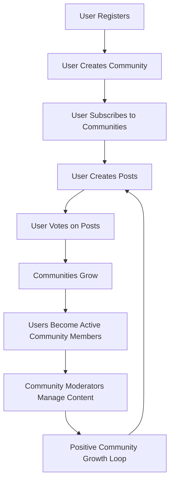

# Requirements Specification: Reddit-like Community Platform

## 1. Service Overview

The platform solves the problem of fragmented online communities by providing a unified space where users can create and engage with topic-focused communities. Unlike traditional social media platforms that prioritize algorithmic content delivery, this platform centers around user-created communities as the fundamental organizational unit, enabling meaningful interactions while maintaining platform-wide cohesion. The core value proposition is delivering a seamless community experience that balances user autonomy with platform integrity.

### Business Value

WHEN users interact with the platform, THE system SHALL ensure that community building is prioritized over content amplification, leading to:
- Reduced polarization through community-specific moderation
- More meaningful user connections based on shared interests
- Higher quality content creation by focusing on community-relevant topics

## 2. User Account Requirements

### 2.1 Registration and Authentication

WHEN a user wants to sign up for the platform, THE system SHALL require:
- A valid, unique email address
- A strong, unique password (minimum 8 characters, including uppercase, lowercase, and numeric characters)
- A unique username (no spaces, minimum 3 characters)
- Agreement to the terms of service

THE system SHALL generate a welcome email with verification link within 1 minute of registration request.

WHEN a user submits their registration information, THE system SHALL validate all input fields and display specific error messages for each validation failure.

### 2.2 Account Management

WHEN a user wants to change their password, THE system SHALL:
- Require the user's current password for authentication
- Verify the new password meets security requirements
- Notify the user via email of the password change

WHEN a user requests account deletion, THE system SHALL:
- Confirm the request through a second authentication step
- Display a warning of irreversible data deletion
- Delete all user content, including posts, comments, and associated karma
- Provide an option to restore the account within 14 days of deletion

### 2.3 Authentication Workflow

THE system SHALL implement JWT-based authentication with the following requirements:
- Sessions expire after 30 minutes of inactivity
- Session tokens are stored in HTTP-only cookies
- Password reset tokens expire after 1 hour
- All authentication endpoints require HTTPS

## 3. User Profile Requirements

### 3.1 Profile Components

WHEN a user views their profile, THE system SHALL display:
- Their display name (defaulting to username if blank)
- A customizable bio text (maximum 255 characters)
- The user's avatar image (JPEG/PNG, max 5MB)
- Their current karma score prominently at the top

WHEN a user views another user's profile, THE system SHALL allow viewing with no restrictions, but shall not display private information (e.g., email address).

### 3.2 Profile Interactions

WHEN a user edits their profile, THE system SHALL:
- Allow updates to display name, bio, and avatar
- Validate all input fields against length and format requirements
- Display a success message upon saving

WHEN a user views their profile, THE system SHALL display a list of their posts (with title, community, and creation date) and comments (with content preview, community, and creation date), filtered by post type.

## 4. Karma System Requirements

### 4.1 Karma Mechanics

WHEN a user receives an upvote on a post or comment, THE system SHALL increase their karma score by 1.

WHEN a user receives a downvote on a post or comment, THE system SHALL decrease their karma score by 1.

WHEN a user changes an upvote to a downvote, THE system SHALL adjust their karma score by -2.

WHEN a user changes a downvote to an upvote, THE system SHALL adjust their karma score by +2.

WHEN a user removes their vote, THE system SHALL adjust their karma score according to their previous vote:
- Previous upvote: decrease by 1
- Previous downvote: increase by 1

### 4.2 Karma Display and Usage

THE system SHALL update karma scores in real-time across all user interactions.

WHEN a user views their profile, THE system SHALL display their karma score as a numeric value at the top.

WHEN a user views another user's profile, THE system SHALL display their karma score below the profile title.

## 5. Communities Requirements

### 5.1 Community Creation

WHEN a user creates a new community, THE system SHALL require:
- A unique community name (min 3 characters, max 50 characters)
- A descriptive community description (min 10 characters)
- A community icon image (JPEG/PNG, max 5MB)
- A URL-safe slug (automatically generated from community name)

THE system SHALL prevent duplicate community names across the entire platform.

### 5.2 Community Ownership Structure

WHEN a user creates a community, THE system SHALL:
- Assign the user as the community owner
- Automatically grant the owner the highest authority within the community
- Store the owner relationship in the community ownership records

WHEN a user is the owner of a community, THE system SHALL prevent the owner from being removed by other users.

## 6. Subscribing Requirements

### 6.1 Subscription Management

WHEN a user views a community page, THE system SHALL display a "Subscribe" button if they are not already subscribed.

WHEN a user clicks "Subscribe", THE system SHALL add them to the community's subscription list.

WHEN a user is subscribed to a community, THE system SHALL automatically include the community's posts in their Home Feed.

### 6.2 Subscription Visibility

THE system SHALL display the subscription count for each community on the community browse page.

THE system SHALL allow users to view all communities they are subscribed to, with search and sorting capabilities.

## 7. Posts Requirements

### 7.1 Post Types

WHEN a user creates a post in a community, THE system SHALL present three post type options:
- Text post: Requires a title and content (text editor)
- Link post: Requires a title and URL (valid HTTP/HTTPS)
- Image post: Requires a title and image upload (JPEG/PNG, max 5MB)

THE system SHALL require a title for all post types.

### 7.2 Post Lifecycle

WHEN a user edits their post, THE system SHALL allow modifications to the post content within a 24-hour window.

WHEN a user deletes their post, THE system SHALL:
- Remove the post from all feeds
- Recalculate all karma related to this post
- Notify the community owner if the post was on the community home page

## 8. Feeds Requirements

### 8.1 Feed Types

THE system SHALL provide three distinct feed views:
- **Home Feed**: Shows posts only from communities the user is subscribed to (logged-in users only)
- **Popular Feed**: Shows posts from all communities across the platform (available to everyone)
- **Community Feed**: Shows posts from one specific community (available to everyone)

### 8.2 Sorting Options

WHEN a user accesses any feed, THE system SHALL provide the following sorting options:
- **Hot**: Most recent posts with high engagement appear first
- **New**: Most recently created posts appear first
- **Top**: Highest vote score for selected time frame (today, week, month, year, all time)
- **Controversial**: Posts with many votes but score close to zero appear first

THE system SHALL paginate all feeds with 20 items per page, with loading indicators for large datasets.

## 9. Comment Requirements

### 9.1 Comment Features

WHEN a user creates a comment, THE system SHALL:
- Allow creation of threaded replies (unlimited depth)
- Display the comment author's username
- Allow editing of comments within 24 hours
- Allow deletion of personal comments

WHEN a user views a comment, THE system SHALL display:
- The author's username
- The content text
- The vote score
- Time since posted in natural language (e.g., "3 hours ago")

### 9.2 Comment Structure

THE system SHALL implement a comment tree structure that properly nests replies and sub-replies.

WHEN a comment has replies, THE system SHALL display a 'Replies' count and provide an interactive button to expand/collapse replies.

## 10. Community Moderation Requirements

### 10.1 Moderator Roles

WHEN a community owner adds a new moderator, THE system SHALL:
- Grant the user moderator privileges for that specific community
- Record the addition in the community moderation log
- Notify the new moderator via email

WHEN a moderator is removed from a community (by owner), THE system SHALL:
- Revoke all moderator privileges for that community
- Record the removal in the moderation log
- Notify the previous moderator via email

### 10.2 Moderation Actions

WHEN a moderator deletes a post, THE system SHALL:
- Notify the post author with reason for deletion
- Remove the post from all feeds immediately
- Recalculate karma for the author

WHEN a moderator bans a user from a community, THE system SHALL:
- Prevent the user's future posts/comments in that community
- Record the ban date and reason in the moderation log
- Notify the user via email

## 11. Reporting Requirements

### 11.1 User Reporting

WHEN a user reports a post or comment, THE system SHALL:
- Require a reason text (min 5 characters, max 255 characters)
- Store the report with the reporter's ID, content ID, and reason
- Prevent the reporter from reporting the same content multiple times

THE system SHALL provide a confirmation message upon reporting.

### 11.2 Moderation Response

WHEN a moderator views a report, THE system SHALL show:
- The content being reported
- The reporter's username
- The reason for the report
- An approval/dismiss button

WHEN a moderator approves a report, THE system SHALL:
- Delete the reported content
- Notify the reporter of the action
- Add a note of the moderation action to the content's history

## Business Flow Diagram

## Success Metrics Validation

For the business to be viable, the platform must meet these critical success criteria:
- Users must find the community model valuable enough to create community ownership (minimum 2 communities per user per month)
- Users must maintain engagement with at least 3 communities per week
- A minimum of 50% of community owners must upgrade to premium tier within 6 months
- The platform must maintain a minimum 3:1 active member to content creator ratio
- The system must generate at least 100,000 community interactions per month before monetization via ads

### Performance Guarantee

THE system SHALL ensure:
- Communities list loads in under 1.5 seconds for up to 500 communities
- Feed items load with 20 items per page in under 2 seconds
- Vote processing occurs within 500 milliseconds
- System handles 50,000 concurrent users with 99.9% uptime
- Platform scales to handle 1,000+ concurrent community interactions

### Security Compliance

ALL user passwords SHALL be stored using bcrypt with cost factor 12.

ALL session data SHALL use secure, HTTP-only cookies.

All API endpoints SHALL implement input validation for security vulnerabilities.

All authentication tokens SHALL follow industry standard best practices for JWT security.

Password reset tokens SHALL expire after 1 hour of inactivity.