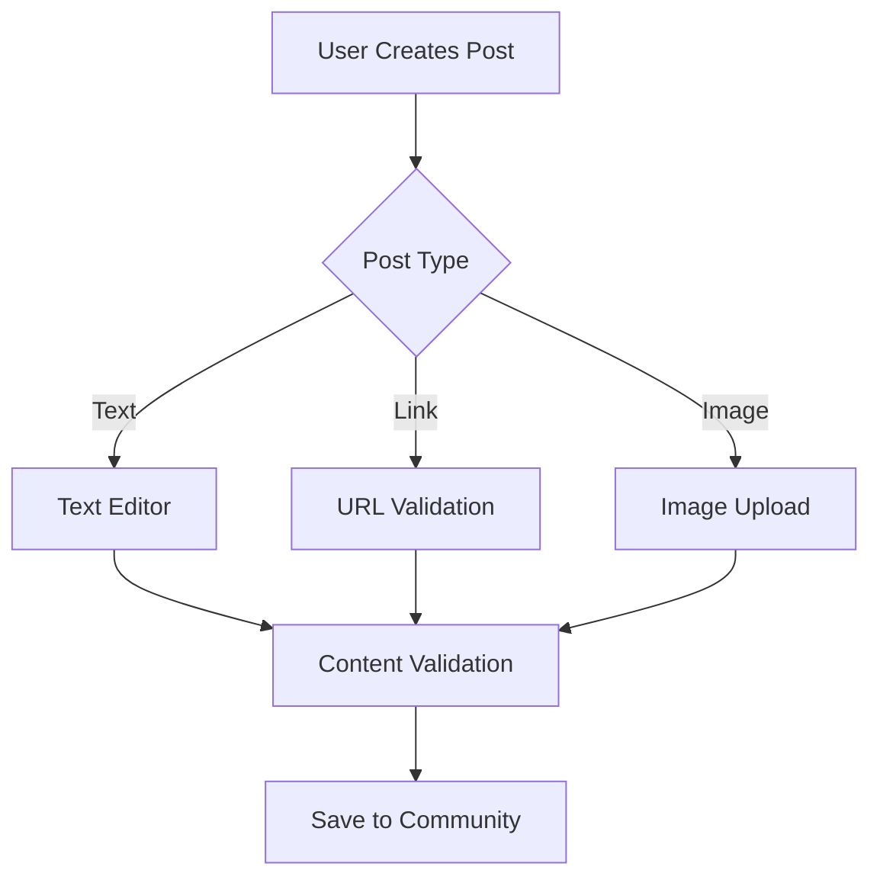
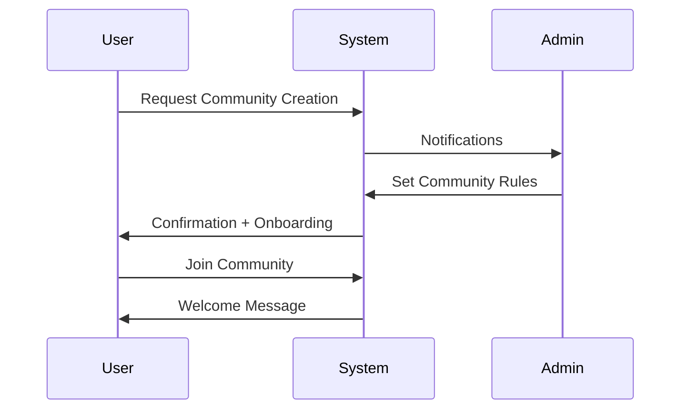

# Requirements Analysis Report: Reddit-like Community Platform

## Service Vision and Purpose

The platform provides a structured digital space for users to engage in interest-based communities with minimal friction. The system enables users to discover, join, and participate in community discussions while maintaining high-quality content standards.

WHEN a user seeks an interest-based community, THE system SHALL provide a searchable community directory with category-based organization. THE platform SHALL ensure communities are designed as first-class citizens with unique rules and culture rather than secondary features.

WHEN a user navigates to a community page, THE system SHALL display only content relevant to that community, eliminating noise from unrelated posts. THIS creates a focused user experience compared to generic social media platforms.

## Target Audience and Business Context

### Primary Audience (Registered Community Members)

- **User Journey**: Discovery → Join → View → Post → Engage via voting/comments
- **Business Requirements**:
  - WHEN a user registers, THE system SHALL verify email address and create secure password
  - WHEN a user creates a post, THE system SHALL validate content type (text, link, image) and enforce maximum size limits
  - WHEN a user upvotes a post, THE system SHALL increment the post's engagement score
  - WHEN a user suspends a post due to violation, THE system SHALL automatically send notification to community admin

### Secondary Audience (Community Administrators)

- **User Journey**: Create → Configure → Moderate → Enforce
- **Business Requirements**:
  - WHEN a community admin creates a new community, THE system SHALL request community-specific rules and moderation settings
  - WHEN content is reported, THE system SHALL notify community admin with full context including reporter info
  - WHEN a user is banned from a community, THE system SHALL record reason and notification method

### Tertiary Audience (Site Administrators)

- **User Journey**: Monitor → Analyze → Enforce → Scale
- **Business Requirements**:
  - WHEN a community violates site-wide policies, THE system SHALL trigger automated reporting to site admin
  - WHEN a new reporting pattern is detected, THE system SHALL update moderation algorithms

## Core Functional Requirements

### Community Management

- **Community Creation**:
  - WHEN a user creates a new community, THE system SHALL require a name, description, and category
  - THE system SHALL generate unique community identifier in format `cmty-YYYYMMDD-NNNN`
  - THE system SHALL populate default moderation rules for new communities

- **Community Subscription**:
  - WHEN a user subscribes to a community, THE system SHALL add to user's active communities list
  - WHEN a user unsubscribes, THE system SHALL gracefully remove from active lists

### Post and Comment System

- **Post Creation**:
  - WHEN a user submits a post, THE system SHALL validate content against community rules
  - THE system SHALL assign automatic 'New' tag to all new content

- **Comment System**:
  - WHEN a user replies to a comment, THE system SHALL create nested hierarchy up to 3 levels
  - WHEN a comment is commented on, THE system SHALL notify original commenter

### Interaction Mechanics

- **Upvote/Downvote System**:
  - WHEN a user upvotes a post, THE system SHALL increment post's positive engagement counter
  - THE system SHALL prevent duplicate votes by same user
  - THE system SHALL display real-time vote count immediately after interaction

- **Karma System**:
  - WHEN a user earns upvotes on posts, THE system SHALL increase community-specific karma by +2 points
  - WHEN a user earns upvotes on comments, THE system SHALL increase community-specific karma by +1 point
  - THE system SHALL update karma display within 5 seconds of engagement

### Content Management

- **Content Sorting**:
  - WHEN a user selects 'Hot', THE system SHALL sort by engagement rate (upvotes ÷ time since creation)
  - WHEN a user selects 'Top', THE system SHALL sort by total upvotes regardless of time
  - WHEN a user selects 'Controversial', THE system SHALL sort by upvote/downvote ratio

- **Reporting System**:
  - WHEN a user reports content, THE system SHALL log reason, timestamp, and reporter identity
  - THE system SHALL send confirmation to reporter and notify community admin
  - WHEN a report is marked as valid, THE system SHALL add 5 karma points to reporter and notify community

## Business Process Integration

### New Community Workflow

### Content Moderation Workflow

1. User reports content → System logs report → Community admin receives notification → Admin reviews → Action taken → Reporter notified
2. **Critical Path**: Report submission → Email notification → Review window (24 hours) → Action recommendation → System update

### User Registration Workflow

WHEN a user registers through email, THE system SHALL:
1. Send verification email with 10-minute expiry
2. Store password hashes using bcrypt
3. Assign default public profile visibility
4. Record sign-up source (organic, referral, social)

## Quality and Compliance Requirements

- **Performance**: Post creation SHALL complete within 2 seconds under 10,000 concurrent users
- **Security**: All user sessions SHALL enforce 15-minute idle timeout
- **Accessibility**: All interfaces SHALL comply with WCAG 2.1 AA standards
- **Scalability**: System SHALL handle 50+ concurrent community creations per minute

## Success Metrics

- **Technical**: 99.9% uptime during business hours
- **User Engagement**: 3+ posts per active user per week
- **Community Health**: <5% of posts requiring moderator intervention
- **Approval Criteria**: All requirements must pass EARS format validation and Mermaid syntax checks

## Critical Implementation Notes

- **No Technical Specifications**: This document contains only business requirements
- **Authentication Flow**: Refer to `07-authentication-flow.md` for technical implementation
- **Karma Implementation Logic**: Documented in `09-karma-system.md`
- **Sorting Algorithms**: Detailed in `10-sorting-filtering.md`

This document serves as the authoritative requirements specification for the development team and must be used as the foundation for database schema design and API implementation.