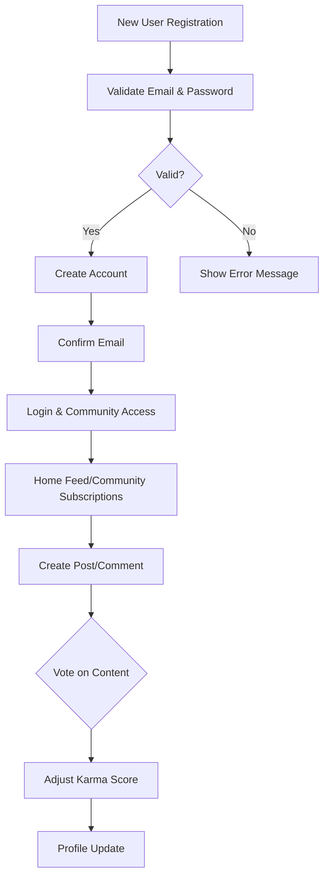
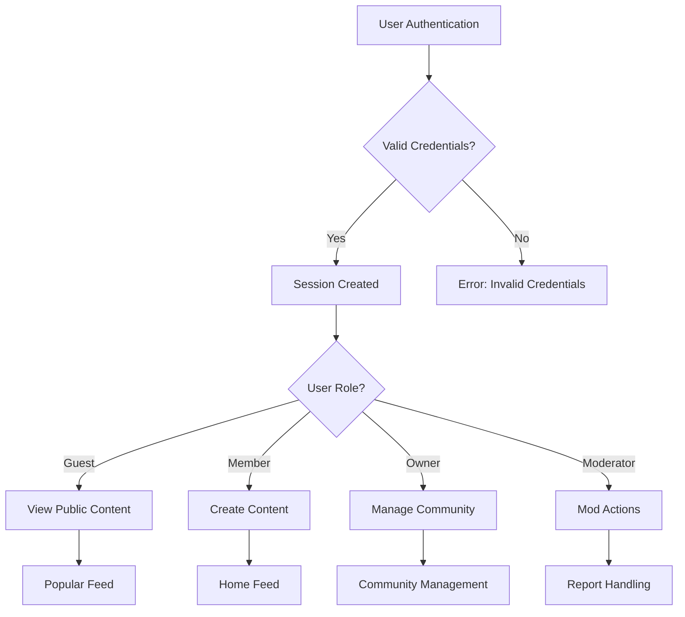

# Community Platform Requirements Specification

## 1. Service Overview

### 1.1 Service Vision
The Community Platform is designed to solve the critical problem of toxic community environments by providing structured, user-controlled online spaces where meaningful discussions thrive. Unlike traditional platforms with unstructured moderation, this service implements proactive community governance through clear ownership structures and a transparent karma system that rewards constructive contributions.

### 1.2 Target Audience
- **Primary Users**: Community creators who want to establish niche spaces around specific interests, hobbies, or professional topics.
- **Secondary Users**: Content consumers who prefer well-moderated communities with meaningful engagement.
- **Role Definitions**:
  - *Guests*: Unauthenticated users browsing public content
  - *Members*: Authenticated users with full participation rights
  - *Owners*: Community creators with complete management authority
  - *Moderators*: Owners-approved users with partial management capabilities

### 1.3 Core Value Proposition
Three integrated pillars drive user value:
1. **Proactive Community Management**: Real-time governance through customizable rules and immediate moderation capabilities
2. **Transparent Incentive System**: Dynamic karma scoring with clear visibility into how scores change based on upvotes, downvotes, and vote removals
3. **Flexible Community Structure**: Support for seamless community creation, subscription, and management with custom identities

## 2. Functional Requirements

### 2.1 User Account Management
- **WHEN** a user registers with email and password, **THEN** the system shall verify email validity and password strength (minimum 12 characters, 1 digit, 1 special character)
- **WHEN** a user attempts to create an account with an email already in use, **THEN** the system shall display a clear error message indicating "Email address already registered"
- **WHEN** a user submits a password change request, **THEN** the system shall require current password verification before accepting new credentials
- **WHEN** a user deletes their account, **THEN** the system shall cascade delete all associated content including posts, comments, and profile data

### 2.2 User Profile Management
- **WHEN** a user updates their display name, **THEN** the system shall restrict to 2-32 characters with no special characters
- **WHEN** a user updates their bio text, **THEN** the system shall limit to 250 characters with no external links allowed
- **WHEN** a user changes their avatar, **THEN** the system shall accept only .jpg, .png, or .gif formats under 5MB
- **WHEN** any user views another user's profile, **THEN** the system shall display:
  - Display name, bio text, and avatar
  - Total karma score
  - List of all posts created (with title, creation date, community)
  - List of all comments made (with content, creation date, post title)

### 2.3 Karma System
- **WHEN** a user upvotes another user's post or comment, **THEN** the author's karma score shall increase by 1
- **WHEN** a user downvotes another user's post or comment, **THEN** the author's karma score shall decrease by 1
- **WHEN** a user removes their vote, **THEN** the system shall retroactively adjust the author's karma by the original vote value
- **WHEN** a user's karma reaches negative values, **THEN** the system shall still display the negative number without restriction
- **WHEN** a karma score changes, **THEN** the system shall update all profile displays immediately

### 2.4 Community Management
- **WHEN** a user creates a new community, **THEN** the system shall require:
  - Unique community name (3-32 characters, letters/digits/special characters)
  - Description (200-2500 characters)
  - Icon image (JPG/PNG/GIF, <=5MB)
- **WHEN** a community is created, **THEN** the creator automatically becomes community owner
- **WHEN** a user browses communities, **THEN** the system shall display:
  - Community name
  - Community description snippet
  - Subscriber count
  - Community icon
- **WHEN** a user searches for communities, **THEN** the system shall allow search by community name with partial matches

### 2.5 Subscription Management
- **WHEN** a user subscribes to a community, **THEN** the system shall add them to the community's subscriber list
- **WHEN** a user unsubscribes from a community, **THEN** the system shall remove them from the subscriber list
- **WHEN** a user views their subscribed communities, **THEN** the system shall display all communities with:
  - Community name
  - Community icon
  - Subscriber count
- **WHEN** a user attempts to create a post in a community without being subscribed, **THEN** the system shall display "You must subscribe to this community to create posts"

### 2.6 Post Management
- **WHEN** a user creates a post, **THEN** the system shall require:
  - Community selection from their subscribed communities
  - Post type selection (text, link, image)
  - For text posts: minimum 5 character content
  - For link posts: valid URL with http/https scheme
  - For image posts: valid image file <=10MB
- **WHEN** a user updates a post, **THEN** the system shall allow editing of content but not type
- **WHEN** a user deletes a post, **THEN** the system shall remove it from all feeds and delete all associated comments
- **WHEN** viewing a single post, **THEN** the system shall display:
  - Title
  - Full content (text for text, URL display for link, image thumbnail for image)
  - Author username
  - Community name
  - Vote score (upvotes minus downvotes)
  - Comment count
  - Creation timestamp with relative time formatting (e.g., "3 hours ago")

### 2.7 Voting System
- **WHEN** a user attempts to vote on a post, **THEN** the system shall allow:
  - Upvote (adds +1 to score)
  - Downvote (adds -1 to score)
  - Vote removal
- **WHEN** a user votes on a post, **THEN** the system shall not allow a second vote of the same type on the same post
- **WHEN** a user changes their vote type, **THEN** the system shall adjust scores accordingly (e.g., upvote to downvote subtracts 2 from score)
- **WHEN** a user views a post's votes, **THEN** the system shall display:
  - Current vote score
  - Upvote count
  - Downvote count

### 2.8 Content Feeds
- **WHEN** a logged-in user accesses Home Feed, **THEN** the system shall display posts only from communities they're subscribed to
- **WHEN** any user accesses Popular Feed, **THEN** the system shall display posts from all communities
- **WHEN** any user accesses Community Feed, **THEN** the system shall display posts from one specific community
- **WHEN** any feed is displayed, **THEN** the system shall support sorting options:
  - *Hot*: Recent posts with high upvote counts
  - *New*: Most recent posts first
  - *Top*: Highest score first (with time filter options)
  - *Controversial*: Posts with many votes but near-zero scores
- **WHEN** a feed is paginated, **THEN** the system shall use standard pagination with 10 items per page

### 2.9 Post Listing Display
**For all feeds**, each post shall show:
- Title
- Author username
- Community name
- Vote score
- Comment count
- Relative time since posted
- Content type indicator:
  - For text posts: first 200 characters of content
  - For image posts: thumbnail image display
  - For link posts: domain name of URL (e.g., "youtube.com")

### 2.10 Comment System
- **WHEN** a user writes a comment, **THEN** the system shall allow comment content with minimum 1 character
- **WHEN** a user replies to a comment, **THEN** the system shall create nested replies with unlimited depth
- **WHEN** a user edits their comment, **THEN** the system shall allow content modification with updated timestamp
- **WHEN** a user deletes their comment, **THEN** the system shall remove it from all views and adjust post comment count
- **WHEN** viewing a post's comments, **THEN** the system shall display:
  - Author username
  - Comment content
  - Vote score
  - Relative time since posted
  - Nested replies structure

### 2.11 Comment Sorting
- **WHEN** viewing comment list, **THEN** the system shall support sorting options:
  - *Best*: Highest score first
  - *New*: Most recent first
  - *Controversial*: Many votes but low score

### 2.12 Moderation System
#### Owner/Moderator Roles
- **WHEN** a user creates a community, **THEN** the system shall make them community owner
- **WHEN** a community owner adds a moderator, **THEN** the system shall add them to the moderator list
- **WHEN** a community owner removes a moderator, **THEN** the system shall remove them from the moderator list
- **WHEN** a moderator attempts to add another moderator, **THEN** the system shall allow it
- **WHEN** a moderator attempts to remove another moderator, **THEN** the system shall deny the request
- **WHEN** a moderator attempts to remove the owner, **THEN** the system shall deny the request

#### Moderator Actions
- **WHEN** a moderator deletes a post, **THEN** the system shall remove it from all feeds and adjust community content metrics
- **WHEN** a moderator deletes a comment, **THEN** the system shall remove it and adjust comment counts
- **WHEN** a moderator bans a user, **THEN** the system shall prevent the user from creating posts/comments in that community
- **WHEN** a user is banned from a community, **THEN** the system shall not show their post/comments in that community's feeds
- **WHEN** a moderator unban a user, **THEN** the system shall restore the user's participation rights in the community
- **WHEN** a moderator views banned users, **THEN** the system shall display list with reason and ban timestamp

### 2.13 Reporting System
- **WHEN** a user reports content, **THEN** the system shall require:
  - Specific reason text (50-500 characters)
  - Contextual description
- **WHEN** a moderator views reports, **THEN** the system shall display:
  - Reported content
  - User who reported it
  - Reason provided
- **WHEN** a moderator approves a report, **THEN** the system shall delete the content and notify the reporting user
- **WHEN** a moderator dismisses a report, **THEN** the system shall retain the content and notify the reporting user
- **WHEN** a report is dismissed, **THEN** the system shall remove it from the moderator's active report list

## 3. Business Rules

### 3.1 Karma Calculation
- **WHEN** a post has 5 upvotes and 2 downvotes, **THEN** the karma score shall be 3
- **WHEN** a user has negative karma, **THEN** the system shall display the negative value without any special formatting
- **WHEN** a user receives a downvote that puts them at -1 karma, **THEN** the system shall update the score immediately

### 3.2 Voting Constraints
- **WHEN** a user attempts to upvote a post they already upvoted, **THEN** the system shall return "You've already upvoted this post"
- **WHEN** a user attempts to change their vote, **THEN** the system shall allow changing upvote to downvote (adjusting score by -2)
- **WHEN** a user removes their vote, **THEN** the system shall adjust the score by the original vote value

### 3.3 Content Display Rules
- **WHEN** displaying a link post, **THEN** the system shall show only the domain name (e.g., "twitter.com" not the full URL)
- **WHEN** displaying the first 200 characters of text content, **THEN** the system shall truncate after 200 characters with ellipsis
- **WHEN** displaying a comment tree, **THEN** the system shall support depth of at least 5 nesting levels

## 4. Security Requirements

### 4.1 Authentication
- **WHEN** a user registers, **THEN** the system shall store password hashes with Bcrypt (cost factor 12)
- **WHEN** a user logs in, **THEN** the system shall issue JWT tokens valid for 7 days
- **WHEN** a session expires, **THEN** the system shall require re-authentication

### 4.2 Data Protection
- **WHEN** a user deletes their account, **THEN** the system shall permanently delete all personal data
- **WHEN** a community owner deletes their account, **THEN** the system shall transfer ownership to a designated next owner

## 5. Performance Requirements

### 5.1 Response Times
- **WHEN** accessing Home Feed, **THEN** the system shall load within 500ms for 100,000 members
- **WHEN** viewing a post with 1,000 comments, **THEN** the system shall display in <2 seconds for 95% of users

### 5.2 Scalability
- **WHEN** the user base grows to 1 million active users, **THEN** the system shall handle 100,000 community posts per day

## 6. Error Handling

### 6.1 Authentication Errors
- **WHEN** invalid credentials are provided, **THEN** the system shall return "Invalid email or password" (without revealing user existence)
- **WHEN** a password reset token expires, **THEN** the system shall return "Reset token expired" and prompt for new request

### 6.2 Content Errors
- **WHEN** a user attempts to post an empty text, **THEN** the system shall return "Content cannot be empty"
- **WHEN** a link post has a URL without a scheme, **THEN** the system shall return "Invalid URL format"

### 6.3 Moderation Errors
- **WHEN** a moderator attempts to delete a post from a non-existent community, **THEN** the system shall return "Community not found"
- **WHEN** a banned user attempts to comment, **THEN** the system shall return "You're banned from this community"

## 7. Mermaid Diagrams

