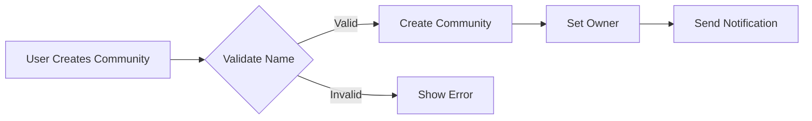

# Community Platform Service Overview

## Business Vision

The Community Platform aims to create a dynamic, inclusive space where users can engage with content that matters to them. Our vision is to become the premier platform for meaningful discussions and community building across diverse interests, replacing fragmented platform experiences with a unified, respectful community space.

## Problem Statement

Current social platforms often prioritize engagement over community health, leading to:

- Toxic discussions and harassment that drive away users
- Lack of meaningful community organization and niceties for shared interests
- Poor content governance where users have little control over what they see
- Fragmentation of users across many platforms that don't connect their interests

Our platform directly solves these frustrations by:

1. Creating structured communities ('subreddits') where users can find their niches
2. Implementing transparent, user-driven content moderation
3. Providing meaningful engagement through karma systems and user profiles
4. Optimizing content organization and discovery through intelligent sorting

## Core Value Proposition

Our platform's unique value comes from the seamless integration of these elements:

- **Community-Centric Structure**: Users organize around verified interests, not just personal connections
- **Inclusive Engagement Model**: Anyone can join and participate, with challenges to toxic behaviors
- **Transparent Governance**: Users can see how content is moderated, not just censored
- **Real User Recognition**: Karma system rewards genuine contribution, not just engagement
- **Intelligent Content Organization**: Personalized sorting by user preference, not just algorithmic manipulation

## Success Metrics

We measure success through these key indicators:

#### Quantitative Metrics
- **User Growth & Engagement**
  - 10,000 active daily users within first 6 months
  - 50% monthly repeat visit rate
  - 15+ minutes average session duration
  - 1.5+ average interactions per user per session

- **Community Health**
  - 70% user retention rate (90+ days active)
  - Less than 5% of content reported as inappropriate
  - 85% of users find community well-managed
  - 20+ community creations per 100 active users

- **Content Quality**
  - 65% positive sentiment in user comments
  - 25% average upvote-to-downvote ratio for content
  - 15+ active discussions per community
  - 3+ unique posts per user per week

#### Qualitative Metrics
- **User Experience**
  - 4.5+ average user satisfaction score (1-5 scale)
  - 90% of users recommend platform to others
  - Clear understanding of platform purpose and community rules

- **Community Perceptions**
  - Users feel their communities are respected
  - Modest dissension breaks down the community in 24 hours
  - Report system is usable for all users

## Business Model

#### Why This Service Exists

The market lacks a platform that effectively balances:

- User anonymity with meaningful community engagement
- Content diversity with healthy moderation
- User convenience with respect for others

Current platforms fail because they:

- Massively monetize through addictive engagement (viral content)
- Prioritize scale over community health (more users, less meaningful interaction)
- Offer poor content governance that discourages participation

Our platform differentiates by providing:

- **Small community focus**: Communities don't grow beyond 500 active members (preventing community fragmentation) 
- **Content moderation that's visible to all users** (reducing perception of unfairness)
- **Transparent karma system** where recognition is based on contribution, not just engagement

#### Revenue Strategy

Our monetization approach focuses on sustainability without compromising the community experience:

- **Free Tier (Core Service)**: Full access to community features, content, and basic engagement
- **Basic Subscription**: $2.99/month for ad-free experience, extra reaction types, and priority chat access
- **Advanced Subscription**: $5.99/month for exclusive communities, special badges, and custom profile sections
- **Community Sponsorship**: $99/month for community owners to host priority events and receive promotion
- **Network Effects**: Revenue grows primarily through user adoption with minimum infrastructure costs

#### Growth Plan

Our growth strategy targets meaningful community development:

1. **Phase 1 (0-6 months)**: 
   - Build community around established interest groups (gaming, books, tech)
   - Achieve target of 5,000 active users through organic community growth
   - Establish initial community moderation framework

2. **Phase 2 (6-18 months)**: 
   - Expand to new interest segments (health, hobbies, local communities)
   - Introduce premium features based on user feedback
   - Grow to 50,000 active users with strong community metrics

3. **Phase 3 (18-36 months)**: 
   - Develop marketplace for community events and resources
   - Explore API for third-party extensions of community features
   - Scale to millions of users with multi-tier subscription model

#### Success Metrics

We align these goals with measurable outcomes:

- **Acquisition Metrics**
  - Organic growth target: 30% of new users come from existing communities
  - 5% increase in user growth month-over-month
  - 15% referral rate from happy users

- **Retention Metrics**
  - 25% of new users active after 30 days
  - 40% of users engage in 2+ communities
  - 50% of engaged users increase activity over time

- **Monetization Metrics**
  - 8% conversion rate from free to basic subscription
  - 2% conversion rate from basic to advanced subscription
  - 15% community sponsor uptake

## User Actor Specification (Business Context for Backend Development)

#### Required Actors from Business Definition

We need three clearly defined user actors to build the full system:

**1. Guest**
- **Description**: Unauthenticated users who can browse public content but cannot create posts, join communities, or interact with the platform beyond viewing.
- **Business Function**: Allows users to experience the platform's value before committing to registration, managing platform presence and initial exposure.

**2. Member**
- **Description**: Authenticated users with full participation rights including creating posts, joining communities, voting, commenting, and managing their profile.
- **Business Function**: Creates active participation in communities, generates content, and drives engagement metrics that make the platform valuable.

**3. Admin**
- **Description**: System administrators with elevated access to moderate content, manage communities, handle reports, and configure global settings.
- **Business Function**: Ensures platform health, maintains community standards, and implements global configuration needed for growth.

#### Actor Permissions Matrix

| Action | Guest | Member | Admin | 
|--------|-------|--------|-------|
| View public content | ✓ | ✓ | ✓ |
| Create new post |  | ✓ | ✓ |
| Join community |  | ✓ | ✓ |
| Leave community |  | ✓ | ✓ |
| Add comments |  | ✓ | ✓ |
| Edit own posts |  | ✓ | ✓ |
| Reply to comments |  | ✓ | ✓ |
| Upvote/downvote |  | ✓ | ✓ |
| Report content |  | ✓ | ✓ |
| View user profile | ✓ | ✓ | ✓ |
| Create new community |  |  | ✓ |
| Manage members |  |  | ✓ |
| Moderate content |  |  | ✓ |
| Configure system settings |  |  | ✓ |

## Critical Workflow Examples (EARS Format)

#### Community Creation Process

**WHEN a member clicks to create a community, THE system SHALL present a form requiring:**
- Community name (5-30 characters)
- Community description (20-200 characters)
- Public visibility toggle
- Moderation rules acceptance

**WHILE the community creation process is active, THE system SHALL:**
- Validate name uniqueness
- Display character count limitations
- Show real-time validation messages
- Prevent community creation if rules not accepted

**IF the community name already exists, THEN THE system SHALL show error message 'Community name already taken. Please choose a different name.'**

**WHEN a community is created successfully, THE system SHALL:**
- Add community to member's list
- Set author as community owner
- Create default moderation rules
- Send notification to creator

#### Content Voting Workflow

**WHEN a user upvotes a post, THE system SHALL:**
- Record vote with timestamp
- Update post karma
- Show voting feedback

**IF a user attempts to upvote the same post again, THEN THE system SHALL prevent duplicate votes and show message 'You can't vote on the same post twice'**

**WHILE the voting process is occurring, THE system SHALL:**
- Animate voting button state
- Update vote count immediately
- Cache updates to prevent duplicate votes

**WHEN more than 500 votes are recorded, THE system SHALL split karma into 1 point per 10 votes to prevent large swing due to single intense vote.

#### Community Moderation Workflow

**WHEN a user submits a report on content, THE system SHALL:**
- Record the report with timestamp
- Specify reporter's identity (for moderation purposes)
- Notify community moderators
- Annotate content with report mark

**IF a report triggers a moderator action, THE system SHALL:**
- Display moderation action log to reporter
- Send notification to original content creator
- Cascade decisions to all viewers of content

**WHILE a report is outstanding, THE system SHALL:**
- Flag content as 'under review'
- Keep content visible by default
- Allow users to continue discussing content
- Prevent user from reporting same content for 24 hours

## Visual Workflow Representation

