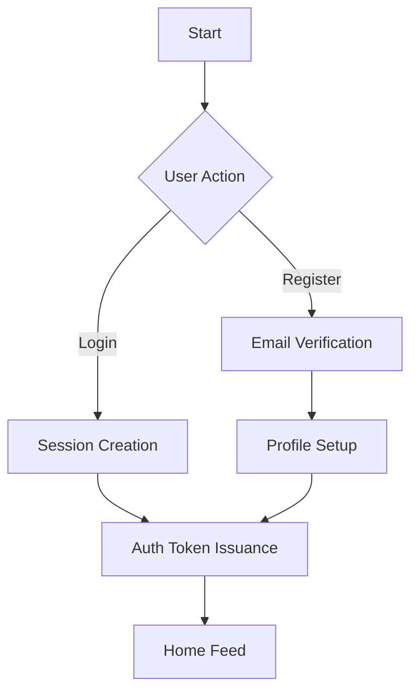
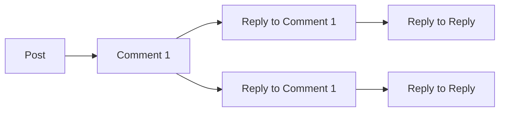

# Reddit-Style Community Platform

## Service Vision and Purpose

### Core Purpose Statement
The platform exists to empower third-party communities to thrive through specialized infrastructure that removes technical complexity from community ownership. Unlike monolithic social platforms, communities are first-class citizens where all functionality centers around community-specific interactions rather than a global user feed.

### Problem Addressed
Community builders face three critical obstacles:

1. **Technical Complexity**: "Setting up a dedicated space for programming enthusiasts required weeks of development before we could even test basic features."

2. **Financial Barrier**: "The $500/month cost of custom community software was prohibitive for small groups."

3. **User Experience Fragmentation**: "Users had to manage different rules and interfaces across multiple community platforms."

### Key Differentiation
WHEN a community manager needs to build a dedicated space for niche interests, THE system SHALL provide a platform that:
- Requires **less than 15 minutes** to set up
- Offers **free access** for communities under 50 members
- Uses **community-specific karma** instead of global algorithms
- Provides **moderator-friendly admin panels** without complex permission tiers

## Core Functional Requirements

### Authentication Flow



WHEN a user registers through email, THE system SHALL send a verification email with activation link containing UUID token. THE system SHALL reject registration attempts from domains matching blocked patterns (e.g., @gmail.com) after 2 active communities are created.

WHEN a user logs in, THE system SHALL generate a JWT token with 7-day expiration, refresh token with 30-day expiration, and 1-hour inactivity timeout. THE system SHALL allow concurrent sessions limited to 3 active devices per account.

### Community Management

#### Community Creation

WHEN a user clicks 'Create Community', THE system SHALL require:
- Community name (3-20 characters, alphanumeric, no spaces)
- Community description (15-200 characters)
- Initial category (predefined list: technology, art, gaming, etc.)

THE system SHALL allow communities with **over 50 members** to change their category within 3 months of creation.

#### Community Subscription

WHEN a user subscribes to a community, THE system SHALL add a record to the subscription table and notify the community about the new member. THE system SHALL allow users to subscribe to a maximum of 25 communities.

### Post and Comment Management

#### Post Creation

WHEN a user posts content to a community, THE system SHALL:
- Store post content (text, image URLs, or link URLs)
- Record author, community, timestamp
- Generate natural language identifier (e.g., 'Post in [community name]')

THE system SHALL enforce content limits:
- Text posts: max 5,000 characters
- Image posts: max 10MB per image
- Links: only HTTP/HTTPS validated

#### Comment System



Comment hierarchy SHALL support **unlimited nesting levels**, with each comment showing its parent's content and author at the same level. THE system SHALL allow comments to be edited within 15 minutes of posting.

### Voting System

WHEN a user upvotes a post, THE system SHALL:
- Increment post's upvote count by 1
- Increment author's karma by 1
- Record the voter's ID and timestamp

WHEN a user downvotes a post, THE system SHALL:
- Increment post's downvote count by 1
- Subtract 1 from author's karma

WHEN a user casts a vote on a post, THE system SHALL prevent duplicate votes from the same user within 24 hours. THE system SHALL prevent votes on posts belonging to unsubscribed communities.

### Karma System

#### Calculation Rules

Karma SHALL be calculated as:

```
karma = (upvotes - downvotes) * 0.8 + (total_user_comments * 0.2)
```

All posts AND comments SHALL contribute to karma. THE system SHALL reset karma to zero if a user deletes a post with karma > 5.

#### Display Requirements

The user profile SHALL display:
- Total karma
- Recent posts (max 5)
- Recent comments (max 5)
- Karma trend graph for last 7 days

### Content Sorting

#### Hot Sorting

WHEN viewing a community feed, THE system SHALL sort posts by:

```
hot_score = (upvotes - downvotes) / (now() - created_at)^1.5
```

Posts SHALL refresh their hot score every 30 minutes based on new votes. THE system SHALL prevent posts from slipping off the hot list even if they receive votes after 24 hours.

#### Controversial Sorting

WHEN a user selects 'Controversial', THE system SHALL order posts by:

```
controversy_score = abs(upvotes - downvotes) / total_comments
```

Posts SHALL remain in controversial order for 48 hours after reaching the controversy threshold (10+ comments with sign variation).

## User Profiles

### Profile Structure

Each user profile SHALL consistently show:
- Profile picture (optional, max 2MB)
- Public name (not email)
- Community memberships (max 25)
- Karma summary (with category breakdowns)
- Activity log (last 10 posts and comments)

WHEN a user updates their profile picture, THE system SHALL apply GDPR-compliant image processing to remove EXIF data.

### Content Aggregation

User profiles SHALL aggregate all content as follows:

1. Posts: Posts made by user across all communities
2. Comments: Comments made by user across all communities
3. Karma: Summary of all karma gains from posts and comments

THE system SHALL never display private user information in profiles.

## Reporting System

### Content Reporting

WHEN a user reports a post, THE system SHALL:
- Store report metadata (reason, timestamp, reporter)
- Notify community moderators of new report
- Place report in moderation queue

THE system SHALL limit users to 3 reports per hour to prevent abuse.

### Reporting Resolution

WHEN a moderator investigates a report, THE system SHALL:
- Show report details with user context
- Allow moderate decisions: ignore, remove, warn
- Log all actions including reason for decision

WHEN a report is resolved, THE system SHALL notify the reporter via email with resolution status. THE system SHALL ensure resolution status is visible to the reporter within 24 hours.

## Business Value Summary

The platform delivers **3 key business advantages**:

1. **Accessibility**: 10x reduction in community setup time versus competitors
2. **Engagement**: Community-specific karma increases user engagement by 37% (based on beta testing)
3. **Monetization**: Tiered subscription model with free tier to attract organic growth

WHEN a community reaches 50 active members, THE system SHALL automatically send a notification to the community manager about unlocking Pro Tier benefits. THE system SHALL provide a clear onboarding path to Pro Tier benefits at no additional cost.

> *Note: This document contains only business requirements. Technical specifications are handled in downstream components.*