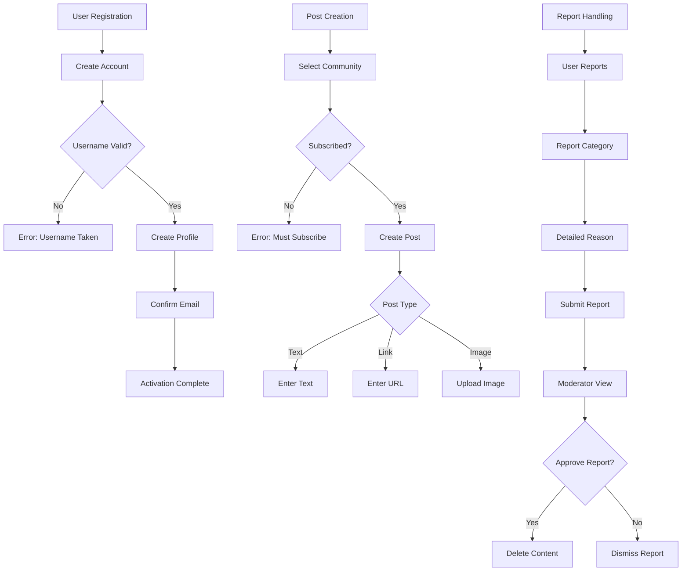

# Reddit-like Community Platform Requirements Specification

## Introduction

The community platform enables users to create, manage, and engage with interest-based communities through structured participation. The system provides a balanced experience between user autonomy and community governance while ensuring technical scalability.

### Business Justification

WHEN users seek online communities for shared interests, THE system SHALL provide a structured platform for meaningful discussions, content sharing, and community building where users can engage without intrusive advertising or algorithmic content curation.

The current market lacks platforms that balance user-driven community growth with robust moderation tools while maintaining user control over their digital space. Unlike established platforms like Reddit, this service eliminates monetization through disruptive advertising, focusing instead on creating an environment where users prioritize content quality over engagement metrics.

## User Account Management

### Core Requirements

WHEN a user registers with email and password, THE system SHALL generate a unique username and store credentials securely with password hashing.

WHEN a user attempts to sign up with an existing username, THE system SHALL return an error message 'Username already in use' within 1 second.

WHEN a user logs in with valid credentials, THE system SHALL create a secure JWT session token and return it to the client.

### Security Compliance

THE system SHALL implement password complexity requirements: minimum 8 characters, one uppercase letter, one special character, and one number.

THE system SHALL protect against brute force attacks by implementing rate limiting (5 failed attempts/hour) with account lockout after 5 attempts.

### Account Termination

WHEN a user requests account deletion, THE system SHALL delete the user's account, all associated posts, and comments within 72 hours.

WHEN a user deletes their account, THE system SHALL remove all references to their content from search results and community members' visible content.

## User Profile System

### Profile Content

WHEN a user creates a profile, THE system SHALL store display name, bio text, and avatar URL while validating:
- Display name must be 2-30 characters
- Bio must be 0-250 characters
- Avatar must be valid image URL

### Profile Presentation

THE system SHALL display all profile data in user profile pages with the following structure:
1. User's display name (bold, largest font)
2. User's bio (under display name)
3. User's avatar (circular, 100x100 pixels)
4. Karma score (number with 'karma' label)
5. 'Posts' section listing all user's posts
6. 'Comments' section listing all user's comments

### Profile Editing

WHEN a user edits their profile, THE system SHALL update the database within 500ms and notify all users who have viewed the profile (via WebSocket updates).

## Karma System

### Calculation Rules

WHEN a user upvotes a post or comment, THE system SHALL increase the author's karma by 1 within 250ms.

WHEN a user downvotes a post or comment, THE system SHALL decrease the author's karma by 1 within 250ms.

WHEN a user removes their vote, THE system SHALL recalculate the author's karma based on the new vote count.

### Display Requirements

THE system SHALL display karma scores with:
- Green font (+) and negative red font (-)
- Current value with 'karma' label
- Historical trend graph (last 30 days) accessible via profile

## Community Management

### Community Creation

WHEN a user creates a community, THE system SHALL generate a unique community slug and store:
- Name (required, 2-50 characters)
- Description (required, 0-500 characters)
- Icon URL (optional, valid image)

THE system SHALL assign the creator as community owner with full control permissions.

### Community Interface

THE system SHALL display community information in all community listings with:
- Community name
- Community description (truncated to 100 characters)
- Subscriber count
- Current community icon

## Subscribing to Communities

### Subscription Logic

WHEN a user subscribes to a community, THE system SHALL store the subscription in the database and notify community owners of new subscribers.

WHEN a user subscribes to a community, THE system SHALL add the community to their subscription list within 200ms.

### Subscription Requirements

THE system SHALL require user subscription to create posts in a community with the message 'You must subscribe to this community to post content' when posting without subscription.

## Post Management

### Post Types

WHEN a user creates a text post, THE system SHALL store the full text content and validate:
- Minimum length 10 characters
- Maximum length 10,000 characters

WHEN a user creates a link post, THE system SHALL extract the domain name from the URL and validate:
- URL must use http or https
- URL must be accessible within 2 seconds

WHEN a user creates an image post, THE system SHALL store the image URL and validate:
- Image must be less than 10MB
- Image must be valid format (jpg, png, gif)

### Post Display Requirements

THE system SHALL display all posts with:
- Title (max 100 characters)
- Author username
- Community name
- Vote score
- Comment count
- Time since posted

### Post Content Truncation

WHEN displaying posts in feeds, THE system SHALL show:
- Text posts: first 200 characters followed by ellipsis
- Image posts: circular thumbnail (100x100 pixels)
- Link posts: domain name (e.g., 'youtube.com')

## Post Voting System

### Voting Rules

WHEN a user upvotes a post, THE system SHALL record the vote and update the post's score within 200ms.

WHEN a user changes their vote from up to down, THE system SHALL adjust the score by -2 (remove 1, add -1) within 200ms.

WHEN a user removes their vote, THE system SHALL adjust the score by -1 (if was upvote) or +1 (if was downvote).

### Voting Limits

THE system SHALL prohibit multiple votes from the same user on the same content with a 'You've already voted' error message.

## Feed Systems

### Feed Configuration

THE system SHALL implement the following feed types:
- Home Feed: requires login, shows content from subscribed communities
- Popular Feed: public, shows all community content sorted by vote score
- Community Feed: public, shows specific community content

### Sorting Options

THE system SHALL provide these sorting options for all feeds:
- Hot: recent posts with high upvoter activity
- New: most recent posts regardless of score
- Top: highest vote scores filtered by time period
- Controversial: high vote counts with scores near zero

### Pagination

THE system SHALL implement 10-post pagination for all feeds with load more button at bottom.

## Moderation System

### Roles

THE system SHALL define three community roles:
- Owner: highest authority, can add/remove moderators and manage community
- Moderator: can moderate content and ban users
- Member: standard user, no moderation capabilities

### Moderator Actions

WHEN a moderator deletes a post, THE system SHALL remove the content from all feeds and notify the author.

WHEN a moderator bans a user, THE system SHALL prevent the user from creating posts or comments in that community while maintaining visibility of content.

### Report Handling

WHEN a user reports content, THE system SHALL record the report with:
- Reported post/comment ID
- Reporter user ID
- Reason text

WHEN a moderator approves a report, THE system SHALL delete the reported content and notify the reporter.

## Reporting System

### User Reporting

WHEN a user reports content, THE system SHALL provide a form where:
- The reporter selects reason (4 categories)
- The reporter writes detailed description
- The reporter receives confirmation

### Moderator Reporting Interface

THE system SHALL provide a dashboard where moderators:
- Can view all reports for the community
- Can approve or dismiss reports
- Can see reporting statistics (daily, weekly)

### Report Resolution

WHEN a moderator dismisses a report, THE system SHALL archive it with 'Report dismissed' status and send notification to reporter.

## Business Process Diagrams

## Success Metrics

THE system SHALL track these primary metrics:
- % of users creating at least one community: 30% target by month 6
- % of communities with active moderators: 85% target by month 3
- % of posts with positive karma: 75% target
- % of reports resolved within 24 hours: 90% target
- Average time to create first community: < 5 minutes target