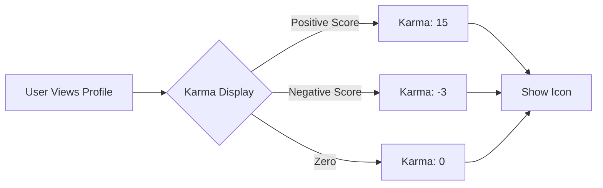
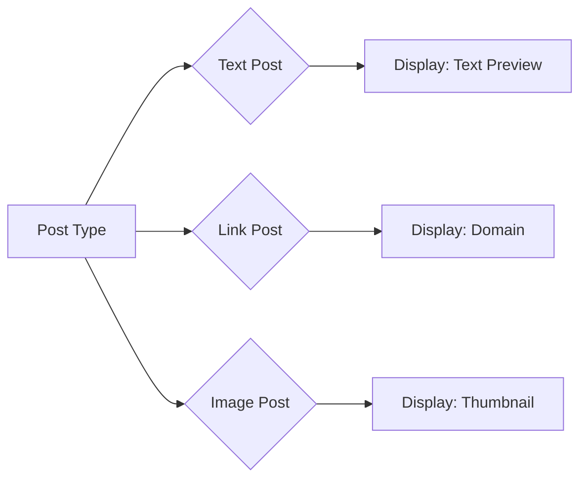
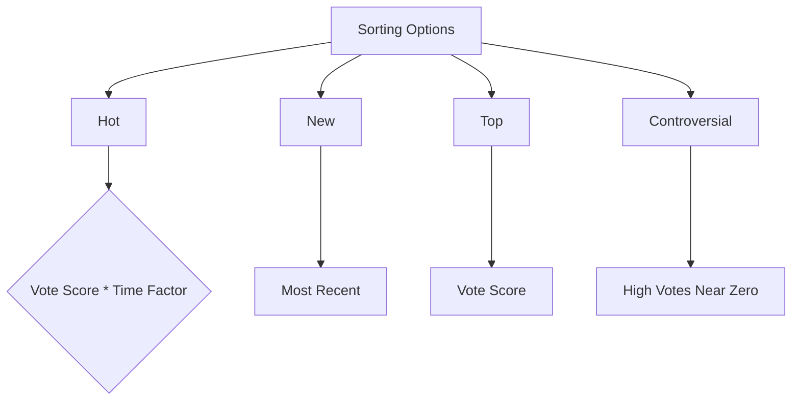
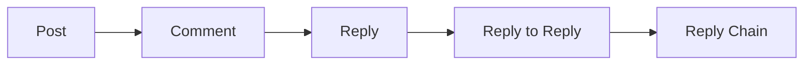
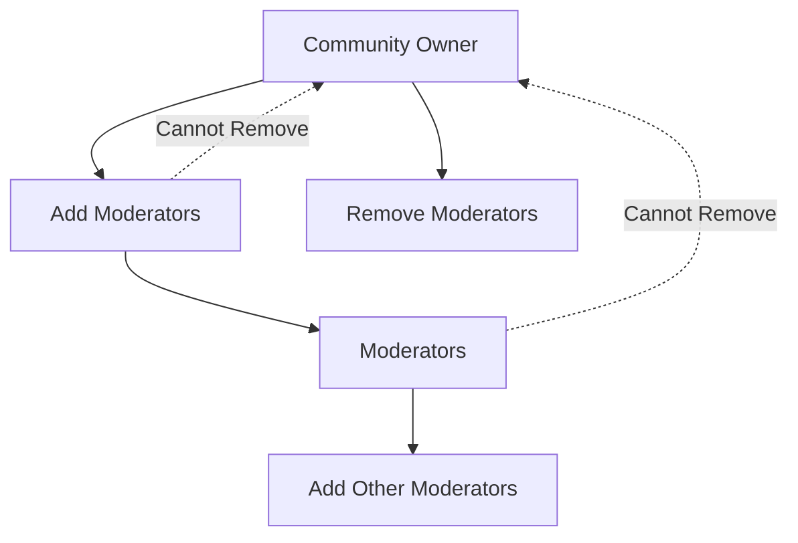

# Reddit Community Platform Requirements Specification

## 1. User Authentication and Management

### User Registration
WHEN a user provides email and password, THEN THE system SHALL:
1. Validate email format using standard regex pattern
2. Verify password strength (min 12 characters, uppercase, lowercase, number, special character)
3. Generate unique username from email prefix (e.g., john@example.com → john123)
4. Store password securely using bcrypt with 12 rounds of hashing
5. Send confirmation email with account activation link

### User Login
WHEN a user submits valid email and password, THEN THE system SHALL:
1. Verify credentials against database
2. Generate access token with 20-minute expiration
3. Generate refresh token with 30-day expiration
4. Return tokens as JSON response
5. Set secure cookies for token storage

### Password Management
WHEN a user requests password change, THEN THE system SHALL:
1. Verify current password
2. Accept new password meeting strength requirements
3. Replace existing password hash with new hash
4. Invalidate all active sessions
5. Send confirmation email of password change

### Account Deletion
WHEN a user deletes their account, THEN THE system SHALL:
1. Verify account ownership via password confirmation
2. Permanently delete all personal data
3. Remove all content created by the user
4. Delete all associated profile information
5. Provide irreversible confirmation message

## 2. User Profiles

### Profile Structure
EVERY user SHALL have:
- Display name (max 30 characters, alphanumeric, spaces)
- Bio text (max 255 characters)
- Avatar image (JPEG/PNG, max 2MB, aspect ratio 1:1)
- Karma score (integer, initially 0)

### Profile Editing
WHEN a member edits their profile, THEN THE system SHALL:
1. Allow changes to display name, bio, and avatar
2. Validate display name against existing usernames
3. Sanitize bio text to prevent HTML injection
4. Store avatar securely in cloud storage
5. Update profile immediately without reload

### Public Profile View
WHEN viewing any user's profile, THEN THE system SHALL display:
- Display name prominently
- Current karma score (e.g., "Karma: 42")
- Bio text below display name
- Avatar image on the left
- List of recent posts (max 5)
- List of recent comments (max 5)

### Profile Display Rules
- IF karma score is negative, display as "Karma: -5"
- IF display name contains special characters, normalize to alphanumeric
- IF bio text exceeds 255 characters, truncate with ellipsis
- Profile updates SHALL be visible to others within 10 seconds

## 3. Karma System

### Karma Calculation
KARMA = TOTAL_UPVOTES - TOTAL_DOWNVOTES

### EARS Requirements
WHEN a user receives an upvote on their post, THEN THE system SHALL increase their karma by 1.
WHEN a user receives a downvote on their post, THEN THE system SHALL decrease their karma by 1.
WHEN a user removes their vote, THEN THE system SHALL adjust karma to previous state.
WHEN a post is deleted, THEN THE system SHALL remove all karma adjustments linked to that post.

### Karma Display

## 4. Community Management

### Community Creation
WHEN a user creates a new community, THEN THE system SHALL:
- Generate unique community ID (comm-[random-uuid])
- Assign creator as owner
- Enforce community name validation (3-25 characters, [a-z0-9_-])
- Set default icon to system placeholder
- Record creation timestamp in ISO 8601 format
- Initialize subscriber count to 0

### Community Attributes
EVERY community SHALL have:
- Unique name (validated during creation)
- Description text (max 500 characters)
- Icon image (JPEG/PNG, max 2MB)
- Subscriber count (integer, increment on subscription)

### Community Search
WHEN searching for communities, THEN THE system SHALL:
1. Return communities matching search query
2. Display results ordered by relevance
3. Show subscriber count for each community
4. Allow filtering by name
5. Return max 50 results per page

## 5. Subscription System

### Subscription Rules
WHEN a member attempts to subscribe to a community, THEN THE system SHALL:
1. Verify user is authenticated
2. Check if community exists
3. Verify user is not already subscribed
4. Add community to subscription list
5. Increment community subscriber count

### Unsubscription Rules
WHEN a member unsubscribes from a community, THEN THE system SHALL:
1. Verify community exists
2. Verify user is subscribed
3. Remove community from subscription list
4. Decrement community subscriber count
5. Confirm action to user

### Subscription Impact
WHEN a user is not subscribed to a community, THEN THE system SHALL:
- Prevent post creation in that community
- Hide community from home feed
- Display 'Subscribe' button on community page
- Show subscriber count as 'X members' (e.g., '142 members')

## 6. Post Management

### Post Creation Requirements
WHEN creating a new post, THEN THE system SHALL:
1. Require title (max 100 characters)
2. Verify community subscription
3. Validate post type:
   - Text posts: min 10 characters, max 10,000 characters
   - Link posts: valid URL starting with http:// or https://
   - Image posts: valid image file (JPEG/PNG/GIF, max 4096px width)
4. Set initial vote score to 0
5. Record creation timestamp

### Post Types

### Post Display Rules
WHEN viewing posts in feeds, THEN THE system SHALL:
- Show title, author, community, vote score
- For text posts: first 200 characters + ...
- For link posts: domain name (e.g., 'youtube.com')
- For image posts: thumbnail preview
- Show time since posted (e.g., '3 hours ago')
- Limit to 20 posts per feed page

## 7. Voting System

### Post Voting
WHEN a user votes on a post, THEN THE system SHALL:
1. Validate user is authenticated
2. Verify user hasn't voted already
3. Prevent voting on own posts
4. Record vote (up/down)
5. Update vote score immediately

### Vote Change Rules
WHEN changing vote on a post, THEN THE system SHALL:
- If up → down: change = -2 (remove +1, add -1)
- If down → up: change = +2 (remove -1, add +1)
- If vote removed: revert to previous score
- Display changed score instantly to all users

### Vote Display
THE system SHALL display vote scores as integer values (e.g., '5 karma') without additional text.

## 8. Feed Systems

### Home Feed
WHEN a user is logged in, THEN THE system SHALL:
- Show posts from subscribed communities
- Sort by 'Hot' (default) by combining vote score and recency
- Limit to 20 posts per page
- Update automatically as new posts are created

### Popular Feed
WHEN any user accesses the platform, THEN THE system SHALL:
- Show posts from all communities
- Sort by 'Top' (default) by vote score
- Refresh content every 5 minutes
- Display upvote/downvote counts for all posts

### Community Feed
WHEN a user views a community, THEN THE system SHALL:
- Show all posts from that community
- Include community description and subscriber count
- Allow selection of sort options (Hot, New, Top, Controversial)

### Sorting Methods

## 9. Comments System

### Comment Creation
WHEN a user creates a comment, THEN THE system SHALL:
1. Validate content (min 10 characters, max 500 characters)
2. Prevent posting if content contains prohibited keywords
3. Attach comment to parent post
4. Set creation timestamp
5. Allow unlimited reply depth

### Nested Reply Structure

### Reply Constraints
- Maximum reply depth of 10 levels
- Replies visible only to community members
- Nested replies ordered chronologically
- Parent comment content visible above replies

## 10. Moderation System

### Role Hierarchy

### Moderation Actions
WHEN a moderator deletes content, THEN THE system SHALL:
- Remove content from all feeds
- Adjust author's karma as follows:
  - FOR each upvote: karma -= 1
  - FOR each downvote: karma += 1
- Record deletion in moderation log
- Send notification to content creator

### Ban Management
WHEN a user is banned from a community, THEN THE system SHALL:
- Prevent post/comment creation
- Display 'You have been banned' message
- Store ban reason and timestamp
- Allow reinstatement at any time by moderator

## 11. Reporting System

### Reporting Workflow
WHEN a user reports content, THEN THE system SHALL:
1. Require report reason (min 20 characters, max 500 characters)
2. Store report with content ID and community ID
3. Notify community moderators
4. Track report status (Pending, Approved, Dismissed)
5. Send resolution notification to reporter

### Resolution Rules
WHEN a report is approved, THEN THE system SHALL:
- Delete reported content
- Notify reporter of resolution
- Update moderation log
- Apply ban if specified

WHEN a report is dismissed, THEN THE system SHALL:
- Keep content
- Notify reporter
- Mark report as dismissed
- Apply no additional action

## 12. System Reliability

### Performance Requirements
- All feeds shall load within 2 seconds
- Comments shall render within 1 second for 100+ comments
- Vote updates shall happen in <200ms
- All requests shall maintain 99.9% uptime

### Security Requirements
- Passwords shall be hashed using bcrypt
- All API endpoints shall validate authentication
- Session tokens shall expire after 20 minutes of inactivity
- All user data shall be encrypted at rest

### Business Value Summary
This specification creates a scalable, secure platform where:
- Users grow into active participation through well-defined role progression
- Communities foster engagement through subscription and moderation features
- Content quality is maintained through karma and voting systems
- Moderation tools provide community owners with necessary control
- Reporting mechanisms ensure community safety

> *This document defines business requirements only. All technical implementations are at the discretion of the development team.*