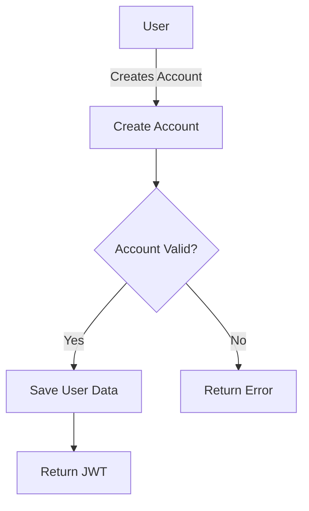
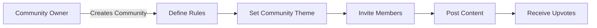

# Reddit-like Community Platform Requirements

## Service Overview

This platform enables community-driven content sharing with user-controlled communities, transparent karma systems, and robust moderation capabilities. It provides three core feed types (Home, Popular, Community) with customizable sorting options to deliver personalized content experiences while maintaining strict community ownership and control.

## User Actors

- **Guest User**: View content without authentication
- **Signed-in User**: Create and manage content, interact with communities
- **Community Owner**: Full control over community settings, moderation
- **Community Moderator**: Assist owner with content moderation

## Business Model Requirements

WHEN a user encounters an unmoderated community with toxic behavior, THE platform SHALL provide a clear community moderation interface to the owner without requiring technical knowledge.
WHEN a user joins a community without clear guidelines, THE platform SHALL require community owners to define basic rules before content can be posted.
THE platform SHALL maintain a focus on niche interest communities rather than broad social networks.

## User Account Requirements

### Registration

WHEN a user provides valid email and password, THE platform SHALL create a new account with a unique username derived from the username field (if available) or a default pattern.
WHEN account creation fails due to duplicate email, THE platform SHALL return "Email already registered" error within 2 seconds.

### Login

WHEN a user submits email and password, THE platform SHALL authenticate and return a JWT token valid for 24 hours.
WHEN login credentials are invalid, THE platform SHALL return "Invalid email or password" error without disclosing which field was incorrect.

### Password Change

WHEN a user submits current password and new password, THE platform SHALL update the password only if current password matches.
WHEN password reset request is approved, THE platform SHALL send verification email within 5 seconds containing a time-limited link.

### Account Deletion

WHEN a user deletes their account, THE platform SHALL permanently remove all personal data including posts, comments, and profile information within 24 hours.
WHEN an account is deleted, THE platform SHALL automatically unsubscribe the user from all communities.

## User Profile Requirements

### Profile Creation

WHEN a user creates an account, THE platform SHALL initialize an empty profile with default avatar.
WHEN a user updates their display name, THE platform SHALL validate it against a minimum length of 3 characters and maximum of 30 characters.

### Profile Display

WHEN viewing another user's profile, THE platform SHALL display: display name, bio, avatar, total karma, and activity history.
WHEN a profile has no bio, THE platform SHALL display "No bio provided" instead of an empty field.

### Profile Management

WHEN a user updates their profile, THE platform SHALL save the changes and update the cached copy within 500 milliseconds.
WHEN an avatar image is uploaded, THE platform SHALL generate three versions (thumbnail, medium, full) within 1 second.

## Karma System Requirements

### General Rules

THE platform SHALL maintain a single karma score for each user, stored as an integer.
WHEN a user upvotes a post or comment, THE user's karma SHALL increase by 1.
WHEN a user downvotes a post or comment, THE user's karma SHALL decrease by 1.

### Vote Changes

WHEN a user changes their vote from upvote to downvote, THE platform SHALL adjust karma by -2 (remove 1 point for canceling upvote, add 1 point for new downvote).
WHEN a user removes their vote, THE platform SHALL adjust karma by ±1.

### Display Requirements

WHEN viewing a user profile, THE platform SHALL display current karma score as a number with appropriate labels (e.g., "Karma: +42").
WHEN karma is negative, THE platform SHALL display it with a minus sign and no additional formatting.

## Communities Requirements

### Community Creation

WHEN a user creates a new community, THE platform SHALL validate community name against minimum length of 3 characters and maximum of 50 characters.
WHEN a community name is taken, THE platform SHALL return "Community name already exists" error.

### Community Display

WHEN browsing communities by name, THE platform SHALL show matching results in alphabetical order with search results updated in real-time as the user types.
WHEN a community has 0 subscribers, THE platform SHALL display "No subscribers" instead of zero.

### Community Ownership

THE community creator SHALL automatically be the owner with full administrative rights.
THE platform SHALL prevent users from creating more than 5 communities without admin approval.

## Posts Requirements

### Post Creation

WHEN a user creates a post in a subscribed community, THE platform SHALL verify community subscription status.
WHEN a post is created as text, THE platform SHALL limit content to 5000 characters.

### Post Types

A post SHALL be one of three types: Text, Link, or Image.

**Text Post Requirements**:
- MUST have title and content
- Content SHALL be between 5 and 5000 characters

**Link Post Requirements**:
- MUST have title and URL
- URL SHALL be valid and use standard domains

**Image Post Requirements**:
- MUST have title and image
- Image SHALL be in JPG, PNG, or GIF format with maximum size of 10MB

### Post Display

WHEN viewing a post, THE platform SHALL display: title, full content, author, community, vote score, comment count, and timestamp.
WHEN viewing a text post in a feed, THE platform SHALL display first 200 characters of content.
WHEN viewing an image post in a feed, THE platform SHALL display a thumbnail version of the image.
WHEN viewing a link post in a feed, THE platform SHALL display the domain name of the URL.

## Post Voting Requirements

### Voting Rules

WHEN a user casts a vote on a post, THE platform SHALL ensure they haven't already voted.
WHEN a user changes their vote, THE platform SHALL recalculate the vote score immediately.

### Score Calculation

THE vote score SHALL equal total upvotes minus total downvotes.
WHEN a post has negative score, THE platform SHALL display it as a negative number.

## Post Feeds Requirements

### Home Feed

THE home feed SHALL show posts from communities the user is subscribed to.
THE home feed SHALL require user to be logged in.

### Popular Feed

THE popular feed SHALL show posts from all communities.
THE popular feed SHALL be accessible to everyone, including guests.

### Community Feed

THE community feed SHALL show posts from a specific community.
THE community feed SHALL be accessible to everyone.

### Sorting Options

All feeds SHALL support sorting by:
- **Hot**: Recent posts with high upvotes appear first
- **New**: Most recently created posts appear first
- **Top**: Highest vote score first with time filter options
- **Controversial**: Highest vote count with score close to zero

### Pagination

ALL feeds SHALL implement pagination supporting page and size parameters.
THE page parameter SHALL default to 1 and size parameter SHALL default to 20.

## Comments Requirements

### Comment Creation

WHEN a user writes a comment, THE platform SHALL validate comment text (5-5000 characters).
WHEN a comment is created, THE platform SHALL associate it with the correct post and parent comment (if replying).

### Comment Display

WHEN viewing a post's comments, THE platform SHALL display top-level comments first.
WHEN viewing nested comments, THE platform SHALL show reply threads with proper indentation.

### Nested Comments

Replies CAN have unlimited levels of nesting.
WHEN a user replies to a comment, THE platform SHALL create a new reply object linked to the parent.

## Comment Voting Requirements

### Voting Rules

Same as post voting rules.

### Sorting

Comments SHALL support sorting by:
- **Best**: Highest vote score first
- **New**: Most recent first
- **Controversial**: Highest vote count with score close to zero

## Community Moderation Requirements

### Moderator Roles

THE community creator SHALL be the owner (highest authority).
THE owner SHALL add moderators.
MODERATORS can add other moderators.
MODERATORS cannot remove the owner.

### Moderator Actions

WHEN a moderator deletes a post, THE platform SHALL remove it from all feeds and reduce the author's karma by 1.
WHEN a user is banned, THE platform SHALL prevent them from creating posts or comments in the community.
WHEN a banned user requests unban, THE platform SHALL notify the owner.

## Reporting Requirements

### Report Submission

WHEN a user reports a post or comment, THE platform SHALL require a reason text (minimum 10 characters).
WHEN a report is submitted, THE platform SHALL notify the community owner.

### Report Management

MODERATORS can view all reports for their community.
WHEN a moderator approves a report, THE platform SHALL delete the content and notify the reporter.
WHEN a report is dismissed, THE platform SHALL remove it from the moderator's report list.

## User Interface and Experience Requirements

### Mobile Responsiveness

THE platform SHALL be fully responsive across all device sizes (mobile, tablet, desktop).
THE mobile view SHALL prioritize core features with minimal scrolling required.

### Performance Requirements

All feed requests SHALL load within 1.5 seconds under normal conditions.
Post creation SHALL complete within 1 second on average.

## Security and Privacy Requirements

### Authentication Security

JWT tokens SHALL expire after 24 hours of inactivity.
Password storage SHALL use bcrypt with cost factor 12.

### Privacy Protection

Account deletion SHALL permanently remove all personal data within 24 hours.
Public profile information SHALL not include email addresses.

## Error Handling Requirements

### User-Friendly Messages

All error messages SHALL be clear and actionable to the user.
ERROR: Invalid community name SHALL specify "Community name must be 3-50 characters, alphanumeric only, no spaces".

### API Error Codes

The platform SHALL use standard HTTP status codes:
- 400 for validation errors
- 401 for authentication errors
- 403 for authorization errors
- 404 for resource not found
- 500 for server errors

## Mermaid Diagrams

## Business Rules Summary

- All karma calculations must be accurate with immediate updates
- Community creation is limited to 5 communities per user without admin approval
- Comment nesting has no depth limits
- Post types have strict content constraints
- Moderation capabilities follow a clear ownership hierarchy
- Reporting system requires written justification

## Technical Architecture Principles

- All endpoints SHALL follow RESTful conventions
- Authentication SHALL use JSON Web Tokens (JWT)
- Data validation SHALL be performed on both client and server
- All database operations SHALL be transactional
- Error handling SHALL comply with RFC 7807 HTTP Problem Details

## Compliance Requirements

- Must comply with GDPR for user data handling
- All content must adhere to community guidelines
- Platform must maintain audit trail for moderation actions
- User data must be stored with adequate encryption at rest

## Success Metrics

- Minimum DAU/MAU ratio of 0.3 within first 6 months
- Average of 3+ comments per post
- Premium conversion rate of at least 5% among active users
- Revenue per user (RPU) of $0.20 within first year of monetization

## Value Proposition

The platform delivers value through:

1. **Community Ownership** - Unique community creation process with complete administrative control
2. **Transparent Karma** - Simple, visible score that directly rewards valuable contributions
3. **User-Controlled Ads** - Communities approve their own ad placements
4. **Low Friction Onboarding** - 3-step community creation that requires minimal setup