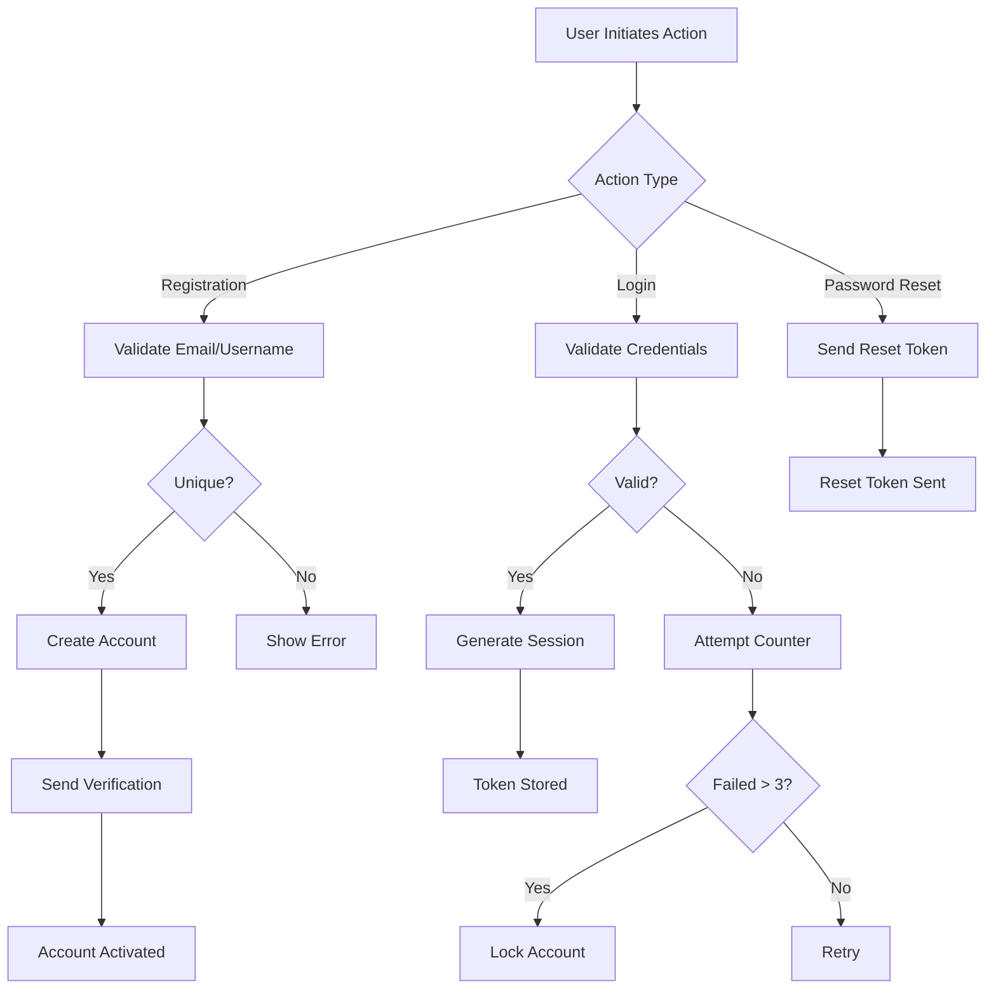

# Reddit-like Community Platform Requirements Specification

## 1. User Account Management

### Authentication Requirements

WHEN a user initiates registration, THEN the system SHALL require a unique email address, password with minimum 8 characters (including at least 1 special character), and username with minimum 3 characters.

IF the email address is already registered, THEN the system SHALL reject registration and display the error message "Email already in use."

IF the username is already taken, THEN the system SHALL reject registration and display "Username is already taken."

WHEN a user submits login credentials, THEN the system SHALL validate credentials against the database and return a session token if valid.

IF a user enters an incorrect password, THEN the system SHALL increment a failed login counter and deny access after 3 consecutive failures, displaying "Too many failed attempts - please try again in 15 minutes."

WHEN a user requests a password change, THEN the system SHALL generate a time-limited reset token and send it to the user's email.

WHEN a user confirms password change via reset link, THEN the system SHALL update the password and invalidate all active sessions for that user.

WHEN a user requests account deletion, THEN the system SHALL permanently remove all associated data including posts, comments, karma, and profile information without any possibility of recovery.

### Session Management

WHEN a user logs in successfully, THEN the system SHALL create a secure session and return an access token (15-minute validity) and refresh token (7-day validity) stored in HTTP-only cookies.

WHEN a session token expires, THEN the system SHALL prompt for re-authentication after 15 minutes of inactivity.

WHEN a user logs out, THEN the system SHALL invalidate the session token and delete the cookie, requiring re-authentication on next access.

## 2. User Profile & Karma

### Profile Requirements

WHEN a user creates a profile, THEN the system SHALL assign a default avatar and allow customization of display name, bio (max 300 characters), and profile picture.

WHEN a user edits their display name, bio, or avatar, THEN the system SHALL validate the changes and update the profile.

WHEN a user views another user's profile, THEN the system SHALL display: display name, bio, avatar, total karma, posts count, and comments count.

### Karma System

WHEN a user receives an upvote on a post or comment, THEN the system SHALL increase their karma score by 1.

WHEN a user receives a downvote on a post or comment, THEN the system SHALL decrease their karma score by 1.

WHEN a user's vote on content is modified (upvote to downvote or vice versa), THEN the system SHALL adjust their karma by 2 (e.g., +2 for downvote to upvote).

WHEN a user's post or comment is deleted, THEN the system SHALL revert all karma changes from that content and associated votes.

WHEN a user's karma score reaches negative values, THEN the system SHALL maintain consistent display without restrictions or special handling.

Karma SHALL be displayed as integer values with no additional formatting or symbols.

## 3. Community System

### Community Creation

WHEN a user creates a new community, THEN the system SHALL require: unique name (alphanumeric + _-), description (max 300 characters), and optional icon.

THE system SHALL generate a URL identifier using the community name (e.g., "programming-enthusiasts" for "Programming Enthusiasts").

WHEN a community name conflicts with an existing community, THEN the system SHALL display an error: "Community name already exists. Please choose a different name."

THE system SHALL automatically assign the creator as the community owner (highest authority).

### Community Subscription

WHEN a user views a community page, THEN the system SHALL display a subscription button.

WHEN a user subscribes to a community, THEN the system SHALL add them to the community's member list.

WHEN a user subscribes to a community, THEN the system SHALL display their community in the Home Feed.

WHEN a user attempts to create a post in a community they're not subscribed to, THEN the system SHALL deny the request and display "You must be subscribed to this community to post."

## 4. Post & Comment Management

### Post Creation Requirements

WHEN a member creates a post in a subscribed community, THEN the system SHALL validate the community subscription status.

WHEN a post title exceeds 100 characters, THEN the system SHALL display "Title must be no longer than 100 characters."

WHEN a text post exceeds 2,000 characters, THEN the system SHALL display "Text content cannot exceed 2,000 characters."

WHEN an image upload exceeds 5MB, THEN the system SHALL display "Image must be less than 5MB."

WHEN a user creates a post, THEN the system SHALL generate a vote score (initially 0) and track the post in community feeds.

### Post Editing Rules

WHEN a user edits their post within 24 hours of creation, THEN the system SHALL permit edits.

WHEN a user attempts to edit a post after 24 hours, THEN the system SHALL display "Posts can only be edited within 24 hours of creation."

WHEN a user changes post type (e.g., image to text), THEN the system SHALL automatically adjust content fields and prompt for re-submission.

### Comment Management

WHEN a user posts a comment, THEN the system SHALL validate comment length (max 500 characters).

WHEN a user replies to a comment, THEN the system SHALL create a new comment with parent reference and limit nesting to 10 levels.

WHEN a comment has replies, THEN deletion of the parent comment SHALL not affect child comments.

## 5. Voting System

### Post & Comment Voting

WHEN a user upvotes a post or comment, THEN the system SHALL increment the vote score by 1 and update the author's karma.

WHEN a user downvotes a post or comment, THEN the system SHALL decrement the vote score by 1 and update the author's karma.

WHEN a user modifies their vote, THEN the system SHALL adjust karma appropriately and update the vote score immediately.

WHEN a user removes their vote, THEN the system SHALL adjust karma based on the previous vote.

### Voting Limitations

WHEN a user attempts to vote on their own content, THEN the system SHALL prevent the vote and display "You cannot vote on your own content."

WHEN a guest user attempts to vote, THEN the system SHALL prompt for registration.

When voting within communities, THEN the system SHALL prevent voting on posts in communities where the user is not subscribed.

## 6. Feed Management

### Feed Types and Access

**Home Feed**: Available ONLY to logged-in users, displaying posts from their subscribed communities.
**Popular Feed**: Available to all users (logged-in or not), displaying posts from all communities.
**Community Feed**: Available to all users, displaying posts from a specific community.

### Feed Sorting Mechanics

**Hot**: Ordered by (upvotes - downvotes) ÷ recency, prioritizing recent posts with many upvotes.
**New**: Ordered by post creation time (newest first).
**Top**: Ranked by vote score (highest first), with optional time filters (today, week, month, year).
**Controversial**: Prioritized with high vote count but score near zero (abs(score) > 2, total votes > 5).

### Pagination and Display

WHEN displaying feeds, THEN the system SHALL show 20 posts per page with navigation controls.

FOR text posts in feeds, THEN the system SHALL display first 200 characters followed by "...".

FOR image posts in feeds, THEN the system SHALL display a scaled-down thumbnail.

FOR link posts in feeds, THEN the system SHALL display the domain name (e.g., "youtube.com").

## 7. Moderation & Reporting

### Community Moderation

WHEN a community owner adds a moderator, THEN the system SHALL assign moderation permissions and send confirmation email.

WHEN a moderator deletes content, THEN the system SHALL update karma scores and log moderation actions.

WHEN a community owner bans a user, THEN the system SHALL prevent them from posting in that community and display ban details.

### Reporting System

WHEN a user reports content, THEN the system SHALL require a category (inappropriate content, spam, hate speech, etc.) and optional comments.

WHEN a report is approved, THEN the system SHALL delete the content and add 1 karma point to the reporter.

WHEN a report is dismissed, THEN the system SHALL not alter karma and notify the reporter.

MODERATORS SHALL view reports with filtering by status and community.

## 8. Business Impact

This community platform model creates a decentralized social experience where:
- Users engage deeply with content aligned to specific interests
- Communities reduce information overload and increase content relevance
- Karma system provides transparent reputation metrics without feature restrictions
- Moderation enables healthy community health without platform-level moderation

### Success Metrics

- Community creation: 10+ new communities/day after initial launch
- Subscriber growth: 50+ subscribers/community after 30 days
- Engagement rate: 75% of subscribers interact with community content within one week
- Content quality: 85% of reported content requires moderation action

# Mermaid Diagram: User Authentication Flow

