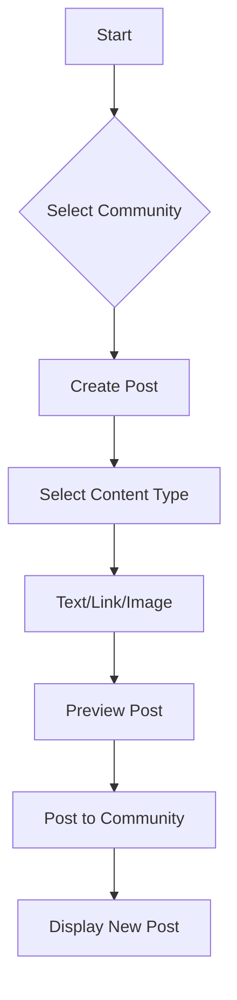

# Reddit-like Community Platform Requirements Analysis

## Service Overview

A Reddit-like community platform enabling users to join, create, and participate in topic-based communities with rich content interaction features. The platform prioritizes intuitive user interaction, content discovery, and community health management.

### Core Value Proposition

The service provides a structured yet flexible platform for community-driven discussions where users can:
- Create and join topic-focused communities
- Share content (text, links, images) with rich interactive features
- Engage through voting, commenting, and karma-based reputation
- Explore content via multiple sorting mechanisms
- Report inappropriate content for moderation

### Target Audience

- General internet users seeking structured discussion spaces
- Content creators looking for niche communities
- Moderators managing community content
- Platform administrators handling system-wide operations

## Business Model

### Why This Service Exists

Current social platforms either lack community structure or over-complicate content creation. This platform focuses on *structured community engagement* as the primary value driver, making it ideal for niche topic discussions while maintaining scalability.

### Revenue Strategy

- Freemium model with core features free for all users
- Premium subscription for advanced analytics and custom community branding ($4.99/month)
- Sponsored community placements for verified brands
- API access for third-party integrations ($0.01/request)

### Success Metrics

- User acquisition: 10,000 active users in first 6 months
- Community growth: 50 new communities per week
- User engagement: 15% daily active user rate
- Quality: Less than 1% content reported as inappropriate

## User Actors and Permissions

### Primary User Roles

| Role | Description | Permissions |
|---|---|---|
| `user` | Regular authenticated community member | Post, comment, upvote, report, subscribe |
| `communityAdmin` | Community-specific moderator | Moderate posts, manage members, create content |
| `siteAdmin` | System-wide administrator | Full system access, analytics, user management |

### Critical Permission Rules

WHEN a user attempts to create a community, THE system SHALL verify:
1. User has karma score >= 10
2. User has not created more than 3 communities
3. Token is valid and not compromised

IF any rule is violated, THEN THE system SHALL display error message specific to the violated rule.

## Core Functional Requirements

### User Registration and Login

WHEN a user registers, THE system SHALL:
- Collect email, password (min 8 chars), and username
- Send verification email with 24-hour expiration
- Return "Account verification required" message

WHEN a user logs in, THE system SHALL:
- Validate credentials against hashed password data
- Generate JWT token with 15-minute expiration
- Return user role and permissions in token payload

### Content Creation and Management

WHEN a user creates a post, THE system SHALL:
- Store post content (text/link/image)
- Associate with selected community
- Generate unique post ID (POST-{random 8 chars})
- Initialize upvote/downvote counters

WHEN a user edits a post, THE system SHALL:
- Verify user owns post
- Allow edits within 24 hours of creation
- Record edit history for moderation

### Community Management

WHEN a user creates a community, THE system SHALL:
- Validate community name for uniqueness
- Assign creating user as first community admin
- Set default moderation settings (public community)
- Add to user's profile subscriptions

WHEN a user subscribes to a community, THE system SHALL:
- Add to user's active subscriptions
- Configure notification preferences
- Subscribe user to relevant activity feeds

## Post and Comment System

### Post Creation Flow



### Comment System and Hierarchy

The comment system enables unlimited nesting of replies with the following requirements:

WHEN a user posts a comment, THE system SHALL:
- Store parent comment ID for hierarchical reference
- Initialize comment upvote/downvote counters
- Notify post creator of new comment

WHEN a user replies to a comment, THE system SHALL:
- Store parent comment ID
- Track full reply path (e.g., top-level comment → reply → reply to reply)

## Upvote/Downvote Mechanics

Karma points are calculated using the following business rules:

1. **Base Points**: +1 for each upvote, -1 for each downvote
2. **Post Quality Bonus**: +2 if post has >5 comments
3. **Comment Quality Bonus**: +1 for each helpful comment
4. **Karma Decay**: Daily decay of 0.5% for inactive accounts

WHEN a user upvotes a post, THE system SHALL:
- Update karma for post author
- Prevent same user from voting again on same item
- Record the vote in audit log

## Sorting and Filtering

### Hot Sorting Logic

Hot sorting prioritizes recent content with positive engagement:

```
hot_score = (votes) / (time_since_creation ^ 1.8)
```

WHEN sorting by "hot", THE system SHALL:
- Calculate hot score for all posts
- Order by highest score first
- Include posts created within last 24 hours

### Top Posts Logic

WHEN sorting by "top", THE system SHALL:
- Calculate total upvotes - total downvotes
- Order posts by descending net score
- Include only valid posts (not deleted/hidden)

## Authentication Flow

### Security Requirements

1. Session timeout after 30 minutes of inactivity
2. 5 failed login attempts trigger 15-minute lockout
3. JWT token validity period: 15 minutes
4. Refresh tokens with 7-day validity
5. Password hashing using Bcrypt (rounds=12)

## User Profiles

### Profile Requirements

THE user profile SHALL display:
- Current karma score (total and real-time change)
- Number of communities created
- Number of posts (total and recent 3)
- Number of comments (total and recent 3)
- Latest community activity timeline

WHEN viewing another user's profile, THE system SHALL:
- Hide email addresses
- Show only public profile information
- Display karma history (last 30 days)

## Karma System

### Core Calculation

Karma reflects community contribution value:

```
karma = (upvotes - downvotes) + (2 * communities_created) + (5 * exceptional_content) + (1 * helpful_comments)
```

### Threshold Rules

- **Karma < 10**: Cannot create communities
- **Karma >= 10**: Can create communities
- **Karma >= 200**: Can moderate communities
- **Karma >= 500**: Can create site-wide features

WHEN user meets threshold, THE system SHALL:
- Update permission profile automagically
- Send notification about new capabilities
- Display badge in profile interface

## Reporting System

### Content Reporting Flow

WHEN a user reports content, THE system SHALL:
- Save report with timestamp and reason
- Notify community admin for that community
- Hide content from public view (not deleted)
- Set content status to "pending review"

WHEN a report reaches 3+ reports, THE system SHALL:
- Automatically hide content
- Send moderator alert with resolution options
- Begin review process in moderation queue

### Moderation Requirements

WHEN community admin reviews reported content, THE system SHALL:
- Show report history and user context
- Provide resolution options (delete, hide, warning)
- Log all moderation actions in audit trail

## Merchandising Requirements

### Premium Features for $$$

- **Custom Branding**: Set community logo and theme
- **Analytics**: View community activity metrics (posts, engagement)
- **Ad Placement**: Sponsored posts in community feed
- **Priority Support**: 24-hour response time for moderator issues

WHEN a user upgrades to premium, THE system SHALL:
- Verify payment through Stripe API
- Update user token with premium status
- Enable premium features immediately
- Send confirmation email with premium features list

## Success Metrics Implementation

### Tracking Requirements

MEASUREMENT: Daily active users (DAU)
METHOD: Track unique user sessions with 24-hour window

MEASUREMENT: Community health score
METHOD: Calculate as (pleasant_content / total_content) * 100

MEASUREMENT: User engagement
METHOD: Track posts/comments made per user per week

## Quality Requirements

- All API responses must be in JSON format
- Response with 200 status OK for successful operations
- Error codes must follow standard HTTP status codes
- All user-facing messages must be in English 'en-US'
- Performance: API response time < 300ms for 95% of requests

## Implementation Notes

This document establishes the authoritative requirements specification for development. All downstream phases (Database, Interface, Test, Realize) will use this as the foundation. The full context including dated analysis files and version history is available for reference during implementation.