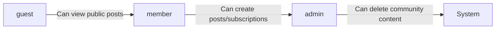
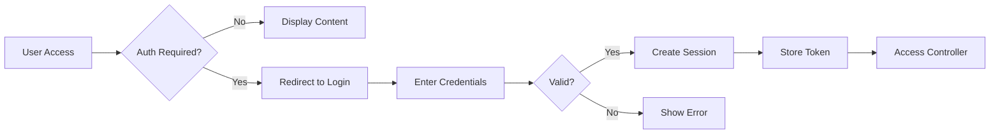

# User Actor Requirements

## Business Context

This document defines the actor structure for the community platform. The platform serves as a digital space where users can form and participate in communities centered around shared interests. The primary user groups are defined by their access levels, capabilities, and permissions within the platform.

## Actor Hierarchy

### Root User Types

The platform supports three fundamental user types that form the complete actor hierarchy:

| Actor Type       | Description                                      | Business Role              |
|------------------|--------------------------------------------------|----------------------------|
| guest            | Unauthenticated users who can browse public content but cannot interact beyond viewing | Public visitors            |
| member           | Authenticated users with full participation rights | Active community users       |
| admin            | System administrators with elevated moderation and configuration access | Platform content managers  |

### Actor Relationship Mapping

The relationship between actor roles forms the complete permission structure:



## Authentication Requirements

### Core Authentication Functions

All authorization decisions are based on the following authentication pathways:

- Guests can access the public homepage and browse public content without any authentication
- Members can access their profile, create communities, post content, and interact with community features
- Admins can access a control panel for moderation, community management, and system configuration

### Authentication Flow Requirements

#### Registration Process

**WHEN a user provides valid registration information, THE system SHALL create a new account and send a confirmation email.**

**WHEN a user submits registration credentials, THE system SHALL require email verification before the account becomes active.**

**WHEN email verification fails after five attempts, THE system SHALL disable the registration attempt and block the email address for 24 hours.**

#### Login Process

**WHEN a guest attempts to perform any action requiring authentication, THE system SHALL redirect to the login page.**

**WHEN login credentials are submitted, THE system SHALL validate the credentials against the database.**

**WHEN all validation steps succeed, THE system SHALL generate a secure JWT token for the session.**

**WHEN the JWT token expires, THE system SHALL redirect to the login page and require re-authentication.**

#### Logout Process

**WHEN a user triggers logout, THE system SHALL invalidate the session token and clear all authentication data.**

**WHEN session is invalidated, THE system SHALL display a confirmation message and redirect to the homepage.**

### Session Management Requirements

- **Session Types**:
  - JWT tokens are used for standard authorization
  - Sessions expire after 15 minutes of inactivity
  - Token refreshes occur automatically via refresh tokens

- **Token Requirements**:
  - Access tokens expire after 30 minutes
  - Refresh tokens expire after 7 days
  - Token storage uses httpOnly cookies for maximum security

- **Token Payload Structure**:
  ```json
  {
    "userId": "string",
    "role": "member",
    "permissions": ["create-post", "upvote"],
    "exp": 1735689600
  }
  ```

#### Session Flow



## Permission Matrix 

### Business Permissions Requirements

The table below defines the precise permissions for each actor type.

| Feature                     | guest | member | admin |
|-----------------------------|-------|--------|-------|
| Browse public content       | ✅    | ✅     | ✅    |
| Create new community        | ❌    | ✅     | ✅    |
| Post text, links, or images | ❌    | ✅     | ✅    |
| Upvote/downvote posts       | ❌    | ✅     | ✅    |
| Comment on posts            | ❌    | ✅     | ✅    |
| Nested replies              | ❌    | ✅     | ✅    |
| View user karma             | ✅    | ✅     | ✅    |
| Sort content                | ✅    | ✅     | ✅    |
| Subscribe to communities    | ❌    | ✅     | ✅    |
| View user profiles          | ✅    | ✅     | ✅    |
| Report content              | ❌    | ✅     | ✅    |
| Edit own posts              | ❌    | ✅     | ✅    |
| Delete own posts            | ❌    | ✅     | ✅    |
| Modify community settings   | ❌    | ❌     | ✅    |
| Delete community content    | ❌    | ❌     | ✅    |
| Manage user accounts        | ❌    | ❌     | ✅    |
| View moderation reports     | ❌    | ❌     | ✅    |

### Permission Logic 

**WHEN a guest attempts to perform any action requiring authentication, THE system SHALL deny access and show a message: 'Please sign in to continue.'**

**WHEN a member attempts to perform an action outside their permission set, THE system SHALL deny access and show a message: 'You do not have permission for this action.'**

**WHEN an admin attempts to perform a system configuration action, THE system SHALL confirm the action through a secondary approval step.**

## User Incident Handling

### Authentication Error Scenarios

**WHEN login credentials are invalid after three attempts, THE system SHALL lock the account for 15 minutes.**

**WHEN a user's account password is expired, THE system SHALL require a password reset before successful login.**

**WHEN a user attempts to tolerate higher session permissions, THE system SHALL fail the request with a 403 Forbidden error.**

### Session Error Scenarios

**WHEN a session token is invalid or expired, THE system SHALL return a 401 Unauthorized error with detailed reason.**

**WHEN a session is logged out, THE system SHALL remove the session from the active session list immediately.**

**WHEN multiple device logins are detected for the same account, THE system SHALL send a notification to the user and allow rejecting new sessions.**

## Performance Requirements

- The authentication process must complete within 2 seconds for 99% of valid authentication requests
- Session validation must occur within 200 milliseconds
- API requests with valid authentication tokens must complete within 1 second
- Token generation must complete within 500 milliseconds
- The system should handle 50 concurrent authentication flows per second

## Business Justification for Actor Structure

The actor structure represents a critical business requirement aligned with our revenue model. Guests represent potential users who can be converted to members through a successful onboarding experience. Members represent the engaged user base that generates content, drives platform activity, and creates value for advertisers. Admins represent our platform's content governance infrastructure, ensuring community quality and reducing support costs.

### Success Metrics

- **User Conversion Rate**: (Guest-to-Member conversion) Target: 25% within 30 days
- **Activity Rate**: (Daily Active Members) Target: 50% of registered members active on platform
- **Security Rating**: (Authentication failure rate) Target: < 0.1%
- **Session Stability**: (Session expiration rate) Target: < 1% of user sessions expire within 30 minutes

## Development Team Note

> *Developer Note: This document defines **business requirements only**. All technical implementations (architecture, APIs, database design, etc.) are at the discretion of the development team.*