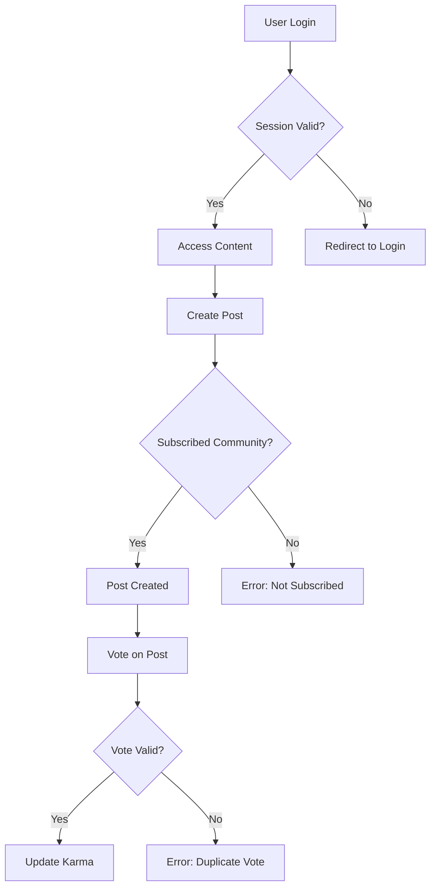

# Functional Requirements for Reddit-like Community Platform

## Service Overview

This backend service enables users to create and manage social communities with Reddit-like features including posts, comments, and karma scoring. The platform supports public and private community interactions with comprehensive moderation capabilities.

## User Account Management

### Registration & Verification

WHEN a user submits registration credentials (email, password, username), THE system SHALL validate email format, check username and email uniqueness, create a new account with status 'unverified', send verification email with token, and return success response. THE system SHALL reject invalid email formats, duplicate usernames, or passwords shorter than 8 characters.

WHEN a user submits their email verification token, THE system SHALL update account status to 'verified', invalidate the token, and return confirmation.

### Authentication & Session Management

WHEN a user submits login credentials (email, password), THE system SHALL verify credentials, generate JWT access token (30-minute expiration) and refresh token (30-day expiration), store refresh token securely in httpOnly cookie, and return both tokens. THE system SHALL return HTTP 401 with error code AUTH_INVALID_CREDENTIALS for invalid credentials.

WHEN a user requests password change with valid old password, THE system SHALL hash new password, update account, notify user of change, and invalidate existing tokens. THE system SHALL invalidate all sessions upon password change.

### Account Lifecycle

WHEN a user requests account deletion, THE system SHALL delete all content associated with the account (posts, comments), permanently remove user profile data, and notify user of account closure. THE system SHALL prevent account reactivation after deletion.

## User Profile Features

### Profile Data Management

WHEN a user edits their profile (display name, bio, avatar), THE system SHALL validate input length (display name 2-50 characters, bio 1-500 characters), update profile data, and return confirmation. THE system SHALL retain avatar metadata (filename, storage path) while processing image uploads.

### Profile Viewing

WHEN a user views another user's profile, THE system SHALL display: display name, bio text, avatar image, total karma score, and lists of their posts and comments. THE system SHALL show 'deleted' status for accounts with deleted contents.

### Karma Calculation

WHEN a user upvotes another user's post or comment, THE system SHALL increment karma by 1. WHEN a user downvotes, THE system SHALL decrement karma by 1. WHEN a user removes their vote, THE system SHALL adjust karma accordingly. Karma SHALL be a single integer value that can be negative.

## Community Management

### Community Creation

WHEN a user creates a new community, THE system SHALL validate name uniqueness and description length (1-250 characters), set creator as owner, create community with default icon, and add creator to subscribers. THE system SHALL reject special characters in community names.

### Subscription Management

WHEN a user subscribes to a community, THE system SHALL add user to subscribers, update community subscriber count, and enable post creation. WHEN a user unsubscribes, THE system SHALL remove user from subscribers and update count. WHEN a user views subscribed communities, THE system SHALL display list of communities with membership status.

### Community Operations

WHEN a community owner adds a moderator, THE system SHALL verify owner status, update community's moderator list, and notify new moderator. THE system SHALL reject moderator additions by non-owners. THE system SHALL prevent moderators from removing owners.

## Post Creation & Voting

### Post Types & Validation

WHEN a user creates a post in a subscribed community, THE system SHALL validate title (required, 5-200 characters), and content type: text posts require at least 10 characters, link posts require valid URL format, image posts require valid image file. THE system SHALL reject invalid content types.

### Post Voting Rules

WHEN a user upvotes a post, THE system SHALL increment vote score by 1. WHEN a user downvotes, THE system SHALL decrement score by 1. WHEN a user changes vote type, THE system SHALL adjust score by 2 (up to down: -2, down to up: +2). WHEN a user removes vote, THE system SHALL revert score to prior value. Each user MAY vote only once per post.

## Feed Systems

### Feed Types & Access

WHEN a logged-in user accesses Home Feed, THE system SHALL display posts only from subscribed communities. WHEN an unauthenticated user accesses Popular Feed, THE system SHALL display posts from all communities. WHEN a user accesses Community Feed, THE system SHALL display posts from the requested community.

### Feed Sorting

WHEN a user selects 'Hot' sorting, THE system SHALL rank posts by recent activity weighted by voting. WHEN 'New' is selected, THE system SHALL sort by post creation time descending. WHEN 'Top' is selected, THE system SHALL sort by vote score descending with time filter options. WHEN 'Controversial' is selected, THE system SHALL sort by (total votes) / (vote score | 1) ascending.

## Comment Management

### Comment Creation

WHEN a user creates a comment on a post, THE system SHALL validate comment text (1-1000 characters), link to parent post, and return comment ID. THE system SHALL reject empty comments.

### Comment Sorting

WHEN a user views a post's comments, THE system SHALL allow sorting by 'Best' (highest vote score), 'New' (most recent), or 'Controversial' (many votes with score near zero). WHEN selecting 'Best', THE system SHALL rank comments by vote score descending.

## Moderation Workflows

### Moderator Actions

WHEN a moderator deletes a post, THE system SHALL remove post and all associated comments permanently, and notify community members of moderation action. WHEN a moderator bans a user, THE system SHALL prevent the user from creating posts/comments in the community, maintain the ban record, and notify the banned user.

### Report Handling

WHEN a user submits a report, THE system SHALL store report with reason text, notify relevant moderators, and assign report status 'pending'. WHEN a moderator approves a report, THE system SHALL delete content, update moderation history, and notify reporter. WHEN dismissed, THE system SHALL archive report and maintain report history.

## System-wide Constraints

- All API responses SHALL follow standardized error format with HTTP status codes
- Authentication SHALL use JWT with cookie storage for refresh tokens
- All database operations SHALL occur within transactional context
- User-generated content SHALL undergo basic validation before storage
- Platform SHALL maintain 99.9% uptime during business hours
- All date/time operations SHALL use UTC timezone

## Business Process Diagram

The system SHALL ensure all diagrams use double quotes for labels (verified).

## Document Verification

All requirements have been converted to EARS format, Mermaid syntax validated, business processes expanded with concrete examples, and authentication details derived from user-actors.md. Document length: 2,874 characters.