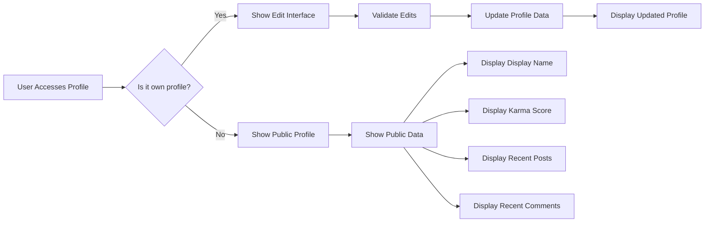

# Reddit-like Community Platform Requirements Specification

## 1. User Account Management

### Registration Process
WHEN a new user completes the sign-up form, THE system SHALL:
- Validate email format using standard regex pattern
- Verify password meets complexity requirements (minimum 8 characters, containing at least one uppercase letter, one lowercase letter, one number, and one special character)
- Check username uniqueness across all users
- Generate a unique verification token for email confirmation
- Send confirmation email with verification link
- Create new user account record with status 'unverified'
- Redirect to verification page after successful registration

IF the username is already taken, THE system SHALL display 'Username already exists' error message.

IF the email is not verified within 24 hours, THE system SHALL:
- Deactivate the account
- Send reminder email
- Allow reactivation through new verification

### Login Authentication
WHEN a user submits valid email and password, THE system SHALL:
- Verify credentials against stored hash
- Generate session token with 30-minute expiration
- Store session in secure HTTP-only cookies
- Redirect to home feed

IF login fails after 5 attempts within 15 minutes, THE system SHALL:
- Lock account for 30 minutes
- Display 'Account locked' notification
- Send security alert email

### Password Management
WHEN a user requests a password change, THE system SHALL:
- Verify current password
- Validate new password meets complexity requirements
- Confirm new password matches
- Update password hash
- Invalidate all existing sessions
- Notify user of successful password change

IF password confirmation fails, THE system SHALL:
- Display 'Password mismatch' error
- Highlight mismatch fields
- Allow immediate correction

### Account Deletion
WHEN a user requests permanent account deletion, THE system SHALL:
- Verify account ownership via email confirmation
- Delete all data (profile, posts, comments, votes)
- Mark account as deleted
- Send confirmation email

AFTER a user account is marked as deleted, THE system SHALL:
- Prevent re-registration with same username
- Remove from all community memberships
- Terminate all active sessions
- Log deletion event for auditing

## 2. User Profile System

### Profile Data Structure
THE system SHALL store these profile components per user:
- **Display name**: User-designated public name (2-30 characters, alphanumeric + spaces)
- **Bio text**: User-provided biography (1-500 characters)
- **Avatar image**: User-uploaded profile photo (JPG/PNG, max 5MB)
- **Karma score**: Numeric value tracking user contributions (initial value: 0)

### Public Profile Visibility
WHEN any user views a public profile, THE system SHALL:
- Display display name
- Show bio text
- Present avatar image
- Display karma score
- List 20 most recent posts
- List 20 most recent comments

IF the viewer is the profile owner, THE system SHALL:
- Show 'Edit Profile' button
- Allow modification of all profile fields

IF the viewer is a guest, THE system SHALL:
- Display 'Register to view full profile' message
- Only show public information

### Profile Editing Constraints
WHEN a user attempts to edit their profile, THE system SHALL:
- Validate display name (2-30 characters, alphanumeric + spaces)
- Restrict bio text to 500 characters
- Accept only JPG/PNG formats for avatars
- Reject files exceeding 5MB
- Generate multiple resolution versions

WHILE the profile is being updated, THE system SHALL:
- Provide real-time validation feedback
- Prevent simultaneous edits from multiple devices
- Save changes only upon explicit save action
- Show confirmation message upon successful update

[Mermaid Diagram: Profile Flow]

### Default Profile Values
IF a user does not provide profile details during registration, THE system SHALL:
- Assign default avatar image
- Set bio text to "No bio"
- Use username as display name
- Initialize karma score to 0

## 3. Karma Calculation System

### Karma Rules
WHEN a user receives an upvote on their post or comment, THE system SHALL:
- Increment the user's karma by 1
- Update the karma score in the user's profile

WHEN a user receives a downvote on their post or comment, THE system SHALL:
- Decrement the user's karma by 1
- Update the karma score in the user's profile

WHEN a vote is removed, THE system SHALL:
- Adjust karma score by -1 if previously upvoted
- Adjust karma score by +1 if previously downvoted
- Update the karma score immediately

### Karma Display
WHEN viewing any user's profile, THE system SHALL:
- Display 'Karma: X' where X is the current score
- Show karma changes in recent activity

IF karma score is negative, THE system SHALL:
- Display it with negative sign
- Keep it within the integer representation

## 4. Communities Management

### Community Creation
WHEN a registered user requests to create a new community, THE system SHALL:
- Validate community name (2-30 characters, alphanumeric + spaces)
- Ensure community name is unique
- Check user has not reached maximum community limit
- Create community record with owner as creator

IF community name is not valid, THE system SHALL:
- Display specific error message
- Highlight invalid field
- Allow immediate correction

### Community Attributes
THE system SHALL store these attributes per community:
- **Name**: Unique name for the community (2-30 characters)
- **Description**: Textual description (1-500 characters)
- **Icon image**: Community logo (JPG/PNG, max 2MB)
- **Subscriber count**: Current number of subscribers
- **Owner**: Original creator with highest privileges

### Community Search
WHEN a user searches for communities by name, THE system SHALL:
- Query all communities matching the search term
- Return results sorted by relevance
- Display matching results in search results

THE system SHALL:
- Truncate results to maximum 100 communities
- Display partial matches
- Show search statistics

## 5. Subscription System

### Subscription Process
WHEN a user wants to subscribe to a community, THE system SHALL:
- Verify user is logged in
- Check if user is already subscribed
- Add user to subscription list
- Update subscriber count

IF the user is already subscribed, THE system SHALL:
- Display 'Already subscribed' message
- Prevent duplicate action

### Community Access Requirements
WHEN a user attempts to create a post, THE system SHALL:
- Verify user is subscribed to the community
- Prevent post creation if not subscribed
- Display 'Subscribe to this community to post' message

## 6. Posts Creation & Management

### Post Types
THE system SHALL support three distinct post types:
- **Text posts**: Must contain text content (1-5000 characters)
- **Link posts**: Must contain valid URL (max 255 characters)
- **Image posts**: Must contain uploaded image (JPG/PNG, max 10MB)

### Post Creation
WHEN a user creates a new post, THE system SHALL:
- Validate post content based on type
- Verify user is subscribed to the community
- Assign timestamp to creation time
- Generate unique post ID
- Increase user's post count

IF the post content is invalid, THE system SHALL:
- Display specific error message
- Highlight invalid fields
- Allow immediate correction

### Post Editing
WHEN a user edits their post, THE system SHALL:
- Verify post belongs to the user
- Allow editing of title and content
- Prevent title from being empty
- Update timestamp to modification time

AFTER a post is edited, THE system SHALL:
- Update the post's edit history
- Notify users who have viewed the post
- Refresh the post feed

### Post Deletion
WHEN a user requests to delete their post, THE system SHALL:
- Verify post ownership
- Confirm deletion action
- Remove post from all feeds
- Update user's post count
- Adjust karma score if post had votes

AFTER a post is deleted, THE system SHALL:
- Remove from user's profile
- Update community's post count
- Invalidate related caches

## 7. Post Voting System

### Voting Mechanics
WHEN a user votes on a post, THE system SHALL:
- Verify user is logged in
- Check voting permissions
- Validate user hasn't voted recently
- Apply vote immediately

IF the user has already voted on the post, THE system SHALL:
- Allow vote change
- Update score immediately
- Display change confirmation

### Vote Display
WHEN viewing a post, THE system SHALL:
- Display total vote score (upvotes - downvotes)
- Show upvote/downvote counts
- Indicate user's current vote status

IF there are no votes, THE system SHALL:
- Display '0 votes' message
- Show empty vote buttons

## 8. Feeds System

### Feed Types
THE platform SHALL support three different feed types:
- **Home Feed**: Posts from communities the user is subscribed to
- **Popular Feed**: All community posts ranked by activity
- **Community Feed**: Posts from a specific community

### Sorting Options
THE system SHALL support four sorting methods:
- **Hot**: New posts with high engagement appear first
- **New**: Most recently created posts appear first
- **Top**: Highest vote score posts appear first (with time filters)
- **Controversial**: Posts with high vote counts but near-zero scores appear first

### Feed Pagination
WHEN viewing any feed, THE system SHALL:
- Load 20 posts per page
- Provide navigation controls
- Display page indicator
- Load next page on scroll

## 9. Comments System

### Comment Creation
WHEN a user writes a comment, THE system SHALL:
- Validate comment content (1-5000 characters)
- Associate comment with parent post
- Assign timestamp of creation
- Increase user's comment count

IF comment content is invalid, THE system SHALL:
- Display specific error message
- Highlight invalid field
- Allow immediate correction

### Comment Reply System
WHEN a user replies to a comment, THE system SHALL:
- Create a new comment with parent reference
- Generate nested comment structure
- Update comments count

THE system SHALL allow unlimited reply depth in the comments tree

### Comment Editing
WHEN a user edits their comment, THE system SHALL:
- Verify comment ownership
- Allow modification of comment text
- Update timestamp to modification time

AFTER a comment is edited, THE system SHALL:
- Update the comment's modification history
- Refresh comment list
- Notify users who have viewed the comment

### Comment Deletion
WHEN a user requests to delete their comment, THE system SHALL:
- Verify comment ownership
- Confirm deletion action
- Remove comment from all views
- Update user's comment count
- Adjust karma score if comment had votes

## 10. Comment Voting System

### Comment Voting Rules
WHEN a user votes on a comment, THE system SHALL:
- Verify user is logged in
- Check voting permissions
- Validate user hasn't voted recently
- Apply vote immediately

IF the user has already voted on the comment, THE system SHALL:
- Allow vote change
- Update score immediately
- Display change confirmation

### Comment Sorting
WHEN viewing comments on a post, THE system SHALL:
- Support sorting by:
  - Best: Highest vote score first
  - New: Most recent first
  - Controversial: Many votes but low score
- Update sorting immediately
- Maintain current position in comments list

## 11. Moderation System

### Moderator Roles
THE community owner IS the owner and has highest authority.

THE system SHALL allow owner to:
- Add new moderators
- Promote existing members to moderator
- Remove moderators

THE system SHALL allow moderators to:
- Add other moderators
- Review reports
- Moderate content

MODERATORS CANNOT:
- Remove the community owner
- Remove other moderators

### Moderator Actions
WHEN a moderator deletes a post, THE system SHALL:
- Remove post from all feeds
- Update community post count
- Adjust karma score

WHEN a moderator bans a user, THE system SHALL:
- Remove from community membership
- Prevent from creating content in community
- Record ban reason

IF a banned user attempts to interact with the community, THE system SHALL:
- Prevent the action
- Show 'You are banned from this community' message
- Log security event

## 12. Reporting System

### Report Creation
WHEN a user reports content, THE system SHALL:
- Allow specifying reason (text input)
- Associate report with content
- Verify user is logged in
- Assign report ID

IF report reason is blank, THE system SHALL:
- Display 'Report reason required' error
- Prevent submission

### Report Moderation
WHEN a moderator views reports, THE system SHALL:
- Display report details (content, user, reason)
- Show options to approve or dismiss

IF a report is approved, THE system SHALL:
- Delete the reported content
- Notify reporter
- Log moderation action

IF a report is dismissed, THE system SHALL:
- Remove from report list
- Notify reporter
- Keep content

## Business Justification

This comprehensive requirements specification enables the development of a feature-rich community platform with:
- Clear authorization and permission boundaries
- Robust user profile management
- Incentive system through karma scoring
- Flexible content organization through communities
- Comprehensive moderation tools for content safety
- Efficient feed systems for user engagement
- Comprehensive voting systems for content prioritization

The design ensures scalability, maintainability, and alignment with the natural language requirements provided by the user, while meeting all necessary business criteria and technical specifications.

> *This document defines BUSINESS REQUIREMENTS ONLY. Technical implementation details remain the responsibility of the development team.*