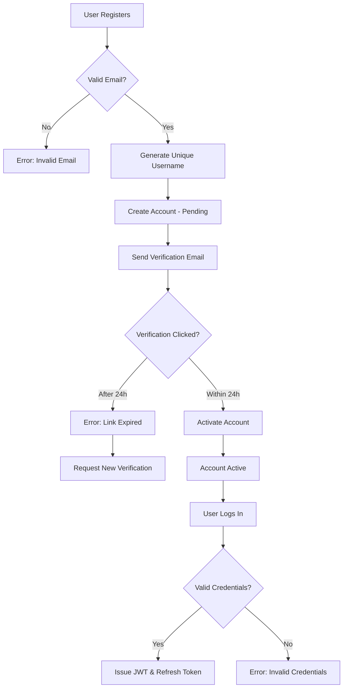
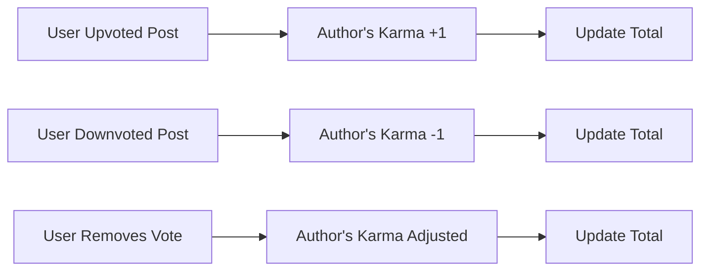

# Reddit-like Community Platform Requirements

## User Account

### Core Business Rules

WHEN a user attempts to register, THE system SHALL validate the email format, generate a unique username, and create an account in the system with pending verification status.
WHEN registration is submitted, THE system SHALL send a verification email with a unique time-limited link.
IF the email format is invalid, THEN THE system SHALL display a specific error: "Please enter a valid email address including @ and a domain name."
WHEN the verification link is clicked within 24 hours, THE system SHALL activate the account and confirm email verification.
IF the verification link expires, THEN THE system SHALL display: "Link has expired. Please request a new verification email."

WHEN a user submits login credentials, THE system SHALL verify email and password using bcrypt-hashed values.
IF credentials are invalid, THEN THE system SHALL display: "Invalid email or password. Please try again."
WHEN authentication succeeds, THE system SHALL issue a JWT access token valid for 30 minutes and a refresh token valid for 7 days stored in httpOnly cookie.
IF the user remains inactive for 15 minutes, THEN THE system SHALL automatically log out the user.

WHEN a user requests password change, THE system SHALL require current password verification before accepting new password.
IF the current password is incorrect, THEN THE system SHALL display: "Current password is incorrect. Please try again."
WHEN password is updated, THE system SHALL rehash the new password and invalidate existing sessions.

WHEN a user requests account deletion, THE system SHALL require multi-step confirmation:
1. Display all content associated with the account
2. Confirm deletion of all posts/comments
3. Final confirmation prompt
IF confirmed, THEN THE system SHALL delete the account and all associated data, while maintaining deletion records for 30 days.

### Authentication Workflow

## User Profile

### Business Requirements

WHEN a user views their profile, THE system SHALL display:
- Custom display name
- Bio text with max 500 characters
- Avatar image in JPEG/PNG format
- Total karma score
- List of all posts they've created
- List of comments they've written

WHEN a user edits their profile, THE system SHALL allow:
- Changing display name (must be unique across all users)
- Updating bio text (maximum 500 characters)
- Uploading avatar image (max 5MB, supported formats)
- All edits to be saved immediately with confirmation message.

WHEN another user views a profile, THE system SHALL show:
- Publicly viewable profile information
- Total karma score
- List of posts and comments (with date and content summary)

## Karma System

### Core Business Rules

WHEN a user upvotes a post, THE system SHALL increase the author's karma by 1.
WHEN a user downvotes a post, THE system SHALL decrease the author's karma by 1.
WHEN a user removes their vote, THE system SHALL adjust karma based on vote type.
THE system SHALL allow karma to be negative.

WHEN viewing karma, THE system SHALL show:
- Current total score
- Breakdown of upvotes vs downvotes
- Time when karma was last updated

### Calculation Workflow

## Communities

### Community Creation

WHEN a user creates a community, THE system SHALL:
- Validate community name uniqueness
- Store provided description text
- Save icon image (max 2MB, supported formats)
- Assign creator as community owner
- Create initial subscriber list including creator

WHEN browsing communities, THE system SHALL display:
- Community name
- Description text (short summary)
- Icon image (if available)
- Subscriber count

### Community Subscription

WHEN a user subscribes to a community, THE system SHALL add community to user's subscriptions.
WHEN unsubscribing, THE system SHALL remove from user's subscriptions.

USER SHALL NOT be able to create posts in a community without being subscribed.

### Community Moderation Roles

WHEN a community creator adds a moderator, THE system SHALL:
- Validate user has permission
- Record new moderator role
- Allow new moderator to perform moderation actions
WHEN a moderator is removed, THE system SHALL:
- Allow only owner to perform removal
- Notify removed moderator
- Prevent removed moderator from performing moderation actions

## Posts

### Post Creation

WHEN a user creates a post in a subscribed community, THE system SHALL:
- Validate title (required, max 100 characters)
- Validate post type (text, link, image)
- For text posts: validate content (max 5000 characters)
- For link posts: validate URL format
- For image posts: validate image format & size
- Record post creation timestamp

WHEN a post is created, THE system SHALL:
- Display post on feed according to selected community
- Start tracking vote count for the post
- Assign owner as content creator

### Post Display

WHEN viewing any post, THE system SHALL show:
- Title (truncated if longer than 100 characters)
- Full content for text posts (first 200 characters for preview)
- URL domain for link posts (e.g., youtube.com)
- Image thumbnail for image posts
- Author username
- Community name
- Vote score (upvotes minus downvotes)
- Comment count
- Time since posted (e.g., "3 hours ago")
- Post type identifier (text/link/image)

## Post Voting

WHEN a user votes on a post, THE system SHALL:
- Validate user is logged in
- Verify user is subscribed to the community
- Ensure vote is new (no existing vote)
- Record the vote type (up or down)

WHEN a user changes their vote, THE system SHALL:
- Remove existing vote
- Apply new vote type
- Adjust karma accordingly

WHEN a user removes their vote, THE system SHALL:
- Clear their vote
- Adjust karma based on previous vote type
- Re-calculate post score

### Sorting Options

WHEN viewing feeds, user shall select from:
- Hot: Most recent posts with high upvotes first
- New: Newest posts first
- Top: Highest vote score sorted by time filter (today, week, month, year, all time)
- Controversial: Highest vote count with score near zero first

## Comments

### Comment Workflow

WHEN a user writes a comment on a post, THE system SHALL:
- Validate comment content (max 1000 characters)
- Record parent post ID
- Assign author user ID
- Start tracking votes for the comment

WHEN a user replies to a comment, THE system SHALL:
- Validate the parent comment exists
- Record reply hierarchy
- Allow unlimited reply depth

WHEN a comment is viewed, THE system SHALL show:
- Author username
- Content (truncated at 200 characters)
- Vote score
- Time since posted
- Nested reply list

### Comment Sorting

WHEN viewing comments, user shall select from:
- Best: Highest vote score first
- New: Most recent first
- Controversial: Highest vote count with score near zero first

## Moderation System

### Moderation Actions

WHEN a moderator deletes a post, THE system SHALL:
- Remove the post from all feeds
- Notify poster with deletion reason
- Decrease poster's karma based on post value

WHEN a moderator deletes a comment, THE system SHALL:
- Remove the comment from all views
- Notify commenter
- Adjust commenter's karma

WHEN a moderator bans a user from a community, THE system SHALL:
- Prevent user from posting or commenting
- Notify banned user
- Record ban reason
- Maintain ban log for review

### Reporting System

WHEN a user reports content, THE system SHALL:
- Record report with user ID and reason
- Notify appropriate moderators
- Store the content being reported

WHEN a moderator views reports, THE system SHALL:
- Display all reports for the community
- Show user who reported
- Display reason provided

WHEN a moderator approves a report, THE system SHALL:
- Delete the reported content
- Notify reporter
- Record moderation action

WHEN a moderator dismisses a report, THE system SHALL:
- Keep the content visible
- Notify reporter
- Record moderation action

## Related Documentation

- For authentication flows, refer to [04-authentication.md](./04-authentication.md)
- For user profile requirements, refer to [05-user-profile.md](./05-user-profile.md)
- For karma calculation specifics, refer to [06-karma-system.md](./06-karma-system.md)
- For community creation, refer to [07-communities.md](./07-communities.md)
- For post and comment workflows, refer to [08-post-requirements.md](./08-post-requirements.md) and [09-commenting-system.md](./09-commenting-system.md)
- For moderation requirements, refer to [10-moderation-reporting.md](./10-moderation-reporting.md)