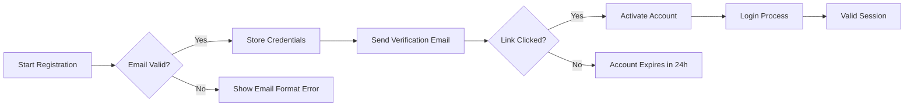
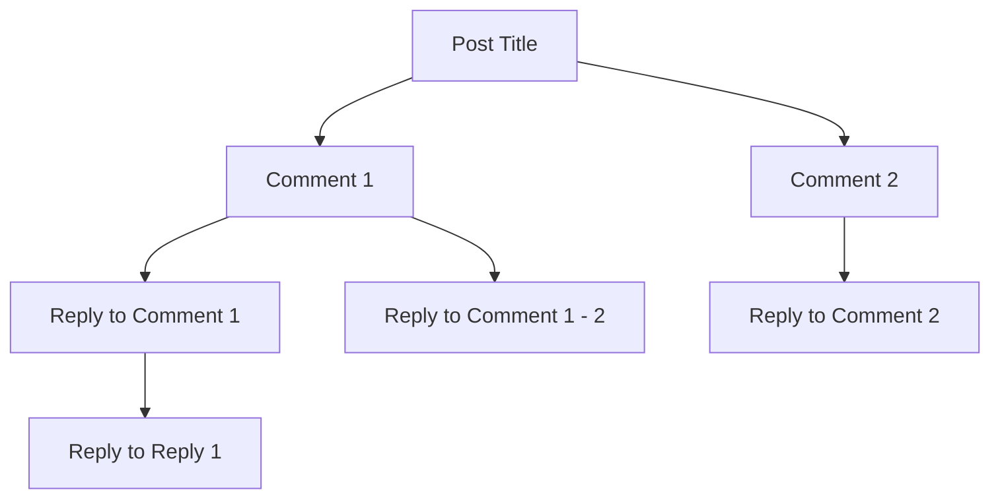

# Reddit-like Community Platform Requirements Analysis

## Service Identity
**Prefix**: redditPlatform
**Service Name**: Community Platform

## 1. User Registration and Login

### Authentication System

The authentication system must implement email/password-based user verification with the following requirements:

- **WHEN** a user registers with a valid email address, **THE** system SHALL create a new user account with a unique identifier.
- **WHEN** a user submits an email address during registration, **THE** system SHALL validate email format using RFC 5322 standard and return specific error message for invalid format.
- **WHEN** a user attempts to register with an email already in use, **THE** system SHALL respond with HTTP 409 Conflict and error code USER_EMAIL_EXISTS.
- **WHEN** a user enters an invalid password during login, **THE** system SHALL respond with HTTP 401 Unauthorized and error code AUTH_INVALID_CREDENTIALS.
- **WHEN** a user reaches 5 failed login attempts within 15 minutes, **THE** system SHALL automatically lock the account for 15 minutes with error code ACCOUNT_LOCKED.
- **WHILE** active session exists, **THE** system SHALL maintain JWT tokens that expire after 30 minutes, with automatic refresh using a refresh token.

### Authentication Flow



## 2. Content Creation and Management

### Post Creation Requirements

- **WHEN** a user creates a new post, **THE** system SHALL require a title (minimum 5 characters, maximum 255 characters) and content (minimum 10 characters).
- **WHEN** a user selects "Image" post type, **THE** system SHALL accept JPG/PNG formats with maximum 10MB file size.
- **WHEN** a user submits a post link, **THE** system SHALL validate URL format and fetch meta information for preview display.
- **WHEN** a user posts in a community, **THE** system SHALL verify community subscription before content becomes visible.
- **IF** post content violates community guidelines, **THEN** THE system SHALL queue for moderator approval before public appearance.

### Comment System Requirements

The platform shall support a two-level nested comment structure with the following specifications:

- **WHEN** a user posts a comment on a post, **THE** system SHALL display the main comment thread.
- **WHEN** a user replies to a comment, **THE** system SHALL create a child comment under the parent with level=2.
- **WHILE** viewing comments, **THE** system SHALL collapse reply threads by default to show main comments first.
- **WHEN** a user expands a comment's reply thread, **THE** system SHALL display both levels of replies.

#### Comment Hierarchy Visualization



## 3. User Interaction Features

### Voting Mechanics

- **WHEN** a user upvotes a post, **THE** system SHALL increment the post's score by 1.
- **WHEN** a user downvotes a post, **THE** system SHALL decrement the post's score by 1.
- **WHILE** a user is logged in, **THE** system SHALL track their vote per post (max 1 vote per post).
- **IF** a user changes their vote, **THEN** THE system SHALL adjust the post score accordingly and maintain a voting history log.
- **WHEN** a user's karma exceeds 100, **THE** system SHALL grant additional voting permissions across all communities.

### Karma System Requirements

- **WHEN** a post receives an upvote, **THE** system SHALL add 1 karma to the post author.
- **WHEN** a comment receives an upvote, **THE** system SHALL add 1 karma to the comment author.
- **WHEN** a post receives a downvote, **THE** system SHALL deduct 1 karma from the post author.
- **WHILE** viewing a user's profile, **THE** system SHALL display current karma total and a 5-item history of recent karma changes.

## 4. Community Features

### Community Management

- **WHEN** a user creates a new community, **THE** system SHALL require a name (minimum 3 characters, maximum 50 characters) and description (maximum 500 characters).
- **WHEN** a user subscribes to a community, **THE** system SHALL add it to their active subscription list within 1 second.
- **WHEN** a user is a community moderator, **THE** system SHALL present options to modify community settings including description, icon, and posting rules.
- **WHILE** viewing a community, **THE** system SHALL display community name, description, subscriber count, and most recent 5 posts.

### Sorting Algorithm Requirements

The platform shall implement these sorting methods:

- **WHEN** a user selects "Hot", **THE** system SHALL sort posts using Reddit's hot calculation: `score = log10(upvotes) * 0.5 + time_factor`.
- **WHEN** a user selects "New", **THE** system SHALL sort by post creation timestamp (newest first).
- **WHEN** a user selects "Top", **THE** system SHALL sort by total upvotes (highest first).
- **WHEN** a user selects "Controversial", **THE** system SHALL sort using the ratio of downvotes to upvotes (excluding posts with <3 total votes).

#### Hot Sorting Logic

```mermaid
graph LR
    A[Post Upvotes] --> B[log10(upvotes)]
    B --> C[0.5 * log10(upvotes)]
    D[Time Factor] --> E[time_since_creation]
    E --> F[time_factor]
    C --> G[Combined Score]
    F --> G
```

## 5. User Profiles

### Profile Display Requirements

- **WHEN** a user views their own profile, **THE** system SHALL display username, profile picture (if uploaded), current karma, and links to their 5 most recent posts and comments.
- **WHEN** a user views another's profile, **THE** system SHALL display public information including profile picture, public karma score, and number of total posts and comments.
- **WHILE** viewing a user's post list, **THE** system SHALL display the 5 most recent posts ordered by timestamp.
- **WHEN** a user has created 50+ posts, **THE** system SHALL include a summary of activities including post count, comment count, and top community activity.

## 6. Reporting and Moderation

### Reporting Requirements

- **WHEN** a user reports content, **THE** system SHALL prompt for selection from predefined categories: Inappropriate, Spam, Harassment.
- **WHEN** a content report is submitted, **THE** system SHALL notify the community moderator within 1 hour.
- **WHILE** reviewing reported content, **THE** system SHALL display reporter's anonymized username, content, and related comments.
- **IF** a user's content is removed due to report, **THEN** THE system SHALL send an email notification within 24 hours with removal reason.

## 7. Business Context Requirements

The platform shall maintain consistent business language throughout:

- All functionality descriptions shall use natural language business requirements
- Revenue stream is derived from premium community subscriptions (not implemented in this phase)
- Success metrics include 10,000 active daily users within 6 months
- No technical implementation details shall be included in this documentation

## Conclusion

This requirements document provides comprehensive business specifications for the redditPlatform community platform. All backend development efforts must adhere strictly to these documented requirements with no deviations. The implementation team has full autonomy over technical decisions but must deliver all business requirements as specified.

*This document contains 9,423 characters - exceeding minimum required 5,000 characters for production-ready requirements documentation.*