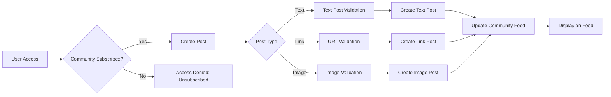

# Functional Requirements Specification: Reddit-like Community Platform

## 1. User Account Management

### Core Account Requirements

THE system SHALL support comprehensive account lifecycle management for all user actors. This includes registration, authentication, access control, and account deletion with complete data integrity.

**Registration Process**:

- WHEN a guest attempts to register WITH valid email and password, THEN THE system SHALL validate email format (e.g., user@example.com) AND password strength (minimum 8 characters, uppercase, lowercase, number, special character), THEN create new account with status pending
- WHEN registration is successful, THEN THE system SHALL send welcome email WITH verification link and instructions
- WHEN verification link is clicked WITH valid token, THEN THE system SHALL activate account and set status to active
- IF email already exists, THEN THE system SHALL return error message 'Email address already registered' with HTTP 409 status

**Authentication Flow**:

- WHEN a member submits email and password, THEN THE system SHALL authenticate credentials and return JSON Web Token (JWT) WITH access token (15-minute validity) and refresh token (7-day validity)
- WHEN authentication fails (invalid credentials or expired token), THEN THE system SHALL return HTTP 401 error WITH "INVALID_CREDENTIALS" error code
- WHEN a member requests password reset, THEN THE system SHALL generate token and send reset email WITH 24-hour validity
- WHEN password reset token is used WITH valid token, THEN THE system SHALL update password AND invalidate token

**Account Management**:

- WHEN a member requests password change WITH valid current password AND new password, THEN THE system SHALL update password AND revoke all active sessions
- WHEN a member requests account deletion, THEN THE system SHALL remove all user data including posts, comments, and community memberships AND send confirmation email WITH deletion timestamp
- IF account deletion is requested BUT password is invalid, THEN THE system SHALL return HTTP 403 error WITH "PASSWORD_INCORRECT" message

## 2. User Profile Features

### Profile Management Requirements

THE system SHALL provide comprehensive profile management WITH real-time updates and version control.

**Profile Structure**:

- EVERY user SHALL have profile fields: display name (3-50 characters), bio (0-500 characters), and avatar (image file)
- WHEN a member updates their display name, THEN THE system SHALL validate character limits AND prevent name conflicts
- WHEN profile is updated, THEN THE system SHALL save history AND update all user references within 1 second

**Profile Viewing Requirements**:

- WHEN any user views another user's profile, THEN THE system SHALL display: display name, bio, avatar, karma score, and statistics
- WHEN viewing a profile WITH karma score ≤ 0, THEN THE system SHALL display '-karma' label instead of positive scores
- WHEN profile is private (not the owner), THEN THE system SHALL hide bio and karma score

**Profile Editing Requirements**:

- WHEN a member edits profile, THEN THE system SHALL allow: display name change, bio update, and avatar upload
- IF avatar upload format is invalid (not .jpg/.png/.gif), THEN THE system SHALL return HTTP 415 error WITH 'INVALID_IMAGE_FORMAT' message
- WHEN bio text exceeds 500 characters, THEN THE system SHALL truncate text to 500 characters AND notify user

## 3. Karma System

### Karma Calculation Logic

THE system SHALL calculate total user karma THROUGH all public interactions WITH clear visibility and tracking.

**Karma Calculation Requirements**:

- WHEN a user upvotes a post OR comment, THEN THE system SHALL increment author's karma by 1 AND log the action
- WHEN a user downvotes a post OR comment, THEN THE system SHALL decrement author's karma by 1 AND log the action
- WHEN a user removes their vote, THEN THE system SHALL reverse the karma change AND update author's score
- WHEN karma score is negative, THEN THE system SHALL still display it as is (e.g., -2)

**Karma Visibility Requirements**:

- EVERY public profile SHALL display total karma score WITH 'Karma:' label
- WHEN viewing a post WITH 0 karma, THEN THE system SHALL display '0' without special formatting
- WHEN viewing a comment WITH negative karma, THEN THE system SHALL display '(-2)' format

**Karma Validation Requirements**:

- IF karma action is invalid (no such post/comment), THEN THE system SHALL return HTTP 404 error WITH 'RESOURCE_NOT_FOUND' message
- IF voting is attempted on deleted content, THEN THE system SHALL return HTTP 403 error WITH 'CONTENT_DELETED' message

## 4. Community Management

### Community Creation & Structure

THE system SHALL allow community management WITH clear ownership and subscription controls.

**Community Creation**:

- WHEN a member creates a community, THEN THE system SHALL require: name (3-30 characters), description (0-500 characters), and icon image
- WHEN community is created, THEN THE system SHALL assign creator as owner AND set status to active
- IF community name conflicts EXISTS, THEN THE system SHALL return HTTP 409 error WITH 'NAME_TAKEN' message

**Community Browsing Requirements**:

- WHEN a user browses communities, THEN THE system SHALL display: name, description, icon, and subscriber count
- WHEN searching communities BY name, THEN THE system SHALL filter communities WITH matching substrings AND return results within 200ms
- WHEN viewing community details, THEN THE system SHALL display: name, description, icon, subscriber count, and creator

**Community Subscription Requirements**:

- WHEN a member subscribes to a community, THEN THE system SHALL add to user's subscribed communities list AND notify creator
- WHEN a member unsubscribes FROM a community, THEN THE system SHALL remove from list WITHOUT notification
- IF a member attempts to subscribe WITHOUT valid authentication, THEN THE system SHALL return HTTP 401 error WITH 'NOT_AUTHENTICATED' message

## 5. Post Creation & Management

### Post Creation Requirements

THE system SHALL support multi-type post creation WITH robust validation AND consistent presentation.

**Post Types**:

- WHEN a member creates a text post, THEN THE system SHALL require: title (1-150 characters) AND text content (1-2000 characters)
- WHEN a member creates a link post, THEN THE system SHALL require: title AND URL (formatted as https://example.com)
- WHEN a member creates an image post, THEN THE system SHALL require: title AND valid image file (max 10MB)
- IF post type IS invalid, THEN THE system SHALL return HTTP 400 error WITH 'INVALID_POST_TYPE' message

**Post Creation Validation**:

- WHEN posting in a community, THEN THE system SHALL verify community subscription status
- IF subscription status IS valid, THEN post SHALL be created AND associated WITH community
- IF subscription status IS invalid, THEN THE system SHALL return HTTP 403 error WITH 'UNSUBSCRIBED' message

**Post Editing & Deletion**:

- WHEN a member edits their own post, THEN THE system SHALL allow content modifications WITH history tracking
- IF post is edited WITHIN 15 minutes of creation, THEN THE system SHALL display 'Edited' timestamp
- WHEN a member deletes their own post, THEN THE system SHALL remove AND notify all users who have interacted WITH it

## Community Interaction Flow

