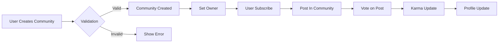
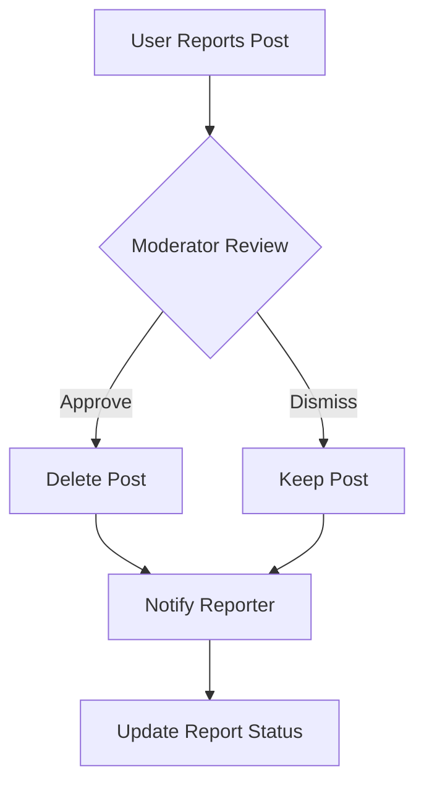

# Reddit-like Community Platform: Comprehensive Requirements Specification

## 1. Service Overview

### Problem Statement
The current social media landscape suffers from fragmented community experiences and lack of specialized platforms for topic-focused discussions. Many users seek dedicated spaces for meaningful conversations about their specific interests without the overwhelming noise of general social networks. Existing platforms often fail to balance user engagement with community health, leading to toxic interactions, low-quality content, and poor user retention.

WHEN a user searches for a passionate community around a specific interest, THE system SHALL present a curated list of relevant communities with clear purpose and active discussion.

WHEN a user encounters toxic content in a community, THE system SHALL provide clear moderation pathways and reporting tools immediately.

### Market Gap Analysis
The gap between general-purpose social platforms and specialized community platforms is clear. Our platform bridges this gap by focusing on:
- Meaningful community building around specific interests
- Empowering community owners with moderation tools
- Creating a transparent reputation system (karma) that encourages quality contributions
- Providing intuitive content discovery across communities

## 2. User Profile Requirements

### Profile Structure
THE system SHALL store and manage these profile components per user:
- **Display name**: User-designated public name (2-30 characters, alphanumeric + spaces)
- **Bio text**: User-provided biography (1-500 characters)
- **Avatar image**: User-uploaded profile photo (JPG/PNG, max 5MB)
- **Karma score**: Numeric value tracking user contributions (initial value: 0)

WHEN a user deletes their account, THE system SHALL permanently remove all profile data including:
- Display name, bio text, avatar image
- Karma score, associated posts and comments

### Editing Constraints
WHEN a user attempts to change their display name, THE system SHALL:
- Validate name is 2-30 characters
- Validate name contains alphanumeric characters and spaces
- Check for uniqueness across all users
- Reject duplicate with message 'Display name already taken'

WHEN a user updates their bio text, THE system SHALL:
- Limit to 500 characters maximum
- Reject input exceeding character limit
- Sanitize HTML tags to prevent XSS

## 3. Karma System Requirements

### Core Formula

Karma = Total Upvotes - Total Downvotes

WHEN a user receives an upvote on their content, THE system SHALL increase their karma score by 1.
WHEN a user receives a downvote on their content, THE system SHALL decrease their karma score by 1.

### Voting Rules

EVERY user may cast one vote per post or comment, WHILE the user has a valid authentication session.

IF a user attempts to cast multiple votes on the same content, THEN THE system SHALL return error message "You can only vote once on this content."

WHEN a user changes an upvote to a downvote, THEN THE system SHALL decrease author's karma by 2.
WHEN a user changes a downvote to an upvote, THEN THE system SHALL increase author's karma by 2.

### Negative Karma Handling

WHILE karma can be negative, THE system SHALL store karma as a signed integer.
IF a user's karma falls below -10, THEN THE system SHALL display "This user's content may not be visible to all Community members."

## 4. Communities and Subscriptions

### Community Creation

ANY user can create a community with:
- Unique name (required)
- Description text (required)
- Icon image (optional)

The creator becomes the community owner with full control.

WHEN a user attempts to create a community with a duplicate name, THEN THE system SHALL display error "Community name already taken."

### Subscription Process

Users can subscribe to any community WITHOUT permission requirements.
WHEN a user subscribes to a community, THEN THE system SHALL add to their subscription list and enable post creation.

### Community Search

USERS can search communities by name. The system SHALL return exact matches first.
WHILE searching, THE system SHALL display community description and subscriber count.

## 5. Posts and Comments

### Post Types

Every post must be one of:
- **Text post**: Requires text content
- **Link post**: Requires valid URL
- **Image post**: Requires uploaded image (JPG/PNG, max 5MB)

WHEN a user creates a link post, THEN THE system SHALL extract domain name for display (e.g., youtube.com).

### Comment System

USERS can write nested comments with no depth limit.
REPLIES to comments can have further replies without limitation.

WHEN a user replies to a comment, THEN THE system SHALL display the reply threaded under the original comment.

## 6. Voting Rules

### Post & Comment Voting

ONE vote per user per post/comment.
Users may change vote direction or remove vote.

WHEN a vote is changed, THEN THE system SHALL immediately reflect net karma change.

### Feed Sorting

All three feeds (Home, Popular, Community) support:
- **Hot**: Recent posts with many upvotes first
- **New**: Most recently created first
- **Top**: Highest score first (with time filters)
- **Controversial**: Many votes near score zero first

## 7. Moderation System

### Ownership Roles

- **Community Owner**: Highest authority (creator)
- **Moderators**: Added by owner, can add/remove other moderators
- **Moderator Limitation**: Cannot remove owner

WHEN an owner adds a moderator, THEN THE system SHALL notify new moderator.

### Moderation Actions

MODERATORS can:
- Delete posts or comments
- Ban users from community
- View banned user list
- Unban users

WHILE banning a user, THE system SHALL display reason to user.

## 8. Reporting System

### Report Creation

USERS can report any content with reason text.
WHEN a report is created, THEN THE system SHALL display confirmation "Report submitted for review."

### Report Resolution

MODERATORS can:
- Approve report (deletes content)
- Dismiss report (keeps content)

WHEN a report is approved, THEN THE system SHALL notify user who submitted the report.

## 9. Visual Workflow Demonstrations

## 10. Business Rule Summary

| Component | Rule | EARS Implementation |
|-----------|------|---------------------|
| Profile | Display name must be unique | WHEN unique check fails, THEN show error |
| Karma | Voting behavior affects karma | WHEN vote changes, THEN update karma |
| Communities | Owner can set community rules | WHEN community created, THEN set owner |
| Voting | One vote per content item | IF duplicate vote, THEN error message |
| Moderation | Owners set moderator permissions | WHEN moderator added, THEN notify |

## 11. Performance Requirements

WHEN a user loads the Home Feed, THE system SHALL display content within 1.5 seconds for 85% of users.
WHEN a user views a community with 10,000 subscribers, THE system SHALL load all community details within 2 seconds.

## 12. Success Metrics

| Metric | Year 1 Target | Year 2 Target |
|--------|---------------|---------------|
| MAU | 50,000 | 250,000 |
| Community Creation | 500/month | 2,500/month |
| User Retention | 40% | 55% |
| Premium Conversion | 3% | 7% |

> *This document contains business requirements only. All technical implementations (APIs, database schema, etc.) are at the discretion of the development team.*