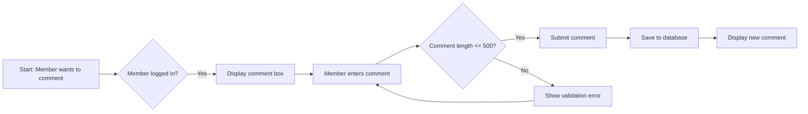
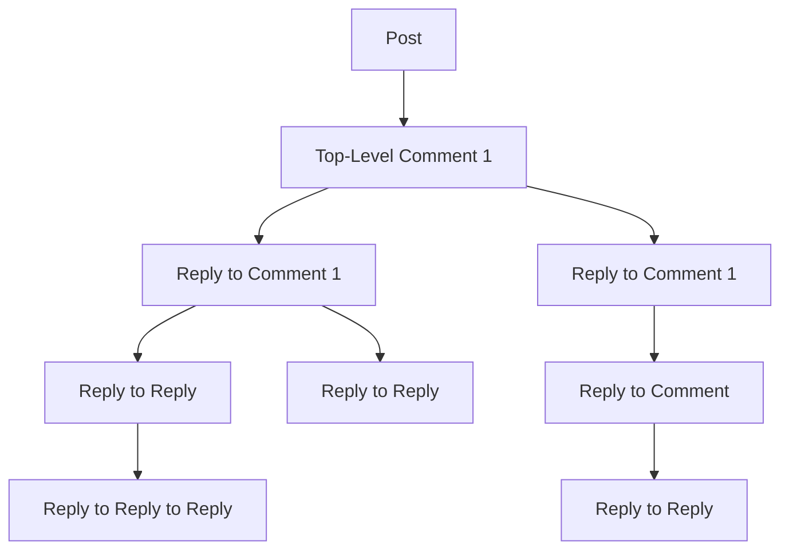
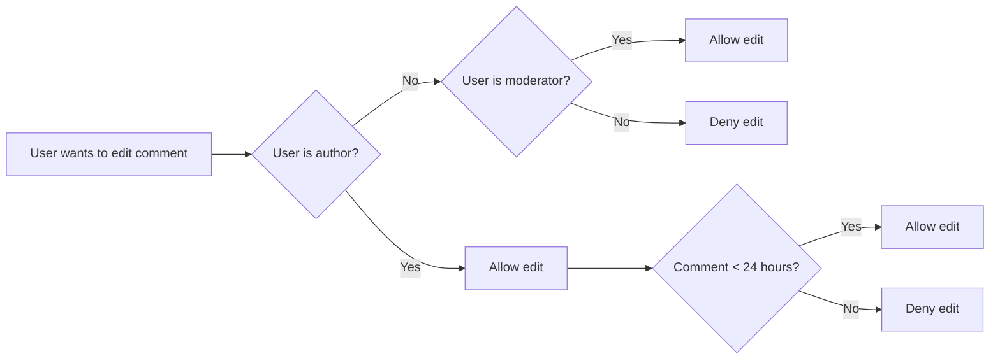
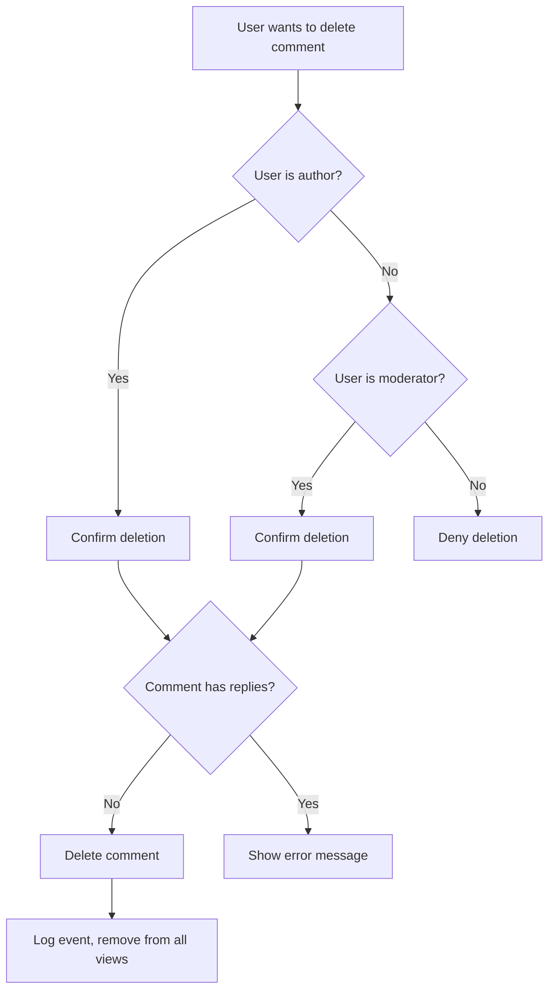

# Comment Management Requirements Specification

### Introduction
The comment management system defines how users interact with comments in the platform, including creation, nesting, editing, deletion, and presentation. This document presents comprehensive business requirements for the comment management system from the user perspective.

### Comment Creation Process

#### Requirements

THE system SHALL allow members to write comments on any post they can view.

WHEN a member attempts to write a comment on a post, THE system SHALL display a comment box below the post.

WHEN a member submits a comment, THE system SHALL save the comment to the database.

THE system SHALL validate that comments cannot exceed 500 characters in length.

THE system SHALL display validation errors for comments that exceed the 500 character limit.

IF a member provides invalid input that cannot be submitted, THEN THE system SHALL display an appropriate error message.

#### User Flow Diagram


### Comment Nesting Rules

#### Requirements

THE system SHALL allow comments to have arbitrary levels of nesting.

WHEN a user replies to a comment, THE system SHALL create a new comment with the parent comment's ID as its reference.

THE system SHALL limit nested comment depth to 10 levels.

THE system SHALL display comments with their respective indentation based on the nesting level.

WHEN a user views a single post in detail, THE system SHALL display all nested comments in a hierarchical tree structure.

#### Business Logic Diagram


### Comment Editing Policy

#### Requirements

THE system SHALL allow comment owners to edit their own comments.

THE system SHALL allow moderators to edit comments in their communities.

THE system SHALL not allow editing of comments after 24 hours of creation.

WHEN a user initiates edit on a comment, THE system SHALL display the original comment content in the edit field.

THE system SHALL allow comment authors to edit their own comments within the first 24 hours.

THE system SHALL limit comment editing to the original author or moderators of the community.

WHEN a comment is edited, THE system SHALL display a notification that the comment has been updated.

WHEN a user edits a comment, THE system SHALL record the edit history with timestamp and user who made the edit.

#### Editing Constraint Diagram


### Comment Deletion Requirements

#### Requirements

THE system SHALL allow users to delete their own comments.

THE system SHALL allow moderators to delete comments in their communities.

THE system SHALL not allow deleting comments that have comments nested under them.

WHEN a user attempts to delete a comment with replies, THE system SHALL display an error message.

WHEN a comment is deleted, THE system SHALL log the deletion event.

THE system SHALL remove the comment from all feeds and user interfaces.

THE system SHALL notify the comment author of the deletion (if performed by a moderator).

#### Deletion Workflow


### Comment Presentation Guidelines

#### Requirements

THE system SHALL display comments on a post with the comment author's username.

THE system SHALL show the time since the comment was posted (e.g., "3 hours ago").

THE system SHALL display comment vote score next to the author.

THE system SHALL limit the displayed comment text to the first 200 characters.

WHEN a user views a comment with more than 200 characters, THE system SHALL display a 'Read More' link.

THE system SHALL render nested comments indented proportionally to their depth.

THE system SHALL display nested comments in thread view with visual indentation.

THE system SHALL sort comments by 'Best', 'New', or 'Controversial' as requested by the user.

#### Presentation Example
```
[Author Username] - 3 minutes ago | Score: +5
Comment text here (first 200 characters). ... Read More

  [Nested Author] - 2 minutes ago | Score: +2
  Nested comment text here (first 200 characters).

    [Nested Author] - 1 minute ago | Score: 0
    Deeper nested comment text here.
```

### Comment Integration with Voting System

#### Requirements

THE system SHALL integrate comments with the voting system from the 06-voting-system.md document.

WHEN a user votes on a comment, THE system SHALL update the comment's vote score immediately.

THE system SHALL display the current vote score for each comment in the comment's UI element.

THE system SHALL ensure comment voting adheres to the same rules as post voting (one vote per user per comment).

### Relationships with Other Components

#### Community Model

THE system SHALL link comments to the community via the post they are associated with.

THE system SHALL ensure comment visibility conforms to community subscription rules.

#### Post Management

THE system SHALL ensure new comments are visible on the affected post.

THE system SHALL maintain comment count on posts and show it in feed listings.

#### Feed Management

THE system SHALL include comments in post feeds according to feed type rules.

THE system SHALL update comment counts and new comment notifications for feeds as appropriate.