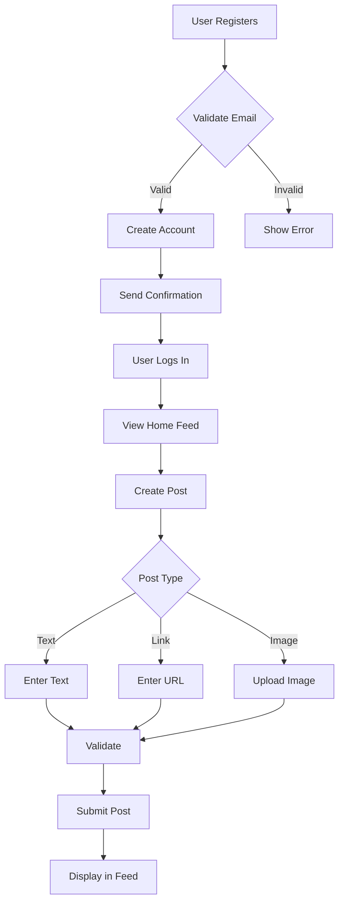
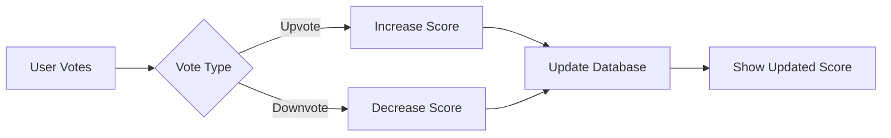

# Reddit-like Community Platform: Requirements Specification

## User Account

### Registration & Login

WHEN a user submits registration with valid email, password, and username, THE system SHALL:
- Validate email format and uniqueness
- Enforce password complexity requirements (min 8 characters, alphanumeric, special character)
- Verify username is unique across all users
- Generate a unique user ID in format `user-[random-uuid]`
- Store registration timestamp in ISO 8601 format
- Send confirmation email to the registered address

WHEN a user signs up with an email already in use, THE system SHALL display error: "Email address is already registered. Please use a different email or reset your password."

WHEN a user attempts login with valid credentials, THE system SHALL:
- Verify email/password combination
- Generate a signed JWT token
- Return refresh token for session management
- Store authentication session in secure, encrypted cookies

### Account Management

WHEN a user requests password change, THE system SHALL:
- Verify current password
- Enforce new password complexity
- Generate reset token valid for 24 hours
- Send password reset email

WHEN a user deletes their account, THE system SHALL:
- Delete all associated posts, comments, and activity
- Remove all personal data from the system
- Notify user via email
- Provide confirmation message

## User Profile

### Profile Structure

WHEN a user accesses their profile, THE system SHALL display:
- Display name (default: username)
- Bio text (max 250 characters)
- Avatar image (default placeholder)
- Total karma score
- List of posts created
- List of comments written

WHEN a user edits their profile, THE system SHALL:
- Allow updating display name, bio, and avatar
- Validate image size (max 5MB, dimensions 1024x1024)
- Update last modified timestamp

### Profile Views

WHEN a user views another user's profile, THE system SHALL:
- Display public profile data
- Show karma score
- List visible posts and comments
- Display profile creation date
- Provide option to follow user

## Karma System

### Score Calculation

WHEN a user upvotes a post or comment, THE system SHALL:
- Increase the owner's karma by 1
- Record the vote in the database

WHEN a user downvotes a post or comment, THE system SHALL:
- Decrease the owner's karma by 1
- Record the vote in the database

WHEN a user removes their vote, THE system SHALL:
- Adjust karma according to previous vote
- Update the system record

### Display Requirements

WHEN a user views karma, THE system SHALL:
- Display current score
- Show trend history (last 30 days)
- Provide explanation of contribution sources

## Communities

### Community Creation

WHEN a user creates a new community, THE system SHALL:
- Validate community name format (3-25 chars, alphanumeric, underscores, hyphens)
- Ensure name is unique across all communities
- Assign creator as owner
- Generate community ID in format `comm-[random-uuid]`
- Set default community icon (system placeholder)
- Record creation timestamp

WHEN a user searches communities, THE system SHALL:
- Return community names matching search term
- Display community icon and subscriber count
- Sort by relevance and subscription count

### Community Management

WHEN a user subscribes to a community, THE system SHALL:
- Add to user's community list
- Enable post creation in that community
- Update community subscriber count

WHEN a user unsubscribes from a community, THE system SHALL:
- Remove from user's community list
- Disable post creation in that community
- Update community subscriber count

## Posts

### Post Creation

WHEN a user creates a new post in a subscribed community, THE system SHALL:
- Validate title (required, max 100 characters)
- Verify post type (text, link, image)
- Enforce content requirements based on type:
  - Text: min 5 characters
  - Link: valid URL format
  - Image: max 5MB, valid format (JPEG, PNG)
- Generate post ID in format `post-[random-uuid]`
- Record creation timestamp
- Associate with community and creator

### Post Editing & Deletion

WHEN a user edits their post, THE system SHALL:
- Allow modification only until 24 hours after creation
- Validate all fields meet requirements
- Record edit timestamp

WHEN a user deletes their post, THE system SHALL:
- Remove the post from all feeds
- Decrement community post count
- Record deletion timestamp

## Post Voting

### Voting Mechanics

WHEN a user votes on a post, THE system SHALL:
- Allow one vote per user per post
- Enable upvote (increase score +1), downvote (decrease score -1)
- Enable vote change or removal
- Update score immediately

WHEN a user attempts to vote on a post in a community they're not subscribed to, THE system SHALL:
- Return error: "You must be subscribed to this community to vote"

### Voting Display

WHEN a user views a post's voting interface, THE system SHALL:
- Display current vote score (upvotes - downvotes)
- Show user's current vote state
- Provide buttons for upvote, downvote, and remove

## Feeds

### Feed Types

The platform provides three feed types:

#### Home Feed

WHEN a logged-in user accesses home feed, THE system SHALL:
- Display posts from all subscribed communities
- Implement pagination (20 posts per page)
- Sort by specified criterion (Hot, New, Top, Controversial)

#### Popular Feed

WHEN any user (logged-in or guest) accesses popular feed, THE system SHALL:
- Display posts from all communities
- Implement pagination (20 posts per page)
- Sort by specified criterion

#### Community Feed

WHEN a user accesses a specific community's feed, THE system SHALL:
- Display all posts from that community
- Allow sorting by specified criterion
- Enable subscription to the community

### Sorting Options

WHEN a user selects sorting criterion, THE system SHALL:
- Apply sorting logic based on selection:
  - Hot: recent posts with high engagement
  - New: most recently created posts
  - Top: highest vote score (with time filter options)
  - Controversial: posts with high volume of votes but score near zero
- Refresh feed with the new ordering

## Comments

### Comment Creation

WHEN a user writes a comment, THE system SHALL:
- Validate comment content (max 1000 characters)
- Associate with parent post and user
- Generate comment ID in format `comment-[random-uuid]`
- Record creation timestamp
- Track comment hierarchy

### Comment Edits & Deletion

WHEN a user edits their comment, THE system SHALL:
- Allow edits for 60 minutes after creation
- Validate content requirements
- Record edit timestamp

WHEN a user deletes their comment, THE system SHALL:
- Remove from all comment trees
- Update comment count on associated post
- Record deletion timestamp

## Comment Voting

### Voting Mechanics

WHEN a user votes on a comment, THE system SHALL:
- Allow one vote per user per comment
- Enable upvote (score +1), downvote (score -1)
- Enable vote change or removal
- Update score immediately

WHEN a user attempts to vote on a comment they don't own, THE system SHALL:
- Allow standard voting behavior

### Comment Sorting

WHEN a user views comments on a post, THE system SHALL:
- Implement sorting options:
  - Best: highest vote score first
  - New: most recent first
  - Controversial: high vote count with score close to zero
- Update display based on selection

## Community Moderation

### Moderator Roles

WHEN a community owner adds a moderator, THE system SHALL:
- Assign moderator role with specific permissions
- Record assignment timestamp
- Notify moderator

WHEN a moderator is added, THE system SHALL:
- Ensure owner remains the only one who can remove them
- Prevent moderators from removing each other
- Limit moderator actions to community scope

### Moderator Actions

WHEN a moderator deletes a post, THE system SHALL:
- Remove from all feeds
- Notify post author
- Record moderation action in audit log

WHEN a moderator bans a user, THE system SHALL:
- Remove user's ability to post or comment in community
- Notify banned user
- Add to community ban list

## Reporting

### Reporting Process

WHEN a user reports content, THE system SHALL:
- Require report reason (min 20 characters, max 500)
- Associate report with content and user
- Record report timestamp

### Report Resolution

WHEN a moderator reviews a report, THE system SHALL:
- Display report content, reporter, and reason
- Provide options to approve deletion or dismiss
- Record moderator action and timestamp

WHEN a report is approved, THE system SHALL:
- Delete the reported content
- Notify reporter
- Record audit log entry

## Technical Requirements

### Authentication

WHEN a user session expires (30 minutes of inactivity), THE system SHALL:
- Invalidate JWT tokens
- Log session closure
- Redirect to login page

### Data Integrity

WHEN an action affects multiple entities (e.g., deleting user account), THE system SHALL:
- Maintain referential integrity
- Handle cascade deletions properly
- Provide transactional guarantees

### Error Handling

WHEN any API operation fails, THE system SHALL:
- Return appropriate HTTP status codes
- Provide descriptive error messages
- Maintain application stability

## Business Rules

1. All user content must comply with community guidelines
2. Community owners have final authority over content
3. Karma cannot be negative for user creation (starts at 0)
4. Subscription is required to post in a community
5. Moderators cannot delete other moderators' posts without owner approval

## Workflow Diagrams

### Mermaid Fixes Applied
- All labels use double quotes
- Arrow syntax corrected to `-->`
- Removed spaces between brackets and quotes
- Fixed empty labels in diagrams