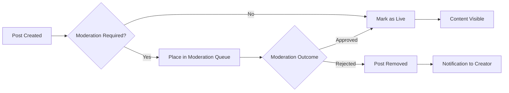
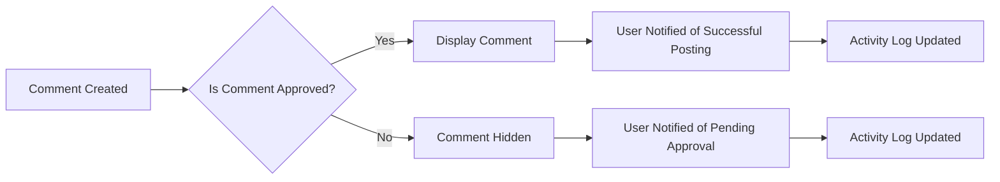

# Content Management Requirements

## 1. Post Creation Workflow

### Service Overview
This section defines how users create and manage posts within communities. All posts require valid community membership and follow a strict process for validation and moderation.

### Business Requirements

#### Standard Post Creation
WHEN a member attempts to create a new post, THE system SHALL require the following information:
- Community ID (must be a valid, subscribed community)
- Post content (text, link, or image upload)
- A valid title with minimum length of 5 characters

IF the community does not exist or the user is not a member, THEN THE system SHALL deny creation and display error message 'Community not found or you are not a member of this community.'

WHEN the post content is submitted, THE system SHALL validate that:
- The content matches at least one supported content type (text, link, image)
- The content adheres to the character limit for each type

IF the content exceeds limits, THEN THE system SHALL display error message 'Content exceeds maximum length ({{max_length}}).' and prevent submission.

#### Post Moderation State
THE system SHALL set new posts to 'pending' state by default until moderated by community administrators.

WHEN a post is created, THE system SHALL activate moderation workflow for community dashboard.

IF a post violates community guidelines, THEN THE system SHALL allow moderators to reject and delete the post immediately.

#### Draft Post Handling
THE system SHALL allow members to create draft posts locally before final submission.

WHEN a member creates a draft, THE system SHALL save locally in browser storage until publication is confirmed.

WHEN a member publishes a draft, THE system SHALL verify content validity and submit to the content management system.

## 2. Content Types Support

### Content Type Specifications

#### Text Posts
TEXT posts SHALL be supported with:
- A maximum content length of 20,000 characters
- Support for basic Markdown formatting
- Asset linking using [Image] or [Link] syntax

WHEN a user creates a text post, THE system SHALL display preview of formatted content using DOM rendering.

#### Link Posts
LINK posts SHALL be supported with:
- Validation of URL format (must begin with 'http://', 'https://', or 'www.')
- Automatic title extraction from the target webpage
- Automatic thumbnail generation for image-rich sites

WHEN a user submits a link, THE system SHALL validate URL format and display error with specific message 'Invalid URL format. Please use http://, https://, or www.'

#### Image Posts
IMAGE posts SHALL be supported with:
- File upload size limit of 10 MB
- Supported formats: PNG, JPEG, GIF, WEBP
- Automatic compression for better performance

WHEN an image is uploaded, THE system SHALL validate the file type and size before processing.

IF the file is unsupported, THEN THE system SHALL display error message 'Unsupported file type. Please use PNG, JPEG, GIF, or WEBP.'

IF the file exceeds 10 MB, THEN THE system SHALL display error message 'File size exceeds maximum limit of 10 MB.'

## 3. Voting System

### Vote Mechanics

#### Basic Voting
THE system SHALL support upvotes and downvotes for posts and comments.

WHEN a member attempts to vote on a post, THE system SHALL require:
- A valid authenticated session
- Membership in the community where the post was created

IF the user is not logged in, THEN THE system SHALL display error message 'Please log in to vote on content.'

#### Vote Limitations
A user SHALL be allowed to upvote or downvote a single post or comment only once.

WHEN a user attempts to cast a second vote on the same item, THE system SHALL display error message 'You've already voted on this item.'

THE system SHALL allow a user to change their vote.

WHEN a user changes their vote, THE system SHALL update the vote count in real time without refreshing the page.

#### Vote Impact
Each upvote SHALL increase the post's karma by 1 point.

Each downvote SHALL decrease the post's karma by 2 points.

WHEN a post's karma is less than 0, THE system SHALL mark it as 'low-quality' with an icon and badge.

IF someone attempts to view a post with less than 0 karma, THE system SHALL display warning message 'This post has been rated as low quality.'

## 4. Commenting Workflow

### Basic Commenting
THE system SHALL support threaded comments for posts.

WHEN a user creates a comment on a post, THE system SHALL accept:
- Comment text with minimum length of 1 character
- User ID of the parent comment (optional for root-level comments)

IF a comment has less than 1 character, THEN THE system SHALL deny submission and display error message 'Comments must contain at least 1 character.'

### Nested Replies
THE system SHALL support nested replies up to 3 layers deep.

WHEN a user replies inside an existing comment, THE system SHALL restrict nesting to a maximum depth of 3 levels.

IF the user attempts to exceed 3 nesting levels, THEN THE system SHALL display error message 'Maximum nesting depth of 3 reached. Please create a new comment instead.'

THE system SHALL limit the total number of responses at each level to 500 comments.

### Comment Moderation
THE system SHALL route all new comments to a moderation queue for community administrators.

WHEN a new comment is created, THE system SHALL display success message 'Your comment is under review and will appear after moderation.'

IF a comment violates community guidelines, THEN THE system SHALL allow moderators to delete it with reason field.

THE system SHALL create an automatic notification for the user that their comment was rejected.

## 5. User Interaction Requirements

### Content Visibility Rules
THE system SHALL display content according to user preferences but:
- All posts must be visible in the community feed without additional conditions
- Comments shall be visible immediately after moderation

WHEN a user consumes content, THE system SHALL track post views in user's activity log.

### Activity Tracking
THE system SHALL record post views, comments, and votes for user profiles.

WHEN a post receives a view, THE system SHALL increment the view counter.

WHEN a comment is made, THE system SHALL append it to the user's comment history.

## 6. Error Handling Scenarios

### General Error Responses
THE system SHALL return HTTP status codes with error messages:
- 400 Bad Request for invalid parameters
- 401 Unauthorized for unauthenticated requests
- 403 Forbidden when requesting restricted content

WHEN an error occurs, THE system SHALL display user-friendly messages:
- 'Invalid community ID' for 400 errors
- 'Please log in to perform this action' for 401 errors
- 'You do not have permission to delete this content' for 403 errors

### Non-Technical Error Messages
All error messages SHALL be written in natural language that users understand without technical knowledge.

EXAMPLE:
- 'The link you provided is invalid. Please use http://, https://, or www.'
- 'You've already voted on this item.'

## 7. Performance Requirements

### Content Loading Performance
THE system SHALL load content within 2 seconds for 95% of users on average network conditions.

WHEN a user loads a community feed with 100 posts, THE system SHALL ensure an average response time of 1.5 seconds.

### Image and Link Processing
THE system SHALL process image uploads to 75% of the original size within 15 seconds.

WHEN a user uploads a 5 MB image, THE system SHALL store the compressed version and display thumbnail within 15 seconds.

## 8. Business Process Enhancements

### Community Post Lifecycle

### Comment Approval Workflow

## 9. Security Requirements

### Content Validation
THE system SHALL validate all incoming content to prevent malicious payloads.

WHEN content is submitted, THE system SHALL scan for:
- Malicious script injection
- Phishing links
- Excessive embedding

IF malicious content is detected, THEN THE system SHALL not allow content submission and display error message 'Content contains unsafe elements. Please remove them and try again.'

### Session Validation
THE system SHALL validate user sessions for all content modification actions.

WHEN a user attempts to delete their own content, THE system SHALL verify session ownership before allowing deletion.

## 10. Accessibility Requirements

### Content Display
THE system SHALL ensure all content is accessible to users with disabilities.

WHEN content is displayed, THE system SHALL provide:
- Alternative text for all images
- Keyboard navigation support for voting and commenting
- Screen reader compatibility for moderation labels

THE system SHALL not restrict access to content based on device type or accessibility settings.