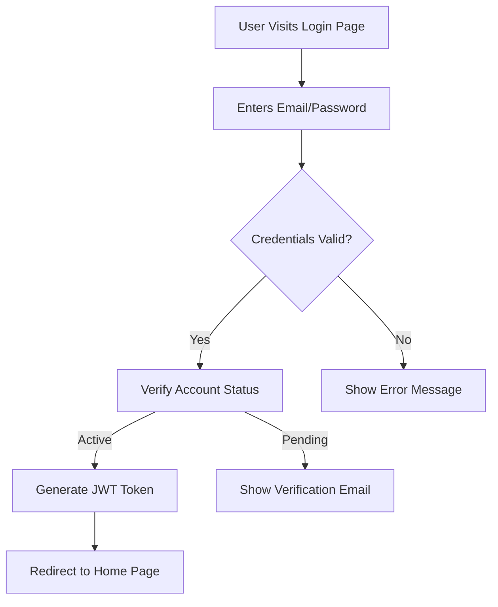

# Community Platform Requirements

## 1. User Registration and Login

### 1.1 Core Authentication Requirements
- WHEN a new user navigates to the registration page, THE system SHALL display required fields: email, password, username, and confirmation.
- WHEN the user submits a registration form with valid credentials, THE system SHALL create a user account with default role "member" and status "active".
- THE system SHALL enforce password requirements: minimum 8 characters, mix of letters, numbers, and special characters.
- THE system SHALL send a verification email with unique confirmation link to the user's provided email address within 2 seconds of registration.

### 1.2 Login Workflow

- IF a user has incomplete profile information (missing username), THEN THE system SHALL redirect to profile setup page after successful login.

## 2. Community Management

### 2.1 Community Creation Requirements
- WHEN a user clicks "Create Community" in the main menu, THE system SHALL display a modal with fields for community name, description, and icon selection.
- THE system SHALL enforce community name constraints: 3-50 characters, unique across platform, no special characters except underscores.
- WHEN the user submits the community creation form, THE system SHALL automatically subscribe the creator to the new community.

### 2.2 Community Subscription Workflow
- WHEN a user navigates to a community's page, THE system SHALL display a "Join Community" button for non-members.
- IF a user clicks "Join Community", THEN THE system SHALL add the user to the community's member list and notify all moderators.
- THE system SHALL display a user's joined communities in their profile navigation menu with subscription status (active, pending).

## 3. Content Creation and Management

### 3.1 Post Creation Process
- WHEN a user clicks the "New Post" button in a community, THE system SHALL display the post creation modal with three content options: text, link, or image upload.
- THE system SHALL enforce 5000-character limit on text posts with real-time character counter visible to the user.
- THE system SHALL allow image uploads up to 10MB with accepted formats JPG, PNG, and GIF.
- IF a user attempts to upload an image with less than 10 karma, THEN THE system SHALL prevent submission and display: "You need at least 10 karma to post images."

### 3.2 Post Display Rules
- WHEN a user views a community feed, THE system SHALL display posts in default order (hot) with: user avatar, community name, post title, upvote count, comment count.
- THE system SHALL hide posts from communities that the user has unsubscribed from.
- IF a post contains multiple media types (text + image), THEN THE system SHALL prioritize the image preview in the feed.

## 4. Voting System

### 4.1 Voting Mechanics Requirements
- WHEN a user clicks the upvote button on a post, THE system SHALL record the vote and increment the upvote count.
- THE system SHALL prevent users from voting more than once on the same post (allowing only one vote per user per post).
- WHEN a user clicks the downvote button on a post, THE system SHALL record the vote and increment the downvote count.
- THE system SHALL display the current upvote/downvote balance (e.g., +3) next to each post.

### 4.2 Vote Reversal Policy
- IF a user clicks the same vote button again, THEN THE system SHALL automatically convert it to the opposite vote (e.g., +1 to -1) without penalty.
- IF a user's vote would result in negative karma, THEN THE system SHALL display: "This will reduce your karma. Are you sure?" before proceeding.

## 5. Comment System

### 5.1 Comment Hierarchy Requirements
- WHEN a user clicks the "Comment" button on a post, THE system SHALL open a comment box with 200-character limit.
- THE system SHALL allow unlimited nested comment levels for comprehensive discussion threads.
- THE system SHALL display all comments with consistent indentation to visually indicate reply hierarchy.

### 5.2 Comment Interaction Rules
- WHILE a user composes a comment, THE system SHALL auto-save draft to local storage if they navigate away.
- IF a user deletes their own comment, THEN THE system SHALL replace it with "Comment deleted by user".
- IF a comment receives over 50 total replies, THEN THE system SHALL display "View 50+ replies" link instead of loading all replies.

## 6. User Profiles

### 6.1 Profile Structure Requirements
- WHEN a user visits another user's profile, THE system SHALL default to showing their posts rather than comments.
- THE system SHALL display a user's karma score prominently on their profile with associated tier (Novice, Contributor, Power User, Legend).
- THE system SHALL show a "Follow" button on user profiles (default: active) that updates in real-time.

### 6.2 Profile Content Aggregation
- THE system SHALL aggregate all user content into chronological order by default with options to filter by content type.
- IF a user has commented on multiple communities, THEN THE system SHALL show a "Community Activity" section highlighting their most active communities.

## 7. Karma System

### 7.1 Karma Calculation Rules
- WHEN a user receives an upvote on a post, THE system SHALL award +1 karma.
- WHEN a user receives an upvote on a comment, THE system SHALL award +1 karma.
- IF a user's karma drops below 0 due to downvotes, THEN THE system SHALL apply suspension for 24 hours for each negative karma point.

### 7.2 Karma Thresholds
- **Novice (0-19 karma)**: Can submit posts but with content restrictions
- **Contributor (20-99 karma)**: Standard posting privileges
- **Power User (100-499 karma)**: Can vote on community moderation decisions
- **Legend (500+ karma)**: Can create their own communities without moderation review

## 8. Sorting and Filtering Logic

### 8.1 Hot Sorting Requirements
- WHEN a user selects "Hot" sorting, THE system SHALL calculate the score using: (upvotes - downvotes) * 100 + (current timestamp - post timestamp).
- THE system SHALL update hot rank scores in real-time as new votes are cast.
- IF a post is more than 7 days old, THEN THE system SHALL reduce its weight by 50% in hot calculations.

### 8.2 Controversial Sorting Requirements
- WHEN a user selects "Controversial" sorting, THE system SHALL calculate the score using: (upvotes - downvotes) / total_voters.
- THE system SHALL show posts with highest controversy scores (absolute value) first.
- IF a post has fewer than 10 voters, THEN THE system SHALL not include it in controversial ranking.

## 9. Content Reporting System

### 9.1 Reporting Workflow
- WHEN a user reports inappropriate content, THE system SHALL display confirmation: "Report submitted for review by community moderators."
- THE system SHALL not disclose the reporter's identity to the content creator.
- WHEN content is marked as violating community guidelines, THEN THE system SHALL inform the reporter: "Your report has been reviewed and content removed. Thank you for helping keep the platform safe."

### 9.2 Reporting Validation
- IF a user reports a post multiple times, THEN THE system SHALL ignore subsequent reports.
- IF a user's reported content is flagged as "false report" (more than 3 warnings), THEN THE system SHALL impose a 7-day reporting suspension.

## Business Context References

This document references requirements from:
- [Post and Comment System](./05-post-comment-system.md)
- [Community Management](./06-community-management.md)
- [Karma System](./09-karma-system.md)
- [Sorting and Filtering](./10-sorting-filtering.md)

## Authentication Requirements

All user interactions require valid authentication. The authentication system:
- Uses JWT tokens with 24-hour expiration
- Requires re-authentication for password changes and account recovery
- Implements secure session management with token refresh mechanism
- Provides comprehensive authorization checking for all features

## Error Handling Specifications

All error scenarios are handled with:
1. Specific user-facing messages
2. Clear guidance for resolution
3. Contextual information about the issue
4. Minimum disruption to user workflow

> This document serves as the authoritative requirements specification for the community platform. All development work must strictly adhere to these documented requirements.