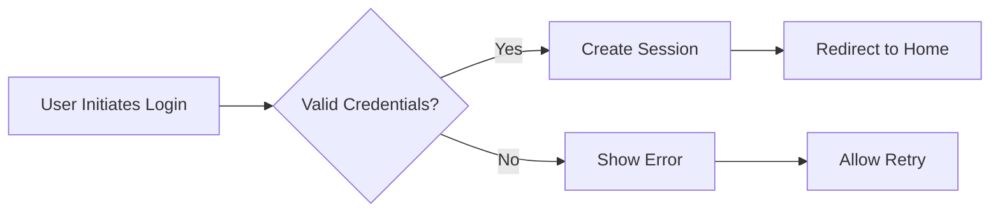
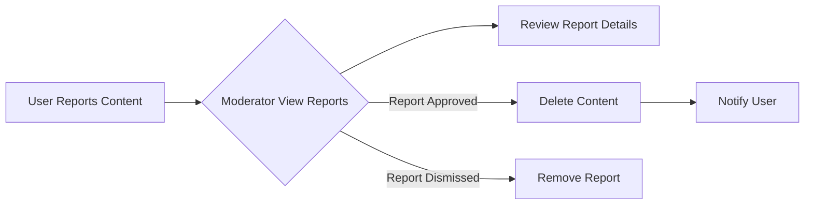

# Reddit-like Community Platform Requirements Specification

## Service Overview
This document defines all business requirements for the Reddit-like community platform. The system enables users to create accounts, engage with content through posts and comments, participate in communities, and manage their reputation through the karma system. The platform supports both public and private community engagement with robust moderation capabilities.

## User Account Requirements

**Authentication Workflow**:

### Business Requirements (EARS Format):

- WHEN a user submits new account registration, THE system SHALL validate email format against standard patterns and verify password meets minimum complexity requirements (12 characters, mixed case, numbers, special characters).
- WHEN a user submits a login request, THE system SHALL authenticate credentials against stored user records and issue a secure JWT token.
- WHEN a user requests password reset, THE system SHALL generate and email a time-limited one-time token (valid for 15 minutes).
- WHEN a user changes password, THE system SHALL invalidate all current active sessions for that user and require re-authentication.
- WHEN a user deletes account, THE system SHALL permanently remove all associated data including posts, comments, and profile information within 5 minutes.

### Error Handling Scenarios:

- ERROR: IF email format is invalid, THEN THE system SHALL display: "Please enter a valid email address."
- ERROR: IF password doesn't meet complexity requirements, THEN THE system SHALL display: "Password must be 12+ characters with uppercase, lowercase, numbers, and special characters."
- ERROR: IF account registration email is already taken, THEN THE system SHALL display: "This email is already registered. Use a different email."
- ERROR: IF login credentials are incorrect, THEN THE system SHALL display: "Invalid email or password - please try again."

## User Profile Requirements

### Business Requirements (EARS Format):

- WHEN a user updates display name, THE system SHALL verify it's unique across all users and prevent special characters except spaces and hyphens.
- WHEN a user updates profile bio, THE system SHALL allow up to 250 characters and block inappropriate content through automated moderation.
- WHEN a user uploads avatar, THE system SHALL accept JPG/PNG/WEBP formats with max 5MB file size and automatically resize to 256x256 pixels.
- WHEN a user views another profile, THE system SHALL display public profile information including display name, bio, avatar, karma score, total posts, and total comments.

### Performance Requirements:

- THE system SHALL update profile information within 0.5 seconds.
- THE system SHALL load profile pages within 1.5 seconds for active users.

## Karma System Requirements

### Business Requirements (EARS Format):

- WHEN someone upvotes a post or comment, THE system SHALL increment the user's karma score by 1.
- WHEN someone downvotes a post or comment, THE system SHALL decrement the user's karma score by 1.
- WHEN someone removes their vote, THE system SHALL adjust karma score based on previous vote type.
- WHEN a user's karma score goes negative, THE system SHALL still display it as a negative value.
- WHEN showing karma score, THE system SHALL use "Karma: [score]" format without units.

### Error Handling Scenarios:

- ERROR: IF a user attempts to vote on a post they didn't create, THEN THE system SHALL display: "You cannot vote on posts you created."
- ERROR: IF a user attempts to change vote after max edits, THEN THE system SHALL display: "Vote change not allowed after 10 minutes."

## Communities Requirements

### Business Requirements (EARS Format):

- WHEN a user creates a new community, THE system SHALL verify community name uniqueness and assign creator as owner.
- WHEN a user browses communities, THE system SHALL list all communities ordered by subscriber count descending.
- WHEN a user searches communities, THE system SHALL allow partial matches on community names and return results sorted alphabetically.
- WHEN a user views community details, THE system SHALL display community name, description, icon, and subscriber count.

### Performance Requirements:

- THE system SHALL process community searches within 0.3 seconds.
- THE system SHALL load community pages within 1.2 seconds.

## Post Creation Requirements

### Business Requirements (EARS Format):

- WHEN a user selects community, THE system SHALL verify they're subscribed before allowing post creation.
- WHEN a user creates text post, THE system SHALL allow up to 5,000 characters with markdown support.
- WHEN a user creates link post, THE system SHALL validate URL format and extract domain name for display.
- WHEN a user creates image post, THE system SHALL accept JPG/PNG files up to 10MB and generate thumbnails.

### Post Type Requirements:

1. **Text Post**: Content must be 50+ characters, up to 5,000 characters total.
2. **Link Post**: Must use HTTP/HTTPS URL format with valid domain.
3. **Image Post**: Must be image file type (JPG/PNG) under 10MB.

## Post Feed Requirements

### Sorting Criteria (All Feeds):

- **Hot**: Most upvotes in the last 24 hours with recent activity weighting.
- **New**: Newest posts first, regardless of engagement.
- **Top**: Highest vote scores, with filter options (today, week, month, year, all time).
- **Controversial**: Highest vote counts where score is within ±5 of zero.

### Post Feed Requirements (EARS Format):

- WHEN a user views Home Feed, THE system SHALL only show posts from subscribed communities.
- WHEN a user views Popular Feed, THE system SHALL show posts from all communities without login requirement.
- WHEN a user views Community Feed, THE system SHALL filter posts to specific community.
- WHEN a user sorts posts, THE system SHALL apply sorting preferences to all feed items within current view.

## Comment Requirements

### Business Requirements (EARS Format):

- WHEN a user writes comment, THE system SHALL validate comment content against 10,000 character limit.
- WHEN a user replies to comment, THE system SHALL enable nested replies with unlimited depth.
- WHEN a user deletes comment, THE system SHALL prevent deletion of comments older than 24 hours unless user is owner or moderator.
- WHEN user views comment thread, THE system SHALL display comments ordered by selected sort method (Best, New, Controversial).

### Performance Requirements:

- THE system SHALL process comments within 0.4 seconds.
- THE system SHALL display post comments within 1.0 second.

## Moderation Requirements

### Business Requirements (EARS Format):

- WHEN a community owner adds moderator, THE system SHALL assign full moderator permissions to the user.
- WHEN a moderator deletes post, THE system SHALL record deletion reason in audit log.
- WHEN a moderator bans user from community, THE system SHALL prevent post/comment creation in that community.
- WHEN a user is banned, THE system SHALL send notification to the banned user with reason.

### Moderation Workflow:

## Business Rules Summary

- All user content is governed by community rules set by creators and moderators
- Karma score is calculated exclusively from valid posts and comments
- Communities and user accounts are fully isolated from each other for data privacy
- All user-generated content must adhere to community-specific rules
- Moderation actions are logged with user ID and timestamp for audit purposes

## Success Metrics

| Metric | Target | Measurement Frequency |
|--------|--------|---------------------|
| Account creation time | <1 second | Per request |
| Post creation time | <0.8 seconds | Per request |
| Feed load time | <1.2 seconds | Per feed view |
| Comment submission time | <0.6 seconds | Per comment |
| Karma update duration | <0.2 seconds | Per vote |

This documentation provides complete business requirements for the Reddit-like community platform. Backend developers have full autonomy over API design, database schema, and technical implementation details. All business requirements are specified in natural language using EARS format with specific, measurable criteria for implementation readiness.