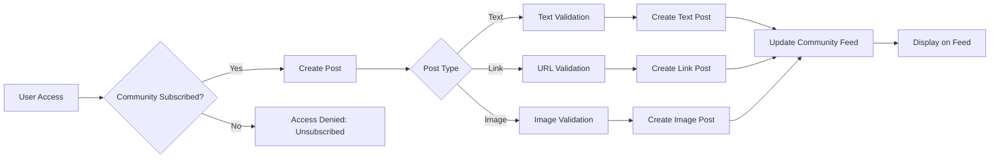

# Functional Requirements Specification: Reddit-like Community Platform

## 1. User Account Management

### Core Account Requirements

**Registration Process**:

WHEN a new user provides valid email and password, THEN the system SHALL validate:
- Email format (e.g., user@example.com)
- Password strength (min 8 characters, uppercase, lowercase, number, special character)
- Email uniqueness (return 'Email already registered' error if duplicate)
THEN create new account with status 'pending'
WHEN registration is successful, THEN the system SHALL send welcome email with verification link
WHEN verification link is clicked, THEN the system SHALL activate account with status 'active'

**Authentication Flow**:

WHEN a user submits email/password, THEN the system SHALL return JWT with:
- Access token (15-minute validity)
- Refresh token (7-day validity)
WHEN authentication fails, THEN the system SHALL return HTTP 401 with 'INVALID_CREDENTIALS'
WHEN password reset request is made, THEN the system SHALL generate token with 24-hour validity
WHEN valid reset token is used, THEN the system SHALL update password and invalidate token

**Account Management**:

WHEN a user requests password change with valid current password, THEN the system SHALL update password and revoke all active sessions
WHEN a user requests account deletion, THEN the system SHALL:
- Remove all associated posts/comments
- Delete community memberships
- Send confirmation email with deletion timestamp
WHEN account deletion fails due to invalid password, THEN the system SHALL return HTTP 403 with 'PASSWORD_INCORRECT'

## 2. User Profile Features

### Profile Management Requirements

EVERY user SHALL have profile fields:
- display_name (3-50 characters, unique)
- bio (0-500 characters)
- avatar (image file, .jpg/.png/.gif, max 10MB)

WHEN a user updates display_name, THEN the system SHALL:
- Validate character count
- Check name conflicts
- Prevent name changes if existing posts use name
WHEN profile is updated, THEN the system SHALL save version history and update all references within 1 second

**Profile Viewing Requirements**:

WHEN any user views another user's profile, THEN the system SHALL display:
- Display name
- Bio (public profiles only)
- Avatar
- Karma score (visible as positive/negative number)
- Total posts count
- Total comments count
WHEN viewing a profile with karma ≤ 0, THEN the system SHALL display '-karma' label (e.g., '-3')

**Profile Editing Requirements**:

WHEN a member edits profile, THEN the system SHALL allow:
- Display name change
- Bio update (truncated to 500 chars)
- Avatar upload (validated format)
IF avatar format is invalid, THEN the system SHALL return HTTP 415 with 'INVALID_IMAGE_FORMAT'

## 3. Karma System

### Karma Calculation Logic

WHEN a user upvotes a post OR comment, THEN the system SHALL increment author's karma by 1 AND log action
WHEN a user downvotes a post OR comment, THEN the system SHALL decrement author's karma by 1 AND log action
WHEN a user removes their vote, THEN the system SHALL reverse karma change AND update author score

**Karma Visibility Requirements**:

EVERY user SHALL see karma score when viewing profile
WHEN karma is negative, THEN the system SHALL display as '-X' (e.g., '-2')
WHEN karma is zero, THEN the system SHALL display '0'

**Karma Validation Requirements**:

WHEN karma action is attempted on deleted content, THEN the system SHALL return HTTP 403 with 'CONTENT_DELETED'
WHEN invalid karma action type is used, THEN the system SHALL return HTTP 400 with 'INVALID_KARMA_ACTION'

## 4. Community Management

### Community Creation & Structure

WHEN a user creates a community, THEN the system SHALL require:
- Name (3-30 characters, unique)
- Description (0-500 characters)
- Icon image (valid format, max 10MB)
THEN assign creator as owner AND set status to 'active'
WHEN community name conflicts exist, THEN the system SHALL return HTTP 409 with 'NAME_TAKEN'

**Community Browsing Requirements**:

WHEN a user browses communities, THEN the system SHALL display:
- Name
- Description (truncated)
- Icon
- Subscriber count
WHEN searching communities by name, THEN the system SHALL filter with substring matching AND return results within 200ms

## 5. Post Creation & Management

### Post Types and Validation

WHEN creating a post, THEN the system SHALL require:
- Title (1-150 characters)
- Content based on post type:
  - Text: 1-2000 characters
  - Link: Valid URL (http/https)
  - Image: Valid image file (max 10MB)
WHEN creating in unsubscribed community, THEN the system SHALL return HTTP 403 with 'UNSUBSCRIBED'

**Post Editing and Deletion**:

WHEN a user edits their own post, THEN the system SHALL:
- Allow content modifications
- Track history (within 15 minutes: show 'Edited' timestamp)
WHEN a user deletes their post, THEN the system SHALL:
- Remove the post
- Notify all users who interacted with it
- Update community stats

## Core Community Interaction Flow

