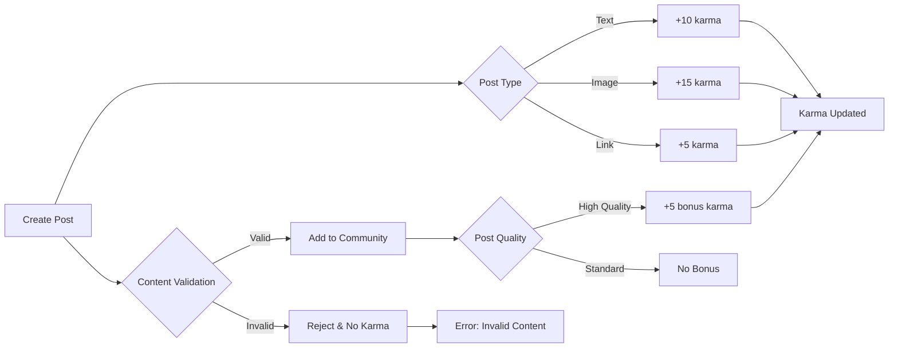

# Karma System Requirements Specification

## Business Justification

The karma system drives sustained user engagement by rewarding quality contributions and fostering positive community behavior. It enables the platform to prioritize high-quality content, incentivize constructive participation, and establish social proofs within the community.

### Competitive Differentiation
Unlike generic engagement metrics, this karma system is deeply integrated with the platform's community structure and content quality requirements, creating a self-sustaining ecosystem where active contributors gain tangible benefits.

## Karma Calculation Rules

All karma calculations must follow these business rules:

### Post Creation
WHEN a member creates a text-based post, THE system SHALL increment their karma by 10 points.

WHEN a member creates a post with an image link, THE system SHALL increment their karma by 15 points.

WHEN a member creates a post with an external link without description, THE system SHALL increment their karma by 5 points.

WHEN a member creates a post that gets reported and removed, THE system SHALL decrement their karma by 5 points.

### Commenting and Interaction
WHEN a member adds a comment to a post, THE system SHALL increment their karma by 1 point.

WHEN a member receives a comment with at least 2 upvotes, THE system SHALL increment their karma by 5 points.

WHEN a member's comment is reported and removed, THE system SHALL decrement their karma by 3 points.

### Voting Participation
WHEN a member upvotes a post, THE system SHALL increment their karma by 0.5 points.

WHEN a member downvotes a post, THE system SHALL increment their karma by 0.1 points.

WHEN a member upvotes a high-karma post (karma ≥ 100), THE system SHALL increment their karma by 1 point.

### Content Quality and Removal
WHEN a post is marked as 'spam' by moderation, THE system SHALL decrement the creator's karma by 10 points.

WHEN a comment is marked as 'inappropriate' by moderation, THE system SHALL decrement the commenter's karma by 5 points.

WHEN a member's post receives 20+ upvotes within 24 hours, THE system SHALL increment their karma by 5 points.

### Karma Decay
WHEN a member's account has been inactive for more than 30 days, THE system SHALL decrement their karma by 1 point per day.

WHEN a member's karma falls below zero, THE system SHALL send a notification stating: 'Your account has been suspended for 30 days due to negative karma.'

### Mermaid Process Diagram for Karma Calculation

## Reputation Impact

### Access Level Thresholds
WHEN a member's karma is less than 50 points, THE system SHALL restrict them from creating new communities.

WHEN a member's karma is between 50 and 150 points, THE system SHALL allow them to create communities with standard permissions.

WHEN a member's karma is 150 points or higher, THE system SHALL grant them 'Community Creator' status enabling community moderation.

WHEN a member's karma is 500 points or higher, THE system SHALL grant them 'Respected Member' status with exclusive access to premium community features.

WHEN a member's karma is below 0 points, THE system SHALL automatically suspend their account for 30 days.

### Content Priority Rules
WHEN a post is created by a member with karma ≥ 50 points, THE system SHALL default to displaying the post in the 'Top' sort order.

WHEN a comment is made by a member with karma ≥ 100 points, THE system SHALL default to displaying the comment near the top within the thread.

WHEN a member's karma is greater than 150 points, THE system SHALL prioritize their content in community ranking algorithms.

### Moderation Priority
WHEN a member's karma is below 50 points, THE system SHALL give reports against their content standard moderation priority.

WHEN a member's karma is 50-150 points, THE system SHALL assign medium priority to reports against their content.

WHEN a member's karma is 150-500 points, THE system SHALL reduce priority for reports against their content.

WHEN a member's karma is 500+ points, THE system SHALL give highest priority to reports against their content with automatic escalation to top moderators.

## User Display Logic

### Public Profile
THE system SHALL display a member's current karma score in their public profile rounded to the nearest integer.

THE system SHALL display karma badges next to members' usernames based on karma thresholds:
- 'Novice' for karma < 50
- 'Contributor' for 50 ≤ karma < 150
- 'Creator' for 150 ≤ karma < 500
- 'Respected' for karma ≥ 500

### Platform Context
WHEN viewing a community page, THE system SHALL display each member's karma next to their username in comments and posts.

WHEN viewing a post, THE system SHALL display the creator's karma score above their post if the creator's karma is ≥ 100.

WHEN viewing their own profile, THE system SHALL display a detailed karma history chart showing weekly accumulation.

### Visual Representation
THE system SHALL use a color-coded karma indicator: green for ≥ 100, orange for 50-99, red for < 50.

WHEN a user views their profile, THE system SHALL display a progress bar showing their current karma level compared to the next badge tier.

## Incentive Framework

### Engagement Incentives
WHEN a new member reaches 50 karma points, THE system SHALL notify them that they qualify as a 'Community Contributor'.

WHEN a member gains 100 karma points, THE system SHALL notify them they've earned 'Creator' status with the ability to moderate their community.

WHEN a member surpasses 500 karma points, THE system SHALL notify them they're now a 'Respected Member', with a special title and exclusive access to community events.

### Gamification Elements
THE system SHALL display a visible karma counter in the user's navigation bar, updating in real-time.

THE system SHALL provide periodic karma leaderboards showing top contributors in communities.

THE system SHALL send a weekly karma summary email showing points earned in the past week.

### Community Benefits
WHEN a member has karma ≥ 150 points, THE system SHALL grant them the ability to create multiple communities.

WHEN a member has karma ≥ 300 points, THE system SHALL grant them priority when resolving community disputes.

WHEN a member has karma ≥ 400 points, THE system SHALL notify them when new communities matching their interests are created.

## Error Handling Scenarios

### Karma Miscalculation
WHEN a karma calculation error occurs during post creation, THE system SHALL not apply any karma changes AND display 'Accounting Error' to the user.

### Repeated Karma Manipulation
WHEN a member is identified as repeatedly attempting to manipulate karma through fake accounts, THE system SHALL freeze their account for 30 days and notify admin.

### Threshold Violation
WHEN a member's karma drops below zero, THE system SHALL show a temporary message: 'Your account has been suspended for 30 days due to negative karma.'

### System Failure
WHEN the karma calculation system is inaccessible, THE system SHALL display content as if karma was zero for all users while logging the error for admin resolution.

## Karma System Maintenance Requirements

### Daily Karma Updates
THE system SHALL recalculate all member karma scores automatically at midnight UTC.

THE system SHALL apply daily karma decay to inactive accounts within the 24-hour window.

THE system SHALL automatically notify members with low karma that they may be at risk of suspension.

### Balance Verification
THE system SHALL perform weekly karma balance audits across 10% of user accounts randomly selected.

THE system SHALL generate a karma discrepancy report whenever a 5% variance is detected between stored and calculated values.

### Historical Record
THE system SHALL maintain a complete karma history for each member, including all earned and deducted points, for 5 years.

THE system SHALL include source metadata with every karma change (e.g., 'post created', 'comment removed').

THE system SHALL automatically generate a karma audit report on user request.
