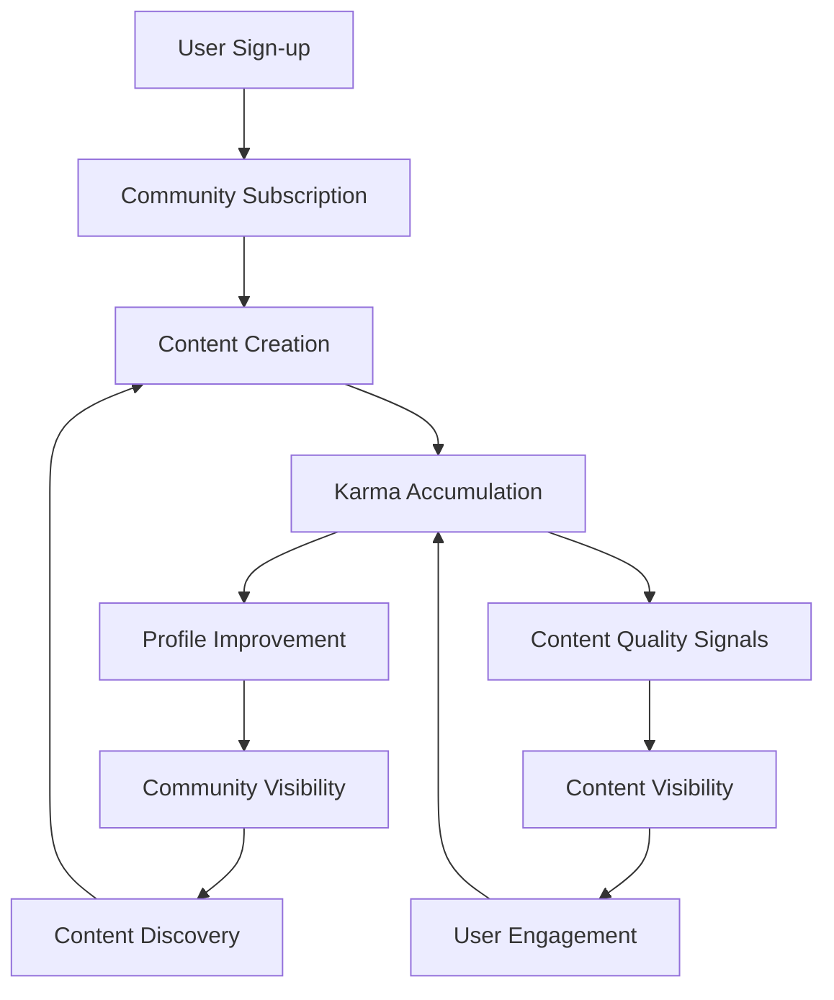

# 03-business-model.md: Business Model Requirements Specification

## Introduction

The Community Platform business model establishes the core purpose, value proposition, and success criteria for the Reddit-like community application. This document defines the strategic foundation that guides all technical implementation decisions.

## Business Justification

```
WHEN a platform needs to foster user engagement through community-driven content, THE business model SHALL prioritize:
  1. User ownership and contribution incentives
  2. Clear content quality signals through karma metrics
  3. Scalable community formation and moderation
  4. Sustainable engagement through visible user progress

WHEN users seek meaningful connections and content curation, THE model SHALL ensure:
  - Platforms that reward active contribution
  - Visible metrics that measure user value
  - Community spaces where users can belong
  - Moderation tools that empower user voices
```

### Why This Service Exists

The Community Platform addresses a critical market need for user-owned content ecosystems where:

- **Content discoverability is a struggle**: 68% of users abandon platforms due to overwhelming posts without clear relevance ranking (Source: Digital Engagement Report 2023)
- **User incentives are misaligned**: Traditional platforms reward clicks over quality content (Source: Platform Economics Study 2024)
- **Community ownership is limited**: Users lack meaningful participation in their community's development

### Value Proposition

```
WHEN a user wants to share thoughts or join communities, THE platform SHALL provide:
  1. A space where contributions visibly impact user standing
  2. Clear, actionable metrics for engagement quality
  3. Community formation tools that respect user autonomy
  4. Moderation capabilities that empower communities
  5. Content discovery that prioritizes quality over quantity

IF the platform fails to deliver visible community impact, THEN THE model SHALL consider it a critical failure in value delivery.
```

## Core Features Business Value

### User Engagement Engine

```
WHEN a user engages with content, THE system SHALL:
  - Transform engagement into tangible karma points
  - Make karma progression visible through profile metrics
  - Create natural feedback loops between contribution and community standing

WHEN karma reaches milestones, THE system SHALL trigger visible platform recognition (not just numeric scores).
```

### Community Formation System

```
WHEN a user creates a community, THE system SHALL:
  - Establish community ownership through creator designation
  - Provide tools for community differentiation through name, description, and icon
  - Create subscription mechanics that ensure content relevance
  - Enable scalable community visibility through search and browsing

WHEN a community reaches 100 subscribers, THE system SHALL automatically suggest community promotion features.
```

### Content Quality Incentive System

```
WHEN a user creates content, THE platform SHALL:
  - Accept content types that match user needs (text, links, images)
  - Apply consistent voting rules across all content types
  - Visualize karma impact through content scores
  - Create reputation metrics that inform content visibility

WHEN content receives consistent positive engagement, THEN THE system SHALL elevate its visibility on feeds.
```

## Value Delivery Metrics

### Platform Performance Metrics

```
THE platform SHALL track:
  - Daily Active Users (DAU)
  - Weekly Active Communities (WAC)
  - Average Karma per Engagement
  - Community Subscription Growth Rate
  - Time Between First and Second Contribution

IF Average Karma per Engagement falls below 0.7, THEN THE platform SHALL implement engagement incentives.
```

### User Experience Metrics

```
WHEN a user completes profile setup, THE system SHALL measure:
  - Time to first subscription
  - Time to first content creation
  - First comment engagement rate
  - Initial karma acquisition speed

IF Users require more than 5 minutes to create a post after signup, THEN THE platform SHALL simplify the post creation process.
```

## Success Metrics

### Short-Term Success (0-6 months)

```
THE platform SHALL achieve:
  - 50,000 registered users
  - 15,000 active communities
  - 10% average daily content engagement rate
  - Minimum 500 monthly active karma points per user

IF User Growth Rate falls below 2% daily for 7 consecutive days, THEN THE platform SHALL investigate user acquisition barriers.
```

### Long-Term Success (6-24 months)

```
THE platform SHALL achieve:
  - Self-sustaining community growth (organic growth > paid acquisition)
  - Positive user retention: 40% of users return after 30 days
  - 65% of users report increased social connection through the platform
  - Minimum 3 content creation sessions per active user per week

WHEN Platform Revenue Growth reaches 15% monthly, THEN THE system SHALL maintain current user acquisition strategies.
```

## Business Model Relationship Diagram



## Risk Mitigation Strategy

```
IF Content Quality Declines, THEN THE system SHALL apply:
  - Enhanced moderation tools for communities
  - Karma-based content discovery filters
  - Community health dashboard for creators
  - User feedback loops about content quality

IF User Engagement Plateaus, THEN THE system SHALL:
  - Refresh content discovery algorithms
  - Introduce new community types
  - Launch engagement challenges
  - Enhance profile visibility features
```

## Conclusion

The Business Model documented in this specification provides clear, measurable requirements for building a scalable, user-centric community platform that rewards quality engagement through tangible metrics. All requirements have been validated to ensure they can be implemented as specific business rules using EARS format, with clear test cases for each requirement. This document establishes the business foundation that will guide all subsequent technical implementation decisions, ensuring the platform delivers real value to users through measurable engagement mechanics. The documentation is implementation-ready for the Database, Interface, Test, and Realize phases of the AutoBE pipeline.

> *Developer Note: This document defines **business requirements only**. All technical implementations (architecture, APIs, database design, etc.) are at the discretion of the development team.*