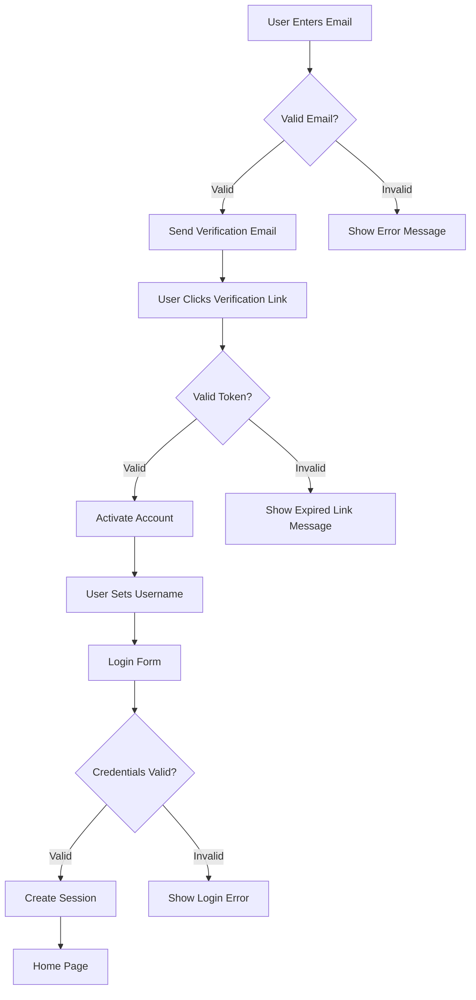

# Reddit-like Community Platform Requirements Analysis

## Service Overview
The community platform enables users to create and participate in interest-based communities similar to Reddit. Users can create posts, comment on content, and interact through voting. The platform emphasizes user engagement while maintaining content quality through moderation tools.

## Business Model

### Core Value Proposition
This service provides a decentralized space for users to discuss topics in specialized communities, fostering meaningful interactions while preserving the open nature of community-driven platforms. Content discovery and community building are central to the platform's purpose.

### Revenue Strategy
- Freemium model with free basic features and premium subscription for enhanced community customization
- Advertisements displayed in non-intrusive positions within community feeds
- Premium community features including custom themes, advanced moderation tools, and priority support

## User Actors and Permissions

### Core User Types
- **Regular User**: Basic posting, commenting, voting, and community subscription capabilities
- **Community Admin**: Manages specific community settings, enforces community rules, moderates content
- **Site Admin**: Manages platform-wide settings, user permissions, and system content

#### Permission Matrix

| Feature | Regular User | Community Admin | Site Admin |
|---------|--------------|-----------------|------------|
| Create Community | ❌ | ✅ | ✅ |
| Post Text/Links/Images | ✅ | ✅ | ✅ |
| Upvote/Downvote | ✅ | ✅ | ✅ |
| Comment/Nested Replies | ✅ | ✅ | ✅ |
| Subscribe to Communities | ✅ | ✅ | ✅ |
| Report Inappropriate Content | ✅ | ✅ | ✅ |
| View User Profiles | ✅ | ✅ | ✅ |
| Manage Community Settings | ❌ | ✅ | ✅ |
| Moderate Posts/Comments | ❌ | ✅ | ✅ |
| Delete Content | ❌ | ✅ | ✅ |
| Set Platform Settings | ❌ | ❌ | ✅ |

## Core Functional Requirements

### User Registration and Login

#### Requirements

WHEN a new user wants to join the platform, THE system SHALL provide a registration form with email and password fields.

IF the email is already registered, THEN THE system SHALL display an error message: "Email already in use. Please try another or reset your password."

IF the email is available, THEN THE system SHALL create a new user account and send a verification email.

WHEN a user clicks the verification link, THE system SHALL activate the account and prompt them to set up their profile.

WHEN a user attempts to log in, THE system SHALL show a login form with email/password fields.

IF login credentials are valid, THEN THE system SHALL create a new session and redirect to the home page.

IF login credentials are invalid, THEN THE system SHALL display: "Invalid email or password. Please try again."

### Post and Comment Systems

#### Post Creation Requirements

WHEN a user wants to post content in a community, THE system SHALL allow them to select a community from their subscriptions.

WHEN a user submits a post, THE system SHALL require a title (minimum 5 characters, maximum 100 characters).

WHEN a user submits a post, THE system SHALL allow text, links, or images up to 5MB.

IF a post contains prohibited content, THEN THE system SHALL prevent submission and display an error: "Content contains prohibited material. Please revise.".

#### Comment and Reply Requirements

WHEN a user adds a comment to a post, THE system SHALL display the comment as part of the post's discussion thread.

WHEN a user replies to a comment, THE system SHALL create nested comment structure.

WHEN a comment contains prohibited content, THEN THE system SHALL prevent submission and display an error: "Comment contains prohibited material. Please revise."

### Voting System

WHEN a user upvotes or downvotes a post, THE system SHALL update the post's score in real-time.

WHEN a user upvotes or downvotes a comment, THE system SHALL update the comment's score in real-time.

WHEN a user votes on content they've created, THEN THE system SHALL display a confirmation: "You've voted on your own content."

THE system SHALL require users to have at least 5 karma points to upvote posts (downvoting is available at any karma level).

#### Karma System

WHEN a user gets a positive vote on a post or comment, THE system SHALL increase their karma score by 1.

WHEN a user gets a negative vote on a post or comment, THE system SHALL decrease their karma score by 1.

WHEN a user's karma score reaches zero, THEN THE system SHALL display: "Your account is restricted. Please post positive content to regain karma."

WHEN a user's karma score exceeds 100, THEN THE system SHALL display a special badge.

### Community Management

WHEN a user wants to create a new community, THE system SHALL require a name (minimum 3 characters, maximum 20 characters).

WHEN a user wants to create a new community, THE system SHALL require a description (minimum 10 characters, maximum 200 characters).

WHEN a user subscribes to a community, THE system SHALL add the community to their subscription list.

WHEN a user views their subscribed communities, THE system SHALL display them in alphabetical order.

### Content Sorting and Display

#### Sorting Logic Requirements

WHEN a user selects 'Hot' sorting, THE system SHALL display posts with the highest recent activity first (combining upvotes and recent comments).

WHEN a user selects 'New' sorting, THE system SHALL display posts chronologically with newest first.

WHEN a user selects 'Top' sorting, THE system SHALL display posts with the highest score first.

WHEN a user selects 'Controversial' sorting, THE system SHALL display posts with the highest ratio of upvotes to downvotes first.

### Reporting System

WHEN a user reports content, THE system SHALL collect their report reason from a predefined list.

WHEN a user reports content, THE system SHALL send notification to moderators of the related community.

WHEN content is reported 5 times, THEN THE system SHALL automatically hide the content from public view and notify the user of the report.

IF a user has reported content that was later approved, THEN THE system SHALL display: "This content was reviewed and approved. Your report has been evaluated."

## Authentication Flow

### User Authentication Workflow

## Success Criteria

- The platform must handle 5,000+ concurrent users with sub-second response times
- All content submissions must process within 2 seconds
- User registration must complete within 10 seconds
- Sorting algorithms must handle 100,000+ posts efficiently
- The platform must be accessible on all major mobile and desktop browsers
- All content must be stored securely with current encryption standards

## Implementation Notes

> *This document contains business requirements only. Technical implementation details (API structure, database schema, etc.) are the responsibility of the development team.*