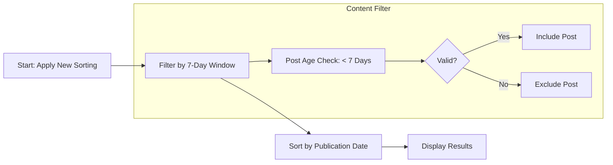
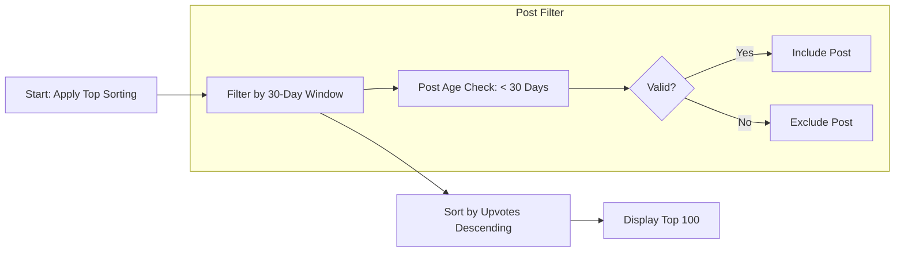

# Requirements Analysis Report: Content Sorting Mechanism

## Executive Summary

The sorting functionality is a core user experience element critical for engagement and content relevance. This specification details how posts should be sorted across contexts and user preferences. The primary goal is to deliver highly relevant content based on community activity and user interests.

### 1. Sorting Criteria Definition

#### 1.1 Hot Sorting

WHEN a user selects "Hot" sorting, THE system SHALL calculate a weighted score based on:
- Upvotes received in the last 10 minutes (40% weight)
- Total upvotes (30% weight)
- Post age (30% weight)

WHEN hot sorting is applied, THE system SHALL reset the hot score after 6 hours for all posts to maintain relevance.

#### 1.2 New Sorting

WHEN a user selects "New" sorting, THE system SHALL sort posts chronologically. THE system SHALL only show posts published within the last 7 days.

WHILE new sorting is active, THE system SHALL exclude posts older than 7 days from results.

#### 1.3 Top Sorting

WHEN a user selects "Top" sorting, THE system SHALL sort posts by total upvote count. THE system SHALL only include posts published within the last 30 days.

IF more than 1,000 posts exist in a community, THEN THE system SHALL display only the top 100 posts with paging available.

#### 1.4 Controversial Sorting

WHEN a user selects "Controversial" sorting, THE system SHALL sort posts by the absolute difference between upvotes and downvotes (|upvotes - downvotes|).

THE system SHALL only include posts with at least 5 total votes for controversial sorting.

### 2. Algorithmic Approach

#### 2.1 Hot Algorithm

```mermaid
graph LR
  A[Start: Apply Hot Sorting] --> B[Calculate Recency Score]
  B --> C[Calculate Popularity Score]
  C --> D[Combine Scores]
  D --> E[Sort Posts]

  subgraph Recency Calculation
    A --> F[Post Age in Minutes]
    F --> G[Age Factor = 1 / (1 + Age)]
    G --> H[Recency Weight = 0.4 * Age Factor]
  end

  subgraph Popularity Calculation
    B --> I[Total Upvotes]
    I --> J[Popularity Factor = Log(1 + Upvotes)]
    J --> K[Popularity Weight = 0.3 * Popularity Factor]
  end

  subgraph Final Score
    C --> L[Total Score = Recency Weight + Popularity Weight + Other Formula]
    L --> M[Post Rank]
  end
```

#### 2.2 New Algorithm



#### 2.3 Top Algorithm



#### 2.4 Controversial Algorithm

```mermaid
graph LR
  A[Start: Apply Controversial Sorting] --> B[Filter by 5+ Total Votes]
  B --> C[Calculate Controversial Score]
  C --> D[Sort by Absolute Score]
  D --> E[Display Results]

  subgraph Post Filter
    B --> F[Total Votes = Upvotes + Downvotes]
    F --> G{Total Votes >= 5?}
    G -->|Yes| H[Include Post]
    G -->|No| I[Exclude Post]
  end

  subgraph Score Calculation
    C --> J[Controversial Score = |Upvotes - Downvotes|]
    J --> K[Sort Descending]
  end
```

### 3. User Preference Handling

#### 3.1 Default Sorting Behavior

WHEN a user first visits a community, THE system SHALL set default sort to 'hot'.

WHILE browsing a community without a sort preference, THE system SHALL use hot sort by default.

#### 3.2 Customization Preferences

WHEN a user selects a sorting option, THE system SHALL save it to their profile.

IF a URL parameter specifies a sort, THE system SHALL use it for the current session only.

#### 3.3 Preference Storage

THE system SHALL store sorting preferences as:
```
{
  "userId": "string",
  "preferredSort": "hot | new | top | controversial",
  "updatedAt": "ISO 8601 timestamp"
}
```

WHEN preferences change, THE system SHALL update the timestamp.

#### 3.4 Default Reset

WHEN no preference change occurs for 7 days, THE system SHALL reset to 'hot' by default.

### 4. Performance Requirements

WHEN requesting sorted content, THE system SHALL deliver results within 500ms for communities with ≤5,000 posts.

IF a community has >5,000 posts, THE system SHALL deliver first page within 1,000ms.

WHEN communities exceed 10,000 posts, THE system SHALL paginate results (20 posts per page).

WHEN a user loads a sorted list, THE system SHALL cache results for 30 seconds.

### 5. Error Handling

IF an invalid sorting parameter is provided, THE system SHALL return 400 Bad Request with message: 'Invalid sort parameter. Valid options: hot, new, top, controversial.'

IF no posts are available for the selected sorting method, THE system SHALL display: 'No posts available for this sorting method. Try another option.'

IF preference update fails, THE system SHALL display: 'Unable to save sorting preference. Please try again later.'

### 6. Integration with Community Features

COMMUNITY CREATION: WHEN creating a community, THE system SHALL allow setting a default sort for the community.

COMMUNITY DEFAULTS: IF community has set default sorting, IT SHALL override user preference for that community.

CONTENT MANAGEMENT: Sorting requires complete data (upvotes, downvotes, timestamps) from content management system.

### 7. Business Relevance

HOT SORTING: PRIORITIZES content with high engagement in the last hour to highlight trending topics.

TOP SORTING: HIGHLIGHTS community-wide popular posts while respecting recency (30-day window).

CONTROVERSIAL SORTING: FOCUSES on posts with balanced engagement (both positive and negative votes) to provide meaningful discussion opportunities.

NEW SORTING: EMPHASIZES freshness by excluding content older than 7 days without exception.

---

*Developer Note: This document specifies business requirements only. Technical implementations (architecture, APIs, database design) are at development team's discretion.*